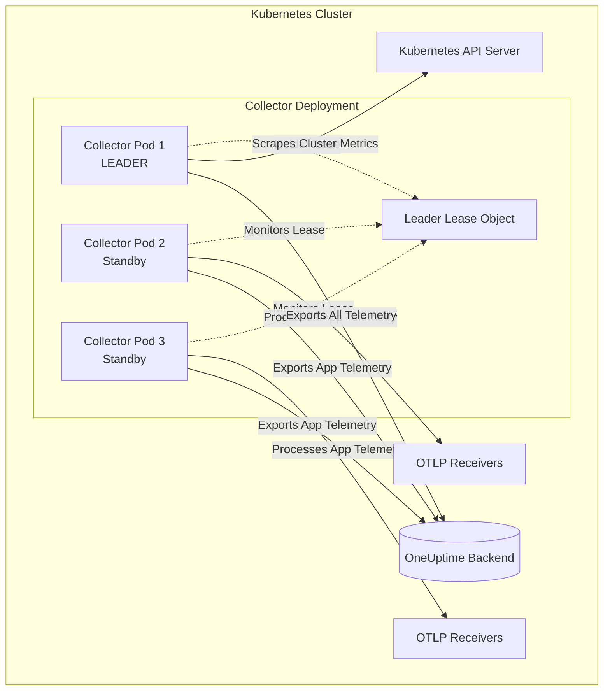

# How to Configure the K8s Leader Elector Extension in the OpenTelemetry Collector

Author: [nawazdhandala](https://www.github.com/nawazdhandala)

Tags: OpenTelemetry, Collector, Extensions, Kubernetes, High Availability, Leader Election

Description: Master the K8s Leader Elector Extension in OpenTelemetry Collector to ensure only one Collector instance performs cluster-scoped operations, preventing duplicate metrics and race conditions in Kubernetes deployments.

---

When running multiple OpenTelemetry Collector instances in a Kubernetes cluster, certain operations should only be performed by a single instance at any given time. The K8s Leader Elector Extension solves this coordination problem by implementing leader election, ensuring that only one Collector instance actively performs cluster-scoped tasks while other instances remain on standby.

## What is the K8s Leader Elector Extension?

The K8s Leader Elector Extension implements the Kubernetes leader election pattern for the OpenTelemetry Collector. It uses Kubernetes lease objects to coordinate among multiple Collector replicas, electing one instance as the "leader" while others wait in standby mode.

This extension is critical for:

- Preventing duplicate cluster-level metrics collection from Kubernetes API
- Ensuring only one instance scrapes cluster-wide Prometheus endpoints
- Coordinating batch jobs that should run once per cluster
- Avoiding race conditions in cluster-scoped configuration operations
- Maintaining high availability through automatic leader failover

When a leader instance fails or becomes unreachable, the extension automatically elects a new leader from the remaining healthy instances, ensuring continuous operation without manual intervention.

## Why Use Leader Election?

Without leader election, multiple Collector instances would simultaneously perform the same cluster-scoped operations, resulting in:

**Duplicate Metrics**: Each Collector instance would scrape the Kubernetes API and emit identical metrics, inflating your telemetry volume and storage costs. A cluster with 5 Collector replicas without leader election would generate 5x redundant cluster metrics.

**API Server Overload**: Multiple instances querying the Kubernetes API simultaneously creates unnecessary load on the control plane. For large clusters with hundreds of nodes, this amplified load can impact overall cluster performance.

**Inconsistent State**: Operations that modify cluster state (like dynamic discovery configuration updates) could conflict when executed simultaneously by multiple instances, leading to race conditions and unpredictable behavior.

**Wasted Resources**: Running identical operations across all replicas wastes CPU, memory, and network bandwidth that could be utilized for actual telemetry processing.

Leader election solves these problems by designating one instance as the active coordinator while others focus on data processing tasks.

## Architecture Overview

The K8s Leader Elector Extension integrates with Kubernetes' native lease-based leader election mechanism. Here's how the system works:



The leader instance maintains an exclusive lease on a Kubernetes lease object. Other instances continuously monitor this lease. If the leader fails to renew the lease (due to crash, network partition, or graceful shutdown), one standby instance automatically acquires the lease and becomes the new leader.

All instances continue processing application telemetry through receivers and exporters. Only cluster-scoped operations are restricted to the leader instance.

## Basic Configuration

Setting up the K8s Leader Elector Extension requires configuration in your Collector deployment. Here's a basic setup:

```yaml
# extensions section defines the leader election behavior
extensions:
  # Configure leader election extension
  k8s_observer:
    # Required: Kubernetes authentication method
    auth_type: serviceAccount      # Use pod's service account

  # Leader election extension configuration
  k8s_leader_elector:
    # Lease name used for coordination
    lease_name: otel-collector-leader

    # Namespace where lease object is created
    lease_namespace: observability

    # How long a lease is valid before requiring renewal
    lease_duration: 15s

    # How often the leader renews its lease
    renew_deadline: 10s

    # How often non-leaders check if lease is available
    retry_period: 2s

# receivers section includes cluster-scoped receivers
receivers:
  # OTLP receiver for application telemetry (all instances)
  otlp:
    protocols:
      grpc:
        endpoint: 0.0.0.0:4317
      http:
        endpoint: 0.0.0.0:4318

  # Kubernetes cluster metrics (leader only)
  k8s_cluster:
    auth_type: serviceAccount
    # Collect cluster-level metrics
    collection_interval: 30s
    node_conditions_to_report: [Ready, MemoryPressure, DiskPressure]
    allocatable_types_to_report: [cpu, memory, storage]

processors:
  batch:
    timeout: 10s
    send_batch_size: 1024

  # Add resource attributes to identify leader
  resource:
    attributes:
      - key: collector.role
        value: ${COLLECTOR_ROLE}      # Set via environment variable
        action: upsert

exporters:
  otlphttp:
    endpoint: https://oneuptime.com/otlp
    headers:
      x-oneuptime-token: ${ONEUPTIME_TOKEN}

service:
  # Enable both extensions
  extensions: [k8s_observer, k8s_leader_elector]

  pipelines:
    # Pipeline for cluster metrics (leader only)
    metrics/cluster:
      receivers: [k8s_cluster]
      processors: [resource, batch]
      exporters: [otlphttp]

    # Pipeline for application telemetry (all instances)
    traces:
      receivers: [otlp]
      processors: [batch]
      exporters: [otlphttp]

    metrics:
      receivers: [otlp]
      processors: [batch]
      exporters: [otlphttp]
```

This configuration establishes leader election with a 15-second lease duration. The leader renews every 10 seconds, and standby instances check every 2 seconds for lease availability.

## Kubernetes Deployment Configuration

The K8s Leader Elector Extension requires specific Kubernetes RBAC permissions and deployment settings. Here's a complete deployment manifest:

```yaml
# ServiceAccount for Collector pods
apiVersion: v1
kind: ServiceAccount
metadata:
  name: otel-collector
  namespace: observability

---
# ClusterRole defines required permissions
apiVersion: rbac.authorization.k8s.io/v1
kind: ClusterRole
metadata:
  name: otel-collector-leader-election
rules:
  # Permissions for leader election
  - apiGroups: ["coordination.k8s.io"]
    resources: ["leases"]
    verbs: ["get", "list", "watch", "create", "update", "patch", "delete"]

  # Permissions for cluster metrics collection
  - apiGroups: [""]
    resources: ["nodes", "nodes/stats", "pods", "namespaces"]
    verbs: ["get", "list", "watch"]

  - apiGroups: ["apps"]
    resources: ["replicasets", "deployments", "daemonsets", "statefulsets"]
    verbs: ["get", "list", "watch"]

---
# ClusterRoleBinding grants permissions to ServiceAccount
apiVersion: rbac.authorization.k8s.io/v1
kind: ClusterRoleBinding
metadata:
  name: otel-collector-leader-election
roleRef:
  apiGroup: rbac.authorization.k8s.io
  kind: ClusterRole
  name: otel-collector-leader-election
subjects:
  - kind: ServiceAccount
    name: otel-collector
    namespace: observability

---
# Deployment with multiple replicas
apiVersion: apps/v1
kind: Deployment
metadata:
  name: otel-collector
  namespace: observability
spec:
  # Multiple replicas for high availability
  replicas: 3

  selector:
    matchLabels:
      app: otel-collector

  template:
    metadata:
      labels:
        app: otel-collector
    spec:
      serviceAccountName: otel-collector

      containers:
        - name: otel-collector
          image: otel/opentelemetry-collector-contrib:0.93.0

          # Environment variables for configuration
          env:
            - name: ONEUPTIME_TOKEN
              valueFrom:
                secretKeyRef:
                  name: oneuptime-credentials
                  key: token

            # Pod name for identifying leader in logs
            - name: POD_NAME
              valueFrom:
                fieldRef:
                  fieldPath: metadata.name

            # Namespace for lease object
            - name: POD_NAMESPACE
              valueFrom:
                fieldRef:
                  fieldPath: metadata.namespace

          # Mount configuration
          volumeMounts:
            - name: config
              mountPath: /etc/otel-collector

          # Resource limits prevent resource exhaustion
          resources:
            limits:
              memory: 2Gi
              cpu: 1000m
            requests:
              memory: 1Gi
              cpu: 500m

          # Liveness probe ensures unhealthy pods are restarted
          livenessProbe:
            httpGet:
              path: /
              port: 13133
            initialDelaySeconds: 30
            periodSeconds: 10

          # Readiness probe controls load balancer traffic
          readinessProbe:
            httpGet:
              path: /
              port: 13133
            initialDelaySeconds: 10
            periodSeconds: 5

      volumes:
        - name: config
          configMap:
            name: otel-collector-config

---
# Service for load balancing OTLP traffic
apiVersion: v1
kind: Service
metadata:
  name: otel-collector
  namespace: observability
spec:
  selector:
    app: otel-collector
  ports:
    - name: otlp-grpc
      protocol: TCP
      port: 4317
      targetPort: 4317
    - name: otlp-http
      protocol: TCP
      port: 4318
      targetPort: 4318
    - name: health
      protocol: TCP
      port: 13133
      targetPort: 13133
  type: ClusterIP
```

This deployment creates 3 Collector replicas with proper RBAC permissions for leader election and cluster metrics collection. The service distributes application telemetry traffic across all instances, while cluster metrics collection happens only on the leader.

## Advanced Configuration Patterns

### Tuning Lease Parameters

Lease timing parameters significantly impact failover behavior and API server load. Here's how to tune them for different scenarios:

```yaml
extensions:
  # Fast failover configuration (for critical clusters)
  k8s_leader_elector/fast:
    lease_name: otel-collector-leader-fast
    lease_namespace: observability

    # Short lease duration for quick failover
    lease_duration: 10s           # Leader must renew within 10s

    # Aggressive renewal to prevent unnecessary failovers
    renew_deadline: 8s            # Renew every 8s

    # Quick detection of leader failure
    retry_period: 2s              # Check every 2s

  # Balanced configuration (recommended for most deployments)
  k8s_leader_elector/balanced:
    lease_name: otel-collector-leader-balanced
    lease_namespace: observability

    # Moderate lease duration balances failover speed and stability
    lease_duration: 15s

    # Conservative renewal reduces API calls
    renew_deadline: 10s

    # Standard retry period
    retry_period: 2s

  # Conservative configuration (for large clusters with high API load)
  k8s_leader_elector/conservative:
    lease_name: otel-collector-leader-conservative
    lease_namespace: observability

    # Longer lease reduces API server load
    lease_duration: 30s

    # Extended renewal interval
    renew_deadline: 20s

    # Longer retry period reduces API calls from standbys
    retry_period: 5s

receivers:
  k8s_cluster:
    auth_type: serviceAccount
    collection_interval: 30s

processors:
  batch:
    timeout: 10s

exporters:
  otlphttp:
    endpoint: https://oneuptime.com/otlp
    headers:
      x-oneuptime-token: ${ONEUPTIME_TOKEN}

service:
  # Choose extension based on cluster requirements
  extensions: [k8s_leader_elector/balanced]

  pipelines:
    metrics/cluster:
      receivers: [k8s_cluster]
      processors: [batch]
      exporters: [otlphttp]
```

**Timing Recommendations**:

- **Fast failover** (10s lease, 8s renew, 2s retry): Use for critical production clusters where 10-15 second failover is acceptable. Increases API server load.

- **Balanced** (15s lease, 10s renew, 2s retry): Recommended for most deployments. Provides reasonable failover time (15-20 seconds) with moderate API load.

- **Conservative** (30s lease, 20s renew, 5s retry): Use for large clusters (1000+ nodes) where API server load is a concern. Accepts longer failover time (30-40 seconds).

### Multiple Leader Election Groups

Complex deployments may require multiple leader election groups for different operational scopes:

```yaml
extensions:
  # Leader election for cluster-wide metrics
  k8s_leader_elector/cluster:
    lease_name: otel-collector-cluster-leader
    lease_namespace: observability
    lease_duration: 15s
    renew_deadline: 10s
    retry_period: 2s

  # Separate leader election for Prometheus federation
  k8s_leader_elector/prometheus:
    lease_name: otel-collector-prometheus-leader
    lease_namespace: observability
    lease_duration: 15s
    renew_deadline: 10s
    retry_period: 2s

  # Leader election for batch processing jobs
  k8s_leader_elector/batch:
    lease_name: otel-collector-batch-leader
    lease_namespace: observability
    lease_duration: 30s           # Longer lease for batch jobs
    renew_deadline: 20s
    retry_period: 5s

receivers:
  # Kubernetes cluster metrics (cluster leader only)
  k8s_cluster:
    auth_type: serviceAccount
    collection_interval: 30s

  # Prometheus scraping (prometheus leader only)
  prometheus:
    config:
      scrape_configs:
        - job_name: 'kubernetes-pods'
          kubernetes_sd_configs:
            - role: pod
          scrape_interval: 30s

  # OTLP for application telemetry (all instances)
  otlp:
    protocols:
      grpc:
        endpoint: 0.0.0.0:4317

processors:
  batch:
    timeout: 10s
    send_batch_size: 1024

exporters:
  otlphttp:
    endpoint: https://oneuptime.com/otlp
    headers:
      x-oneuptime-token: ${ONEUPTIME_TOKEN}

service:
  # Enable all leader election groups
  extensions:
    - k8s_leader_elector/cluster
    - k8s_leader_elector/prometheus
    - k8s_leader_elector/batch

  pipelines:
    # Cluster metrics pipeline (cluster leader)
    metrics/cluster:
      receivers: [k8s_cluster]
      processors: [batch]
      exporters: [otlphttp]

    # Prometheus metrics pipeline (prometheus leader)
    metrics/prometheus:
      receivers: [prometheus]
      processors: [batch]
      exporters: [otlphttp]

    # Application telemetry (all instances)
    traces:
      receivers: [otlp]
      processors: [batch]
      exporters: [otlphttp]
```

This configuration allows different instances to be leaders for different operational domains. One instance might be the cluster metrics leader while another handles Prometheus federation, distributing load and reducing single points of failure.

## Monitoring Leader Election

Track leader election status and transitions with internal metrics and logs:

```yaml
extensions:
  k8s_leader_elector:
    lease_name: otel-collector-leader
    lease_namespace: observability
    lease_duration: 15s
    renew_deadline: 10s
    retry_period: 2s

    # Enable detailed logging for leader transitions
    logging:
      level: info                 # Log all leader changes
      log_transitions: true       # Log when leadership changes

receivers:
  k8s_cluster:
    auth_type: serviceAccount
    collection_interval: 30s

  otlp:
    protocols:
      grpc:
        endpoint: 0.0.0.0:4317

processors:
  batch:
    timeout: 10s

exporters:
  otlphttp:
    endpoint: https://oneuptime.com/otlp
    headers:
      x-oneuptime-token: ${ONEUPTIME_TOKEN}

service:
  extensions: [k8s_leader_elector]

  # Configure Collector self-monitoring
  telemetry:
    logs:
      level: info

    metrics:
      level: detailed
      readers:
        - periodic:
            exporter:
              otlp:
                protocol: http/protobuf
                endpoint: https://oneuptime.com/otlp
                headers:
                  x-oneuptime-token: ${ONEUPTIME_TOKEN}

  pipelines:
    metrics/cluster:
      receivers: [k8s_cluster]
      processors: [batch]
      exporters: [otlphttp]

    traces:
      receivers: [otlp]
      processors: [batch]
      exporters: [otlphttp]
```

**Key Metrics to Monitor**:

- **otelcol_k8s_leader_elector_is_leader**: Boolean gauge indicating if this instance is the current leader (1 = leader, 0 = standby)
- **otelcol_k8s_leader_elector_lease_renewals_total**: Counter of successful lease renewals
- **otelcol_k8s_leader_elector_lease_renewal_failures_total**: Counter of failed renewal attempts
- **otelcol_k8s_leader_elector_leader_transitions_total**: Counter of leadership transitions (indicates failovers)

Monitor `leader_transitions_total` - frequent transitions indicate instability in your deployment, possibly due to resource constraints, network issues, or overly aggressive lease parameters.

## Troubleshooting Common Issues

### Split Brain Prevention

Network partitions can potentially create split-brain scenarios. The extension handles this through Kubernetes API consensus:

```yaml
extensions:
  k8s_leader_elector:
    lease_name: otel-collector-leader
    lease_namespace: observability

    # Conservative settings prevent split-brain
    lease_duration: 20s
    renew_deadline: 15s
    retry_period: 3s

    # Explicitly require API server consensus
    require_leader_confirmation: true

receivers:
  k8s_cluster:
    auth_type: serviceAccount
    collection_interval: 30s

processors:
  batch:
    timeout: 10s

exporters:
  otlphttp:
    endpoint: https://oneuptime.com/otlp
    headers:
      x-oneuptime-token: ${ONEUPTIME_TOKEN}

service:
  extensions: [k8s_leader_elector]

  pipelines:
    metrics/cluster:
      receivers: [k8s_cluster]
      processors: [batch]
      exporters: [otlphttp]
```

The Kubernetes API server acts as the source of truth, preventing multiple instances from believing they are the leader simultaneously.

### Debugging Leader Election Failures

Enable verbose logging to diagnose election issues:

```yaml
extensions:
  k8s_leader_elector:
    lease_name: otel-collector-leader
    lease_namespace: observability
    lease_duration: 15s
    renew_deadline: 10s
    retry_period: 2s

    # Verbose logging for debugging
    logging:
      level: debug                # Enable debug-level logs
      log_transitions: true       # Log all transitions
      log_lease_updates: true     # Log every lease update
      log_api_errors: true        # Log API communication errors

receivers:
  k8s_cluster:
    auth_type: serviceAccount
    collection_interval: 30s

processors:
  batch:
    timeout: 10s

exporters:
  # Use logging exporter for debugging
  logging:
    loglevel: debug
    sampling_initial: 5
    sampling_thereafter: 200

  otlphttp:
    endpoint: https://oneuptime.com/otlp
    headers:
      x-oneuptime-token: ${ONEUPTIME_TOKEN}

service:
  # Enable debug telemetry
  telemetry:
    logs:
      level: debug

  extensions: [k8s_leader_elector]

  pipelines:
    metrics/cluster:
      receivers: [k8s_cluster]
      processors: [batch]
      exporters: [logging, otlphttp]
```

Debug logs will show lease acquisition attempts, renewal operations, and any API communication errors.

### RBAC Permission Issues

Verify RBAC permissions if leader election fails consistently:

```bash
# Check if ServiceAccount has lease permissions
kubectl auth can-i create leases \
  --as=system:serviceaccount:observability:otel-collector \
  -n observability

kubectl auth can-i update leases \
  --as=system:serviceaccount:observability:otel-collector \
  -n observability

kubectl auth can-i get leases \
  --as=system:serviceaccount:observability:otel-collector \
  -n observability

# Verify lease object exists
kubectl get lease -n observability

# Check lease status
kubectl describe lease otel-collector-leader -n observability
```

Missing permissions will prevent lease acquisition and election participation.

## Production Best Practices

### Resource Limits and Failover

Set appropriate resource limits to ensure reliable failover:

```yaml
# Kubernetes Deployment snippet
apiVersion: apps/v1
kind: Deployment
metadata:
  name: otel-collector
  namespace: observability
spec:
  replicas: 3

  template:
    spec:
      containers:
        - name: otel-collector
          image: otel/opentelemetry-collector-contrib:0.93.0

          # Guaranteed QoS for reliable failover
          resources:
            limits:
              memory: 2Gi
              cpu: 1000m
            requests:
              memory: 2Gi          # Match limits for guaranteed QoS
              cpu: 1000m

          # Health probes enable automatic failover
          livenessProbe:
            httpGet:
              path: /
              port: 13133
            initialDelaySeconds: 30
            periodSeconds: 10
            failureThreshold: 3    # Allow 3 failures before restart

          readinessProbe:
            httpGet:
              path: /
              port: 13133
            initialDelaySeconds: 10
            periodSeconds: 5
            failureThreshold: 2

      # Pod disruption budget prevents simultaneous pod evictions
      # (defined separately)
```

**Pod Disruption Budget**:

```yaml
apiVersion: policy/v1
kind: PodDisruptionBudget
metadata:
  name: otel-collector-pdb
  namespace: observability
spec:
  minAvailable: 2                 # Ensure at least 2 replicas always available
  selector:
    matchLabels:
      app: otel-collector
```

This ensures sufficient replicas remain available during voluntary disruptions (node maintenance, cluster upgrades), maintaining high availability for leader election.

### Graceful Shutdown

Configure graceful shutdown to enable clean leader transitions:

```yaml
# Kubernetes Deployment snippet
spec:
  template:
    spec:
      containers:
        - name: otel-collector
          # Environment variable for graceful shutdown timeout
          env:
            - name: SHUTDOWN_TIMEOUT
              value: "30s"

      # Allow time for graceful shutdown and leader transition
      terminationGracePeriodSeconds: 60
```

**Collector Configuration**:

```yaml
extensions:
  k8s_leader_elector:
    lease_name: otel-collector-leader
    lease_namespace: observability
    lease_duration: 15s
    renew_deadline: 10s
    retry_period: 2s

    # Graceful shutdown configuration
    shutdown:
      # Release lease immediately on shutdown signal
      release_lease_on_shutdown: true

      # Wait for standby to acquire lease before fully shutting down
      wait_for_successor: true
      successor_timeout: 30s      # Max wait for successor election

receivers:
  k8s_cluster:
    auth_type: serviceAccount
    collection_interval: 30s

processors:
  batch:
    timeout: 10s

exporters:
  otlphttp:
    endpoint: https://oneuptime.com/otlp
    headers:
      x-oneuptime-token: ${ONEUPTIME_TOKEN}

service:
  extensions: [k8s_leader_elector]

  pipelines:
    metrics/cluster:
      receivers: [k8s_cluster]
      processors: [batch]
      exporters: [otlphttp]
```

Graceful shutdown ensures the outgoing leader releases its lease and waits for a successor to acquire it before fully terminating, minimizing gaps in cluster metrics collection.

## Related Resources

For comprehensive coverage of OpenTelemetry Collector deployment in Kubernetes, explore these related posts:

- [OpenTelemetry Collector: What It Is, When You Need It, and When You Don't](https://oneuptime.com/blog/post/2025-09-18-what-is-opentelemetry-collector-and-why-use-one/view)
- [How to collect internal metrics from OpenTelemetry Collector](https://oneuptime.com/blog/post/2025-01-22-how-to-collect-opentelemetry-collector-internal-metrics/view)
- [Kubernetes Network Policies for Zero Trust Security](https://oneuptime.com/blog/post/2026-01-06-kubernetes-network-policies-zero-trust/view)

## Summary

The K8s Leader Elector Extension enables reliable coordination among multiple OpenTelemetry Collector instances in Kubernetes deployments. By implementing leader election, you prevent duplicate cluster metrics, reduce API server load, and maintain high availability through automatic failover.

Start with the balanced configuration (15s lease, 10s renew, 2s retry) for most production deployments. Tune lease parameters based on your specific failover requirements and cluster size. Always deploy at least 3 replicas to ensure reliable leader election during maintenance and failures.

Monitor leader election metrics to detect instability, and implement proper RBAC permissions, resource limits, and graceful shutdown behavior for production reliability. The extension's automatic failover mechanism ensures continuous cluster metrics collection even during pod failures, node maintenance, or cluster upgrades.

Need a production-grade backend for your Kubernetes observability? OneUptime provides native support for OpenTelemetry with automatic high availability, seamless failover, and comprehensive Kubernetes integration without vendor lock-in.
