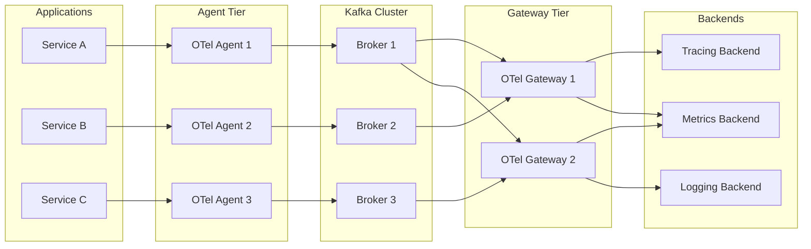
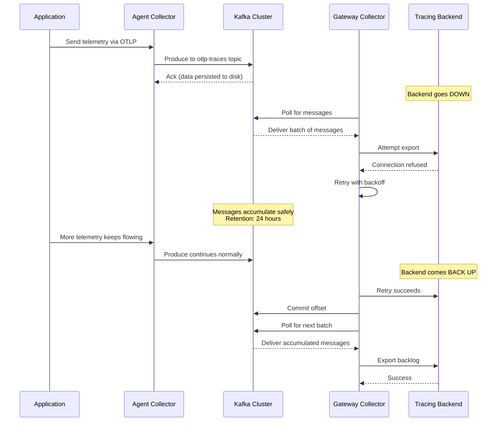

# How to Use Kafka as a Buffer Between Collector Tiers for Maximum Durability

Author: [nawazdhandala](https://www.github.com/nawazdhandala)

Tags: OpenTelemetry, Kafka, Observability, Reliability, Data Pipeline

Description: Learn how to place Apache Kafka between OpenTelemetry Collector tiers to build durable, loss-resistant telemetry pipelines that survive outages and traffic spikes.

---

When you run OpenTelemetry at scale, the gap between your agents and your backend becomes the most fragile part of the pipeline. Collectors can crash, backends can go down, and sudden traffic spikes can overwhelm everything in between. Placing Apache Kafka as a buffer between collector tiers solves these problems by giving you a durable, replayable message layer that decouples producers from consumers.

This guide walks through the architecture, configuration, and operational details of running Kafka between OpenTelemetry Collector tiers in production.

## Why Kafka Between Collector Tiers

The typical OpenTelemetry pipeline looks like this: agents collect telemetry from applications, forward it to a gateway collector, which then exports to a backend. The problem is that if the gateway or backend goes down, agents either drop data or block.

Kafka fixes this by acting as a persistent buffer. Agents write to Kafka, and gateway collectors read from Kafka at their own pace. If the backend is down for an hour, the data sits safely in Kafka until things recover.

Here are the key benefits:

- **Durability**: Kafka persists messages to disk with configurable retention. Your telemetry data survives collector restarts and backend outages.
- **Decoupling**: Producers and consumers operate independently. A slow backend does not cause agents to drop data.
- **Replay**: If you need to reprocess data (maybe you changed a pipeline rule), you can reset consumer offsets and replay from Kafka.
- **Scalability**: Kafka partitions let you scale consumption horizontally without changing the producer side.

## Architecture Overview

The architecture has three layers: agent collectors that gather telemetry from your applications, Kafka as the durable buffer in the middle, and gateway collectors that consume from Kafka and export to your backends.



## Setting Up Kafka Topics

Before configuring the collectors, you need Kafka topics for each signal type. Separating traces, metrics, and logs into different topics lets you scale and tune each independently.

Create the topics with appropriate partition counts and replication factors for your cluster size:

```bash
# Create a topic for traces with 12 partitions and replication factor of 3
# 12 partitions gives good parallelism for most mid-size deployments
kafka-topics.sh --create \
  --bootstrap-server kafka-1:9092,kafka-2:9092,kafka-3:9092 \
  --topic otlp-traces \
  --partitions 12 \
  --replication-factor 3 \
  --config retention.ms=86400000 \
  --config retention.bytes=10737418240

# Create a topic for metrics with similar settings
kafka-topics.sh --create \
  --bootstrap-server kafka-1:9092,kafka-2:9092,kafka-3:9092 \
  --topic otlp-metrics \
  --partitions 12 \
  --replication-factor 3 \
  --config retention.ms=86400000 \
  --config retention.bytes=10737418240

# Create a topic for logs, which typically needs more throughput
# so we give it more partitions
kafka-topics.sh --create \
  --bootstrap-server kafka-1:9092,kafka-2:9092,kafka-3:9092 \
  --topic otlp-logs \
  --partitions 24 \
  --replication-factor 3 \
  --config retention.ms=86400000 \
  --config retention.bytes=21474836480
```

The retention settings above keep data for 24 hours (86400000 ms) with a maximum of 10 GB per partition for traces and metrics, and 20 GB for logs. Adjust these based on your traffic volume and how long you want data to survive an outage.

## Configuring the Agent Tier (Kafka Producer)

The agent collectors run as sidecars or daemonsets close to your applications. They receive telemetry via OTLP and export it to Kafka using the Kafka exporter.

This is the agent collector configuration that produces to Kafka:

```yaml
# agent-collector-config.yaml
# This collector runs on each node and forwards telemetry to Kafka
receivers:
  otlp:
    protocols:
      grpc:
        endpoint: 0.0.0.0:4317
      http:
        endpoint: 0.0.0.0:4318

processors:
  # Batch telemetry before sending to Kafka to reduce the number
  # of small messages and improve throughput
  batch:
    send_batch_size: 1024
    send_batch_max_size: 2048
    timeout: 5s

  # Add metadata about the originating node so you can trace
  # data lineage through the pipeline
  resource:
    attributes:
      - key: collector.tier
        value: agent
        action: upsert
      - key: collector.node
        value: ${env:NODE_NAME}
        action: upsert

  # Keep memory usage bounded on the agent nodes
  memory_limiter:
    check_interval: 1s
    limit_mib: 512
    spike_limit_mib: 128

exporters:
  # Kafka exporter for traces
  kafka/traces:
    brokers:
      - kafka-1:9092
      - kafka-2:9092
      - kafka-3:9092
    topic: otlp-traces
    encoding: otlp_proto
    # Use snappy compression to reduce network bandwidth
    # between agents and Kafka
    producer:
      compression: snappy
      max_message_bytes: 10000000
      flush_max_messages: 500
      required_acks: -1  # Wait for all in-sync replicas

  # Kafka exporter for metrics
  kafka/metrics:
    brokers:
      - kafka-1:9092
      - kafka-2:9092
      - kafka-3:9092
    topic: otlp-metrics
    encoding: otlp_proto
    producer:
      compression: snappy
      max_message_bytes: 10000000
      required_acks: -1

  # Kafka exporter for logs
  kafka/logs:
    brokers:
      - kafka-1:9092
      - kafka-2:9092
      - kafka-3:9092
    topic: otlp-logs
    encoding: otlp_proto
    producer:
      compression: snappy
      max_message_bytes: 10000000
      required_acks: -1

service:
  pipelines:
    traces:
      receivers: [otlp]
      processors: [memory_limiter, resource, batch]
      exporters: [kafka/traces]
    metrics:
      receivers: [otlp]
      processors: [memory_limiter, resource, batch]
      exporters: [kafka/metrics]
    logs:
      receivers: [otlp]
      processors: [memory_limiter, resource, batch]
      exporters: [kafka/logs]
```

A few things to note about this configuration. Setting `required_acks: -1` means Kafka waits for all in-sync replicas to acknowledge the write before returning success. This gives you the strongest durability guarantee. The `snappy` compression reduces bandwidth usage without adding much CPU overhead.

## Configuring the Gateway Tier (Kafka Consumer)

The gateway collectors consume from Kafka and export to your observability backends. They run as a stateless deployment that you can scale horizontally by adding more replicas. Kafka consumer groups handle partition assignment automatically.

Here is the gateway collector configuration:

```yaml
# gateway-collector-config.yaml
# This collector reads from Kafka and forwards to backends
receivers:
  # Kafka receiver for traces -- reads from the otlp-traces topic
  kafka/traces:
    brokers:
      - kafka-1:9092
      - kafka-2:9092
      - kafka-3:9092
    topic: otlp-traces
    group_id: otel-gateway-traces
    encoding: otlp_proto
    # Start from the earliest unprocessed message if this is a
    # new consumer group or after an offset reset
    initial_offset: earliest
    # Commit offsets every 5 seconds to avoid reprocessing
    # too much data after a restart
    auto_commit:
      enable: true
      interval: 5s

  # Kafka receiver for metrics
  kafka/metrics:
    brokers:
      - kafka-1:9092
      - kafka-2:9092
      - kafka-3:9092
    topic: otlp-metrics
    group_id: otel-gateway-metrics
    encoding: otlp_proto
    initial_offset: earliest
    auto_commit:
      enable: true
      interval: 5s

  # Kafka receiver for logs
  kafka/logs:
    brokers:
      - kafka-1:9092
      - kafka-2:9092
      - kafka-3:9092
    topic: otlp-logs
    group_id: otel-gateway-logs
    encoding: otlp_proto
    initial_offset: earliest
    auto_commit:
      enable: true
      interval: 5s

processors:
  batch:
    send_batch_size: 2048
    timeout: 10s

  memory_limiter:
    check_interval: 1s
    limit_mib: 2048
    spike_limit_mib: 512

  # Add gateway-tier metadata for pipeline observability
  resource:
    attributes:
      - key: collector.tier
        value: gateway
        action: upsert

exporters:
  # Export traces to your tracing backend via OTLP
  otlp/traces:
    endpoint: tempo.observability.svc:4317
    tls:
      insecure: false
      ca_file: /etc/ssl/certs/ca.crt
    retry_on_failure:
      enabled: true
      initial_interval: 5s
      max_interval: 60s
      max_elapsed_time: 300s
    sending_queue:
      enabled: true
      num_consumers: 10
      queue_size: 5000

  # Export metrics to your metrics backend
  otlp/metrics:
    endpoint: mimir.observability.svc:4317
    tls:
      insecure: false
      ca_file: /etc/ssl/certs/ca.crt
    retry_on_failure:
      enabled: true
      initial_interval: 5s
      max_interval: 60s
    sending_queue:
      enabled: true
      num_consumers: 10
      queue_size: 5000

  # Export logs to your logging backend
  otlp/logs:
    endpoint: loki.observability.svc:4317
    tls:
      insecure: false
      ca_file: /etc/ssl/certs/ca.crt
    retry_on_failure:
      enabled: true
      initial_interval: 5s
      max_interval: 60s
    sending_queue:
      enabled: true
      num_consumers: 10
      queue_size: 5000

service:
  pipelines:
    traces:
      receivers: [kafka/traces]
      processors: [memory_limiter, resource, batch]
      exporters: [otlp/traces]
    metrics:
      receivers: [kafka/metrics]
      processors: [memory_limiter, resource, batch]
      exporters: [otlp/metrics]
    logs:
      receivers: [kafka/logs]
      processors: [memory_limiter, resource, batch]
      exporters: [otlp/logs]
```

## How Data Flows During an Outage

The real value of this setup shows up when things break. Here is what happens during a backend outage:



The agents never even know the backend was down. They keep writing to Kafka, which keeps accepting messages. When the backend recovers, the gateways work through the backlog at their own pace.

## Scaling Considerations

When sizing your Kafka cluster and collector tiers, think about these factors:

**Partition count**: Each partition can only be consumed by one consumer in a group. If you have 12 partitions and 4 gateway replicas, each gateway handles 3 partitions. If you scale to 12 gateways, each gets 1 partition. Going beyond 12 gateways would leave some idle.

**Consumer lag monitoring**: Track the consumer lag for each group. If lag keeps growing, you need more gateway replicas or faster backends.

Here is a Prometheus query to monitor consumer lag:

```promql
# This query shows the consumer lag per topic and consumer group,
# which tells you how far behind your gateways are from real-time
sum by (topic, group) (
  kafka_consumer_group_lag{
    group=~"otel-gateway-.*"
  }
)
```

**Retention tuning**: Set retention based on your longest expected outage. If your SLA says the backend can be down for 4 hours, set retention to at least 8 hours to give yourself margin. Remember that retention applies per partition, so total storage is `retention_bytes * partition_count`.

## Deploying with Kubernetes

Here is a Kubernetes deployment for the gateway tier that uses horizontal pod autoscaling based on Kafka consumer lag:

```yaml
# gateway-deployment.yaml
# Deploys gateway collectors that consume from Kafka
apiVersion: apps/v1
kind: Deployment
metadata:
  name: otel-gateway
  namespace: observability
spec:
  replicas: 3
  selector:
    matchLabels:
      app: otel-gateway
  template:
    metadata:
      labels:
        app: otel-gateway
    spec:
      containers:
        - name: otel-collector
          image: otel/opentelemetry-collector-contrib:0.96.0
          args: ["--config=/etc/otel/config.yaml"]
          resources:
            requests:
              cpu: "1"
              memory: 2Gi
            limits:
              cpu: "2"
              memory: 4Gi
          volumeMounts:
            - name: config
              mountPath: /etc/otel
            - name: tls
              mountPath: /etc/ssl/certs
      volumes:
        - name: config
          configMap:
            name: gateway-collector-config
        - name: tls
          secret:
            secretName: observability-tls
---
# Scale gateways based on Kafka consumer lag
apiVersion: autoscaling/v2
kind: HorizontalPodAutoscaler
metadata:
  name: otel-gateway-hpa
  namespace: observability
spec:
  scaleTargetRef:
    apiVersion: apps/v1
    kind: Deployment
    name: otel-gateway
  minReplicas: 3
  maxReplicas: 20
  metrics:
    - type: External
      external:
        metric:
          name: kafka_consumer_group_lag
          selector:
            matchLabels:
              group: otel-gateway-traces
        target:
          type: AverageValue
          # Scale up when average lag per pod exceeds 10000 messages
          averageValue: "10000"
```

## Handling Schema Evolution

One thing that catches people off guard is schema changes. When you upgrade your OpenTelemetry SDK or Collector, the protobuf schema for OTLP might change. Using `otlp_proto` encoding in both the Kafka exporter and receiver handles this well because protobuf is forward and backward compatible. Avoid using JSON encoding in production because it is slower and more fragile across versions.

## Wrapping Up

Putting Kafka between your collector tiers transforms your telemetry pipeline from a fragile chain into a resilient system. Agents never block on slow backends, data survives outages for as long as your retention allows, and you can scale each tier independently. The tradeoff is operational complexity (you now have a Kafka cluster to manage), but if you already run Kafka or have a managed Kafka service, this is one of the best patterns for production OpenTelemetry deployments.
