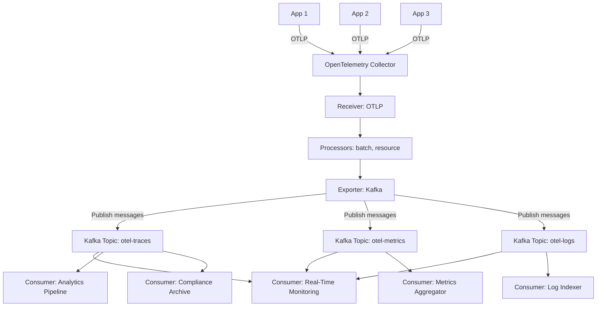
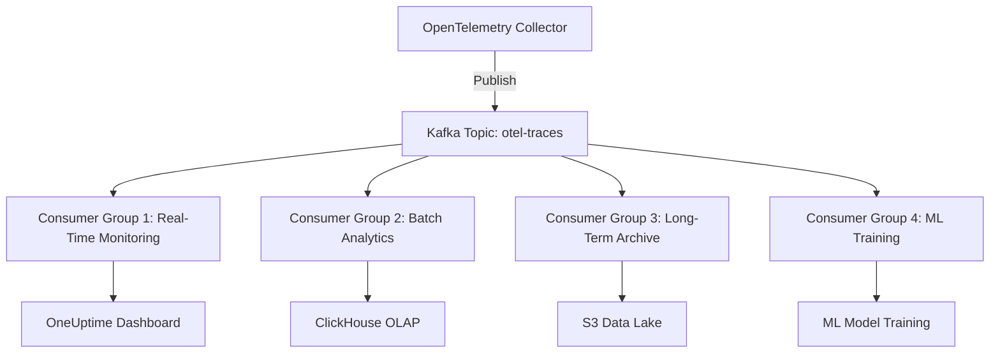

# How to Configure the Kafka Exporter in the OpenTelemetry Collector

Author: [nawazdhandala](https://www.github.com/nawazdhandala)

Tags: OpenTelemetry, Collector, Exporters, Kafka, Streaming, Message Queue, Event-Driven

Description: A detailed guide to configuring the Kafka exporter in OpenTelemetry Collector for streaming telemetry data to Apache Kafka topics, including authentication, partitioning strategies, serialization formats, and production-ready configurations for event-driven architectures.

---

The Kafka exporter sends telemetry data (traces, metrics, and logs) from the OpenTelemetry Collector to Apache Kafka topics. This enables event-driven architectures where multiple downstream consumers process telemetry independently, making it ideal for building flexible, scalable observability pipelines.

Unlike direct-to-backend exporters, the Kafka exporter decouples telemetry producers from consumers. Applications send telemetry to the Collector, which publishes to Kafka topics. Downstream systems (analytics engines, storage systems, custom processors) consume from these topics at their own pace, providing resilience, scalability, and flexibility.

This guide covers everything from basic Kafka integration to advanced partitioning strategies, authentication patterns, serialization formats, and production deployment architectures.

---

## Why Use the Kafka Exporter?

The Kafka exporter enables several powerful architectural patterns:

**Decoupled architecture**: Producers and consumers operate independently. Slow consumers do not block telemetry collection, and new consumers can be added without affecting existing systems.

**Multiple consumers**: Send telemetry to Kafka once, consume it many times for different purposes (real-time monitoring, batch analytics, long-term archival, compliance auditing).

**Buffer during outages**: Kafka acts as a durable buffer. If downstream systems are unavailable, telemetry accumulates in Kafka and is processed when systems recover.

**Stream processing**: Use Kafka Streams, Flink, or Spark to perform real-time analytics, aggregations, and transformations on telemetry data.

**Event-driven workflows**: Trigger actions based on telemetry events (auto-scaling based on metrics, incident creation for error traces, cost alerts for high-cardinality metrics).

**Data lake integration**: Export telemetry to Kafka, then use Kafka Connect to load it into data lakes (S3, HDFS, Delta Lake) for long-term storage and ML training.

---

## Basic Configuration

Here is a minimal Kafka exporter configuration:

```yaml
# receivers configuration (how telemetry enters the Collector)
receivers:
  otlp:
    protocols:
      grpc:        # Accept OTLP over gRPC from instrumented apps
      http:        # Accept OTLP over HTTP from instrumented apps

# exporters configuration (send telemetry to Kafka)
exporters:
  kafka:
    brokers:
      - kafka-1.example.com:9092
      - kafka-2.example.com:9092
      - kafka-3.example.com:9092

    # Kafka topic for telemetry
    topic: otel-telemetry

# service pipelines (wire receivers to exporters)
service:
  pipelines:
    traces:
      receivers: [otlp]
      exporters: [kafka]

    metrics:
      receivers: [otlp]
      exporters: [kafka]

    logs:
      receivers: [otlp]
      exporters: [kafka]
```

This sends all telemetry (traces, metrics, logs) to the `otel-telemetry` topic on the specified Kafka cluster.

---

## Architecture and Data Flow

This diagram shows how telemetry flows through Kafka to multiple consumers:



Kafka acts as a central hub that decouples producers (Collector) from consumers (monitoring, analytics, storage systems).

---

## Topic Configuration

You can send telemetry to a single topic or separate topics per signal type:

### Single Topic for All Signals

Simplest approach, useful for small deployments:

```yaml
exporters:
  kafka:
    brokers:
      - kafka.example.com:9092
    topic: otel-all  # All traces, metrics, and logs
```

Consumers must filter messages by signal type using message metadata or content inspection.

### Separate Topics per Signal

More common in production, allows signal-specific consumers:

```yaml
exporters:
  kafka/traces:
    brokers:
      - kafka.example.com:9092
    topic: otel-traces

  kafka/metrics:
    brokers:
      - kafka.example.com:9092
    topic: otel-metrics

  kafka/logs:
    brokers:
      - kafka.example.com:9092
    topic: otel-logs

service:
  pipelines:
    traces:
      receivers: [otlp]
      exporters: [kafka/traces]

    metrics:
      receivers: [otlp]
      exporters: [kafka/metrics]

    logs:
      receivers: [otlp]
      exporters: [kafka/logs]
```

This allows independent scaling and retention policies per signal type.

### Dynamic Topic Routing

Route to different topics based on resource attributes:

```yaml
exporters:
  kafka:
    brokers:
      - kafka.example.com:9092

    # Use resource attribute for topic name
    topic: otel-${resource.attributes.environment}

    # Fallback if attribute is missing
    fallback_topic: otel-unknown
```

With this configuration:
- Telemetry from `production` environment goes to `otel-production` topic
- Telemetry from `staging` environment goes to `otel-staging` topic
- Telemetry without environment attribute goes to `otel-unknown` topic

---

## Serialization Formats

The Kafka exporter supports multiple message serialization formats:

### OTLP Protobuf (Default)

Binary protobuf format, efficient and preserves full fidelity:

```yaml
exporters:
  kafka:
    brokers:
      - kafka.example.com:9092
    topic: otel-traces
    encoding: otlp_proto  # Default, binary protobuf
```

Best for:
- Maximum efficiency (smallest message size)
- Full OpenTelemetry data fidelity
- Consumers that understand OTLP protobuf format
- High-throughput scenarios

### OTLP JSON

Human-readable JSON format:

```yaml
exporters:
  kafka:
    brokers:
      - kafka.example.com:9092
    topic: otel-traces
    encoding: otlp_json  # JSON format
```

Best for:
- Debugging (can inspect messages with Kafka CLI tools)
- Consumers that prefer JSON over protobuf
- Integration with JSON-based stream processors

### Jaeger Protobuf

Jaeger-specific protobuf format (traces only):

```yaml
exporters:
  kafka:
    brokers:
      - kafka.example.com:9092
    topic: jaeger-spans
    encoding: jaeger_proto  # Jaeger format
```

Best for:
- Integrating with existing Jaeger infrastructure
- Consumers that expect Jaeger format
- Migrating from Jaeger to OpenTelemetry gradually

### Jaeger JSON

Jaeger-specific JSON format (traces only):

```yaml
exporters:
  kafka:
    brokers:
      - kafka.example.com:9092
    topic: jaeger-spans
    encoding: jaeger_json
```

Choose OTLP formats for new deployments. Use Jaeger formats only when integrating with legacy Jaeger systems.

---

## Partitioning Strategies

Kafka partitions enable parallel processing and ordering guarantees. Configure how telemetry is distributed across partitions:

### Trace ID Partitioning (Default)

Keep all spans from the same trace in the same partition:

```yaml
exporters:
  kafka:
    brokers:
      - kafka.example.com:9092
    topic: otel-traces

    # Partition by trace ID (default for traces)
    partition_key: trace_id
```

This ensures consumers can process complete traces without cross-partition coordination.

### Service Name Partitioning

Group telemetry by service:

```yaml
exporters:
  kafka:
    brokers:
      - kafka.example.com:9092
    topic: otel-traces

    # Partition by service name
    partition_key: resource.service.name
```

Useful when different consumers handle different services.

### Random Partitioning

Distribute evenly across partitions:

```yaml
exporters:
  kafka:
    brokers:
      - kafka.example.com:9092
    topic: otel-traces

    # No partition key = random distribution
    # partition_key: <not set>
```

Provides best load distribution but no ordering guarantees.

### Metadata-Based Partitioning

Partition based on custom attributes:

```yaml
exporters:
  kafka:
    brokers:
      - kafka.example.com:9092
    topic: otel-traces

    # Partition by custom attribute
    partition_key: resource.cluster.name
```

This allows cluster-specific consumers to subscribe to specific partitions.

---

## Authentication and Security

Kafka supports multiple authentication mechanisms for secure deployments:

### SASL/PLAIN Authentication

Username and password authentication:

```yaml
exporters:
  kafka:
    brokers:
      - kafka.example.com:9092
    topic: otel-traces

    # SASL/PLAIN authentication
    auth:
      sasl:
        mechanism: PLAIN
        username: ${KAFKA_USERNAME}
        password: ${KAFKA_PASSWORD}
```

Set credentials via environment variables:

```bash
export KAFKA_USERNAME="otel-producer"
export KAFKA_PASSWORD="secret-password"
./otelcol-contrib --config=config.yaml
```

### SASL/SCRAM Authentication

More secure than PLAIN, uses challenge-response:

```yaml
exporters:
  kafka:
    brokers:
      - kafka.example.com:9092
    topic: otel-traces

    auth:
      sasl:
        mechanism: SCRAM-SHA-512  # Or SCRAM-SHA-256
        username: ${KAFKA_USERNAME}
        password: ${KAFKA_PASSWORD}
```

### TLS Encryption

Encrypt data in transit:

```yaml
exporters:
  kafka:
    brokers:
      - kafka.example.com:9093  # TLS port
    topic: otel-traces

    # Enable TLS
    auth:
      tls:
        insecure: false  # Verify server certificate
        ca_file: /etc/kafka/ca.crt  # CA certificate
```

### Mutual TLS (mTLS)

Client certificate authentication:

```yaml
exporters:
  kafka:
    brokers:
      - kafka.example.com:9093
    topic: otel-traces

    # Mutual TLS authentication
    auth:
      tls:
        ca_file: /etc/kafka/ca.crt
        cert_file: /etc/kafka/client.crt
        key_file: /etc/kafka/client.key
```

### AWS MSK IAM Authentication

For AWS Managed Streaming for Kafka:

```yaml
exporters:
  kafka:
    brokers:
      - b-1.my-cluster.kafka.us-west-2.amazonaws.com:9098
    topic: otel-traces

    # AWS IAM authentication
    auth:
      sasl:
        mechanism: AWS_MSK_IAM
        aws_msk:
          region: us-west-2
          # Use IAM role credentials (recommended for EKS/EC2)
```

When running on EKS, configure IAM Roles for Service Accounts (IRSA) for seamless authentication.

---

## Producer Configuration

Fine-tune Kafka producer behavior for performance and reliability:

```yaml
exporters:
  kafka:
    brokers:
      - kafka.example.com:9092
    topic: otel-traces

    # Producer configuration
    producer:
      # Maximum time to wait for batch to fill
      max_message_bytes: 1000000  # 1 MB per message (default)

      # Compression (reduces network usage)
      compression: snappy  # Options: none, gzip, snappy, lz4, zstd

      # Number of acknowledgments required
      required_acks: 1  # Options: 0 (none), 1 (leader), -1 (all replicas)

      # Retry configuration
      max_retries: 3
      retry_backoff: 100ms  # Wait between retries
```

**Compression algorithms:**

- **snappy**: Fast compression, low CPU usage, good compression ratio (default)
- **gzip**: Better compression but higher CPU usage
- **lz4**: Very fast, low CPU, decent compression
- **zstd**: Best compression ratio, moderate CPU
- **none**: No compression (only for very fast networks)

**Required acks (durability vs latency):**

- **0**: No acknowledgment (fastest, least durable, message loss possible)
- **1**: Leader acknowledgment (balanced, some message loss possible on leader failure)
- **-1**: All replicas acknowledge (slowest, most durable, no message loss)

For production observability data, use `required_acks: 1` (good balance) or `-1` (maximum durability).

---

## Production-Ready Configuration

Here is a comprehensive production configuration:

```yaml
receivers:
  # Accept telemetry from instrumented applications
  otlp:
    protocols:
      grpc:
        endpoint: 0.0.0.0:4317
      http:
        endpoint: 0.0.0.0:4318

processors:
  # Protect Collector from memory exhaustion
  memory_limiter:
    check_interval: 1s
    limit_mib: 512
    spike_limit_mib: 128

  # Add resource attributes for identification
  resource:
    attributes:
      - key: collector.hostname
        value: ${HOSTNAME}
        action: upsert
      - key: deployment.environment
        value: production
        action: upsert

  # Batch telemetry to reduce Kafka messages
  batch:
    timeout: 10s
    send_batch_size: 1000
    send_batch_max_size: 1500

exporters:
  # Separate Kafka topics per signal type
  kafka/traces:
    brokers:
      - kafka-1.example.com:9092
      - kafka-2.example.com:9092
      - kafka-3.example.com:9092

    topic: otel-traces

    # Use efficient binary encoding
    encoding: otlp_proto

    # Partition by trace ID for complete traces per partition
    partition_key: trace_id

    # Authentication
    auth:
      sasl:
        mechanism: SCRAM-SHA-512
        username: ${KAFKA_USERNAME}
        password: ${KAFKA_PASSWORD}
      tls:
        insecure: false
        ca_file: /etc/kafka/ca.crt

    # Producer settings
    producer:
      compression: snappy
      required_acks: 1
      max_retries: 3
      retry_backoff: 100ms

    # Timeouts
    timeout: 10s

  kafka/metrics:
    brokers:
      - kafka-1.example.com:9092
      - kafka-2.example.com:9092
      - kafka-3.example.com:9092

    topic: otel-metrics
    encoding: otlp_proto

    # Partition by service name for service-specific consumers
    partition_key: resource.service.name

    auth:
      sasl:
        mechanism: SCRAM-SHA-512
        username: ${KAFKA_USERNAME}
        password: ${KAFKA_PASSWORD}
      tls:
        insecure: false
        ca_file: /etc/kafka/ca.crt

    producer:
      compression: snappy
      required_acks: 1

  kafka/logs:
    brokers:
      - kafka-1.example.com:9092
      - kafka-2.example.com:9092
      - kafka-3.example.com:9092

    topic: otel-logs
    encoding: otlp_proto

    # Random partitioning for even distribution
    # partition_key: <not set>

    auth:
      sasl:
        mechanism: SCRAM-SHA-512
        username: ${KAFKA_USERNAME}
        password: ${KAFKA_PASSWORD}
      tls:
        insecure: false
        ca_file: /etc/kafka/ca.crt

    producer:
      compression: snappy
      required_acks: 1

# Service configuration
service:
  pipelines:
    traces:
      receivers: [otlp]
      processors: [memory_limiter, resource, batch]
      exporters: [kafka/traces]

    metrics:
      receivers: [otlp]
      processors: [memory_limiter, resource, batch]
      exporters: [kafka/metrics]

    logs:
      receivers: [otlp]
      processors: [memory_limiter, resource, batch]
      exporters: [kafka/logs]
```

This configuration provides:

- Separate topics per signal type for independent consumption
- SASL/SCRAM authentication with TLS encryption
- Efficient Snappy compression
- Leader acknowledgment for balanced durability and performance
- Appropriate partitioning strategies per signal type
- Resource attribute tagging for traceability

---

## Multi-Consumer Architecture

One of Kafka's key benefits is supporting multiple independent consumers:



Each consumer group processes the same telemetry data independently for different purposes.

Example consumer configurations:

**Consumer 1: Real-time monitoring (low latency)**

```yaml
# OpenTelemetry Collector consuming from Kafka
receivers:
  kafka:
    brokers:
      - kafka.example.com:9092
    topic: otel-traces
    encoding: otlp_proto
    group_id: realtime-monitoring

exporters:
  otlphttp:
    endpoint: https://oneuptime.com/otlp
```

**Consumer 2: Batch analytics (high throughput)**

```yaml
# Kafka Connect to ClickHouse
{
  "name": "clickhouse-sink",
  "config": {
    "connector.class": "com.clickhouse.kafka.connect.ClickHouseSinkConnector",
    "topics": "otel-traces",
    "consumer.max.poll.records": "5000"
  }
}
```

**Consumer 3: Archival (long-term storage)**

```yaml
# Kafka Connect to S3
{
  "name": "s3-sink",
  "config": {
    "connector.class": "io.confluent.connect.s3.S3SinkConnector",
    "topics": "otel-traces",
    "s3.bucket.name": "telemetry-archive"
  }
}
```

---

## Kafka Topic Configuration

Configure Kafka topics for optimal performance and retention:

```bash
# Create topic with appropriate partitions and replication
kafka-topics.sh --create \
  --topic otel-traces \
  --partitions 12 \
  --replication-factor 3 \
  --config retention.ms=604800000 \  # 7 days retention
  --config compression.type=producer \  # Use producer compression
  --config max.message.bytes=1048576  # 1 MB max message size

# Create topic for metrics (shorter retention)
kafka-topics.sh --create \
  --topic otel-metrics \
  --partitions 6 \
  --replication-factor 3 \
  --config retention.ms=259200000  # 3 days retention

# Create topic for logs (shortest retention)
kafka-topics.sh --create \
  --topic otel-logs \
  --partitions 24 \
  --replication-factor 3 \
  --config retention.ms=86400000  # 1 day retention
```

**Partition count considerations:**

- More partitions = more parallelism (more consumers can process simultaneously)
- Too many partitions = higher overhead (more files, more memory)
- Rule of thumb: Start with 2-4 partitions per expected consumer instance
- Example: If you plan to run 3 consumer instances, use 6-12 partitions

**Retention considerations:**

- Traces: 3-7 days (balance between buffer capacity and storage cost)
- Metrics: 1-3 days (metrics are typically aggregated quickly)
- Logs: 1-2 days (logs are high volume, consume quickly)

---

## Troubleshooting Common Issues

### Connection Refused

**Problem**: Collector cannot connect to Kafka brokers.

**Solution**:
- Verify broker addresses and ports are correct
- Check network connectivity (`telnet kafka.example.com 9092`)
- Ensure firewall rules allow outbound connections
- Verify Kafka brokers are running and healthy

### Authentication Failures

**Problem**: Messages fail to publish with authentication errors.

**Solution**:
- Verify username and password are correct
- Check SASL mechanism matches broker configuration
- Ensure TLS certificates are valid and trusted
- Test authentication with Kafka CLI tools:

```bash
kafka-console-producer.sh \
  --broker-list kafka.example.com:9092 \
  --topic test \
  --producer-property security.protocol=SASL_SSL \
  --producer-property sasl.mechanism=SCRAM-SHA-512 \
  --producer-property sasl.jaas.config='...'
```

### Message Too Large

**Problem**: Collector fails to publish large telemetry batches.

**Solution**:
- Reduce batch size in batch processor
- Increase `max.message.bytes` on Kafka topic
- Increase `max_message_bytes` in exporter configuration
- Enable compression to reduce message size

```yaml
processors:
  batch:
    send_batch_size: 500  # Reduce batch size
    send_batch_max_size: 750

exporters:
  kafka:
    producer:
      max_message_bytes: 5000000  # 5 MB
      compression: zstd  # Better compression
```

### Slow Publishing

**Problem**: Kafka exporter has high latency.

**Solution**:
- Reduce `required_acks` (0 or 1 instead of -1)
- Enable compression to reduce network overhead
- Increase batch size to amortize per-message overhead
- Add more Kafka brokers if cluster is overloaded
- Check network latency between Collector and Kafka

### Consumer Lag

**Problem**: Consumers fall behind, lag increases.

**Solution**:
- Scale up consumer instances (add more consumers to consumer group)
- Increase partition count for more parallelism
- Optimize consumer processing logic
- Monitor consumer lag with Kafka metrics:

```bash
kafka-consumer-groups.sh \
  --bootstrap-server kafka.example.com:9092 \
  --group realtime-monitoring \
  --describe
```

---

## Monitoring Kafka Exporter

Monitor the exporter's performance using its internal metrics:

```promql
# Messages published successfully
rate(otelcol_exporter_sent_spans_total{exporter="kafka"}[5m])

# Failed publishes
rate(otelcol_exporter_send_failed_spans_total{exporter="kafka"}[5m])

# Publishing latency
histogram_quantile(0.99,
  rate(otelcol_exporter_send_latency_bucket{exporter="kafka"}[5m])
)
```

Also monitor Kafka broker metrics:

```bash
# Kafka metrics via JMX
kafka.server:type=BrokerTopicMetrics,name=MessagesInPerSec
kafka.server:type=BrokerTopicMetrics,name=BytesInPerSec
kafka.network:type=RequestMetrics,name=RequestQueueTimeMs
```

---

## Kafka vs Other Exporters

| Feature | Kafka Exporter | OTLP HTTP Exporter | File Exporter |
|---------|---------------|-------------------|---------------|
| Architecture | Pub/sub messaging | Direct push | Local storage |
| Multiple consumers | Yes (many consumers) | No (single backend) | No (local only) |
| Buffering during outages | Yes (Kafka retention) | Limited (Collector queue) | Yes (disk space) |
| Latency | Low to moderate | Low | Very low |
| Complexity | Higher (requires Kafka) | Lower | Lowest |
| Cost | Moderate (Kafka cluster) | Low | Very low |
| Best for | Event-driven architectures | Direct backend delivery | Archival, debugging |

Use Kafka when you need decoupled, multi-consumer architectures. Use OTLP for simple direct delivery to a single backend.

---

## Related Resources

- [What is the OpenTelemetry Collector and Why Use One?](https://oneuptime.com/blog/post/2025-09-18-what-is-opentelemetry-collector-and-why-use-one/view)
- [How to Configure the OTLP HTTP Exporter in the OpenTelemetry Collector](https://oneuptime.com/blog/post/2026-02-06-otlp-http-exporter-opentelemetry-collector/view)
- [How to Configure the File Exporter in the OpenTelemetry Collector](https://oneuptime.com/blog/post/2026-02-06-file-exporter-opentelemetry-collector/view)

---

## Summary

The Kafka exporter enables event-driven observability architectures by publishing telemetry to Apache Kafka topics. Key takeaways:

- Use separate topics per signal type for independent consumption
- Choose partitioning strategy based on consumer requirements
- Use OTLP protobuf encoding for efficiency and fidelity
- Enable SASL and TLS authentication for security
- Use Snappy or Zstd compression to reduce network usage
- Configure appropriate retention policies per topic
- Monitor consumer lag to detect processing bottlenecks
- Batch aggressively to reduce message overhead

The Kafka exporter is production-ready and powers observability pipelines at scale. It provides the flexibility to route telemetry to multiple destinations, perform stream processing, and build event-driven workflows around observability data.

For a fully managed observability solution that eliminates infrastructure complexity while providing flexible data routing, check out [OneUptime](https://oneuptime.com).
