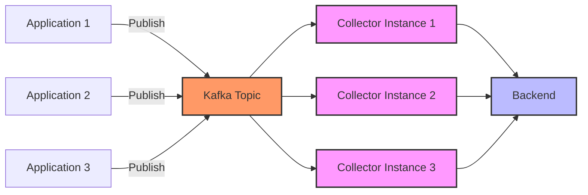

# How to Configure the Kafka Receiver in the OpenTelemetry Collector

Author: [nawazdhandala](https://www.github.com/nawazdhandala)

Tags: OpenTelemetry, Collector, Kafka, Message Queue, Distributed Systems, Observability

Description: Master the Kafka receiver in OpenTelemetry Collector for consuming telemetry data from Apache Kafka. Includes configuration examples, consumer group setup, and performance tuning.

Apache Kafka is a distributed streaming platform commonly used for building real-time data pipelines. The Kafka receiver in the OpenTelemetry Collector enables you to consume telemetry data (traces, metrics, and logs) from Kafka topics. This pattern is useful for decoupling telemetry producers from the collector, buffering during high load, and building resilient observability architectures.

## Understanding the Kafka Receiver

The Kafka receiver acts as a Kafka consumer that reads telemetry data from one or more Kafka topics. It deserializes messages, converts them to OpenTelemetry's internal format, and passes them through the collector's processing pipeline.

This architecture provides several benefits:

- **Decoupling**: Applications publish telemetry to Kafka without direct connection to the collector
- **Buffering**: Kafka acts as a durable buffer during collector downtime or maintenance
- **Scalability**: Multiple collector instances can consume from the same topic using consumer groups
- **Resilience**: Kafka's replication provides fault tolerance for telemetry data

## Basic Configuration

Here's a minimal configuration to consume traces from a Kafka topic:

```yaml
receivers:
  kafka:
    # Kafka broker addresses
    brokers:
      - localhost:9092

    # Protocol version for telemetry data
    protocol_version: 2.0.0

    # Topic to consume from
    topic: otlp_spans

    # Encoding of messages in Kafka
    encoding: otlp_proto

    # Consumer group ID
    group_id: otel-collector

processors:
  batch:
    timeout: 1s
    send_batch_size: 1024

exporters:
  logging:
    verbosity: detailed

service:
  pipelines:
    traces:
      receivers: [kafka]
      processors: [batch]
      exporters: [logging]
```

This configuration connects to a local Kafka broker, consumes messages from the `otlp_spans` topic using the OTLP Protobuf encoding, and forwards them through the pipeline.

## Supported Encodings

The Kafka receiver supports multiple message encodings:

```yaml
receivers:
  kafka:
    brokers:
      - kafka-1.example.com:9092
      - kafka-2.example.com:9092

    # OTLP Protobuf encoding (recommended for traces and metrics)
    topic: otlp_spans
    encoding: otlp_proto

  kafka/jaeger:
    brokers:
      - kafka-1.example.com:9092

    # Jaeger Protobuf encoding
    topic: jaeger_spans
    encoding: jaeger_proto

  kafka/zipkin:
    brokers:
      - kafka-1.example.com:9092

    # Zipkin JSON or Protobuf encoding
    topic: zipkin_spans
    encoding: zipkin_proto

  kafka/logs:
    brokers:
      - kafka-1.example.com:9092

    # Raw text logs
    topic: application_logs
    encoding: raw

service:
  pipelines:
    traces:
      receivers: [kafka, kafka/jaeger, kafka/zipkin]
      processors: [batch]
      exporters: [logging]

    logs:
      receivers: [kafka/logs]
      processors: [batch]
      exporters: [logging]
```

Available encodings:
- `otlp_proto`: OTLP Protobuf format (recommended)
- `jaeger_proto`: Jaeger Protobuf format
- `jaeger_json`: Jaeger JSON format
- `zipkin_proto`: Zipkin Protobuf format
- `zipkin_json`: Zipkin JSON format
- `raw`: Raw text (for logs)
- `json`: Generic JSON format

## Authentication Configuration

### SASL/PLAIN Authentication

Configure username/password authentication:

```yaml
receivers:
  kafka:
    brokers:
      - kafka.example.com:9092

    topic: otlp_spans
    encoding: otlp_proto
    group_id: otel-collector

    # SASL PLAIN authentication
    auth:
      sasl:
        mechanism: PLAIN
        username: collector-user
        password: ${KAFKA_PASSWORD}
```

Use environment variables for sensitive credentials:

```bash
export KAFKA_PASSWORD="your-secure-password"
```

### SASL/SCRAM Authentication

For enhanced security, use SCRAM-SHA-256 or SCRAM-SHA-512:

```yaml
receivers:
  kafka:
    brokers:
      - kafka.example.com:9092

    topic: otlp_spans
    encoding: otlp_proto
    group_id: otel-collector

    # SASL SCRAM-SHA-256 authentication
    auth:
      sasl:
        mechanism: SCRAM-SHA-256
        username: collector-user
        password: ${KAFKA_PASSWORD}
```

### TLS Configuration

Enable TLS encryption for secure communication:

```yaml
receivers:
  kafka:
    brokers:
      - kafka.example.com:9093

    topic: otlp_spans
    encoding: otlp_proto
    group_id: otel-collector

    # TLS configuration
    auth:
      tls:
        # CA certificate for broker verification
        ca_file: /etc/otel/certs/ca-cert.pem

        # Client certificate (mutual TLS)
        cert_file: /etc/otel/certs/client-cert.pem
        key_file: /etc/otel/certs/client-key.pem

        # Skip hostname verification (not recommended for production)
        insecure_skip_verify: false
```

### Combined SASL and TLS

Use both SASL authentication and TLS encryption:

```yaml
receivers:
  kafka:
    brokers:
      - kafka.example.com:9093

    topic: otlp_spans
    encoding: otlp_proto
    group_id: otel-collector

    # Combined SASL and TLS
    auth:
      sasl:
        mechanism: SCRAM-SHA-256
        username: collector-user
        password: ${KAFKA_PASSWORD}

      tls:
        ca_file: /etc/otel/certs/ca-cert.pem
        cert_file: /etc/otel/certs/client-cert.pem
        key_file: /etc/otel/certs/client-key.pem
```

## Consumer Group Configuration

Consumer groups enable horizontal scaling of the Kafka receiver:

```yaml
receivers:
  kafka:
    brokers:
      - kafka-1.example.com:9092
      - kafka-2.example.com:9092
      - kafka-3.example.com:9092

    topic: otlp_spans
    encoding: otlp_proto

    # Consumer group configuration
    group_id: otel-collector-traces

    # Client ID for identification
    client_id: collector-instance-01

    # Initial offset to consume from
    # Options: latest, earliest
    initial_offset: latest

    # Session timeout
    session_timeout: 10s

    # Heartbeat interval
    heartbeat_interval: 3s
```

## Data Flow Architecture



## Advanced Configuration Options

### Metadata Configuration

Control how the receiver fetches topic metadata:

```yaml
receivers:
  kafka:
    brokers:
      - kafka.example.com:9092

    topic: otlp_spans
    encoding: otlp_proto
    group_id: otel-collector

    # Metadata configuration
    metadata:
      # How often to refresh metadata
      refresh_frequency: 10m

      # Allow auto topic creation
      full: true

      # Retry settings
      retry:
        max: 3
        backoff: 250ms
```

### Message Processing Configuration

Fine-tune message consumption behavior:

```yaml
receivers:
  kafka:
    brokers:
      - kafka.example.com:9092

    topic: otlp_spans
    encoding: otlp_proto
    group_id: otel-collector

    # Partition assignment strategy
    # Options: range, roundrobin, sticky
    partition_assignment_strategy: roundrobin

    # Enable auto-commit of offsets
    auto_commit:
      enable: true
      interval: 1s
```

### Resource Attributes

Add metadata to consumed telemetry:

```yaml
receivers:
  kafka:
    brokers:
      - kafka.example.com:9092

    topic: otlp_spans
    encoding: otlp_proto
    group_id: otel-collector

    # Extract headers as resource attributes
    header_extraction:
      extract_headers: true
      headers:
        - key: client_id
          from: client-id
        - key: kafka_partition
          from: partition
```

## Complete Production Configuration

Here's a comprehensive production configuration:

```yaml
receivers:
  # Traces from Kafka
  kafka/traces:
    brokers:
      - kafka-1.example.com:9093
      - kafka-2.example.com:9093
      - kafka-3.example.com:9093

    protocol_version: 2.8.0

    topic: otlp_spans
    encoding: otlp_proto

    # Consumer group settings
    group_id: otel-collector-traces
    client_id: collector-traces-01
    initial_offset: latest

    # Timeouts
    session_timeout: 10s
    heartbeat_interval: 3s

    # Authentication
    auth:
      sasl:
        mechanism: SCRAM-SHA-256
        username: otel-collector
        password: ${KAFKA_PASSWORD}

      tls:
        ca_file: /etc/otel/certs/ca.pem
        cert_file: /etc/otel/certs/client.pem
        key_file: /etc/otel/certs/client-key.pem
        insecure_skip_verify: false

    # Metadata
    metadata:
      refresh_frequency: 10m
      full: true
      retry:
        max: 3
        backoff: 250ms

    # Auto-commit settings
    auto_commit:
      enable: true
      interval: 1s

  # Metrics from Kafka
  kafka/metrics:
    brokers:
      - kafka-1.example.com:9093
      - kafka-2.example.com:9093
      - kafka-3.example.com:9093

    protocol_version: 2.8.0

    topic: otlp_metrics
    encoding: otlp_proto

    group_id: otel-collector-metrics
    client_id: collector-metrics-01

    auth:
      sasl:
        mechanism: SCRAM-SHA-256
        username: otel-collector
        password: ${KAFKA_PASSWORD}

      tls:
        ca_file: /etc/otel/certs/ca.pem
        cert_file: /etc/otel/certs/client.pem
        key_file: /etc/otel/certs/client-key.pem

  # Logs from Kafka
  kafka/logs:
    brokers:
      - kafka-1.example.com:9093
      - kafka-2.example.com:9093
      - kafka-3.example.com:9093

    protocol_version: 2.8.0

    topic: application_logs
    encoding: raw

    group_id: otel-collector-logs
    client_id: collector-logs-01

    auth:
      sasl:
        mechanism: SCRAM-SHA-256
        username: otel-collector
        password: ${KAFKA_PASSWORD}

      tls:
        ca_file: /etc/otel/certs/ca.pem

processors:
  # Protect against memory overload
  memory_limiter:
    check_interval: 1s
    limit_mib: 2000
    spike_limit_mib: 400

  # Batch for efficiency
  batch:
    timeout: 1s
    send_batch_size: 2048
    send_batch_max_size: 4096

  # Add resource attributes
  resource:
    attributes:
      - key: collector.source
        value: kafka
        action: insert
      - key: deployment.environment
        value: production
        action: insert

exporters:
  # Export to OTLP backend
  otlp:
    endpoint: backend.example.com:4317
    tls:
      insecure: false
      cert_file: /etc/otel/certs/client.pem
      key_file: /etc/otel/certs/client-key.pem
    compression: gzip
    timeout: 10s

service:
  pipelines:
    traces:
      receivers: [kafka/traces]
      processors: [memory_limiter, batch, resource]
      exporters: [otlp]

    metrics:
      receivers: [kafka/metrics]
      processors: [memory_limiter, batch, resource]
      exporters: [otlp]

    logs:
      receivers: [kafka/logs]
      processors: [memory_limiter, batch, resource]
      exporters: [otlp]

  telemetry:
    logs:
      level: info
      encoding: json
    metrics:
      address: 0.0.0.0:8888
```

## Producing Data to Kafka

### Using OTLP Kafka Exporter

Configure applications to export directly to Kafka:

```yaml
# Application's OpenTelemetry Collector configuration
exporters:
  kafka:
    brokers:
      - kafka.example.com:9093

    # Topic to write to
    topic: otlp_spans

    # Encoding
    encoding: otlp_proto

    # Authentication
    auth:
      sasl:
        mechanism: SCRAM-SHA-256
        username: app-user
        password: ${KAFKA_PASSWORD}

      tls:
        ca_file: /etc/certs/ca.pem

service:
  pipelines:
    traces:
      receivers: [otlp]
      processors: [batch]
      exporters: [kafka]
```

### Using Kafka Producer Libraries

Example using Python with kafka-python:

```python
from kafka import KafkaProducer
from opentelemetry.proto.collector.trace.v1 import trace_service_pb2
import json

# Create Kafka producer
producer = KafkaProducer(
    bootstrap_servers=['kafka.example.com:9093'],
    security_protocol='SASL_SSL',
    sasl_mechanism='SCRAM-SHA-256',
    sasl_plain_username='app-user',
    sasl_plain_password='password',
    ssl_cafile='/etc/certs/ca.pem'
)

# Send telemetry data
def send_spans(spans):
    # Serialize to OTLP protobuf
    request = trace_service_pb2.ExportTraceServiceRequest()
    # ... populate request with spans ...

    # Send to Kafka
    producer.send('otlp_spans', request.SerializeToString())
    producer.flush()
```

## Performance Tuning

### Consumer Fetch Configuration

Optimize message fetching for high throughput:

```yaml
receivers:
  kafka:
    brokers:
      - kafka.example.com:9092

    topic: otlp_spans
    encoding: otlp_proto
    group_id: otel-collector

    # Fetch configuration
    fetch:
      # Minimum bytes to fetch
      min: 1048576  # 1 MB

      # Maximum bytes to fetch
      max: 52428800  # 50 MB

      # Maximum wait time
      wait_time: 500ms
```

### Parallel Processing

Configure multiple consumers for parallel processing:

```yaml
receivers:
  kafka:
    brokers:
      - kafka.example.com:9092

    topic: otlp_spans
    encoding: otlp_proto
    group_id: otel-collector

    # Number of consumer goroutines
    consumers: 10
```

### Offset Management

Control offset commit behavior for reliability:

```yaml
receivers:
  kafka:
    brokers:
      - kafka.example.com:9092

    topic: otlp_spans
    encoding: otlp_proto
    group_id: otel-collector

    # Manual offset management for reliability
    auto_commit:
      enable: false

    # Commit offsets after successful processing
    offset_retention: 168h  # 7 days
```

## Monitoring and Observability

### Consumer Lag Monitoring

Monitor consumer lag to ensure the receiver keeps up with incoming data:

```bash
# Check consumer lag
kafka-consumer-groups.sh --bootstrap-server kafka.example.com:9092 \
  --group otel-collector-traces --describe
```

### Metrics to Monitor

Key metrics for the Kafka receiver:

```yaml
service:
  telemetry:
    metrics:
      address: 0.0.0.0:8888
      level: detailed
```

Important metrics:
- `otelcol_receiver_accepted_spans`: Spans accepted from Kafka
- `otelcol_receiver_refused_spans`: Spans refused (errors)
- `kafka_consumer_lag`: Consumer lag per partition
- `kafka_consumer_offset`: Current offset per partition

## Troubleshooting Common Issues

### Consumer Group Rebalancing

Frequent rebalancing can impact performance. Increase timeouts:

```yaml
receivers:
  kafka:
    brokers:
      - kafka.example.com:9092

    topic: otlp_spans
    encoding: otlp_proto
    group_id: otel-collector

    # Increase timeouts to reduce rebalancing
    session_timeout: 30s
    heartbeat_interval: 10s
```

### Authentication Failures

Verify credentials and authentication mechanism:

```bash
# Test connection with credentials
kafka-console-consumer.sh --bootstrap-server kafka.example.com:9093 \
  --topic otlp_spans \
  --consumer-property security.protocol=SASL_SSL \
  --consumer-property sasl.mechanism=SCRAM-SHA-256 \
  --consumer-property sasl.jaas.config='org.apache.kafka.common.security.scram.ScramLoginModule required username="user" password="pass";'
```

### Decode Errors

Ensure encoding matches the format of messages in Kafka:

```yaml
receivers:
  kafka:
    brokers:
      - kafka.example.com:9092

    topic: otlp_spans

    # Match encoding with producer
    encoding: otlp_proto  # or jaeger_proto, zipkin_json, etc.

service:
  telemetry:
    logs:
      level: debug  # Enable debug logging to see decode errors
```

## Integration with OneUptime

Export telemetry consumed from Kafka to OneUptime:

```yaml
exporters:
  otlp:
    endpoint: otlp.oneuptime.com:4317
    headers:
      x-oneuptime-token: "your-token-here"

service:
  pipelines:
    traces:
      receivers: [kafka]
      processors: [batch]
      exporters: [otlp]
```

## Related Resources

Learn more about OpenTelemetry Collector receivers:

- https://oneuptime.com/blog/post/2026-02-06-jaeger-receiver-opentelemetry-collector/view
- https://oneuptime.com/blog/post/2026-02-06-zipkin-receiver-opentelemetry-collector/view
- https://oneuptime.com/blog/post/2026-02-06-statsd-receiver-opentelemetry-collector/view

## Conclusion

The Kafka receiver provides powerful capabilities for building scalable and resilient observability pipelines. By leveraging Kafka's distributed architecture, you can decouple telemetry producers from consumers, buffer data during outages, and scale horizontally using consumer groups.

Start with basic configuration and progressively add authentication, TLS encryption, and performance optimizations. Monitor consumer lag and adjust fetch parameters to maintain optimal throughput for your workload.

With proper configuration, the Kafka receiver enables production-grade telemetry ingestion that can handle high volumes while providing durability and fault tolerance through Kafka's robust infrastructure.
