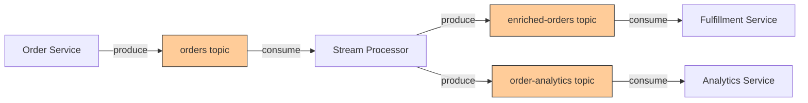
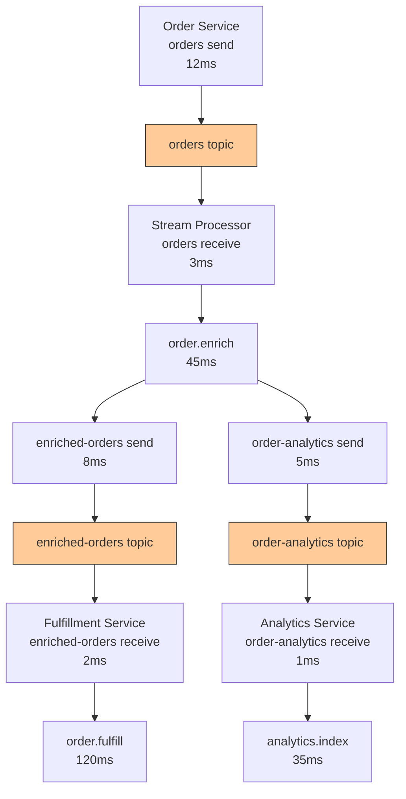

# How to Build Real-Time Kafka Streaming Observability with OpenTelemetry

Author: [nawazdhandala](https://www.github.com/nawazdhandala)

Tags: OpenTelemetry, Kafka, Streaming, Observability, Distributed Tracing, Metrics, Java

Description: Learn how to build real-time observability for Apache Kafka streaming applications using OpenTelemetry, covering producer and consumer instrumentation, trace propagation, and stream processing metrics.

---

Apache Kafka sits at the center of many real-time data pipelines, handling millions of events per second for use cases ranging from event sourcing to log aggregation to stream processing. The challenge with Kafka observability is that messages flow asynchronously through topics and partitions, making it difficult to trace a single event from producer to consumer. A message might be produced by one service, processed by a stream processor, and consumed by three different downstream services, all without a direct request-response relationship.

OpenTelemetry solves this by propagating trace context through Kafka message headers. When a producer sends a message, the current trace context gets injected into the message headers. When a consumer picks it up, the context is extracted, and the consumer's processing becomes a linked span in the same trace. This guide covers how to set up that end-to-end observability for a Kafka-based streaming system.

## Kafka Streaming Architecture

Before diving into code, here is the architecture we will instrument:



An order comes in, gets produced to the `orders` topic, a stream processor enriches it and fans out to two topics, and downstream consumers handle fulfillment and analytics. Without tracing, if the fulfillment service sees a delayed order, you have no way to know whether the delay was in the original producer, the stream processor, or the consumer itself.

## Instrumenting the Kafka Producer

The producer side is where trace context gets injected into message headers. Using OpenTelemetry's Kafka instrumentation for Java, much of this happens automatically, but understanding the mechanics helps when you need to add custom attributes:

```java
// OrderProducer.java
import io.opentelemetry.api.OpenTelemetry;
import io.opentelemetry.api.trace.Span;
import io.opentelemetry.api.trace.SpanKind;
import io.opentelemetry.api.trace.Tracer;
import io.opentelemetry.context.Context;
import io.opentelemetry.context.propagation.TextMapSetter;
import org.apache.kafka.clients.producer.KafkaProducer;
import org.apache.kafka.clients.producer.ProducerRecord;
import org.apache.kafka.common.header.Headers;

import java.nio.charset.StandardCharsets;

public class OrderProducer {
    private final KafkaProducer<String, String> producer;
    private final Tracer tracer;
    private final OpenTelemetry openTelemetry;

    // TextMapSetter injects trace context into Kafka headers
    private static final TextMapSetter<Headers> HEADER_SETTER =
        (headers, key, value) ->
            headers.add(key, value.getBytes(StandardCharsets.UTF_8));

    public OrderProducer(KafkaProducer<String, String> producer, OpenTelemetry otel) {
        this.producer = producer;
        this.openTelemetry = otel;
        this.tracer = otel.getTracer("order-producer", "1.0.0");
    }

    public void sendOrder(Order order) {
        // Create a PRODUCER span representing this message send
        Span span = tracer.spanBuilder("orders send")
            .setSpanKind(SpanKind.PRODUCER)
            .setAttribute("messaging.system", "kafka")
            .setAttribute("messaging.destination.name", "orders")
            .setAttribute("messaging.operation", "publish")
            .setAttribute("order.id", order.getId())
            .setAttribute("order.item_count", order.getItems().size())
            .startSpan();

        try {
            ProducerRecord<String, String> record = new ProducerRecord<>(
                "orders",
                order.getId(),
                serializeOrder(order)
            );

            // Inject the current trace context into Kafka message headers
            openTelemetry.getPropagators()
                .getTextMapPropagator()
                .inject(Context.current().with(span), record.headers(), HEADER_SETTER);

            // Send the message asynchronously with a callback
            producer.send(record, (metadata, exception) -> {
                if (exception != null) {
                    span.setStatus(io.opentelemetry.api.trace.StatusCode.ERROR,
                        exception.getMessage());
                    span.recordException(exception);
                } else {
                    // Record the partition and offset for debugging
                    span.setAttribute("messaging.kafka.partition", metadata.partition());
                    span.setAttribute("messaging.kafka.offset", metadata.offset());
                    span.setStatus(io.opentelemetry.api.trace.StatusCode.OK);
                }
                span.end();
            });
        } catch (Exception e) {
            span.setStatus(io.opentelemetry.api.trace.StatusCode.ERROR, e.getMessage());
            span.recordException(e);
            span.end();
            throw e;
        }
    }
}
```

The key piece is the `inject` call that writes trace context into the Kafka record's headers. When the consumer reads this message, it can extract that context and continue the same trace. The `messaging.kafka.partition` and `messaging.kafka.offset` attributes are useful for correlating traces with Kafka's internal state when debugging ordering or duplication issues.

## Instrumenting the Kafka Consumer

On the consumer side, you extract the trace context from the incoming message headers and create a new span linked to the producer's span:

```java
// OrderConsumer.java
import io.opentelemetry.api.OpenTelemetry;
import io.opentelemetry.api.trace.Span;
import io.opentelemetry.api.trace.SpanKind;
import io.opentelemetry.api.trace.Tracer;
import io.opentelemetry.context.Context;
import io.opentelemetry.context.Scope;
import io.opentelemetry.context.propagation.TextMapGetter;
import org.apache.kafka.clients.consumer.ConsumerRecord;
import org.apache.kafka.clients.consumer.ConsumerRecords;
import org.apache.kafka.clients.consumer.KafkaConsumer;
import org.apache.kafka.common.header.Header;

import java.nio.charset.StandardCharsets;
import java.time.Duration;

public class OrderConsumer {
    private final KafkaConsumer<String, String> consumer;
    private final Tracer tracer;
    private final OpenTelemetry openTelemetry;

    // TextMapGetter extracts trace context from Kafka headers
    private static final TextMapGetter<ConsumerRecord<String, String>> HEADER_GETTER =
        new TextMapGetter<>() {
            @Override
            public Iterable<String> keys(ConsumerRecord<String, String> carrier) {
                return () -> {
                    java.util.List<String> keys = new java.util.ArrayList<>();
                    carrier.headers().forEach(h -> keys.add(h.key()));
                    return keys.iterator();
                };
            }

            @Override
            public String get(ConsumerRecord<String, String> carrier, String key) {
                Header header = carrier.headers().lastHeader(key);
                return header != null
                    ? new String(header.value(), StandardCharsets.UTF_8)
                    : null;
            }
        };

    public OrderConsumer(KafkaConsumer<String, String> consumer, OpenTelemetry otel) {
        this.consumer = consumer;
        this.openTelemetry = otel;
        this.tracer = otel.getTracer("order-consumer", "1.0.0");
    }

    public void pollAndProcess() {
        while (true) {
            ConsumerRecords<String, String> records = consumer.poll(Duration.ofMillis(100));

            for (ConsumerRecord<String, String> record : records) {
                // Extract trace context from message headers
                Context extractedContext = openTelemetry.getPropagators()
                    .getTextMapPropagator()
                    .extract(Context.current(), record, HEADER_GETTER);

                // Create a CONSUMER span linked to the producer span
                Span span = tracer.spanBuilder("orders receive")
                    .setParent(extractedContext)
                    .setSpanKind(SpanKind.CONSUMER)
                    .setAttribute("messaging.system", "kafka")
                    .setAttribute("messaging.destination.name", record.topic())
                    .setAttribute("messaging.operation", "receive")
                    .setAttribute("messaging.kafka.partition", record.partition())
                    .setAttribute("messaging.kafka.offset", record.offset())
                    .setAttribute("messaging.kafka.consumer.group", "order-processor")
                    .startSpan();

                try (Scope scope = span.makeCurrent()) {
                    // Process the message within the traced context
                    processOrder(record, span);
                    span.setStatus(io.opentelemetry.api.trace.StatusCode.OK);
                } catch (Exception e) {
                    span.setStatus(io.opentelemetry.api.trace.StatusCode.ERROR,
                        e.getMessage());
                    span.recordException(e);
                    handleProcessingError(record, e);
                } finally {
                    span.end();
                }
            }
        }
    }

    private void processOrder(ConsumerRecord<String, String> record, Span parentSpan) {
        Order order = deserializeOrder(record.value());

        // Create a child span for the business logic
        Span processSpan = tracer.spanBuilder("order.enrich")
            .setAttribute("order.id", order.getId())
            .setAttribute("order.total", order.getTotal())
            .startSpan();

        try (Scope scope = processSpan.makeCurrent()) {
            // Enrich the order with customer data
            enrichWithCustomerData(order);
            // Enrich with inventory availability
            enrichWithInventoryStatus(order);

            processSpan.setStatus(io.opentelemetry.api.trace.StatusCode.OK);
        } catch (Exception e) {
            processSpan.setStatus(io.opentelemetry.api.trace.StatusCode.ERROR,
                e.getMessage());
            processSpan.recordException(e);
            throw e;
        } finally {
            processSpan.end();
        }
    }
}
```

The `setParent(extractedContext)` call is what creates the connection between the producer and consumer spans. In your tracing backend, you will see the consumer span as a child of the producer span, even though they run in different processes.

## Measuring Kafka-Specific Metrics

Traces show you individual message flows, but you also need aggregate metrics to understand the health of your streaming system. Here are the metrics that matter most:

```java
// KafkaStreamingMetrics.java
import io.opentelemetry.api.metrics.LongCounter;
import io.opentelemetry.api.metrics.LongHistogram;
import io.opentelemetry.api.metrics.Meter;
import io.opentelemetry.api.metrics.ObservableGauge;

public class KafkaStreamingMetrics {
    private final LongCounter messagesProduced;
    private final LongCounter messagesConsumed;
    private final LongCounter processingErrors;
    private final LongHistogram processingLatency;
    private final LongHistogram messageAge;

    public KafkaStreamingMetrics(Meter meter) {
        // Count messages produced, partitioned by topic
        messagesProduced = meter.counterBuilder("kafka.messages.produced")
            .setDescription("Number of messages produced to Kafka")
            .build();

        // Count messages consumed, partitioned by topic and consumer group
        messagesConsumed = meter.counterBuilder("kafka.messages.consumed")
            .setDescription("Number of messages consumed from Kafka")
            .build();

        // Count processing errors by type
        processingErrors = meter.counterBuilder("kafka.processing.errors")
            .setDescription("Number of message processing errors")
            .build();

        // Histogram of message processing time
        processingLatency = meter.histogramBuilder("kafka.processing.latency")
            .setDescription("Time to process a consumed message")
            .setUnit("ms")
            .ofLongs()
            .build();

        // Histogram of message age (time from produce to consume)
        messageAge = meter.histogramBuilder("kafka.message.age")
            .setDescription("Time between message production and consumption")
            .setUnit("ms")
            .ofLongs()
            .build();
    }

    public void recordProduced(String topic) {
        messagesProduced.add(1,
            io.opentelemetry.api.common.Attributes.of(
                io.opentelemetry.api.common.AttributeKey.stringKey("messaging.destination.name"),
                topic
            ));
    }

    public void recordConsumed(String topic, String consumerGroup, long ageMs) {
        var attrs = io.opentelemetry.api.common.Attributes.builder()
            .put("messaging.destination.name", topic)
            .put("messaging.kafka.consumer.group", consumerGroup)
            .build();

        messagesConsumed.add(1, attrs);
        messageAge.record(ageMs, attrs);
    }

    public void recordProcessingLatency(String topic, long latencyMs) {
        processingLatency.record(latencyMs,
            io.opentelemetry.api.common.Attributes.of(
                io.opentelemetry.api.common.AttributeKey.stringKey("messaging.destination.name"),
                topic
            ));
    }
}
```

The `kafka.message.age` metric is particularly valuable. It measures the time from when a message was produced to when it was consumed and processed. A rising message age indicates that consumers are falling behind, even before consumer lag metrics from the broker show a problem.

## Instrumenting Kafka Streams Applications

If you use Kafka Streams for stream processing, you need to instrument the topology itself. Kafka Streams does not have native OpenTelemetry support yet, but you can wrap your processors:

```java
// TracedProcessor.java
import io.opentelemetry.api.trace.Span;
import io.opentelemetry.api.trace.SpanKind;
import io.opentelemetry.api.trace.Tracer;
import org.apache.kafka.streams.processor.api.Processor;
import org.apache.kafka.streams.processor.api.ProcessorContext;
import org.apache.kafka.streams.processor.api.Record;

public class TracedProcessor<KIn, VIn, KOut, VOut> implements Processor<KIn, VIn, KOut, VOut> {
    private final Processor<KIn, VIn, KOut, VOut> delegate;
    private final Tracer tracer;
    private final String processorName;
    private ProcessorContext<KOut, VOut> context;

    public TracedProcessor(Processor<KIn, VIn, KOut, VOut> delegate,
                           Tracer tracer, String processorName) {
        this.delegate = delegate;
        this.tracer = tracer;
        this.processorName = processorName;
    }

    @Override
    public void init(ProcessorContext<KOut, VOut> ctx) {
        this.context = ctx;
        delegate.init(ctx);
    }

    @Override
    public void process(Record<KIn, VIn> record) {
        // Create a span for each record processed in the topology
        Span span = tracer.spanBuilder("streams." + processorName + " process")
            .setSpanKind(SpanKind.CONSUMER)
            .setAttribute("messaging.system", "kafka")
            .setAttribute("kafka.streams.processor", processorName)
            .setAttribute("kafka.streams.task.id",
                context.taskId().toString())
            .startSpan();

        try {
            delegate.process(record);
            span.setStatus(io.opentelemetry.api.trace.StatusCode.OK);
        } catch (Exception e) {
            span.setStatus(io.opentelemetry.api.trace.StatusCode.ERROR, e.getMessage());
            span.recordException(e);
            throw e;
        } finally {
            span.end();
        }
    }
}
```

This wrapper adds tracing to any Kafka Streams processor without modifying the business logic. You can apply it across your topology to get visibility into how records flow through different processing stages.

## Collector Configuration for Kafka Telemetry

The Collector needs to handle the high volume of telemetry that Kafka applications produce. Here is a configuration tuned for streaming workloads:

```yaml
# otel-collector-config.yaml
receivers:
  otlp:
    protocols:
      grpc:
        endpoint: 0.0.0.0:4317

  # Optionally scrape Kafka broker JMX metrics
  kafkametrics:
    brokers:
      - kafka-1:9092
      - kafka-2:9092
      - kafka-3:9092
    protocol_version: 3.6.0
    scrapers:
      - brokers
      - topics
      - consumers
    collection_interval: 30s

processors:
  memory_limiter:
    check_interval: 1s
    limit_mib: 2048
    spike_limit_mib: 512

  # Larger batch sizes for high-throughput streaming telemetry
  batch:
    timeout: 10s
    send_batch_size: 1024
    send_batch_max_size: 2048

  # Add Kafka-specific resource attributes
  resource:
    attributes:
      - key: platform
        value: kafka-streaming
        action: upsert

exporters:
  otlp:
    endpoint: your-backend:4317
    sending_queue:
      enabled: true
      num_consumers: 10
      queue_size: 5000

service:
  pipelines:
    traces:
      receivers: [otlp]
      processors: [memory_limiter, resource, batch]
      exporters: [otlp]
    metrics:
      receivers: [otlp, kafkametrics]
      processors: [memory_limiter, resource, batch]
      exporters: [otlp]
```

The `kafkametrics` receiver scrapes broker-level metrics directly, giving you topic throughput, partition counts, and consumer group offsets alongside your application telemetry. The larger batch sizes and sending queue accommodate the high volume of events typical in streaming applications.

## Tracing Across Multiple Hops

In a fan-out architecture where one topic feeds multiple consumers, the trace looks like a tree:



Each service in this chain extracts and propagates context, so you get a complete picture of a single order flowing through the entire system. If the fulfillment service is slow, you can see whether the delay was in the `order.fulfill` span or whether the message sat in the topic for a long time before being consumed.

## Monitoring Stream Processing Health

Beyond individual traces, you need dashboard panels that show overall streaming health:

```yaml
# Dashboard queries (PromQL examples)
# Message throughput by topic
# rate(kafka_messages_produced_total[5m])
# rate(kafka_messages_consumed_total[5m])

# Processing latency percentiles
# histogram_quantile(0.95, rate(kafka_processing_latency_bucket[5m]))
# histogram_quantile(0.99, rate(kafka_processing_latency_bucket[5m]))

# Message age (produce-to-consume delay)
# histogram_quantile(0.95, rate(kafka_message_age_bucket[5m]))

# Error rate by topic
# rate(kafka_processing_errors_total[5m])
```

A healthy streaming system shows stable throughput, low processing latency, and minimal message age. When any of these deviate, you drill into traces from that time window to find the root cause.

## Handling Dead Letter Queues

When message processing fails after retries, messages typically go to a dead letter queue (DLQ). Instrument this path so failed messages remain traceable:

```java
// DeadLetterHandler.java
private void sendToDeadLetterQueue(ConsumerRecord<String, String> record,
                                     Exception error, Span originalSpan) {
    Span dlqSpan = tracer.spanBuilder("dlq.send")
        .setSpanKind(SpanKind.PRODUCER)
        .setAttribute("messaging.system", "kafka")
        .setAttribute("messaging.destination.name", record.topic() + ".dlq")
        .setAttribute("dlq.original_topic", record.topic())
        .setAttribute("dlq.original_partition", record.partition())
        .setAttribute("dlq.original_offset", record.offset())
        .setAttribute("dlq.error_type", error.getClass().getSimpleName())
        .setAttribute("dlq.error_message", error.getMessage())
        .startSpan();

    try {
        ProducerRecord<String, String> dlqRecord = new ProducerRecord<>(
            record.topic() + ".dlq",
            record.key(),
            record.value()
        );

        // Propagate context to the DLQ message
        openTelemetry.getPropagators()
            .getTextMapPropagator()
            .inject(Context.current().with(dlqSpan),
                dlqRecord.headers(), HEADER_SETTER);

        dlqProducer.send(dlqRecord).get();
        dlqSpan.setStatus(io.opentelemetry.api.trace.StatusCode.OK);
    } catch (Exception e) {
        dlqSpan.setStatus(io.opentelemetry.api.trace.StatusCode.ERROR,
            e.getMessage());
        dlqSpan.recordException(e);
    } finally {
        dlqSpan.end();
    }
}
```

Recording the original topic, partition, and offset on the DLQ span lets you trace a failed message back to exactly where it was produced. This is invaluable when debugging data quality issues that cause processing failures.

## Conclusion

Building observability for Kafka streaming applications with OpenTelemetry requires attention to three areas: propagating trace context through message headers so you can follow individual events across services, recording Kafka-specific metrics like message age and processing latency for aggregate monitoring, and instrumenting error handling paths including retries and dead letter queues. The result is a system where you can answer both "what is happening right now across the streaming platform" and "what happened to this specific message" with confidence.
