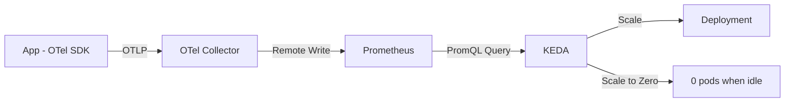

# How to Configure KEDA Auto-Scaling Based on OpenTelemetry Custom Metrics

Author: [nawazdhandala](https://www.github.com/nawazdhandala)

Tags: OpenTelemetry, KEDA, Autoscaling, Kubernetes, Custom Metrics

Description: Configure KEDA to auto-scale Kubernetes workloads based on OpenTelemetry custom metrics using the Prometheus scaler.

KEDA (Kubernetes Event-Driven Autoscaling) extends the Kubernetes HPA with event-driven scaling capabilities. Where the standard HPA polls metrics on a fixed interval, KEDA can scale based on external event sources - message queues, databases, cron schedules, and crucially, any metric available in Prometheus. Since OpenTelemetry metrics flow naturally into Prometheus, KEDA becomes a powerful way to auto-scale based on your custom application metrics.

This post walks through installing KEDA, connecting it to OpenTelemetry metrics stored in Prometheus, and configuring ScaledObjects for common scaling scenarios.

## Why KEDA Over Standard HPA

Standard HPA has limitations that KEDA solves:

- HPA cannot scale to zero. KEDA can, which is valuable for batch workloads and development environments.
- HPA requires the Prometheus Adapter to use custom metrics. KEDA talks to Prometheus directly.
- HPA scaling logic is limited to target averages. KEDA supports arbitrary Prometheus queries as scaling triggers.



## Installing KEDA

Deploy KEDA into your cluster using Helm.

```bash
# Add the KEDA Helm repo
helm repo add kedacore https://kedacore.github.io/charts
helm repo update

# Install KEDA into its own namespace
helm install keda kedacore/keda \
  --namespace keda \
  --create-namespace \
  --set prometheus.metricServer.enabled=true
```

## Setting Up OpenTelemetry Metrics for KEDA

First, instrument your application with the metrics KEDA will use for scaling decisions. The metrics should reflect actual workload demand.

```python
# scaling_metrics.py - Metrics that drive KEDA scaling
from opentelemetry import metrics

meter = metrics.get_meter("scaling.signals")

# Queue-based scaling: pending work items
pending_jobs = meter.create_up_down_counter(
    name="jobs.pending",
    description="Number of jobs waiting to be processed",
    unit="{job}",
)

# Rate-based scaling: requests per second
request_counter = meter.create_counter(
    name="http.requests.total",
    description="Total HTTP requests received",
    unit="{request}",
)

# Latency-based scaling: scale up when latency degrades
request_latency = meter.create_histogram(
    name="http.request.duration",
    description="HTTP request processing duration",
    unit="s",
)

# Connection-based scaling: active WebSocket connections
active_connections = meter.create_up_down_counter(
    name="ws.connections.active",
    description="Number of active WebSocket connections",
    unit="{connection}",
)

def enqueue_job(job):
    pending_jobs.add(1, {"queue": job.queue_name, "priority": job.priority})

def complete_job(job):
    pending_jobs.add(-1, {"queue": job.queue_name, "priority": job.priority})
```

Route these metrics through the OTel Collector to Prometheus.

```yaml
# otel-collector-keda.yaml
receivers:
  otlp:
    protocols:
      grpc:
        endpoint: 0.0.0.0:4317

processors:
  batch:
    timeout: 10s

  k8sattributes:
    extract:
      metadata:
        - k8s.namespace.name
        - k8s.deployment.name
        - k8s.pod.name

exporters:
  prometheusremotewrite:
    endpoint: http://prometheus:9090/api/v1/write
    resource_to_telemetry_conversion:
      enabled: true

service:
  pipelines:
    metrics:
      receivers: [otlp]
      processors: [k8sattributes, batch]
      exporters: [prometheusremotewrite]
```

## KEDA TriggerAuthentication for Prometheus

Before creating ScaledObjects, set up a TriggerAuthentication resource that tells KEDA how to connect to Prometheus. If Prometheus requires authentication, include the credentials here.

```yaml
# keda-prometheus-auth.yaml
apiVersion: keda.sh/v1alpha1
kind: TriggerAuthentication
metadata:
  name: prometheus-auth
  namespace: default
spec:
  secretTargetRef: []
  # For unauthenticated Prometheus, leave secretTargetRef empty
  # For authenticated setups, add:
  # secretTargetRef:
  #   - parameter: bearerToken
  #     name: prometheus-token
  #     key: token
```

## Scenario 1: Scale on Pending Jobs

Scale a worker deployment based on the number of pending jobs in a queue. This is the classic event-driven pattern.

```yaml
# keda-scaled-object-jobs.yaml
apiVersion: keda.sh/v1alpha1
kind: ScaledObject
metadata:
  name: job-worker-scaler
  namespace: default
spec:
  scaleTargetRef:
    name: job-worker  # Name of the Deployment to scale
  # Scale to zero when there are no pending jobs
  minReplicaCount: 0
  maxReplicaCount: 30
  # Wait 5 minutes before scaling down to avoid thrashing
  cooldownPeriod: 300
  # Check every 15 seconds
  pollingInterval: 15

  triggers:
    - type: prometheus
      metadata:
        # Prometheus server address
        serverAddress: http://prometheus.monitoring.svc:9090
        # PromQL query that returns the scaling signal
        query: |
          sum(jobs_pending{queue="processing"})
        # Scale up when there are more than 10 pending jobs per pod
        threshold: "10"
        # Enable scale-to-zero
        activationThreshold: "1"
      authenticationRef:
        name: prometheus-auth
```

When the `jobs_pending` metric is 0, KEDA scales the deployment to zero pods. When the first job appears (exceeding the `activationThreshold` of 1), KEDA spins up a pod. As the queue grows, KEDA adds more pods so each pod handles roughly 10 pending jobs.

## Scenario 2: Scale on Request Rate

Scale a web service based on requests per second. This works well for APIs that need to handle variable traffic.

```yaml
# keda-scaled-object-rps.yaml
apiVersion: keda.sh/v1alpha1
kind: ScaledObject
metadata:
  name: api-service-scaler
  namespace: default
spec:
  scaleTargetRef:
    name: api-service
  minReplicaCount: 2  # Always keep at least 2 pods for availability
  maxReplicaCount: 50
  cooldownPeriod: 120
  pollingInterval: 15

  triggers:
    - type: prometheus
      metadata:
        serverAddress: http://prometheus.monitoring.svc:9090
        # Requests per second averaged over 2 minutes
        query: |
          sum(rate(http_requests_total{service_name="api-service"}[2m]))
        # Target 200 RPS per pod
        threshold: "200"
```

## Scenario 3: Scale on Latency Degradation

Scale up when p99 latency exceeds an acceptable threshold. This catches situations where the service is overloaded but RPS has not increased - for example, when downstream dependencies slow down.

```yaml
# keda-scaled-object-latency.yaml
apiVersion: keda.sh/v1alpha1
kind: ScaledObject
metadata:
  name: api-latency-scaler
  namespace: default
spec:
  scaleTargetRef:
    name: api-service
  minReplicaCount: 2
  maxReplicaCount: 50
  cooldownPeriod: 180
  pollingInterval: 30

  triggers:
    - type: prometheus
      metadata:
        serverAddress: http://prometheus.monitoring.svc:9090
        # p99 latency in seconds
        query: |
          histogram_quantile(0.99,
            sum(rate(http_request_duration_bucket{service_name="api-service"}[5m])) by (le)
          )
        # Scale up when p99 exceeds 500ms
        threshold: "0.5"
        # Only activate scaling when latency exceeds 200ms
        activationThreshold: "0.2"
```

## Combining Multiple Triggers

KEDA supports multiple triggers on a single ScaledObject. When multiple triggers are defined, KEDA uses the one that requests the highest replica count. This lets you cover multiple scaling scenarios simultaneously.

```yaml
# keda-scaled-object-combined.yaml
apiVersion: keda.sh/v1alpha1
kind: ScaledObject
metadata:
  name: api-combined-scaler
  namespace: default
spec:
  scaleTargetRef:
    name: api-service
  minReplicaCount: 2
  maxReplicaCount: 50
  cooldownPeriod: 120

  triggers:
    # Scale on request rate
    - type: prometheus
      metadata:
        serverAddress: http://prometheus.monitoring.svc:9090
        query: sum(rate(http_requests_total{service_name="api-service"}[2m]))
        threshold: "200"

    # Also scale on latency
    - type: prometheus
      metadata:
        serverAddress: http://prometheus.monitoring.svc:9090
        query: |
          histogram_quantile(0.99,
            sum(rate(http_request_duration_bucket{service_name="api-service"}[5m])) by (le)
          )
        threshold: "0.5"

    # Also scale on active connections
    - type: prometheus
      metadata:
        serverAddress: http://prometheus.monitoring.svc:9090
        query: sum(ws_connections_active{service_name="api-service"})
        threshold: "100"
```

## Monitoring KEDA Scaling Decisions

KEDA exposes its own metrics that you should monitor to understand scaling behavior. Scrape them with the OTel Collector.

```yaml
# Scrape KEDA metrics
receivers:
  prometheus:
    config:
      scrape_configs:
        - job_name: keda-operator
          static_configs:
            - targets: ['keda-operator.keda.svc:8080']
```

Key KEDA metrics to track:

- `keda_scaler_metrics_value` - the current value of each scaling trigger
- `keda_scaler_errors_total` - errors querying the scaler (like Prometheus being unreachable)
- `keda_scaled_object_errors_total` - errors applying scaling decisions

Build a dashboard panel that overlays the scaler metric value against the actual replica count. This shows you exactly how KEDA is responding to your OpenTelemetry metrics and helps you tune the thresholds and cooldown periods for your workload.
