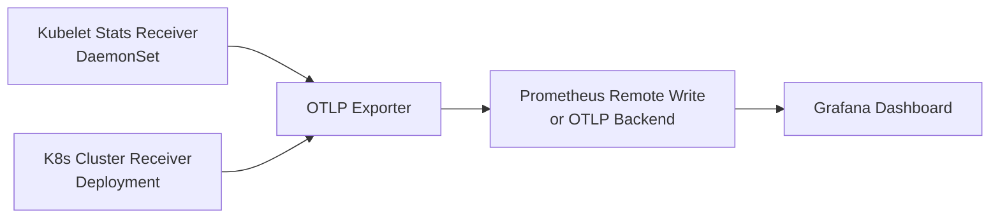

# How to Build a Kubernetes Cluster Overview Dashboard from OpenTelemetry Collector Metrics

Author: [nawazdhandala](https://www.github.com/nawazdhandala)

Tags: OpenTelemetry, Kubernetes, Grafana, Monitoring

Description: Build a Kubernetes cluster overview dashboard using OpenTelemetry Collector metrics covering nodes, pods, and resource usage.

Kubernetes clusters generate a massive amount of operational data. Nodes cycle through states, pods get scheduled and evicted, and resource consumption fluctuates constantly. The OpenTelemetry Collector, paired with the Kubernetes Cluster Receiver and Kubelet Stats Receiver, can pull all of this into a single telemetry pipeline - giving you the raw material for a comprehensive cluster overview dashboard.

This post walks through configuring the collectors, selecting the right metrics, and building panels that give you real visibility into cluster health.

## Architecture Overview

The setup uses two collector deployment patterns: a DaemonSet for node-level metrics (via the Kubelet Stats Receiver) and a single-replica Deployment for cluster-level metrics (via the K8s Cluster Receiver).



## Configuring the K8s Cluster Receiver

The K8s Cluster Receiver watches the Kubernetes API server for changes to nodes, pods, deployments, and other resources. It emits metrics like `k8s.node.condition_ready`, `k8s.deployment.available`, and `k8s.pod.phase`.

Here is the collector config for the cluster-level deployment:

```yaml
# otel-collector-cluster.yaml
# Deploy this as a single-replica Deployment (not a DaemonSet)
receivers:
  k8scluster:
    # How often to poll the API server
    collection_interval: 30s
    # Which resource types to watch
    node_conditions_to_report:
      - Ready
      - MemoryPressure
      - DiskPressure
    allocatable_types_to_report:
      - cpu
      - memory

exporters:
  prometheusremotewrite:
    endpoint: "http://prometheus:9090/api/v1/write"

service:
  pipelines:
    metrics:
      receivers: [k8scluster]
      exporters: [prometheusremotewrite]
```

## Configuring the Kubelet Stats Receiver

The Kubelet Stats Receiver runs on each node as a DaemonSet. It connects to the local kubelet's stats endpoint and emits per-pod and per-container resource metrics - CPU usage, memory working set, filesystem capacity, and network I/O.

```yaml
# otel-collector-daemonset.yaml
# Deploy this as a DaemonSet so each node gets one instance
receivers:
  kubeletstats:
    # Use the node's service account to authenticate
    auth_type: serviceAccount
    collection_interval: 20s
    # Pull container, pod, and node level stats
    metric_groups:
      - node
      - pod
      - container

processors:
  # Add k8s metadata so metrics are labeled with namespace, pod name, etc.
  k8sattributes:
    passthrough: false
    extract:
      metadata:
        - k8s.namespace.name
        - k8s.pod.name
        - k8s.node.name

exporters:
  prometheusremotewrite:
    endpoint: "http://prometheus:9090/api/v1/write"

service:
  pipelines:
    metrics:
      receivers: [kubeletstats]
      processors: [k8sattributes]
      exporters: [prometheusremotewrite]
```

## RBAC Requirements

Both receivers need specific Kubernetes RBAC permissions. The cluster receiver needs read access to the API server, and the kubelet stats receiver needs access to the node's kubelet endpoint.

```yaml
# rbac.yaml
# ClusterRole for the K8s Cluster Receiver
apiVersion: rbac.authorization.k8s.io/v1
kind: ClusterRole
metadata:
  name: otel-collector-cluster
rules:
  - apiGroups: [""]
    resources: ["nodes", "pods", "namespaces", "replicationcontrollers"]
    verbs: ["get", "list", "watch"]
  - apiGroups: ["apps"]
    resources: ["deployments", "replicasets", "daemonsets", "statefulsets"]
    verbs: ["get", "list", "watch"]
---
# ClusterRole for the Kubelet Stats Receiver
apiVersion: rbac.authorization.k8s.io/v1
kind: ClusterRole
metadata:
  name: otel-collector-kubelet
rules:
  - apiGroups: [""]
    resources: ["nodes/stats", "nodes/proxy"]
    verbs: ["get"]
```

## Building the Dashboard Panels

With metrics flowing, you can build out the Grafana dashboard. Here are the key PromQL queries for each panel.

**Node Readiness** - shows how many nodes are in Ready state vs total:

```promql
# Count of nodes reporting Ready = true
sum(k8s_node_condition_ready == 1)
```

**Pod Phase Distribution** - a pie chart showing running, pending, succeeded, and failed pods:

```promql
# Count pods grouped by their phase
count by (phase) (k8s_pod_phase)
```

**CPU Usage vs Allocatable** - a gauge showing cluster-wide CPU saturation:

```promql
# Total CPU used across all nodes divided by total allocatable CPU
sum(k8s_node_cpu_utilization) / sum(k8s_node_allocatable_cpu) * 100
```

**Memory Working Set per Namespace** - a stacked time series:

```promql
# Memory working set bytes grouped by namespace
sum by (k8s_namespace_name) (k8s_pod_memory_working_set)
```

**Top 10 Pods by CPU** - a bar gauge for quick identification of resource-heavy pods:

```promql
# Top 10 pods consuming the most CPU
topk(10, sum by (k8s_pod_name) (k8s_container_cpu_utilization))
```

## Dashboard Layout

Organize the panels into rows for quick scanning:

1. **Cluster Summary Row** - Node count, pod count, overall CPU/memory gauges
2. **Node Health Row** - Node conditions, per-node CPU and memory over time
3. **Workload Row** - Deployment availability, replica counts, restart counts
4. **Resource Detail Row** - Top pods by CPU, top pods by memory, namespace breakdowns

## Tips for Production Use

A few things to keep in mind when running this in production. Set the collection interval based on your needs - 30 seconds works for most dashboards, but you might want 10 seconds for alerting. Use the `filter` processor to drop metrics from system namespaces like `kube-system` if they add noise. And always set resource limits on the collector pods themselves so a metrics spike does not destabilize the cluster.

The combination of the K8s Cluster Receiver and Kubelet Stats Receiver covers the full picture - from high-level cluster state down to per-container resource consumption. Once you have this foundation in place, extending it with application-level OpenTelemetry metrics becomes straightforward.
