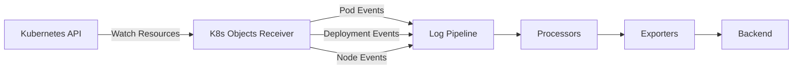

# How to Configure the Kubernetes Objects Receiver in the OpenTelemetry Collector

Author: [nawazdhandala](https://www.github.com/nawazdhandala)

Tags: OpenTelemetry, Collector, Kubernetes, Objects, Events, Logs

Description: Learn how to configure the Kubernetes Objects Receiver in the OpenTelemetry Collector to collect Kubernetes events and object state changes.

---

The Kubernetes Objects Receiver collects data about Kubernetes resources by watching the Kubernetes API server. It captures events like pod creations, deletions, failures, and state changes, converting them into OpenTelemetry logs for centralized monitoring and analysis.

For more on Kubernetes observability, see our guide on [monitoring Kubernetes with OpenTelemetry](https://oneuptime.com/blog/post/kubernetes-monitoring-opentelemetry/view).

## What is the Kubernetes Objects Receiver?

The Kubernetes Objects Receiver watches Kubernetes API resources and converts resource events into OpenTelemetry log records. It provides visibility into cluster state changes, helping you track pod lifecycle events, deployment updates, service modifications, and other Kubernetes operations.



Use cases:
- Track pod creation, deletion, and failures
- Monitor deployment rollouts and rollbacks
- Capture node events and conditions
- Audit configuration changes
- Debug scheduling issues

## Basic Configuration

Start with a simple configuration to watch pod events.

```yaml
receivers:
  k8sobjects:
    # Authentication method
    auth_type: serviceAccount

    # Watch for pod events
    objects:
      - name: pods
        mode: watch

exporters:
  debug:
    verbosity: detailed

service:
  pipelines:
    logs:
      receivers: [k8sobjects]
      exporters: [debug]
```

## Authentication

Configure how the receiver authenticates with the Kubernetes API.

### Service Account (Recommended for In-Cluster)

When running inside Kubernetes, use service account authentication.

```yaml
receivers:
  k8sobjects:
    # Use service account token
    auth_type: serviceAccount

    objects:
      - name: pods
        mode: watch
```

Create RBAC permissions:

```yaml
apiVersion: v1
kind: ServiceAccount
metadata:
  name: otel-collector
  namespace: observability
---
apiVersion: rbac.authorization.k8s.io/v1
kind: ClusterRole
metadata:
  name: otel-collector
rules:
  # Watch pods
  - apiGroups: [""]
    resources: ["pods"]
    verbs: ["get", "list", "watch"]

  # Watch events
  - apiGroups: [""]
    resources: ["events"]
    verbs: ["get", "list", "watch"]

  # Watch deployments
  - apiGroups: ["apps"]
    resources: ["deployments", "replicasets", "daemonsets", "statefulsets"]
    verbs: ["get", "list", "watch"]

  # Watch nodes
  - apiGroups: [""]
    resources: ["nodes"]
    verbs: ["get", "list", "watch"]
---
apiVersion: rbac.authorization.k8s.io/v1
kind: ClusterRoleBinding
metadata:
  name: otel-collector
roleRef:
  apiGroup: rbac.authorization.k8s.io
  kind: ClusterRole
  name: otel-collector
subjects:
  - kind: ServiceAccount
    name: otel-collector
    namespace: observability
```

### Kubeconfig (For External Access)

When running outside Kubernetes, use kubeconfig authentication.

```yaml
receivers:
  k8sobjects:
    # Use kubeconfig file
    auth_type: kubeConfig

    # Path to kubeconfig
    kubeconfig_path: ${env:HOME}/.kube/config

    # Context to use (optional)
    context: production-cluster

    objects:
      - name: pods
        mode: watch
```

## Object Configuration

Configure which Kubernetes resources to watch.

### Watch Pods

```yaml
receivers:
  k8sobjects:
    auth_type: serviceAccount

    objects:
      # Watch pods
      - name: pods
        mode: watch

        # Watch specific namespaces (optional)
        namespaces: [default, production, staging]

        # Label selector (optional)
        label_selector: app=myapp

        # Field selector (optional)
        field_selector: status.phase=Running
```

### Watch Events

Kubernetes events provide information about cluster activity.

```yaml
receivers:
  k8sobjects:
    auth_type: serviceAccount

    objects:
      # Watch Kubernetes events
      - name: events
        mode: watch

        # Watch all namespaces
        namespaces: []

        # Capture event types
        # Events include: Normal, Warning
```

### Watch Multiple Resource Types

```yaml
receivers:
  k8sobjects:
    auth_type: serviceAccount

    objects:
      # Watch pods
      - name: pods
        mode: watch
        namespaces: [production]

      # Watch deployments
      - name: deployments
        mode: watch
        group: apps
        namespaces: [production]

      # Watch services
      - name: services
        mode: watch
        namespaces: [production]

      # Watch nodes
      - name: nodes
        mode: watch

      # Watch events
      - name: events
        mode: watch
```

## Watch Modes

Configure how the receiver collects resource data.

### Watch Mode

Watch mode streams real-time events as resources change.

```yaml
receivers:
  k8sobjects:
    auth_type: serviceAccount

    objects:
      - name: pods
        # Watch for real-time changes
        mode: watch

        # Interval for resync (re-list all resources)
        interval: 5m
```

### Pull Mode

Pull mode periodically fetches the current state of resources.

```yaml
receivers:
  k8sobjects:
    auth_type: serviceAccount

    objects:
      - name: pods
        # Periodically fetch pod list
        mode: pull

        # Pull interval
        interval: 1m
```

Use pull mode for resources that change infrequently or when you need periodic snapshots.

## Namespace Filtering

Control which namespaces to watch.

### Specific Namespaces

```yaml
receivers:
  k8sobjects:
    auth_type: serviceAccount

    objects:
      - name: pods
        mode: watch

        # Only watch these namespaces
        namespaces:
          - production
          - staging
          - default
```

### All Namespaces

```yaml
receivers:
  k8sobjects:
    auth_type: serviceAccount

    objects:
      - name: pods
        mode: watch

        # Watch all namespaces (empty list)
        namespaces: []
```

### Exclude Namespaces

Use processors to exclude specific namespaces.

```yaml
receivers:
  k8sobjects:
    auth_type: serviceAccount

    objects:
      - name: pods
        mode: watch
        namespaces: []

processors:
  # Exclude system namespaces
  filter/namespaces:
    logs:
      log_record:
        - attributes["k8s.namespace.name"] != "kube-system"
        - attributes["k8s.namespace.name"] != "kube-public"
        - attributes["k8s.namespace.name"] != "kube-node-lease"

service:
  pipelines:
    logs:
      receivers: [k8sobjects]
      processors: [filter/namespaces]
      exporters: [otlp]
```

## Label and Field Selectors

Filter resources using Kubernetes selectors.

### Label Selector

```yaml
receivers:
  k8sobjects:
    auth_type: serviceAccount

    objects:
      # Only watch pods with specific labels
      - name: pods
        mode: watch
        label_selector: app=api,environment=production

      # Watch deployments with any of these labels
      - name: deployments
        mode: watch
        group: apps
        label_selector: tier in (frontend,backend)
```

### Field Selector

```yaml
receivers:
  k8sobjects:
    auth_type: serviceAccount

    objects:
      # Only watch running pods
      - name: pods
        mode: watch
        field_selector: status.phase=Running

      # Only watch pods on specific node
      - name: pods
        mode: watch
        field_selector: spec.nodeName=node-1
```

## Event Processing

Process Kubernetes object events to extract meaningful data.

### Extract Pod Events

```yaml
receivers:
  k8sobjects:
    auth_type: serviceAccount

    objects:
      - name: events
        mode: watch

processors:
  # Extract pod event details
  transform/pod_events:
    log_statements:
      - context: log
        statements:
          # Extract event details
          - set(attributes["event.type"], body["type"]) where body["type"] != nil
          - set(attributes["event.reason"], body["reason"]) where body["reason"] != nil
          - set(attributes["event.message"], body["message"]) where body["message"] != nil

          # Extract involved object
          - set(attributes["k8s.object.kind"], body["involvedObject"]["kind"]) where body["involvedObject"]["kind"] != nil
          - set(attributes["k8s.object.name"], body["involvedObject"]["name"]) where body["involvedObject"]["name"] != nil
          - set(attributes["k8s.namespace.name"], body["involvedObject"]["namespace"]) where body["involvedObject"]["namespace"] != nil

          # Set severity based on event type
          - set(severity_text, "WARN") where attributes["event.type"] == "Warning"
          - set(severity_text, "INFO") where attributes["event.type"] == "Normal"

          # Flag critical events
          - set(attributes["event.critical"], true) where attributes["event.reason"] == "Failed" or attributes["event.reason"] == "BackOff" or attributes["event.reason"] == "FailedScheduling"

exporters:
  otlp:
    endpoint: ${env:OTEL_EXPORTER_OTLP_ENDPOINT}

service:
  pipelines:
    logs:
      receivers: [k8sobjects]
      processors: [transform/pod_events]
      exporters: [otlp]
```

### Extract Deployment Changes

```yaml
receivers:
  k8sobjects:
    auth_type: serviceAccount

    objects:
      - name: deployments
        mode: watch
        group: apps

processors:
  transform/deployments:
    log_statements:
      - context: log
        statements:
          # Extract deployment info
          - set(attributes["k8s.deployment.name"], body["metadata"]["name"]) where body["metadata"]["name"] != nil
          - set(attributes["k8s.namespace.name"], body["metadata"]["namespace"]) where body["metadata"]["namespace"] != nil

          # Extract deployment spec
          - set(attributes["k8s.deployment.replicas"], body["spec"]["replicas"]) where body["spec"]["replicas"] != nil
          - set(attributes["k8s.deployment.strategy"], body["spec"]["strategy"]["type"]) where body["spec"]["strategy"]["type"] != nil

          # Extract deployment status
          - set(attributes["k8s.deployment.available_replicas"], body["status"]["availableReplicas"]) where body["status"]["availableReplicas"] != nil
          - set(attributes["k8s.deployment.ready_replicas"], body["status"]["readyReplicas"]) where body["status"]["readyReplicas"] != nil
          - set(attributes["k8s.deployment.updated_replicas"], body["status"]["updatedReplicas"]) where body["status"]["updatedReplicas"] != nil

          # Detect rollout status
          - set(attributes["deployment.rollout_complete"], true) where attributes["k8s.deployment.replicas"] == attributes["k8s.deployment.available_replicas"]
          - set(attributes["deployment.rollout_complete"], false) where attributes["k8s.deployment.replicas"] != attributes["k8s.deployment.available_replicas"]

exporters:
  otlp:
    endpoint: ${env:OTEL_EXPORTER_OTLP_ENDPOINT}

service:
  pipelines:
    logs:
      receivers: [k8sobjects]
      processors: [transform/deployments]
      exporters: [otlp]
```

### Extract Node Conditions

```yaml
receivers:
  k8sobjects:
    auth_type: serviceAccount

    objects:
      - name: nodes
        mode: watch

processors:
  transform/nodes:
    log_statements:
      - context: log
        statements:
          # Extract node info
          - set(attributes["k8s.node.name"], body["metadata"]["name"]) where body["metadata"]["name"] != nil

          # Extract node conditions
          - set(attributes["node.ready"], true) where body["status"]["conditions"] != nil
          - set(attributes["node.memory_pressure"], false) where body["status"]["conditions"] != nil
          - set(attributes["node.disk_pressure"], false) where body["status"]["conditions"] != nil

          # Extract capacity
          - set(attributes["node.capacity.cpu"], body["status"]["capacity"]["cpu"]) where body["status"]["capacity"]["cpu"] != nil
          - set(attributes["node.capacity.memory"], body["status"]["capacity"]["memory"]) where body["status"]["capacity"]["memory"] != nil
          - set(attributes["node.capacity.pods"], body["status"]["capacity"]["pods"]) where body["status"]["capacity"]["pods"] != nil

exporters:
  otlp:
    endpoint: ${env:OTEL_EXPORTER_OTLP_ENDPOINT}

service:
  pipelines:
    logs:
      receivers: [k8sobjects]
      processors: [transform/nodes]
      exporters: [otlp]
```

## Monitoring Scenarios

### Track Pod Failures

```yaml
receivers:
  k8sobjects:
    auth_type: serviceAccount

    objects:
      # Watch pod events
      - name: events
        mode: watch

processors:
  # Filter to pod failures
  filter/pod_failures:
    logs:
      log_record:
        # Only failed, crash loop, or image pull failures
        - attributes["event.reason"] == "Failed" or attributes["event.reason"] == "BackOff" or attributes["event.reason"] == "ErrImagePull" or attributes["event.reason"] == "ImagePullBackOff"

  transform/pod_failures:
    log_statements:
      - context: log
        statements:
          - set(attributes["alert.type"], "pod_failure")
          - set(severity_text, "ERROR")

exporters:
  otlp:
    endpoint: ${env:OTEL_EXPORTER_OTLP_ENDPOINT}

service:
  pipelines:
    logs:
      receivers: [k8sobjects]
      processors: [filter/pod_failures, transform/pod_failures]
      exporters: [otlp]
```

### Monitor Deployment Rollouts

```yaml
receivers:
  k8sobjects:
    auth_type: serviceAccount

    objects:
      - name: deployments
        mode: watch
        group: apps
        namespaces: [production]

processors:
  transform/rollouts:
    log_statements:
      - context: log
        statements:
          # Calculate rollout progress
          - set(attributes["rollout.progress"], attributes["k8s.deployment.updated_replicas"] / attributes["k8s.deployment.replicas"]) where attributes["k8s.deployment.replicas"] != nil and attributes["k8s.deployment.replicas"] > 0

          # Flag stuck rollouts
          - set(attributes["rollout.stuck"], true) where attributes["k8s.deployment.updated_replicas"] != attributes["k8s.deployment.replicas"]

          # Set severity for issues
          - set(severity_text, "WARN") where attributes["rollout.stuck"] == true
          - set(severity_text, "INFO") where attributes["rollout.stuck"] != true

exporters:
  otlp:
    endpoint: ${env:OTEL_EXPORTER_OTLP_ENDPOINT}

service:
  pipelines:
    logs:
      receivers: [k8sobjects]
      processors: [transform/rollouts]
      exporters: [otlp]
```

### Track Resource Scheduling Issues

```yaml
receivers:
  k8sobjects:
    auth_type: serviceAccount

    objects:
      - name: events
        mode: watch

processors:
  filter/scheduling:
    logs:
      log_record:
        # Scheduling failures
        - attributes["event.reason"] == "FailedScheduling" or attributes["event.reason"] == "FailedMount" or attributes["event.reason"] == "FailedAttachVolume"

  transform/scheduling:
    log_statements:
      - context: log
        statements:
          - set(attributes["alert.type"], "scheduling_failure")
          - set(severity_text, "ERROR")

          # Extract reason details
          - set(attributes["failure.reason"], attributes["event.reason"])
          - set(attributes["failure.message"], attributes["event.message"])

exporters:
  otlp:
    endpoint: ${env:OTEL_EXPORTER_OTLP_ENDPOINT}

service:
  pipelines:
    logs:
      receivers: [k8sobjects]
      processors: [filter/scheduling, transform/scheduling]
      exporters: [otlp]
```

## Resource Attributes

Add contextual information to collected logs.

```yaml
receivers:
  k8sobjects:
    auth_type: serviceAccount

    objects:
      - name: pods
        mode: watch

processors:
  # Add resource attributes
  resource/k8s:
    attributes:
      - key: k8s.cluster.name
        value: ${env:CLUSTER_NAME}
        action: upsert
      - key: deployment.environment
        value: ${env:ENVIRONMENT}
        action: upsert
      - key: collector.name
        value: ${env:HOSTNAME}
        action: upsert

  # Detect additional k8s attributes
  k8sattributes:
    auth_type: serviceAccount
    passthrough: false
    extract:
      metadata:
        - k8s.namespace.name
        - k8s.deployment.name
        - k8s.pod.name
        - k8s.pod.uid
        - k8s.node.name
      labels:
        - tag_name: app
          key: app
          from: pod
        - tag_name: version
          key: version
          from: pod

exporters:
  otlp:
    endpoint: ${env:OTEL_EXPORTER_OTLP_ENDPOINT}

service:
  pipelines:
    logs:
      receivers: [k8sobjects]
      processors: [resource/k8s, k8sattributes]
      exporters: [otlp]
```

## Complete Production Example

Full configuration for comprehensive Kubernetes monitoring.

```yaml
receivers:
  k8sobjects:
    auth_type: serviceAccount

    objects:
      # Watch pods
      - name: pods
        mode: watch
        namespaces: [production, staging]
        interval: 5m

      # Watch deployments
      - name: deployments
        mode: watch
        group: apps
        namespaces: [production, staging]
        interval: 5m

      # Watch events
      - name: events
        mode: watch
        namespaces: [production, staging]

      # Watch nodes
      - name: nodes
        mode: watch
        interval: 5m

processors:
  # Process pod events
  transform/pods:
    log_statements:
      - context: log
        statements:
          - set(attributes["k8s.object.type"], "pod") where body["kind"] == "Pod"
          - set(attributes["k8s.pod.name"], body["metadata"]["name"]) where body["kind"] == "Pod" and body["metadata"]["name"] != nil
          - set(attributes["k8s.namespace.name"], body["metadata"]["namespace"]) where body["kind"] == "Pod" and body["metadata"]["namespace"] != nil
          - set(attributes["k8s.pod.phase"], body["status"]["phase"]) where body["kind"] == "Pod" and body["status"]["phase"] != nil

  # Process deployment events
  transform/deployments:
    log_statements:
      - context: log
        statements:
          - set(attributes["k8s.object.type"], "deployment") where body["kind"] == "Deployment"
          - set(attributes["k8s.deployment.name"], body["metadata"]["name"]) where body["kind"] == "Deployment" and body["metadata"]["name"] != nil
          - set(attributes["k8s.deployment.replicas"], body["spec"]["replicas"]) where body["kind"] == "Deployment" and body["spec"]["replicas"] != nil

  # Process Kubernetes events
  transform/events:
    log_statements:
      - context: log
        statements:
          - set(attributes["k8s.object.type"], "event") where body["kind"] == "Event"
          - set(attributes["event.type"], body["type"]) where body["kind"] == "Event" and body["type"] != nil
          - set(attributes["event.reason"], body["reason"]) where body["kind"] == "Event" and body["reason"] != nil
          - set(attributes["event.message"], body["message"]) where body["kind"] == "Event" and body["message"] != nil

          # Set severity
          - set(severity_text, "WARN") where attributes["event.type"] == "Warning"
          - set(severity_text, "ERROR") where attributes["event.reason"] == "Failed"
          - set(severity_text, "INFO") where severity_text == nil

  # Filter out noisy events
  filter/events:
    logs:
      log_record:
        # Exclude informational events
        - attributes["event.reason"] != "Pulling" and attributes["event.reason"] != "Pulled" and attributes["event.reason"] != "Created" and attributes["event.reason"] != "Started"

  # Add resource attributes
  resource/k8s:
    attributes:
      - key: k8s.cluster.name
        value: ${env:CLUSTER_NAME}
        action: upsert
      - key: deployment.environment
        value: ${env:ENVIRONMENT}
        action: upsert
      - key: collector.name
        value: ${env:HOSTNAME}
        action: upsert

  # Enrich with k8s metadata
  k8sattributes:
    auth_type: serviceAccount
    passthrough: false
    extract:
      metadata:
        - k8s.namespace.name
        - k8s.deployment.name
        - k8s.pod.name
        - k8s.node.name
      labels:
        - tag_name: app
          key: app
          from: pod
        - tag_name: environment
          key: environment
          from: namespace

  # Batch processing
  batch:
    timeout: 10s
    send_batch_size: 1000

exporters:
  # Send to OTLP backend
  otlp:
    endpoint: ${env:OTEL_EXPORTER_OTLP_ENDPOINT}
    headers:
      authorization: Bearer ${env:OTEL_AUTH_TOKEN}
    compression: gzip

extensions:
  health_check:
    endpoint: 0.0.0.0:13133

service:
  extensions: [health_check]

  pipelines:
    logs:
      receivers: [k8sobjects]
      processors:
        - transform/pods
        - transform/deployments
        - transform/events
        - filter/events
        - resource/k8s
        - k8sattributes
        - batch
      exporters: [otlp]

  telemetry:
    logs:
      level: info
      encoding: json
    metrics:
      address: 0.0.0.0:8888
```

## Summary

| Feature | Configuration |
|---------|--------------|
| **Authentication** | Service account or kubeconfig |
| **Objects** | Pods, deployments, services, nodes, events |
| **Watch Modes** | Watch (real-time) or pull (periodic) |
| **Filtering** | Namespaces, labels, field selectors |
| **Processing** | Extract metadata, set severity, enrich |
| **Use Cases** | Pod failures, deployment rollouts, scheduling issues |

The Kubernetes Objects Receiver provides visibility into Kubernetes cluster operations by watching API resources and events. By collecting pod lifecycle events, deployment changes, and node conditions, you can monitor cluster health, track deployments, debug scheduling issues, and maintain audit trails. Combined with transform processors, you can extract structured data and create actionable alerts for your Kubernetes infrastructure.

For more on Kubernetes monitoring, see our guides on [Kubernetes metrics](https://oneuptime.com/blog/post/kubernetes-metrics-opentelemetry/view) and [pod monitoring](https://oneuptime.com/blog/post/kubernetes-pod-monitoring/view).
