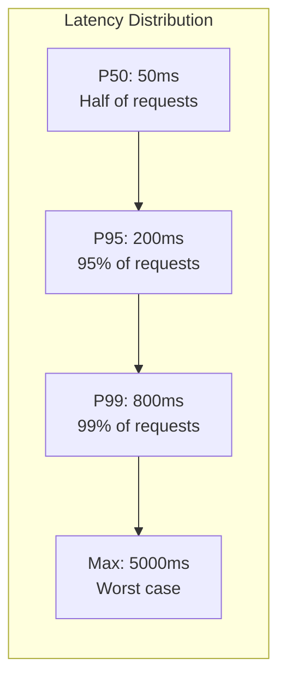

# How to Build Latency-Based Alerts Using OpenTelemetry Histogram Percentiles (P50, P95, P99)

Author: [nawazdhandala](https://www.github.com/nawazdhandala)

Tags: OpenTelemetry, Latency, Histograms, Percentiles, Prometheus

Description: Build percentile-based latency alerts using OpenTelemetry histogram metrics with P50, P95, and P99 thresholds.

Average latency is a misleading metric. A service can report an average latency of 100ms while 1% of users experience 5-second response times. Percentile-based alerting catches these tail latency problems that averages hide. OpenTelemetry histograms are designed for exactly this use case, recording the distribution of request durations so you can compute P50, P95, and P99 values.

This post walks through configuring OpenTelemetry histogram metrics and building percentile-based alert rules in Prometheus.

## Why Percentiles Matter

The P99 (99th percentile) represents the worst experience for 1 in 100 users. In a service handling 10,000 requests per minute, that is 100 users per minute hitting the slow path.



Alerting on P50 catches broad degradation. Alerting on P99 catches tail latency issues affecting a small but significant portion of traffic.

## Step 1: Configure Histogram Buckets in Your SDK

The accuracy of percentile calculations depends on your bucket boundaries. Buckets that are too coarse produce inaccurate estimates; buckets that are too fine increase cardinality.

This configuration sets up explicit histogram buckets tuned for a typical web service:

```python
# Python OpenTelemetry SDK - configure histogram buckets
from opentelemetry import metrics
from opentelemetry.sdk.metrics import MeterProvider
from opentelemetry.sdk.metrics.export import PeriodicExportingMetricReader
from opentelemetry.sdk.metrics.view import View, ExplicitBucketHistogramAggregation
from opentelemetry.exporter.otlp.proto.grpc.metric_exporter import OTLPMetricExporter

# Define bucket boundaries in seconds
# Dense around typical web response times (10ms-1s)
# Sparse at the tails for outlier capture
latency_buckets = [
    0.005, 0.01, 0.025, 0.05, 0.075,
    0.1, 0.15, 0.2, 0.25, 0.3, 0.4, 0.5,
    0.75, 1.0, 1.5, 2.0, 2.5, 5.0, 10.0,
]

# Create a view that applies custom buckets to the HTTP duration histogram
latency_view = View(
    instrument_name="http.server.request.duration",
    aggregation=ExplicitBucketHistogramAggregation(boundaries=latency_buckets),
)

exporter = OTLPMetricExporter(endpoint="otel-collector:4317")
reader = PeriodicExportingMetricReader(exporter, export_interval_millis=15000)
provider = MeterProvider(
    metric_readers=[reader],
    views=[latency_view],
)
metrics.set_meter_provider(provider)
```

For Go services, configure buckets in the OTel SDK:

```go
// Go OpenTelemetry SDK - custom histogram buckets
package main

import (
    "go.opentelemetry.io/otel/sdk/metric"
)

func newMeterProvider() *metric.MeterProvider {
    // Define custom bucket boundaries for HTTP latency
    buckets := []float64{
        0.005, 0.01, 0.025, 0.05, 0.075,
        0.1, 0.15, 0.2, 0.25, 0.3, 0.4, 0.5,
        0.75, 1.0, 1.5, 2.0, 2.5, 5.0, 10.0,
    }

    view := metric.NewView(
        metric.Instrument{Name: "http.server.request.duration"},
        metric.Stream{
            Aggregation: metric.AggregationExplicitBucketHistogram{
                Boundaries: buckets,
            },
        },
    )

    provider := metric.NewMeterProvider(metric.WithView(view))
    return provider
}
```

## Step 2: Configure the Collector to Preserve Histogram Buckets

The OpenTelemetry Collector must export histogram data in a format Prometheus can consume. Ensure the Prometheus exporter is configured to preserve bucket boundaries.

```yaml
# otel-collector-config.yaml
receivers:
  otlp:
    protocols:
      grpc:
        endpoint: "0.0.0.0:4317"

processors:
  batch:
    timeout: 10s

exporters:
  prometheus:
    endpoint: "0.0.0.0:8889"
    resource_to_telemetry_conversion:
      enabled: true
    # Metric names will follow the pattern:
    # otel_http_server_request_duration_seconds_bucket
    # otel_http_server_request_duration_seconds_count
    # otel_http_server_request_duration_seconds_sum

service:
  pipelines:
    metrics:
      receivers: [otlp]
      processors: [batch]
      exporters: [prometheus]
```

## Step 3: Write Recording Rules for Percentiles

Computing percentiles from raw histogram buckets at query time is expensive. Recording rules pre-compute percentiles at regular intervals, making alert evaluation fast and consistent.

These recording rules compute P50, P95, and P99 for each service:

```yaml
# prometheus-recording-rules.yaml
groups:
  - name: latency_percentiles
    interval: 30s
    rules:
      # P50 - median latency
      - record: service:http_latency_p50:5m
        expr: |
          histogram_quantile(0.50,
            sum by (service_name, le) (
              rate(otel_http_server_request_duration_seconds_bucket[5m])
            )
          )

      # P95 - 95th percentile
      - record: service:http_latency_p95:5m
        expr: |
          histogram_quantile(0.95,
            sum by (service_name, le) (
              rate(otel_http_server_request_duration_seconds_bucket[5m])
            )
          )

      # P99 - 99th percentile
      - record: service:http_latency_p99:5m
        expr: |
          histogram_quantile(0.99,
            sum by (service_name, le) (
              rate(otel_http_server_request_duration_seconds_bucket[5m])
            )
          )

      # P99.9 - for high-traffic services
      - record: service:http_latency_p999:5m
        expr: |
          histogram_quantile(0.999,
            sum by (service_name, le) (
              rate(otel_http_server_request_duration_seconds_bucket[5m])
            )
          )
```

## Step 4: Build Percentile-Based Alert Rules

Now create alert rules against the pre-computed percentiles. Different percentiles warrant different severity levels and thresholds.

```yaml
# prometheus-alert-rules.yaml
groups:
  - name: latency_alerts
    rules:
      # P99 critical - tail latency affecting 1% of users
      - alert: HighTailLatency_P99
        expr: service:http_latency_p99:5m > 1.0
        for: 3m
        labels:
          severity: critical
          percentile: "p99"
        annotations:
          summary: "P99 latency {{ $value | humanizeDuration }} on {{ $labels.service_name }}"
          description: "1% of requests are taking longer than 1 second"
          dashboard: "https://grafana.example.com/d/latency?var-service={{ $labels.service_name }}"

      # P95 warning - broader latency degradation
      - alert: HighLatency_P95
        expr: service:http_latency_p95:5m > 0.5
        for: 5m
        labels:
          severity: warning
          percentile: "p95"
        annotations:
          summary: "P95 latency {{ $value | humanizeDuration }} on {{ $labels.service_name }}"
          description: "5% of requests are taking longer than 500ms"

      # P50 critical - if median is slow, the service is broadly broken
      - alert: HighMedianLatency_P50
        expr: service:http_latency_p50:5m > 0.3
        for: 3m
        labels:
          severity: critical
          percentile: "p50"
        annotations:
          summary: "Median latency {{ $value | humanizeDuration }} on {{ $labels.service_name }}"
          description: "More than half of all requests are slower than 300ms"

      # Latency spike detection - P99 jumped significantly
      - alert: LatencySpike_P99
        expr: |
          service:http_latency_p99:5m
          /
          (service:http_latency_p99:5m offset 1h)
          > 3
        for: 5m
        labels:
          severity: warning
        annotations:
          summary: "P99 latency tripled on {{ $labels.service_name }} compared to 1 hour ago"
```

## Bucket Design Pitfalls

The most common mistake is using default SDK buckets that are too coarse for your actual latency distribution. If your service responds in 10-50ms and your first bucket boundary is at 100ms, you lose all precision in the range that matters. Run a few hours of production traffic, examine the actual latency distribution using `histogram_quantile`, and adjust bucket boundaries accordingly.

Also watch out for the `le="+Inf"` bucket. If a significant percentage of requests fall into the infinity bucket, your percentile calculations will be inaccurate because Prometheus linearly interpolates within buckets. Add explicit boundaries that cover your realistic worst-case latency.
