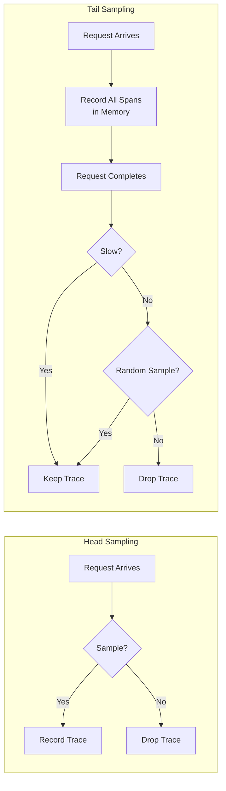
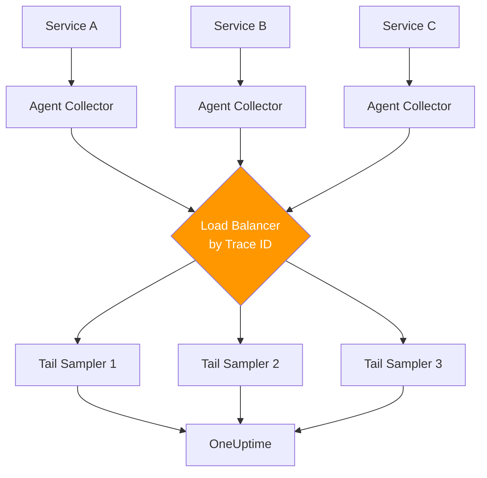

# How to Implement Latency-Based Sampling to Capture Slow Traces

Author: [nawazdhandala](https://www.github.com/nawazdhandala)

Tags: OpenTelemetry, Sampling, Latency, Tail Sampling, Performance, Tracing

Description: Learn how to implement latency-based sampling in OpenTelemetry to automatically capture slow traces and surface performance bottlenecks.

---

Standard probabilistic sampling treats all traces equally. A request that completes in 2 milliseconds gets the same chance of being sampled as a request that takes 30 seconds. This is a problem because the slow requests are almost always the ones you care about. They represent the user experiences that need fixing, the database queries that need optimizing, and the service calls that are about to time out. Latency-based sampling flips the equation by keeping slow traces at a much higher rate than fast ones, giving you the data you actually need for performance debugging.

## Head Sampling vs Tail Sampling

Before diving into latency-based sampling, it is important to understand why you cannot do this with head sampling alone. Head sampling makes the keep-or-drop decision at the beginning of a trace, before the first span is even complete. At that point, you have no idea how long the request will take. You are sampling blind.

Tail sampling, on the other hand, waits until the trace is complete (or a timeout has passed) before making a decision. This means you can look at the total duration, the error status, the number of spans, or any other attribute of the finished trace and use that information to decide whether to keep it.



The tradeoff is that tail sampling requires holding all spans in memory until the decision is made. For high-traffic systems, this can be significant. But for the quality of traces you capture, it is usually worth it.

## Configuring Latency-Based Tail Sampling in the Collector

The OpenTelemetry Collector's `tail_sampling` processor is where latency-based sampling lives. It buffers complete traces in memory and applies policies to decide which ones to keep.

```yaml
# collector-config.yaml
# Tail sampling with latency-based policies

receivers:
  otlp:
    protocols:
      grpc:
        endpoint: 0.0.0.0:4317

processors:
  tail_sampling:
    # How long to wait for a trace to complete
    # before making a sampling decision
    decision_wait: 30s
    # Maximum number of traces held in memory
    num_traces: 100000
    # Expected number of new traces per second
    # (helps with memory allocation)
    expected_new_traces_per_sec: 1000
    policies:
      # Policy 1: Always keep traces slower than 2 seconds
      - name: slow-traces
        type: latency
        latency:
          threshold_ms: 2000

      # Policy 2: Sample 5% of normal-speed traces
      - name: baseline-sampling
        type: probabilistic
        probabilistic:
          sampling_percentage: 5

exporters:
  otlp:
    endpoint: https://otel.oneuptime.com:4317

service:
  pipelines:
    traces:
      receivers: [otlp]
      processors: [tail_sampling]
      exporters: [otlp]
```

This configuration keeps every trace that takes longer than 2 seconds, plus a 5% random sample of all other traces. The `decision_wait` of 30 seconds means the collector holds spans in memory for up to 30 seconds waiting for the trace to complete. If spans are still arriving after 30 seconds, the collector makes a decision with whatever it has.

The `num_traces` parameter controls the maximum number of traces buffered in memory. If your system processes more concurrent traces than this limit, some traces may be dropped before they can be evaluated. Set this based on your traffic volume and available memory.

## Tiered Latency Policies

A single latency threshold is a good start, but you can build more nuanced policies by combining multiple latency thresholds with different sampling rates. This lets you capture 100% of truly slow traces, a moderate sample of somewhat slow traces, and a small sample of fast traces.

```yaml
processors:
  tail_sampling:
    decision_wait: 30s
    num_traces: 200000
    expected_new_traces_per_sec: 5000
    policies:
      # Tier 1: Keep all traces over 5 seconds
      # These are serious performance issues
      - name: very-slow-traces
        type: latency
        latency:
          threshold_ms: 5000

      # Tier 2: Keep all traces over 1 second
      # These are worth investigating
      - name: slow-traces
        type: latency
        latency:
          threshold_ms: 1000

      # Tier 3: Keep 10% of traces between 500ms and 1s
      # Provides baseline visibility into borderline cases
      - name: medium-traces
        type: and
        and:
          and_sub_policy:
            - name: latency-filter
              type: latency
              latency:
                threshold_ms: 500
            - name: probabilistic-filter
              type: probabilistic
              probabilistic:
                sampling_percentage: 10

      # Tier 4: Keep 1% of fast traces for baseline comparison
      - name: fast-baseline
        type: probabilistic
        probabilistic:
          sampling_percentage: 1
```

The `and` policy type combines sub-policies. Both sub-policies must evaluate to "keep" for the trace to be kept. In Tier 3, this means a trace must both exceed 500ms AND win the 10% probabilistic lottery. This composite policy structure gives you fine-grained control without sending excessive data to your backend.

## Combining Latency with Error Sampling

Slow traces and error traces are the two most valuable categories for debugging. You can combine them in a single tail sampling configuration so you never miss either one.

```yaml
processors:
  tail_sampling:
    decision_wait: 30s
    num_traces: 150000
    expected_new_traces_per_sec: 3000
    policies:
      # Keep all traces with errors regardless of latency
      - name: error-traces
        type: status_code
        status_code:
          status_codes:
            - ERROR

      # Keep all slow traces regardless of error status
      - name: slow-traces
        type: latency
        latency:
          threshold_ms: 2000

      # Keep a small random sample for baseline metrics
      - name: random-baseline
        type: probabilistic
        probabilistic:
          sampling_percentage: 2
```

The tail sampling processor evaluates all policies for each trace. If any policy says "keep," the trace is kept. This OR logic means a trace that is both slow and errored will be kept (as expected), and you do not need to worry about policy ordering or conflicts.

## Implementing Custom Latency Logic in Application Code

Sometimes you need latency-based decisions at the application level rather than the collector. You might want to add attributes to spans that a downstream collector can use, or you might want to record additional detail only for slow requests.

```python
import time
from opentelemetry import trace

tracer = trace.get_tracer("latency-aware-app")

def handle_request(request):
    with tracer.start_as_current_span("handle_request") as span:
        start_time = time.monotonic()

        # Process the request
        result = process_business_logic(request)

        elapsed_ms = (time.monotonic() - start_time) * 1000

        # Tag slow spans so the collector can make
        # informed sampling decisions
        span.set_attribute("request.duration_ms", elapsed_ms)
        span.set_attribute("request.is_slow", elapsed_ms > 1000)

        if elapsed_ms > 1000:
            # Add extra debugging context for slow requests
            # These attributes help diagnose the root cause
            span.set_attribute("request.slow_reason", "investigate")
            span.add_event(
                "slow_request_detected",
                attributes={
                    "elapsed_ms": elapsed_ms,
                    "threshold_ms": 1000,
                },
            )

        return result
```

By tagging spans with `request.is_slow`, you give the collector's tail sampling processor something to filter on using an `attribute` policy. This combines the application's knowledge about what counts as "slow" for its specific context with the collector's ability to make trace-wide sampling decisions.

## Scaling Tail Sampling with Load Balancing

Tail sampling has an important constraint: all spans for a given trace must be processed by the same collector instance. If spans from the same trace land on different collector instances, each instance only sees a partial trace and cannot make accurate latency decisions.

The solution is to add a load-balancing exporter in front of your tail sampling collectors. This exporter routes all spans with the same trace ID to the same downstream collector.

```yaml
# Agent collector (runs on each node)
receivers:
  otlp:
    protocols:
      grpc:
        endpoint: 0.0.0.0:4317

exporters:
  # Load-balancing exporter routes by trace ID
  loadbalancing:
    protocol:
      otlp:
        timeout: 10s
    resolver:
      dns:
        # Headless service that resolves to all
        # tail sampling collector pods
        hostname: tail-sampling-collectors.monitoring.svc
        port: 4317

service:
  pipelines:
    traces:
      receivers: [otlp]
      exporters: [loadbalancing]
```

```yaml
# Tail sampling collector (multiple instances behind DNS)
receivers:
  otlp:
    protocols:
      grpc:
        endpoint: 0.0.0.0:4317

processors:
  tail_sampling:
    decision_wait: 30s
    num_traces: 100000
    policies:
      - name: slow-traces
        type: latency
        latency:
          threshold_ms: 2000
      - name: baseline
        type: probabilistic
        probabilistic:
          sampling_percentage: 3

exporters:
  otlp:
    endpoint: https://otel.oneuptime.com:4317

service:
  pipelines:
    traces:
      receivers: [otlp]
      processors: [tail_sampling]
      exporters: [otlp]
```



The agent collectors on each node forward all spans to the load-balancing layer, which hashes trace IDs and routes them to consistent tail sampling instances. Each tail sampler then has a complete view of the traces it is responsible for and can make accurate latency-based decisions.

## Memory and Performance Considerations

Tail sampling is not free. Every span for every trace must be held in memory until the decision wait period expires. For a system generating 10,000 spans per second with a 30 second decision wait, you are holding roughly 300,000 spans in memory at any given time. Each span can range from a few hundred bytes to several kilobytes depending on attributes and events.

Monitor these collector metrics to ensure your tail sampling setup is healthy:

- `otelcol_processor_tail_sampling_count_traces_sampled`: How many traces were kept vs dropped
- `otelcol_processor_tail_sampling_sampling_decision_latency`: How long decisions take
- `otelcol_processor_tail_sampling_count_traces_dropped`: Traces dropped due to memory pressure

If you see traces being dropped, increase `num_traces` or add more collector instances behind the load balancer.

## Wrapping Up

Latency-based sampling transforms your tracing data from a random sample into a targeted collection of the traces that matter most. By using tail sampling in the OpenTelemetry Collector, you can keep 100% of slow traces while aggressively filtering fast, healthy requests. The key architectural requirement is ensuring all spans for a trace reach the same collector instance, which the load-balancing exporter handles cleanly. Start with a simple latency threshold, monitor your collector's memory usage, and refine your policies as you learn what latency patterns matter most for your specific workloads.
