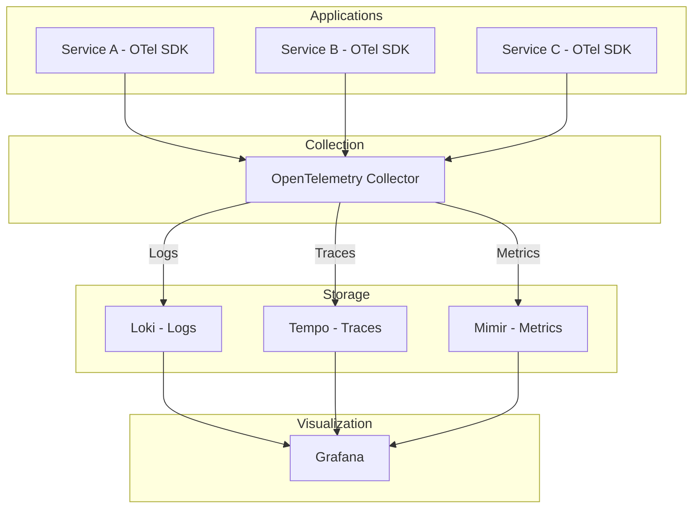
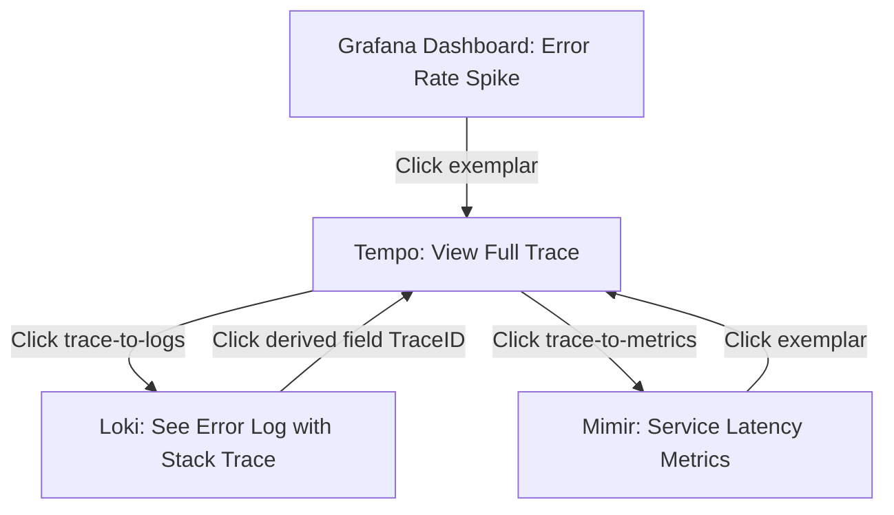

# How to Build a Complete LGTM Stack (Loki, Grafana, Tempo, Mimir) with OpenTelemetry

Author: [nawazdhandala](https://www.github.com/nawazdhandala)

Tags: OpenTelemetry, Grafana, Loki, Tempo, Mimir, LGTM Stack, Observability

Description: Build a complete LGTM observability stack with Loki, Grafana, Tempo, and Mimir, fully integrated with OpenTelemetry for traces, metrics, and logs.

---

The LGTM stack is Grafana's answer to full-stack observability. Loki handles logs, Grafana provides visualization, Tempo stores traces, and Mimir manages metrics. When you wire all four together with OpenTelemetry as the data collection layer, you get a production-grade observability platform that is entirely open source. This guide walks you through building the complete stack from scratch with working configurations for every component.

## What the LGTM Stack Looks Like

Each component in the stack has a specific job. OpenTelemetry sits in front of all three storage backends as the unified data collection layer.



The beauty of this architecture is that your applications only need to know about one endpoint: the OpenTelemetry Collector. The Collector handles routing, processing, and exporting to the right backends. If you ever need to swap out a backend, your applications do not change at all.

## Project Structure

Let's organize the configuration files into a clean project structure.

```
lgtm-stack/
  docker-compose.yaml
  otel-collector-config.yaml
  tempo-config.yaml
  mimir-config.yaml
  loki-config.yaml
  grafana/
    datasources.yaml
    dashboards.yaml
    dashboards/
      services-overview.json
```

We will go through each file one at a time.

## Loki Configuration

Loki stores logs. We configure it with the v13 schema, TSDB index, and local filesystem storage. For production you would use S3 or GCS instead.

```yaml
# loki-config.yaml
# Configures Loki for log storage with OTLP support

auth_enabled: false

server:
  http_listen_port: 3100

common:
  path_prefix: /loki
  storage:
    filesystem:
      chunks_directory: /loki/chunks
      rules_directory: /loki/rules
  replication_factor: 1
  ring:
    kvstore:
      store: inmemory

limits_config:
  # Required for accepting OpenTelemetry structured metadata
  allow_structured_metadata: true
  retention_period: 168h
  max_query_series: 500
  max_query_parallelism: 2

schema_config:
  configs:
    - from: 2024-01-01
      store: tsdb
      object_store: filesystem
      schema: v13
      index:
        prefix: index_
        period: 24h

query_range:
  results_cache:
    cache:
      embedded_cache:
        enabled: true
        max_size_mb: 100
```

## Tempo Configuration

Tempo stores traces. We enable the OTLP receiver, configure the metrics generator to produce span metrics, and set up local storage.

```yaml
# tempo-config.yaml
# Configures Tempo for trace storage with metrics generation

server:
  http_listen_port: 3200

distributor:
  receivers:
    otlp:
      protocols:
        grpc:
          endpoint: 0.0.0.0:4317
        http:
          endpoint: 0.0.0.0:4318

ingester:
  max_block_duration: 5m

compactor:
  compaction:
    block_retention: 72h

storage:
  trace:
    backend: local
    local:
      path: /var/tempo/traces
    wal:
      path: /var/tempo/wal

# Generate RED metrics from traces and push them to Mimir
metrics_generator:
  registry:
    external_labels:
      source: tempo
      cluster: local
  storage:
    path: /var/tempo/generator/wal
    remote_write:
      - url: http://mimir:9009/api/v1/push
        send_exemplars: true

overrides:
  defaults:
    metrics_generator:
      # Generate both service graphs and per-span metrics
      processors: [service-graphs, span-metrics]
```

The `metrics_generator` section is what makes the LGTM stack more than the sum of its parts. Tempo analyzes incoming traces and automatically generates rate, error, and duration (RED) metrics. These metrics are pushed to Mimir, so you can alert on trace-derived data without writing any extra instrumentation. The `service-graphs` processor also creates metrics that power the service map visualization in Grafana.

## Mimir Configuration

Mimir stores metrics. In monolithic mode, it runs all components in one process.

```yaml
# mimir-config.yaml
# Configures Mimir for metric storage in monolithic mode

multitenancy_enabled: false

blocks_storage:
  backend: filesystem
  filesystem:
    dir: /data/mimir/blocks
  tsdb:
    dir: /data/mimir/tsdb
  bucket_store:
    sync_dir: /data/mimir/sync

compactor:
  data_dir: /data/mimir/compactor
  sharding_ring:
    kvstore:
      store: memberlist

distributor:
  ring:
    kvstore:
      store: memberlist

ingester:
  ring:
    kvstore:
      store: memberlist
    replication_factor: 1

server:
  http_listen_port: 9009

store_gateway:
  sharding_ring:
    kvstore:
      store: memberlist

limits:
  max_label_names_per_series: 30
  max_global_series_per_user: 1500000
  # Accept exemplars so we can link metrics to traces
  max_global_exemplars_per_user: 100000
```

The `max_global_exemplars_per_user` setting is crucial for the metrics-to-traces correlation. Exemplars are sample trace IDs attached to metric data points. When you hover over a metric chart in Grafana, you can click an exemplar to jump directly to the trace that produced that data point.

## OpenTelemetry Collector Configuration

The Collector is the routing hub. It receives all three signal types from applications and sends them to the appropriate backends.

```yaml
# otel-collector-config.yaml
# Central collector that routes traces, metrics, and logs to the LGTM stack

receivers:
  otlp:
    protocols:
      grpc:
        endpoint: 0.0.0.0:4317
      http:
        endpoint: 0.0.0.0:4318

processors:
  batch:
    # Batch all signals before exporting for better throughput
    send_batch_size: 1024
    timeout: 5s

  memory_limiter:
    # Protect the Collector from running out of memory
    check_interval: 5s
    limit_mib: 512
    spike_limit_mib: 128

  resource:
    attributes:
      # Tag all telemetry with the cluster name
      - key: cluster
        value: lgtm-local
        action: upsert

  # Add resource attributes to metric labels for PromQL filtering
  transform/metrics:
    metric_statements:
      - context: datapoint
        statements:
          - set(attributes["cluster"], resource.attributes["cluster"])

exporters:
  otlphttp/tempo:
    # Send traces to Tempo via OTLP HTTP
    endpoint: http://tempo:4318

  otlphttp/loki:
    # Send logs to Loki via its OTLP endpoint
    endpoint: http://loki:3100/otlp

  prometheusremotewrite:
    # Send metrics to Mimir via Prometheus remote write
    endpoint: http://mimir:9009/api/v1/push
    resource_to_telemetry_conversion:
      enabled: true
    tls:
      insecure: true

service:
  pipelines:
    traces:
      receivers: [otlp]
      processors: [memory_limiter, resource, batch]
      exporters: [otlphttp/tempo]
    metrics:
      receivers: [otlp]
      processors: [memory_limiter, resource, transform/metrics, batch]
      exporters: [prometheusremotewrite]
    logs:
      receivers: [otlp]
      processors: [memory_limiter, resource, batch]
      exporters: [otlphttp/loki]
```

Notice that each pipeline has its own set of processors and a single exporter. The `memory_limiter` goes first in every pipeline to protect the Collector from OOM kills. The `resource` processor runs next to add common attributes. Then `batch` runs last (before the exporter) to group data for efficient network transport.

## Grafana Data Source Provisioning

This is where the magic of cross-signal correlation happens.

```yaml
# grafana/datasources.yaml
# Provisions all three LGTM backends with cross-signal correlation

apiVersion: 1

datasources:
  - name: Mimir
    type: prometheus
    uid: mimir
    access: proxy
    url: http://mimir:9009/prometheus
    isDefault: true
    jsonData:
      httpMethod: POST
      # Link metric exemplars to traces in Tempo
      exemplarTraceIdDestinations:
        - name: traceID
          datasourceUid: tempo

  - name: Tempo
    type: tempo
    uid: tempo
    access: proxy
    url: http://tempo:3200
    jsonData:
      # Link traces to logs in Loki
      tracesToLogsV2:
        datasourceUid: loki
        spanStartTimeShift: "-1h"
        spanEndTimeShift: "1h"
        tags:
          - key: service.name
            value: service_name
        filterByTraceID: true
        filterBySpanID: false
      # Link traces to metrics in Mimir
      tracesToMetrics:
        datasourceUid: mimir
        spanStartTimeShift: "-1h"
        spanEndTimeShift: "1h"
        tags:
          - key: service.name
            value: service_name
        queries:
          - name: Request Rate
            query: "sum(rate(traces_spanmetrics_calls_total{$$__tags}[5m]))"
          - name: Error Rate
            query: "sum(rate(traces_spanmetrics_calls_total{$$__tags, status_code=\"STATUS_CODE_ERROR\"}[5m]))"
      # Enable the service graph powered by Tempo's metrics generator
      serviceMap:
        datasourceUid: mimir
      nodeGraph:
        enabled: true

  - name: Loki
    type: loki
    uid: loki
    access: proxy
    url: http://loki:3100
    jsonData:
      # Link logs to traces in Tempo via trace ID extraction
      derivedFields:
        - datasourceUid: tempo
          matcherRegex: "[Tt]race[_.]?[Ii][Dd][\":]?\\s*[\"']?(\\w+)"
          name: TraceID
          url: "$${__value.raw}"
          matcherType: regex
```

Every data source links to the other two. Mimir links to Tempo through exemplars. Tempo links to Loki through `tracesToLogsV2` and to Mimir through `tracesToMetrics`. Loki links to Tempo through derived fields. This creates a fully connected graph where you can start at any signal and navigate to any other.

## Docker Compose - The Complete Stack

Here is the Docker Compose file that brings everything up.

```yaml
# docker-compose.yaml
# Complete LGTM stack with OpenTelemetry Collector

version: "3.8"

services:
  # Grafana Loki - Log storage
  loki:
    image: grafana/loki:latest
    command: ["-config.file=/etc/loki.yaml"]
    volumes:
      - ./loki-config.yaml:/etc/loki.yaml
      - loki-data:/loki
    ports:
      - "3100:3100"
    healthcheck:
      test: ["CMD-SHELL", "wget --no-verbose --tries=1 --spider http://localhost:3100/ready || exit 1"]
      interval: 10s
      timeout: 5s
      retries: 5

  # Grafana Tempo - Trace storage
  tempo:
    image: grafana/tempo:latest
    command: ["-config.file=/etc/tempo.yaml"]
    volumes:
      - ./tempo-config.yaml:/etc/tempo.yaml
      - tempo-data:/var/tempo
    ports:
      - "3200:3200"
    depends_on:
      mimir:
        condition: service_healthy

  # Grafana Mimir - Metric storage
  mimir:
    image: grafana/mimir:latest
    command: ["-config.file=/etc/mimir.yaml", "-target=all"]
    volumes:
      - ./mimir-config.yaml:/etc/mimir.yaml
      - mimir-data:/data/mimir
    ports:
      - "9009:9009"
    healthcheck:
      test: ["CMD-SHELL", "wget --no-verbose --tries=1 --spider http://localhost:9009/ready || exit 1"]
      interval: 10s
      timeout: 5s
      retries: 5

  # OpenTelemetry Collector - Data pipeline
  otel-collector:
    image: otel/opentelemetry-collector-contrib:latest
    volumes:
      - ./otel-collector-config.yaml:/etc/otelcol-contrib/config.yaml
    ports:
      - "4317:4317"   # OTLP gRPC
      - "4318:4318"   # OTLP HTTP
    depends_on:
      loki:
        condition: service_healthy
      mimir:
        condition: service_healthy
      tempo:
        condition: service_started

  # Grafana - Visualization
  grafana:
    image: grafana/grafana:latest
    volumes:
      - ./grafana/datasources.yaml:/etc/grafana/provisioning/datasources/datasources.yaml
    ports:
      - "3000:3000"
    environment:
      - GF_SECURITY_ADMIN_PASSWORD=admin
      - GF_FEATURE_TOGGLES_ENABLE=traceqlEditor
    depends_on:
      - loki
      - tempo
      - mimir

volumes:
  loki-data:
  tempo-data:
  mimir-data:
```

Start it all with:

```bash
# Launch the complete LGTM stack
docker-compose up -d
```

After about 30 seconds, all services should be healthy. Grafana will be available at `http://localhost:3000` (username: admin, password: admin).

## Instrumenting a Sample Application

Here is a Go application that sends all three signal types to the Collector.

```go
// main.go
// Sample Go app instrumented with OpenTelemetry for the LGTM stack

package main

import (
    "context"
    "log/slog"
    "net/http"
    "time"

    "go.opentelemetry.io/otel"
    "go.opentelemetry.io/otel/exporters/otlp/otlptrace/otlptracegrpc"
    "go.opentelemetry.io/otel/exporters/otlp/otlpmetric/otlpmetricgrpc"
    "go.opentelemetry.io/otel/exporters/otlp/otlplog/otlploggrpc"
    "go.opentelemetry.io/otel/sdk/resource"
    sdktrace "go.opentelemetry.io/otel/sdk/trace"
    sdkmetric "go.opentelemetry.io/otel/sdk/metric"
    sdklog "go.opentelemetry.io/otel/sdk/log"
    semconv "go.opentelemetry.io/otel/semconv/v1.24.0"
)

func initOTel(ctx context.Context) (func(), error) {
    // Create a shared resource describing this service
    res, _ := resource.New(ctx,
        resource.WithAttributes(
            semconv.ServiceName("demo-app"),
            semconv.ServiceVersion("0.1.0"),
        ),
    )

    // Set up trace exporter and provider
    traceExporter, _ := otlptracegrpc.New(ctx,
        otlptracegrpc.WithEndpoint("localhost:4317"),
        otlptracegrpc.WithInsecure(),
    )
    tp := sdktrace.NewTracerProvider(
        sdktrace.WithBatcher(traceExporter),
        sdktrace.WithResource(res),
    )
    otel.SetTracerProvider(tp)

    // Set up metric exporter and provider
    metricExporter, _ := otlpmetricgrpc.New(ctx,
        otlpmetricgrpc.WithEndpoint("localhost:4317"),
        otlpmetricgrpc.WithInsecure(),
    )
    mp := sdkmetric.NewMeterProvider(
        sdkmetric.WithReader(
            sdkmetric.NewPeriodicReader(metricExporter,
                sdkmetric.WithInterval(15*time.Second)),
        ),
        sdkmetric.WithResource(res),
    )
    otel.SetMeterProvider(mp)

    // Set up log exporter and provider
    logExporter, _ := otlploggrpc.New(ctx,
        otlploggrpc.WithEndpoint("localhost:4317"),
        otlploggrpc.WithInsecure(),
    )
    lp := sdklog.NewLoggerProvider(
        sdklog.WithProcessor(sdklog.NewBatchProcessor(logExporter)),
        sdklog.WithResource(res),
    )

    // Return a cleanup function
    return func() {
        tp.Shutdown(ctx)
        mp.Shutdown(ctx)
        lp.Shutdown(ctx)
    }, nil
}

func main() {
    ctx := context.Background()
    shutdown, _ := initOTel(ctx)
    defer shutdown()

    tracer := otel.Tracer("demo-app")
    meter := otel.Meter("demo-app")

    // Create a request counter
    requestCounter, _ := meter.Int64Counter("http.server.requests.total")

    http.HandleFunc("/", func(w http.ResponseWriter, r *http.Request) {
        // Start a span for the request
        ctx, span := tracer.Start(r.Context(), "handleRequest")
        defer span.End()

        // Increment the request counter
        requestCounter.Add(ctx, 1)

        // Log with trace context
        slog.InfoContext(ctx, "handling request",
            "method", r.Method,
            "path", r.URL.Path,
        )

        w.Write([]byte("Hello from LGTM stack!"))
    })

    slog.Info("starting server on :8080")
    http.ListenAndServe(":8080", nil)
}
```

## The Correlation Workflow

With everything running, here is how you debug an issue across all three signals.



The flow is bidirectional. You can start from any signal and navigate to the others. This is the core value of the LGTM stack. Individual tools are good on their own, but the real power comes from being able to move fluidly between logs, traces, and metrics without losing context.

## Production Deployment Considerations

This local setup works for development and testing. For production, here are the things you need to change.

First, switch all storage backends from local filesystem to object storage (S3, GCS, or Azure Blob). All three backends support this natively. Second, run each backend in microservices mode. Loki, Tempo, and Mimir all support splitting into separate read and write paths that scale independently. Third, deploy the OpenTelemetry Collector as a DaemonSet on each Kubernetes node, with a separate gateway Collector deployment for processing. Fourth, enable authentication. Use Mimir's multi-tenancy with the `X-Scope-OrgID` header, Loki's equivalent tenant ID, and Tempo's per-tenant overrides. Fifth, set up alerting rules in Mimir using the ruler component. You can define PromQL-based alerts on both direct metrics and the span metrics generated by Tempo.

The Grafana team also provides Helm charts for deploying the entire stack on Kubernetes. The `mimir-distributed`, `loki-distributed`, and `tempo-distributed` charts handle sharding, replication, and resource management. For Grafana itself, the standard `grafana` chart works with the same provisioning YAML files shown in this guide.

The LGTM stack with OpenTelemetry gives you a complete, open-source observability platform. Every component is designed to work together, and the cross-signal correlation makes debugging production issues significantly faster than jumping between disconnected tools.
