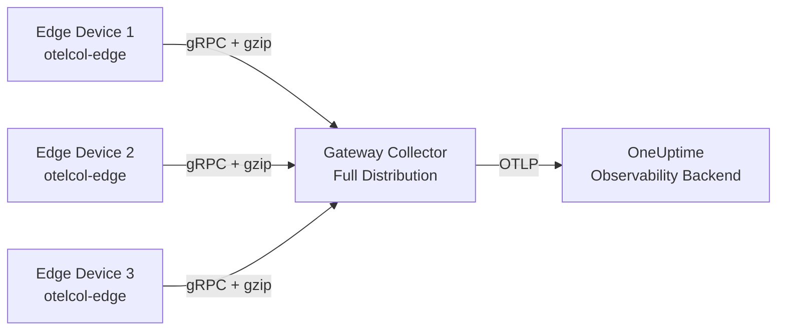

# How to Configure Lightweight OpenTelemetry for Edge Computing Devices

Author: [nawazdhandala](https://www.github.com/nawazdhandala)

Tags: OpenTelemetry, Edge Computing, IoT, Lightweight, Collector, Observability

Description: Learn how to configure a minimal OpenTelemetry setup for resource-constrained edge computing devices with practical examples and optimization strategies.

---

Edge computing devices operate under tight resource constraints. Memory is measured in megabytes, CPU cycles are precious, and network bandwidth is often limited or intermittent. Running a full OpenTelemetry Collector on these devices is not practical, but that does not mean you have to fly blind. With the right configuration, you can get meaningful telemetry from edge devices without overwhelming their limited resources.

This guide walks through building a lightweight OpenTelemetry pipeline tailored for edge environments, from selecting the right collector distribution to tuning every parameter for minimal overhead.

## Why Standard OpenTelemetry Is Too Heavy for Edge

The default OpenTelemetry Collector distribution ships with dozens of receivers, processors, and exporters. Most of them are irrelevant for edge workloads. The binary alone can consume 50 to 100 MB of RAM at idle, which is unacceptable when your device only has 256 MB or 512 MB total.

The solution is to build a custom collector using the OpenTelemetry Collector Builder (ocb). This tool lets you pick only the components you need, producing a minimal binary with a much smaller footprint.

## Building a Custom Minimal Collector

The OpenTelemetry Collector Builder uses a YAML manifest to define which components to include. Here is a manifest optimized for edge devices:

```yaml
# builder-config.yaml
# Collector Builder manifest for edge devices
# Only includes the bare minimum components needed

dist:
  # Name for the custom collector binary
  name: otelcol-edge
  # Output directory for the built binary
  output_path: ./dist
  # Use the core module as the base
  module: github.com/open-telemetry/opentelemetry-collector

receivers:
  # OTLP receiver for ingesting traces, metrics, and logs
  - gomod: go.opentelemetry.io/collector/receiver/otlpreceiver v0.96.0

processors:
  # Batch processor to reduce network calls
  - gomod: go.opentelemetry.io/collector/processor/batchprocessor v0.96.0
  # Memory limiter to prevent OOM on constrained devices
  - gomod: go.opentelemetry.io/collector/processor/memorylimiterprocessor v0.96.0

exporters:
  # OTLP exporter to send data to a central collector or backend
  - gomod: go.opentelemetry.io/collector/exporter/otlpexporter v0.96.0
  # File exporter as a fallback when network is unavailable
  - gomod: go.opentelemetry.io/collector/exporter/fileexporter v0.96.0
```

Build the binary with the collector builder:

```bash
# Install the OpenTelemetry Collector Builder
go install go.opentelemetry.io/collector/cmd/builder@latest

# Build the custom collector from the manifest
builder --config=builder-config.yaml
```

This produces a binary that is typically under 30 MB and uses around 15 to 20 MB of RAM at idle. That is a significant reduction compared to the full distribution.

## Configuring the Collector for Minimal Resource Usage

With the custom binary built, the next step is writing a collector configuration that respects the device's constraints. Every parameter matters when resources are scarce.

```yaml
# otelcol-edge-config.yaml
# Collector configuration tuned for edge devices with limited resources

receivers:
  otlp:
    protocols:
      # Use gRPC for efficient binary serialization
      grpc:
        endpoint: 127.0.0.1:4317
        # Keep max message size small to avoid memory spikes
        max_recv_msg_size_mib: 4

processors:
  # Memory limiter should be the first processor in the pipeline
  memory_limiter:
    # Check memory usage every 5 seconds
    check_interval: 5s
    # Start dropping data at 80 MB to prevent OOM kills
    limit_mib: 80
    # Begin throttling at 60 MB as a soft warning threshold
    spike_limit_mib: 20

  batch:
    # Send batches every 30 seconds to reduce network overhead
    timeout: 30s
    # Keep batch sizes small to limit memory consumption
    send_batch_size: 50
    # Cap the maximum batch size
    send_batch_max_size: 100

exporters:
  otlp:
    endpoint: gateway-collector.example.com:4317
    tls:
      insecure: false
    # Use gzip compression to save bandwidth
    compression: gzip
    retry_on_failure:
      enabled: true
      # Wait 10 seconds before retrying failed exports
      initial_interval: 10s
      # Cap retry backoff at 5 minutes
      max_interval: 300s
    sending_queue:
      enabled: true
      # Small queue to limit memory usage
      queue_size: 50

  file:
    # Fallback: write telemetry to local file when network is down
    path: /var/otel/buffer.json
    rotation:
      # Rotate files at 10 MB to prevent disk fill
      max_megabytes: 10
      max_backups: 3

service:
  pipelines:
    traces:
      receivers: [otlp]
      processors: [memory_limiter, batch]
      exporters: [otlp]
    metrics:
      receivers: [otlp]
      processors: [memory_limiter, batch]
      exporters: [otlp]
```

The memory limiter processor is critical here. Without it, a burst of telemetry data could push the collector past available memory and trigger an out-of-memory kill by the operating system. Placing it first in the processor chain ensures it can shed load before any buffering happens.

## Sampling Strategies for Edge Devices

Sending every single trace and metric from an edge device is wasteful. Most of the data is routine and uninteresting. Sampling lets you keep the important signals while discarding the noise.

For edge scenarios, tail-based sampling at the device level is too memory-intensive. Instead, use head-based sampling with a probabilistic sampler in your application code:

```python
# Python application running on the edge device
# Configure a probabilistic sampler to keep resource usage low

from opentelemetry import trace
from opentelemetry.sdk.trace import TracerProvider
from opentelemetry.sdk.trace.sampling import TraceIdRatioBased
from opentelemetry.sdk.trace.export import BatchSpanExporter
from opentelemetry.exporter.otlp.proto.grpc.trace_exporter import OTLPSpanExporter

# Sample only 10% of traces to reduce data volume
# Adjust the ratio based on your traffic patterns
sampler = TraceIdRatioBased(0.1)

provider = TracerProvider(sampler=sampler)

# Configure the batch exporter with conservative settings
exporter = OTLPSpanExporter(
    endpoint="localhost:4317",
    insecure=True,
)

# Use small batch sizes and longer delays for edge devices
span_processor = BatchSpanExporter(
    exporter,
    max_queue_size=256,        # Keep queue small
    max_export_batch_size=32,  # Small batches
    schedule_delay_millis=10000,  # Export every 10 seconds
)

provider.add_span_processor(span_processor)
trace.set_tracer_provider(provider)
```

A 10% sampling rate is a good starting point. You can adjust this based on the device's workload. For devices that handle critical operations, you might want to bump it up to 25% or even 50%. For high-throughput sensor devices generating repetitive data, 1% might be enough.

## Architecture: Edge to Gateway Pattern

Edge devices should not export telemetry directly to your observability backend. Instead, route data through a gateway collector that runs on more capable hardware. This pattern provides buffering, aggregation, and retry logic that edge devices cannot handle on their own.



The gateway collector runs the full OpenTelemetry distribution with tail-based sampling, attribute enrichment, and robust retry queues. It handles the heavy lifting so edge devices do not have to.

## Handling Network Interruptions

Edge devices frequently lose connectivity. Your telemetry pipeline needs to handle this gracefully without losing data or crashing the collector.

The file exporter serves as a local buffer. When the primary OTLP exporter fails to reach the gateway, data gets written to disk. You can then set up a simple cron job or watchdog process to replay the buffered data once connectivity returns:

```bash
#!/bin/bash
# replay-buffer.sh
# Replays buffered telemetry data when network connectivity returns

BUFFER_FILE="/var/otel/buffer.json"
GATEWAY="gateway-collector.example.com:4317"

# Check if the gateway is reachable
if nc -z -w 5 gateway-collector.example.com 4317 2>/dev/null; then
    if [ -f "$BUFFER_FILE" ] && [ -s "$BUFFER_FILE" ]; then
        echo "Network available. Replaying buffered telemetry..."
        # Use the collector's file receiver or a custom script to replay
        curl -X POST "http://localhost:4318/v1/traces" \
            -H "Content-Type: application/json" \
            -d @"$BUFFER_FILE"
        # Clear the buffer after successful replay
        truncate -s 0 "$BUFFER_FILE"
    fi
fi
```

This approach ensures you do not lose telemetry data during network outages while keeping the collector itself simple and stateless.

## Monitoring the Collector Itself

Even a lightweight collector needs basic self-monitoring. You want to know if the collector is running, if it is dropping data, and how much memory it is consuming. The collector exposes internal metrics that you can scrape with a minimal Prometheus setup or log periodically:

```yaml
# Add telemetry section to the collector config
service:
  telemetry:
    logs:
      # Reduce log verbosity on edge devices
      level: warn
    metrics:
      # Expose collector internal metrics on a local port
      address: 127.0.0.1:8888
      level: basic
```

Setting the log level to `warn` instead of the default `info` reduces disk I/O and log volume. The `basic` metrics level exposes only essential counters like accepted and dropped spans, which is enough to detect problems without adding overhead.

## Resource Limits with systemd

If your edge device runs Linux, use systemd to enforce hard resource limits on the collector process:

```ini
# /etc/systemd/system/otelcol-edge.service
# Systemd unit file with resource constraints for edge collector

[Unit]
Description=OpenTelemetry Collector (Edge)
After=network.target

[Service]
ExecStart=/usr/local/bin/otelcol-edge --config=/etc/otel/config.yaml
Restart=on-failure
RestartSec=10

# Hard memory limit prevents runaway memory usage
MemoryMax=100M
# CPU quota limits collector to 20% of one core
CPUQuota=20%
# Limit file descriptors
LimitNOFILE=1024

[Install]
WantedBy=multi-user.target
```

These limits act as a safety net. Even if the collector configuration has a bug that causes excessive resource consumption, systemd will constrain it before it impacts other processes running on the device.

## Summary

Running OpenTelemetry on edge devices requires deliberate trade-offs. You sacrifice completeness for efficiency, trading rich telemetry pipelines for minimal, focused data collection. The key principles are: build a custom collector binary with only the components you need, enforce memory limits aggressively, sample data at the source, route through a gateway collector, and plan for network interruptions.

With this approach, even a Raspberry Pi-class device can participate in your distributed tracing and metrics pipeline without breaking a sweat.
