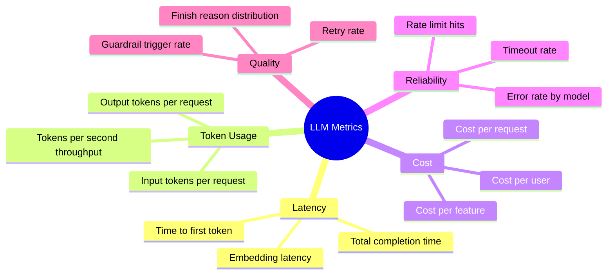
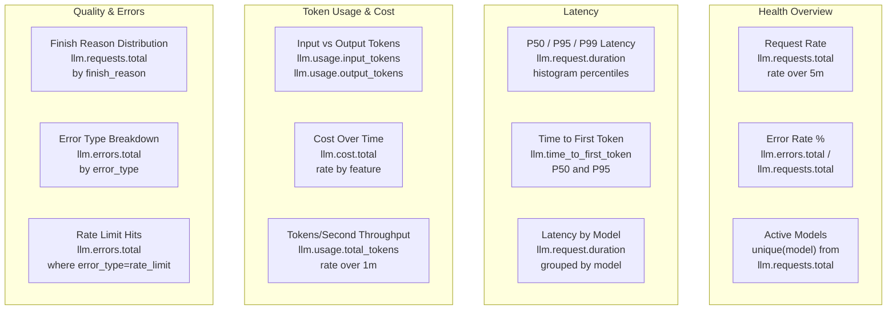

# How to Build an LLM Observability Dashboard with OpenTelemetry Metrics

Author: [nawazdhandala](https://www.github.com/nawazdhandala)

Tags: OpenTelemetry, LLM Observability, Metrics, Dashboard, Monitoring, GenAI

Description: Step-by-step guide to building a production LLM observability dashboard using OpenTelemetry metrics for tracking latency, tokens, costs, and error rates.

---

Running LLMs in production without a proper dashboard is like driving at night with the headlights off. You know things are working when users aren't complaining, but you have no idea how close you are to a cliff. An LLM observability dashboard built on OpenTelemetry metrics gives you real-time visibility into latency, token usage, costs, error rates, and model performance, all using open standards that work with any backend.

This guide walks through defining the right metrics, instrumenting your application, and organizing everything into a dashboard that actually helps you operate your LLM service.

## What Metrics Matter for LLM Observability?

Before writing any code, let's establish what we need to track. LLM workloads have unique characteristics that traditional APM metrics don't cover well. Here's the breakdown:



## Defining the Metrics

Let's define a comprehensive set of OpenTelemetry metrics for LLM observability. We'll use histograms for latency and token distributions (so we get percentiles), counters for request totals and errors, and gauges where appropriate.

```python
# llm_metrics.py - Define all LLM observability metrics
from opentelemetry import metrics

meter = metrics.get_meter("llm-service")

# --- Latency Metrics ---

# Histogram for total LLM request duration (includes network time)
llm_request_duration = meter.create_histogram(
    name="llm.request.duration",
    description="Total time from request sent to response received",
    unit="ms",
)

# Histogram for time to first token (streaming responses)
llm_time_to_first_token = meter.create_histogram(
    name="llm.time_to_first_token",
    description="Time from request sent to first token received",
    unit="ms",
)

# --- Token Usage Metrics ---

# Histogram for input token counts
llm_input_tokens = meter.create_histogram(
    name="llm.usage.input_tokens",
    description="Number of input/prompt tokens per request",
    unit="tokens",
)

# Histogram for output token counts
llm_output_tokens = meter.create_histogram(
    name="llm.usage.output_tokens",
    description="Number of output/completion tokens per request",
    unit="tokens",
)

# Counter for total tokens consumed (for cost tracking)
llm_total_tokens = meter.create_counter(
    name="llm.usage.total_tokens",
    description="Cumulative total tokens consumed",
    unit="tokens",
)

# --- Request Metrics ---

# Counter for total LLM requests
llm_requests_total = meter.create_counter(
    name="llm.requests.total",
    description="Total number of LLM requests made",
)

# Counter for LLM errors
llm_errors_total = meter.create_counter(
    name="llm.errors.total",
    description="Total number of failed LLM requests",
)

# --- Cost Metrics ---

# Counter for estimated cost in USD
llm_cost_total = meter.create_counter(
    name="llm.cost.total",
    description="Estimated cumulative cost in USD",
    unit="usd",
)
```

## Instrumenting LLM Calls

Now let's build a wrapper that records all these metrics whenever your application calls an LLM. This wrapper handles both the OpenAI chat completions API and streaming responses.

```python
# llm_instrumented.py - Instrumented LLM client with full metric recording
import time
import openai
from opentelemetry import trace
from llm_metrics import (
    llm_request_duration, llm_time_to_first_token, llm_input_tokens,
    llm_output_tokens, llm_total_tokens, llm_requests_total,
    llm_errors_total, llm_cost_total,
)

tracer = trace.get_tracer("llm-service")

# Pricing per 1K tokens (update these for your models)
MODEL_PRICING = {
    "gpt-4": {"input": 0.03, "output": 0.06},
    "gpt-4-turbo": {"input": 0.01, "output": 0.03},
    "gpt-3.5-turbo": {"input": 0.0005, "output": 0.0015},
}

def estimate_cost(model: str, input_tokens: int, output_tokens: int) -> float:
    """Calculate the estimated cost for an LLM request based on token usage."""
    pricing = MODEL_PRICING.get(model, {"input": 0.01, "output": 0.03})
    input_cost = (input_tokens / 1000) * pricing["input"]
    output_cost = (output_tokens / 1000) * pricing["output"]
    return input_cost + output_cost

def chat_completion(
    client: openai.OpenAI,
    messages: list,
    model: str = "gpt-4",
    temperature: float = 0.7,
    max_tokens: int = 1024,
    feature: str = "default",
    user_id: str = "unknown",
):
    """Make an LLM call with full observability metrics."""

    # Common attributes for all metrics from this request
    attrs = {
        "model": model,
        "feature": feature,
    }

    with tracer.start_as_current_span("llm.chat_completion") as span:
        span.set_attribute("gen_ai.system", "openai")
        span.set_attribute("gen_ai.request.model", model)
        span.set_attribute("gen_ai.request.temperature", temperature)
        span.set_attribute("gen_ai.request.max_tokens", max_tokens)
        span.set_attribute("user.id", user_id)
        span.set_attribute("feature", feature)

        start_time = time.perf_counter()

        try:
            response = client.chat.completions.create(
                model=model,
                messages=messages,
                temperature=temperature,
                max_tokens=max_tokens,
            )

            duration_ms = (time.perf_counter() - start_time) * 1000

            # Extract usage data
            input_tok = response.usage.prompt_tokens
            output_tok = response.usage.completion_tokens
            cost = estimate_cost(model, input_tok, output_tok)
            finish_reason = response.choices[0].finish_reason

            # Record all metrics
            llm_request_duration.record(duration_ms, attributes=attrs)
            llm_input_tokens.record(input_tok, attributes=attrs)
            llm_output_tokens.record(output_tok, attributes=attrs)
            llm_total_tokens.add(input_tok + output_tok, attributes=attrs)
            llm_requests_total.add(1, attributes={**attrs, "status": "success", "finish_reason": finish_reason})
            llm_cost_total.add(cost, attributes=attrs)

            # Set span attributes for trace-level detail
            span.set_attribute("llm.duration_ms", duration_ms)
            span.set_attribute("gen_ai.usage.input_tokens", input_tok)
            span.set_attribute("gen_ai.usage.output_tokens", output_tok)
            span.set_attribute("llm.cost_usd", cost)
            span.set_attribute("llm.finish_reason", finish_reason)

            return response.choices[0].message.content

        except openai.RateLimitError as e:
            duration_ms = (time.perf_counter() - start_time) * 1000
            llm_request_duration.record(duration_ms, attributes=attrs)
            llm_errors_total.add(1, attributes={**attrs, "error_type": "rate_limit"})
            llm_requests_total.add(1, attributes={**attrs, "status": "error"})
            span.set_attribute("error", True)
            span.set_attribute("error.type", "rate_limit")
            raise

        except openai.APITimeoutError as e:
            duration_ms = (time.perf_counter() - start_time) * 1000
            llm_request_duration.record(duration_ms, attributes=attrs)
            llm_errors_total.add(1, attributes={**attrs, "error_type": "timeout"})
            llm_requests_total.add(1, attributes={**attrs, "status": "error"})
            span.set_attribute("error", True)
            span.set_attribute("error.type", "timeout")
            raise

        except Exception as e:
            duration_ms = (time.perf_counter() - start_time) * 1000
            llm_request_duration.record(duration_ms, attributes=attrs)
            llm_errors_total.add(1, attributes={**attrs, "error_type": type(e).__name__})
            llm_requests_total.add(1, attributes={**attrs, "status": "error"})
            span.set_attribute("error", True)
            span.set_attribute("error.type", type(e).__name__)
            raise
```

## Streaming Response Instrumentation

Streaming is increasingly common for LLM applications because it improves perceived latency. But it requires different instrumentation since tokens arrive incrementally. Here's how to measure time-to-first-token properly.

```python
# streaming_instrumented.py - Instrument streaming LLM responses
import time
from opentelemetry import trace
from llm_metrics import llm_request_duration, llm_time_to_first_token, llm_output_tokens

tracer = trace.get_tracer("llm-service")

def chat_completion_stream(client, messages: list, model: str = "gpt-4", feature: str = "default"):
    """Stream an LLM response while capturing timing metrics."""

    attrs = {"model": model, "feature": feature}

    with tracer.start_as_current_span("llm.chat_completion_stream") as span:
        span.set_attribute("gen_ai.system", "openai")
        span.set_attribute("gen_ai.request.model", model)
        span.set_attribute("llm.streaming", True)

        start_time = time.perf_counter()
        first_token_time = None
        token_count = 0
        full_response = []

        # Create the streaming request
        stream = client.chat.completions.create(
            model=model,
            messages=messages,
            stream=True,
        )

        # Iterate over streamed chunks
        for chunk in stream:
            if chunk.choices[0].delta.content:
                content = chunk.choices[0].delta.content

                # Record time to first token
                if first_token_time is None:
                    first_token_time = time.perf_counter()
                    ttft_ms = (first_token_time - start_time) * 1000
                    llm_time_to_first_token.record(ttft_ms, attributes=attrs)
                    span.set_attribute("llm.time_to_first_token_ms", ttft_ms)

                token_count += 1
                full_response.append(content)

                # Yield each chunk to the caller
                yield content

        # Record total duration and token count after stream completes
        total_duration_ms = (time.perf_counter() - start_time) * 1000
        llm_request_duration.record(total_duration_ms, attributes=attrs)
        llm_output_tokens.record(token_count, attributes=attrs)

        span.set_attribute("llm.duration_ms", total_duration_ms)
        span.set_attribute("llm.output_token_estimate", token_count)
```

## Dashboard Layout

Now that the metrics are flowing, let's design the dashboard. A well-organized LLM observability dashboard should answer five questions at a glance: Is it working? Is it fast? Is it expensive? Which models are being used? And are there quality issues?



## Setting Up the Dashboard Panels

Here are the specific metric queries for each panel. These examples use PromQL syntax, which is common across many backends, but the OpenTelemetry metrics are standard and will work with any OTLP-compatible system.

```yaml
# dashboard_panels.yaml - Panel definitions for the LLM observability dashboard

# Panel 1: Request rate over time
- title: "LLM Request Rate"
  query: "rate(llm_requests_total[5m])"
  group_by: ["model", "feature"]
  visualization: "time_series"

# Panel 2: Error rate percentage
- title: "Error Rate %"
  query: "rate(llm_errors_total[5m]) / rate(llm_requests_total[5m]) * 100"
  group_by: ["model"]
  visualization: "gauge"
  thresholds: { warning: 1, critical: 5 }

# Panel 3: Latency percentiles
- title: "Request Latency (P50/P95/P99)"
  query: "histogram_quantile(0.95, rate(llm_request_duration_bucket[5m]))"
  group_by: ["model"]
  visualization: "time_series"

# Panel 4: Token usage comparison
- title: "Input vs Output Tokens"
  queries:
    - "rate(llm_usage_input_tokens_sum[5m]) / rate(llm_usage_input_tokens_count[5m])"
    - "rate(llm_usage_output_tokens_sum[5m]) / rate(llm_usage_output_tokens_count[5m])"
  visualization: "stacked_bar"

# Panel 5: Cost tracking
- title: "Estimated Cost (USD/hour)"
  query: "rate(llm_cost_total[1h]) * 3600"
  group_by: ["model", "feature"]
  visualization: "time_series"

# Panel 6: Finish reason breakdown
- title: "Finish Reason Distribution"
  query: "rate(llm_requests_total[5m])"
  group_by: ["finish_reason"]
  visualization: "pie_chart"
```

## Adding Business Context

Raw infrastructure metrics are useful for engineering, but to get buy-in from your team, tie LLM metrics to business outcomes. Adding the `feature` and `user_id` attributes lets you answer questions like "which feature costs the most?" and "are power users consuming disproportionate resources?"

```python
# business_context.py - Track LLM usage by business dimensions
from llm_instrumented import chat_completion
import openai

client = openai.OpenAI()

# Track which product feature triggered this LLM call
result = chat_completion(
    client=client,
    messages=[{"role": "user", "content": "Summarize this document..."}],
    model="gpt-4",
    feature="document-summarizer",  # Business feature name
    user_id="user-12345",           # Enables per-user cost analysis
)

# Track a different feature using a cheaper model
result = chat_completion(
    client=client,
    messages=[{"role": "user", "content": "Classify this email as spam or not spam"}],
    model="gpt-3.5-turbo",
    feature="email-classifier",
    user_id="user-12345",
)
```

With this in place, your cost panel can show a breakdown like:

| Feature | Model | Requests/hr | Avg Tokens | Cost/hr |
|---------|-------|------------|------------|---------|
| document-summarizer | gpt-4 | 150 | 2,400 | $12.60 |
| email-classifier | gpt-3.5-turbo | 3,000 | 180 | $0.81 |
| chatbot | gpt-4-turbo | 500 | 900 | $6.00 |

## Alerting Rules

A dashboard is only useful if someone is looking at it. Set up alerts for the conditions that need immediate attention.

```python
# alerts.py - Key alerting rules for LLM observability

ALERT_RULES = {
    # Error rate exceeds 5% for any model
    "high_error_rate": {
        "condition": "rate(llm_errors_total[5m]) / rate(llm_requests_total[5m]) > 0.05",
        "severity": "critical",
        "summary": "LLM error rate exceeds 5%",
    },

    # P95 latency exceeds 10 seconds
    "high_latency": {
        "condition": "histogram_quantile(0.95, rate(llm_request_duration_bucket[5m])) > 10000",
        "severity": "warning",
        "summary": "LLM P95 latency exceeds 10 seconds",
    },

    # Hourly cost exceeds budget
    "cost_overrun": {
        "condition": "rate(llm_cost_total[1h]) * 3600 > 50",
        "severity": "warning",
        "summary": "LLM cost exceeds $50/hour",
    },

    # Rate limit errors spike
    "rate_limiting": {
        "condition": "rate(llm_errors_total{error_type='rate_limit'}[5m]) > 10",
        "severity": "critical",
        "summary": "High rate of API rate limit errors",
    },

    # Time to first token regression
    "slow_ttft": {
        "condition": "histogram_quantile(0.95, rate(llm_time_to_first_token_bucket[5m])) > 3000",
        "severity": "warning",
        "summary": "Time to first token P95 exceeds 3 seconds",
    },
}
```

## Conclusion

Building an LLM observability dashboard with OpenTelemetry metrics gives you the operational visibility that's essential for running AI features in production. The metrics we covered - latency, token usage, cost, error rates, and quality signals - cover the full picture of LLM health. Because everything is built on OpenTelemetry, you're using open standards that work with any OTLP-compatible backend and won't lock you into a specific vendor. Start with the core metrics (request duration, token counts, error rate), get them on a dashboard, set up alerts for the critical ones, and then expand into cost tracking and business attribution as your LLM usage grows.
