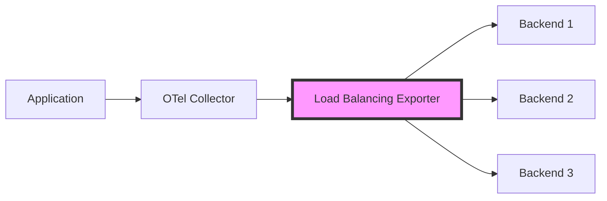

# How to Configure the Load Balancing Exporter in the OpenTelemetry Collector

Author: [nawazdhandala](https://www.github.com/nawazdhandala)

Tags: OpenTelemetry, Collector, Exporters, Load Balancing, Observability, Distributed Systems

Description: Learn how to configure the load balancing exporter in the OpenTelemetry Collector to distribute telemetry data across multiple backend endpoints for improved reliability and performance.

The OpenTelemetry Collector provides a load balancing exporter that distributes telemetry data across multiple backend endpoints. This capability is essential for high-availability deployments where you need to ensure that telemetry data continues flowing even if one backend becomes unavailable, and for distributing load to prevent overwhelming a single backend instance.

## Understanding the Load Balancing Exporter

The load balancing exporter acts as a proxy that sits between your collector pipeline and multiple downstream exporters or backend endpoints. It implements various load balancing strategies to distribute traces, metrics, and logs across available backends. The exporter performs health checks on backend endpoints and automatically routes traffic away from unhealthy instances.

This exporter is particularly useful when you have multiple instances of the same backend service and want to distribute the load evenly. For example, if you run multiple instances of Jaeger, Prometheus, or a custom observability backend, the load balancing exporter ensures that no single instance becomes a bottleneck.



## Load Balancing Strategies

The load balancing exporter supports several strategies for distributing telemetry data:

**Round Robin**: Distributes requests evenly across all available backends in a circular order. Each backend receives approximately the same number of requests over time.

**Random**: Randomly selects a backend for each request. This provides good distribution without maintaining state about which backend was last used.

**Trace ID Hashing**: Uses the trace ID to consistently route all spans from the same trace to the same backend. This is critical for distributed tracing systems that need to see complete traces on a single backend instance.

## Basic Configuration

Here is a basic configuration for the load balancing exporter that distributes traces across three OTLP endpoints:

```yaml
receivers:
  otlp:
    protocols:
      grpc:
        endpoint: 0.0.0.0:4317
      http:
        endpoint: 0.0.0.0:4318

processors:
  batch:
    timeout: 10s
    send_batch_size: 1024

exporters:
  # Define the load balancing exporter
  loadbalancing:
    protocol:
      otlp:
        # Timeout for sending data to backends
        timeout: 10s
        # Use insecure connection (for development only)
        insecure: true
    resolver:
      # Static resolver with predefined endpoints
      static:
        hostnames:
          - backend-1.example.com:4317
          - backend-2.example.com:4317
          - backend-3.example.com:4317
    # Routing key determines how data is distributed
    routing_key: "traceID"

service:
  pipelines:
    traces:
      receivers: [otlp]
      processors: [batch]
      exporters: [loadbalancing]
```

In this configuration, the load balancing exporter uses trace ID hashing to ensure that all spans belonging to the same trace are sent to the same backend endpoint. This is important because distributed tracing backends need to assemble complete traces from individual spans.

## Advanced Configuration with DNS Resolution

For dynamic environments where backend endpoints may change, you can use DNS-based service discovery instead of static hostnames:

```yaml
exporters:
  loadbalancing:
    protocol:
      otlp:
        timeout: 10s
        # Enable TLS for secure communication
        tls:
          insecure: false
          ca_file: /etc/ssl/certs/ca.pem
          cert_file: /etc/ssl/certs/client.pem
          key_file: /etc/ssl/private/client-key.pem
    resolver:
      # DNS resolver for dynamic service discovery
      dns:
        # Hostname that resolves to multiple A records
        hostname: "otlp-backends.example.com"
        # Port to use for all resolved addresses
        port: 4317
        # Interval for refreshing DNS records
        interval: 30s
        # Timeout for DNS queries
        timeout: 5s
    # Use service routing for metrics and logs
    routing_key: "service"

service:
  pipelines:
    traces:
      receivers: [otlp]
      processors: [batch]
      exporters: [loadbalancing]
```

The DNS resolver periodically queries the configured hostname and updates the list of available backend endpoints. This works well with Kubernetes services, AWS ELB, or any DNS-based service discovery mechanism. When the DNS records change, the load balancer automatically picks up the new endpoints without requiring a collector restart.

## Configuring Multiple Pipelines

You can configure different load balancing strategies for different signal types. For example, use trace ID hashing for traces and service-based routing for metrics:

```yaml
receivers:
  otlp:
    protocols:
      grpc:
        endpoint: 0.0.0.0:4317

processors:
  batch:
    timeout: 10s

exporters:
  # Load balancer for traces using trace ID routing
  loadbalancing/traces:
    protocol:
      otlp:
        timeout: 10s
        insecure: true
    resolver:
      static:
        hostnames:
          - trace-backend-1.example.com:4317
          - trace-backend-2.example.com:4317
    routing_key: "traceID"

  # Load balancer for metrics using service routing
  loadbalancing/metrics:
    protocol:
      otlp:
        timeout: 10s
        insecure: true
    resolver:
      static:
        hostnames:
          - metrics-backend-1.example.com:4317
          - metrics-backend-2.example.com:4317
    routing_key: "service"

service:
  pipelines:
    traces:
      receivers: [otlp]
      processors: [batch]
      exporters: [loadbalancing/traces]
    metrics:
      receivers: [otlp]
      processors: [batch]
      exporters: [loadbalancing/metrics]
```

This configuration creates separate load balancing exporters for traces and metrics, each with its own routing strategy and backend endpoints. The routing key for metrics uses the service name, which ensures that all metrics from the same service go to the same backend, making it easier to correlate metrics per service.

## Health Checking and Failover

The load balancing exporter automatically performs health checks on backend endpoints. When a backend becomes unhealthy, the exporter stops routing traffic to it until it recovers:

```yaml
exporters:
  loadbalancing:
    protocol:
      otlp:
        timeout: 10s
        insecure: false
        # Configure keepalive for connection health
        keepalive:
          time: 30s
          timeout: 10s
          permit_without_stream: true
        # Enable compression to reduce network usage
        compression: gzip
    resolver:
      dns:
        hostname: "otlp-backends.example.com"
        port: 4317
        interval: 30s
    routing_key: "traceID"
    # Configure health check behavior
    health_check:
      # Enable health checking
      enabled: true
      # Interval between health checks
      interval: 15s
      # Timeout for health check requests
      timeout: 5s

service:
  pipelines:
    traces:
      receivers: [otlp]
      processors: [batch]
      exporters: [loadbalancing]
```

Health checks ensure that the load balancer only sends data to healthy backends. If a backend fails its health check, it is temporarily removed from the rotation. The load balancer continues checking the unhealthy backend and automatically adds it back when it recovers.

## Kubernetes Deployment Example

When deploying the OpenTelemetry Collector in Kubernetes with load balancing, you can leverage Kubernetes services for endpoint discovery:

```yaml
exporters:
  loadbalancing:
    protocol:
      otlp:
        timeout: 10s
        insecure: false
        tls:
          insecure_skip_verify: false
    resolver:
      # Use Kubernetes headless service for endpoint discovery
      dns:
        hostname: "otlp-backend-headless.observability.svc.cluster.local"
        port: 4317
        interval: 30s
    routing_key: "traceID"

service:
  pipelines:
    traces:
      receivers: [otlp]
      processors: [batch]
      exporters: [loadbalancing]
```

A Kubernetes headless service returns all pod IPs for the service, allowing the load balancer to distribute traffic directly to individual backend pods rather than going through the Kubernetes service proxy. This reduces latency and provides more control over load distribution.

## Monitoring Load Balancer Performance

The load balancing exporter exposes metrics that help you monitor its performance and health. You should monitor these key metrics:

- Backend connection status and health check results
- Request distribution across backends
- Failed requests per backend
- Response times per backend

Configure the Prometheus exporter to expose these metrics:

```yaml
receivers:
  otlp:
    protocols:
      grpc:
        endpoint: 0.0.0.0:4317

processors:
  batch:
    timeout: 10s

exporters:
  loadbalancing:
    protocol:
      otlp:
        timeout: 10s
        insecure: true
    resolver:
      static:
        hostnames:
          - backend-1.example.com:4317
          - backend-2.example.com:4317
    routing_key: "traceID"

  # Export collector metrics to Prometheus
  prometheus:
    endpoint: "0.0.0.0:8888"

service:
  pipelines:
    traces:
      receivers: [otlp]
      processors: [batch]
      exporters: [loadbalancing]
  # Enable telemetry pipeline for collector metrics
  telemetry:
    metrics:
      address: ":8888"
```

## Best Practices

When configuring the load balancing exporter, follow these best practices:

**Choose the Right Routing Key**: Use trace ID routing for traces to keep traces together, and service or resource routing for metrics and logs to enable easier querying and aggregation.

**Configure Appropriate Timeouts**: Set timeouts that balance responsiveness with reliability. Too short and you may see false failures; too long and you will delay error detection.

**Use DNS Resolution in Dynamic Environments**: For cloud-native deployments where backends scale up and down, use DNS-based resolution to automatically discover new endpoints.

**Enable Health Checks**: Always enable health checks to ensure that the load balancer can detect and route around failed backends.

**Monitor Backend Performance**: Track metrics for each backend to identify performance issues or imbalances in load distribution.

**Secure Backend Connections**: Use TLS for connections between the collector and backends, especially in production environments.

## Integration with Other Exporters

The load balancing exporter works with various protocol exporters including OTLP, Jaeger, and Zipkin. For more information on configuring other exporters, see our related posts on [configuring OTLP exporters](https://oneuptime.com/blog/post/2026-02-06-otlp-grpc-exporter-opentelemetry-collector/view) and [understanding OpenTelemetry Collector pipelines](https://oneuptime.com/blog/post/2026-01-07-opentelemetry-collector-pipelines/view).

## Conclusion

The load balancing exporter is a powerful tool for building resilient and scalable observability pipelines. By distributing telemetry data across multiple backends, you can improve system reliability, prevent backend overload, and ensure continuous data flow even during partial failures. The exporter's support for multiple routing strategies, health checking, and dynamic service discovery makes it suitable for both static and cloud-native deployment environments.

Configure the load balancing exporter based on your specific needs, choosing appropriate routing keys for different signal types and enabling health checks to maintain system reliability. With proper configuration and monitoring, the load balancing exporter helps you build robust observability infrastructure that scales with your applications.
