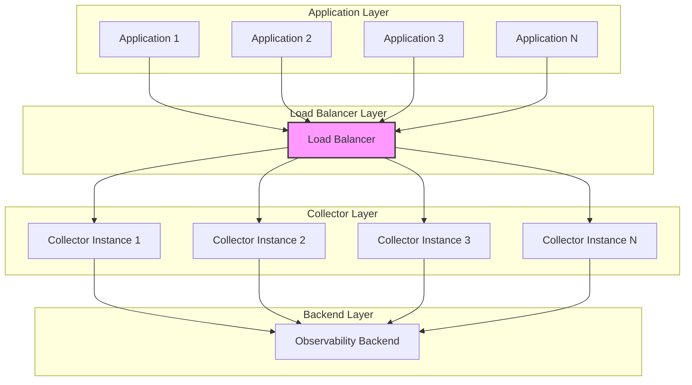

# How to Set Up Load Balancing Across Multiple Collector Instances

Author: [nawazdhandala](https://www.github.com/nawazdhandala)

Tags: OpenTelemetry, Collector, Load Balancing, Scaling, High Availability, Architecture

Description: Learn how to distribute telemetry traffic across multiple OpenTelemetry Collector instances using various load balancing strategies for high availability and scalability.

Running multiple OpenTelemetry Collector instances is essential for high-availability and high-throughput deployments. However, multiple instances are only effective when traffic is properly distributed across them. This is where load balancing becomes critical.

This comprehensive guide explores different load balancing approaches for OpenTelemetry Collector, from simple round-robin distribution to sophisticated trace-aware routing, helping you build scalable and reliable telemetry pipelines.

## Why Load Balance OpenTelemetry Collectors

Load balancing collector instances provides several key benefits:

**High Availability**: If one collector fails, traffic automatically routes to healthy instances, preventing data loss and maintaining service continuity.

**Horizontal Scalability**: Add more collector instances to handle increased telemetry volume without hitting single-instance resource limits.

**Resource Optimization**: Distribute CPU, memory, and network load evenly across instances for efficient resource utilization.

**Zero-Downtime Updates**: Deploy new collector versions by gradually shifting traffic to updated instances without interrupting telemetry collection.

**Geographic Distribution**: Deploy collectors closer to data sources to reduce latency and network costs.

## Load Balancing Architecture Overview

A typical load-balanced collector deployment consists of multiple layers:



## Load Balancing Strategies

Different load balancing strategies suit different use cases:

### Round Robin

Distributes requests evenly across all instances in sequence.

**Pros**: Simple, ensures even distribution
**Cons**: Doesn't account for instance load or connection state
**Best for**: Stateless workloads with uniform request sizes

### Least Connections

Routes to the instance with fewest active connections.

**Pros**: Accounts for connection state, good for long-lived connections
**Cons**: More complex, requires connection tracking
**Best for**: gRPC connections, HTTP/2 with connection reuse

### Consistent Hashing

Routes requests based on a hash of request properties (e.g., trace ID).

**Pros**: Ensures related requests go to same instance, enables stateful processing
**Cons**: Uneven distribution if hash space isn't uniform
**Best for**: Tail-based sampling, trace aggregation

### Random

Selects a random instance for each request.

**Pros**: Simple, decent distribution over time
**Cons**: Can be uneven in short time windows
**Best for**: High-volume stateless workloads

## Kubernetes Service Load Balancing

The simplest approach in Kubernetes is using a Service resource with multiple collector pods:

```yaml
apiVersion: v1
kind: Service
metadata:
  name: otel-collector
  namespace: observability
  labels:
    app: otel-collector
spec:
  type: ClusterIP
  selector:
    app: otel-collector
  ports:
  - name: otlp-grpc
    port: 4317
    targetPort: 4317
    protocol: TCP
  - name: otlp-http
    port: 4318
    targetPort: 4318
    protocol: TCP
  - name: metrics
    port: 8888
    targetPort: 8888
    protocol: TCP

  # Session affinity for gRPC connection reuse
  sessionAffinity: ClientIP
  sessionAffinityConfig:
    clientIP:
      # Keep connections to same pod for 3 hours
      timeoutSeconds: 10800
---
apiVersion: apps/v1
kind: Deployment
metadata:
  name: otel-collector
  namespace: observability
spec:
  # Multiple replicas for load distribution
  replicas: 5
  selector:
    matchLabels:
      app: otel-collector
  template:
    metadata:
      labels:
        app: otel-collector
    spec:
      containers:
      - name: otel-collector
        image: otel/opentelemetry-collector-contrib:latest
        resources:
          requests:
            cpu: 2000m
            memory: 4Gi
          limits:
            cpu: 4000m
            memory: 8Gi
        ports:
        - containerPort: 4317
          name: otlp-grpc
          protocol: TCP
        - containerPort: 4318
          name: otlp-http
          protocol: TCP
        volumeMounts:
        - name: config
          mountPath: /etc/otel
        livenessProbe:
          httpGet:
            path: /
            port: 13133
          initialDelaySeconds: 30
          periodSeconds: 10
        readinessProbe:
          httpGet:
            path: /
            port: 13133
          initialDelaySeconds: 5
          periodSeconds: 5
      volumes:
      - name: config
        configMap:
          name: otel-collector-config
```

Applications send data to `otel-collector.observability.svc.cluster.local:4317`, and Kubernetes automatically distributes connections across collector pods.

## NGINX Load Balancer

For bare-metal or VM deployments, use NGINX as a load balancer:

```nginx
# /etc/nginx/nginx.conf

# Define upstream collector instances
upstream otel_collectors_grpc {
    # Least connections algorithm for gRPC
    least_conn;

    # Collector instances
    server collector1.internal:4317 max_fails=3 fail_timeout=30s weight=1;
    server collector2.internal:4317 max_fails=3 fail_timeout=30s weight=1;
    server collector3.internal:4317 max_fails=3 fail_timeout=30s weight=1;
    server collector4.internal:4317 max_fails=3 fail_timeout=30s weight=1;
    server collector5.internal:4317 max_fails=3 fail_timeout=30s weight=1;

    # Keepalive connections improve performance
    keepalive 100;
    keepalive_requests 1000;
    keepalive_timeout 60s;
}

upstream otel_collectors_http {
    least_conn;

    server collector1.internal:4318 max_fails=3 fail_timeout=30s;
    server collector2.internal:4318 max_fails=3 fail_timeout=30s;
    server collector3.internal:4318 max_fails=3 fail_timeout=30s;
    server collector4.internal:4318 max_fails=3 fail_timeout=30s;
    server collector5.internal:4318 max_fails=3 fail_timeout=30s;

    keepalive 100;
}

# gRPC load balancer
server {
    listen 4317 http2;
    server_name otel-lb.example.com;

    # Enable gRPC
    grpc_pass grpc://otel_collectors_grpc;

    # Retry on failures
    grpc_next_upstream error timeout http_500 http_502 http_503 http_504;
    grpc_next_upstream_tries 2;
    grpc_next_upstream_timeout 10s;

    # Timeouts
    grpc_connect_timeout 5s;
    grpc_send_timeout 60s;
    grpc_read_timeout 60s;

    # Buffer settings
    grpc_buffer_size 4k;

    # Logging
    access_log /var/log/nginx/otel-grpc-access.log;
    error_log /var/log/nginx/otel-grpc-error.log warn;
}

# HTTP load balancer
server {
    listen 4318;
    server_name otel-lb.example.com;

    location / {
        proxy_pass http://otel_collectors_http;

        # Connection settings
        proxy_http_version 1.1;
        proxy_set_header Connection "";

        # Retry on failures
        proxy_next_upstream error timeout http_500 http_502 http_503 http_504;
        proxy_next_upstream_tries 2;
        proxy_next_upstream_timeout 10s;

        # Timeouts
        proxy_connect_timeout 5s;
        proxy_send_timeout 60s;
        proxy_read_timeout 60s;

        # Headers
        proxy_set_header Host $host;
        proxy_set_header X-Real-IP $remote_addr;
        proxy_set_header X-Forwarded-For $proxy_add_x_forwarded_for;

        # Logging
        access_log /var/log/nginx/otel-http-access.log;
        error_log /var/log/nginx/otel-http-error.log warn;
    }
}

# Health check endpoint for load balancer monitoring
server {
    listen 8080;

    location /health {
        access_log off;
        return 200 "healthy\n";
        add_header Content-Type text/plain;
    }
}
```

This configuration provides:
- Health checking with automatic removal of failed instances
- Connection keepalive for performance
- Automatic retry on failures
- Separate handling for gRPC and HTTP protocols

## HAProxy Load Balancer

HAProxy is another excellent choice for load balancing collectors:

```haproxy
# /etc/haproxy/haproxy.cfg

global
    log /dev/log local0
    log /dev/log local1 notice
    maxconn 10000
    daemon

defaults
    log global
    mode tcp
    option tcplog
    option dontlognull
    timeout connect 5s
    timeout client 60s
    timeout server 60s
    timeout check 5s

# Frontend for OTLP gRPC
frontend otel_grpc_frontend
    bind *:4317
    mode tcp
    default_backend otel_grpc_backend

# Backend for OTLP gRPC
backend otel_grpc_backend
    mode tcp
    balance leastconn

    # Health check
    option tcp-check

    # Collector instances
    server collector1 collector1.internal:4317 check inter 5s rise 2 fall 3 maxconn 1000
    server collector2 collector2.internal:4317 check inter 5s rise 2 fall 3 maxconn 1000
    server collector3 collector3.internal:4317 check inter 5s rise 2 fall 3 maxconn 1000
    server collector4 collector4.internal:4317 check inter 5s rise 2 fall 3 maxconn 1000
    server collector5 collector5.internal:4317 check inter 5s rise 2 fall 3 maxconn 1000

# Frontend for OTLP HTTP
frontend otel_http_frontend
    bind *:4318
    mode http
    default_backend otel_http_backend

# Backend for OTLP HTTP
backend otel_http_backend
    mode http
    balance leastconn

    # Health check
    option httpchk GET /
    http-check expect status 200

    # HTTP keepalive
    option http-server-close
    option forwardfor

    # Collector instances
    server collector1 collector1.internal:4318 check port 13133 inter 5s rise 2 fall 3
    server collector2 collector2.internal:4318 check port 13133 inter 5s rise 2 fall 3
    server collector3 collector3.internal:4318 check port 13133 inter 5s rise 2 fall 3
    server collector4 collector4.internal:4318 check port 13133 inter 5s rise 2 fall 3
    server collector5 collector5.internal:4318 check port 13133 inter 5s rise 2 fall 3

# Stats interface for monitoring
listen stats
    bind *:8404
    mode http
    stats enable
    stats uri /stats
    stats refresh 30s
    stats show-node
    stats show-legends
```

HAProxy provides robust health checking and a built-in stats interface for monitoring.

## AWS Application Load Balancer (ALB)

For AWS deployments, use Application Load Balancer for HTTP traffic:

```yaml
# Terraform configuration for ALB
resource "aws_lb" "otel_collector" {
  name               = "otel-collector-alb"
  internal           = true
  load_balancer_type = "application"
  security_groups    = [aws_security_group.otel_lb.id]
  subnets           = var.private_subnet_ids

  enable_deletion_protection = true
  enable_http2              = true

  tags = {
    Name        = "otel-collector-alb"
    Environment = "production"
  }
}

# Target group for OTLP HTTP
resource "aws_lb_target_group" "otel_http" {
  name     = "otel-collector-http"
  port     = 4318
  protocol = "HTTP"
  vpc_id   = var.vpc_id

  health_check {
    enabled             = true
    healthy_threshold   = 2
    unhealthy_threshold = 3
    timeout             = 5
    interval            = 30
    path                = "/"
    port                = "13133"
    protocol            = "HTTP"
    matcher             = "200"
  }

  deregistration_delay = 30

  stickiness {
    type            = "lb_cookie"
    cookie_duration = 3600
    enabled         = true
  }

  tags = {
    Name = "otel-collector-http"
  }
}

# Listener for OTLP HTTP
resource "aws_lb_listener" "otel_http" {
  load_balancer_arn = aws_lb.otel_collector.arn
  port              = 4318
  protocol          = "HTTP"

  default_action {
    type             = "forward"
    target_group_arn = aws_lb_target_group.otel_http.arn
  }
}

# Register collector instances
resource "aws_lb_target_group_attachment" "collectors" {
  count            = length(var.collector_instance_ids)
  target_group_arn = aws_lb_target_group.otel_http.arn
  target_id        = var.collector_instance_ids[count.index]
  port             = 4318
}
```

## AWS Network Load Balancer (NLB) for gRPC

For gRPC traffic, use Network Load Balancer:

```yaml
# Terraform configuration for NLB
resource "aws_lb" "otel_collector_grpc" {
  name               = "otel-collector-nlb"
  internal           = true
  load_balancer_type = "network"
  subnets           = var.private_subnet_ids

  enable_deletion_protection = true
  enable_cross_zone_load_balancing = true

  tags = {
    Name        = "otel-collector-nlb"
    Environment = "production"
  }
}

# Target group for OTLP gRPC
resource "aws_lb_target_group" "otel_grpc" {
  name     = "otel-collector-grpc"
  port     = 4317
  protocol = "TCP"
  vpc_id   = var.vpc_id

  health_check {
    enabled             = true
    healthy_threshold   = 2
    unhealthy_threshold = 3
    timeout             = 5
    interval            = 30
    port                = "13133"
    protocol            = "HTTP"
    path                = "/"
  }

  deregistration_delay = 30

  tags = {
    Name = "otel-collector-grpc"
  }
}

# Listener for OTLP gRPC
resource "aws_lb_listener" "otel_grpc" {
  load_balancer_arn = aws_lb.otel_collector_grpc.arn
  port              = 4317
  protocol          = "TCP"

  default_action {
    type             = "forward"
    target_group_arn = aws_lb_target_group.otel_grpc.arn
  }
}
```

## Trace-Aware Load Balancing with Load Balancing Exporter

For tail-based sampling and stateful processing, use the load balancing exporter to route complete traces to the same collector instance:

```yaml
# First-tier collectors (agents): route by trace ID
receivers:
  otlp:
    protocols:
      grpc:
        endpoint: 0.0.0.0:4317

processors:
  batch:
    timeout: 5s
    send_batch_size: 4096

exporters:
  # Load balancing exporter with trace-aware routing
  loadbalancing:
    protocol:
      otlp:
        # Don't use TLS for internal communication
        tls:
          insecure: true
        # Short timeout for low latency
        timeout: 5s

    resolver:
      # Use static list of gateway collectors
      static:
        hostnames:
          - gateway-collector-0.otel-gateway.observability.svc.cluster.local:4317
          - gateway-collector-1.otel-gateway.observability.svc.cluster.local:4317
          - gateway-collector-2.otel-gateway.observability.svc.cluster.local:4317
          - gateway-collector-3.otel-gateway.observability.svc.cluster.local:4317
          - gateway-collector-4.otel-gateway.observability.svc.cluster.local:4317

      # Or use DNS for dynamic discovery
      # dns:
      #   hostname: otel-gateway.observability.svc.cluster.local
      #   port: 4317

    # Route by trace ID for consistent hashing
    routing_key: "traceID"

service:
  pipelines:
    traces:
      receivers: [otlp]
      processors: [batch]
      exporters: [loadbalancing]
```

Gateway collectors receive complete traces and perform tail-based sampling:

```yaml
# Gateway collectors: process complete traces
receivers:
  otlp:
    protocols:
      grpc:
        endpoint: 0.0.0.0:4317

processors:
  batch:
    timeout: 10s
    send_batch_size: 8192

  # Tail-based sampling requires complete traces
  tail_sampling:
    decision_wait: 30s
    num_traces: 100000
    expected_new_traces_per_sec: 1000
    policies:
      - name: error-traces
        type: status_code
        status_code:
          status_codes: [ERROR]
      - name: slow-traces
        type: latency
        latency:
          threshold_ms: 1000
      - name: probabilistic
        type: probabilistic
        probabilistic:
          sampling_percentage: 5

exporters:
  otlp/backend:
    endpoint: backend.example.com:4317

service:
  pipelines:
    traces:
      receivers: [otlp]
      processors: [tail_sampling, batch]
      exporters: [otlp/backend]
```

This architecture ensures that all spans from a trace reach the same gateway collector for accurate sampling decisions.

## DNS-Based Load Balancing

Use DNS with multiple A records for simple client-side load balancing:

```bash
# DNS configuration (BIND format)
otel-collector.example.com.  300  IN  A  10.0.1.10
otel-collector.example.com.  300  IN  A  10.0.1.11
otel-collector.example.com.  300  IN  A  10.0.1.12
otel-collector.example.com.  300  IN  A  10.0.1.13
otel-collector.example.com.  300  IN  A  10.0.1.14
```

Clients resolve the DNS name and connect to one of the returned IPs. Most gRPC clients automatically distribute connections across all resolved addresses.

**Pros**: Simple, no additional infrastructure
**Cons**: No health checking, clients must support DNS load balancing, long DNS cache times can delay traffic redistribution

## Service Mesh Load Balancing (Istio)

In environments using a service mesh like Istio, configure destination rules for advanced load balancing:

```yaml
apiVersion: networking.istio.io/v1beta1
kind: DestinationRule
metadata:
  name: otel-collector
  namespace: observability
spec:
  host: otel-collector.observability.svc.cluster.local
  trafficPolicy:
    # Load balancing algorithm
    loadBalancer:
      consistentHash:
        # Hash based on source IP for session affinity
        useSourceIp: true

      # Or use least request load balancing
      # simple: LEAST_REQUEST

    # Connection pool settings
    connectionPool:
      tcp:
        maxConnections: 100
        connectTimeout: 5s
        tcpKeepalive:
          time: 7200s
          interval: 75s
      http:
        http2MaxRequests: 1000
        maxRequestsPerConnection: 100

    # Circuit breaker
    outlierDetection:
      consecutiveErrors: 5
      interval: 30s
      baseEjectionTime: 30s
      maxEjectionPercent: 50
      minHealthPercent: 50
```

Service mesh provides sophisticated traffic management with circuit breaking, retry policies, and automatic health checking.

## Client-Side Load Balancing

Configure OpenTelemetry SDKs to distribute traffic across multiple collector endpoints:

```go
// Go SDK example with multiple collector endpoints
package main

import (
    "context"
    "math/rand"
    "time"

    "go.opentelemetry.io/otel"
    "go.opentelemetry.io/otel/exporters/otlp/otlptrace/otlptracegrpc"
    "go.opentelemetry.io/otel/sdk/trace"
    "google.golang.org/grpc"
    "google.golang.org/grpc/balancer/roundrobin"
)

func main() {
    // Multiple collector endpoints
    collectorEndpoints := []string{
        "collector1.example.com:4317",
        "collector2.example.com:4317",
        "collector3.example.com:4317",
    }

    // Select random endpoint (client-side load balancing)
    endpoint := collectorEndpoints[rand.Intn(len(collectorEndpoints))]

    // Or use gRPC's built-in load balancing with DNS
    // endpoint := "dns:///otel-collector.example.com:4317"

    exporter, err := otlptracegrpc.New(
        context.Background(),
        otlptracegrpc.WithEndpoint(endpoint),
        otlptracegrpc.WithInsecure(),
        // Enable gRPC load balancing
        otlptracegrpc.WithDialOption(
            grpc.WithDefaultServiceConfig(`{"loadBalancingPolicy":"round_robin"}`),
        ),
    )
    if err != nil {
        panic(err)
    }

    tp := trace.NewTracerProvider(
        trace.WithBatcher(exporter),
    )
    otel.SetTracerProvider(tp)

    // Your application code here
}
```

## Monitoring Load Balancer Health

Track these metrics to ensure proper load distribution:

```promql
# Request rate per collector instance
sum by (instance) (rate(otelcol_receiver_accepted_spans[5m]))

# Check if load is evenly distributed (coefficient of variation)
stddev(rate(otelcol_receiver_accepted_spans[5m])) /
avg(rate(otelcol_receiver_accepted_spans[5m]))

# Connection count per instance (if available from load balancer)
haproxy_backend_current_sessions{backend="otel_grpc_backend"}

# Health check failures
haproxy_backend_check_failures_total{backend="otel_grpc_backend"}
```

Alert on uneven distribution:

```yaml
groups:
  - name: otel_load_balancing
    rules:
      - alert: UnevenCollectorLoad
        expr: |
          (stddev(rate(otelcol_receiver_accepted_spans[5m])) /
           avg(rate(otelcol_receiver_accepted_spans[5m]))) > 0.5
        for: 15m
        labels:
          severity: warning
        annotations:
          summary: "Uneven load distribution across collectors"
          description: "Collector load has high variance, check load balancer"
```

## Load Balancing Decision Matrix

Choose the right load balancing approach based on your requirements:

| Requirement | Recommended Approach |
|------------|---------------------|
| Kubernetes deployment | Kubernetes Service |
| Bare metal / VMs | NGINX or HAProxy |
| AWS cloud | ALB (HTTP) + NLB (gRPC) |
| Tail-based sampling | Load balancing exporter with traceID routing |
| Service mesh | Istio DestinationRule |
| Simple deployment | DNS-based load balancing |
| Client control | Client-side load balancing in SDKs |

## Complete Load-Balanced Architecture

Here's a production-ready architecture with multiple load balancing layers:

```yaml
# Agent collectors on each node (DaemonSet)
apiVersion: apps/v1
kind: DaemonSet
metadata:
  name: otel-agent
  namespace: observability
spec:
  selector:
    matchLabels:
      app: otel-agent
  template:
    metadata:
      labels:
        app: otel-agent
    spec:
      containers:
      - name: otel-agent
        image: otel/opentelemetry-collector-contrib:latest
        resources:
          requests:
            cpu: 500m
            memory: 512Mi
          limits:
            cpu: 1000m
            memory: 1Gi
---
# Gateway collectors with load balancing (StatefulSet)
apiVersion: v1
kind: Service
metadata:
  name: otel-gateway
  namespace: observability
spec:
  clusterIP: None  # Headless for StatefulSet
  selector:
    app: otel-gateway
  ports:
  - name: otlp-grpc
    port: 4317
---
apiVersion: apps/v1
kind: StatefulSet
metadata:
  name: otel-gateway
  namespace: observability
spec:
  serviceName: otel-gateway
  replicas: 5
  selector:
    matchLabels:
      app: otel-gateway
  template:
    metadata:
      labels:
        app: otel-gateway
    spec:
      containers:
      - name: otel-gateway
        image: otel/opentelemetry-collector-contrib:latest
        resources:
          requests:
            cpu: 2000m
            memory: 4Gi
          limits:
            cpu: 4000m
            memory: 8Gi
---
# Public-facing Service with load balancing
apiVersion: v1
kind: Service
metadata:
  name: otel-collector-lb
  namespace: observability
spec:
  type: LoadBalancer
  selector:
    app: otel-gateway
  ports:
  - name: otlp-grpc
    port: 4317
    targetPort: 4317
  - name: otlp-http
    port: 4318
    targetPort: 4318
  sessionAffinity: ClientIP
  sessionAffinityConfig:
    clientIP:
      timeoutSeconds: 10800
```

## Related Resources

For more information on scaling and monitoring your OpenTelemetry Collector deployment:

- [How to Scale the OpenTelemetry Collector for High-Throughput Environments](https://oneuptime.com/blog/post/scale-opentelemetry-collector-high-throughput/view)
- [How to Monitor the Collector with Its Internal Metrics](https://oneuptime.com/blog/post/monitor-collector-internal-metrics/view)
- [How to Configure Sending Queues and Retry Logic in the Collector](https://oneuptime.com/blog/post/configure-sending-queues-retry-logic-collector/view)
- [How to Tune Batch Processor Settings for Optimal Collector Performance](https://oneuptime.com/blog/post/tune-batch-processor-optimal-collector-performance/view)

Proper load balancing is essential for building scalable and reliable telemetry pipelines with OpenTelemetry Collector. By choosing the right load balancing strategy for your infrastructure and monitoring distribution effectiveness, you can ensure high availability and optimal resource utilization across your collector fleet. Whether you're using simple round-robin distribution or sophisticated trace-aware routing, the techniques covered in this guide will help you build production-ready observability infrastructure.
