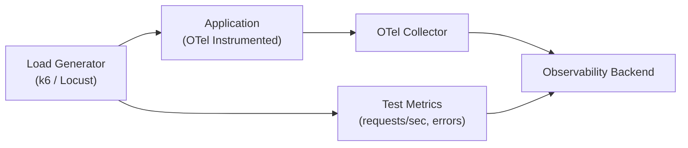
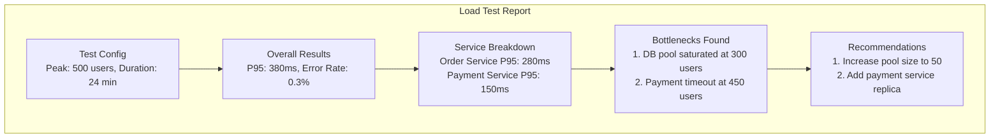

# How to Use OpenTelemetry for Load Testing Observability

Author: [nawazdhandala](https://www.github.com/nawazdhandala)

Tags: OpenTelemetry, Load Testing, Performance, Observability, Metrics, Tracing, k6, Locust

Description: Learn how to combine OpenTelemetry with load testing tools to get deep visibility into system behavior under stress, identifying bottlenecks before they hit production.

---

Load testing without observability is like driving with your eyes closed. You know the car is moving, and you will definitely find out when you hit something. The test might tell you that throughput dropped and latency spiked at 500 concurrent users, but it will not tell you why.

When you instrument your system with OpenTelemetry and then run load tests against it, you get a completely different level of insight. You can see exactly which service became the bottleneck, which database query started timing out, which connection pool ran dry, and which downstream dependency started rate-limiting you. This turns load testing from a pass/fail exercise into a detailed performance analysis.

---

## Architecture



The load generator sends traffic to your instrumented application. OpenTelemetry captures the internal behavior of your application under load, and both the load test metrics and the application telemetry flow into the same backend for correlated analysis.

---

## Tagging Load Test Traffic

The first thing you need is a way to distinguish load test traffic from real production traffic. Tag your test requests so the resulting traces and metrics can be filtered.

```python
# load_test_middleware.py
from opentelemetry import trace, context
from opentelemetry.baggage import set_baggage, get_baggage

def load_test_middleware(request, call_next):
    """
    Middleware that detects load test traffic and propagates
    that information through the entire trace via baggage.
    """
    # Check for a load test header
    is_load_test = request.headers.get("X-Load-Test", "false").lower() == "true"
    test_id = request.headers.get("X-Load-Test-ID", "unknown")

    if is_load_test:
        # Set baggage so all downstream services know this is a test
        ctx = set_baggage("load_test", "true")
        ctx = set_baggage("load_test_id", test_id, context=ctx)

        # Also set span attributes for filtering
        span = trace.get_current_span()
        span.set_attribute("test.load_test", True)
        span.set_attribute("test.load_test_id", test_id)

    response = call_next(request)
    return response
```

By using OpenTelemetry baggage, the load test flag propagates automatically through all downstream service calls. Every span in the trace gets tagged, which means you can filter your dashboards to show only load test traffic or exclude it from production metrics.

---

## Instrumenting Your Load Test with k6

k6 is a popular load testing tool that can export metrics to OpenTelemetry. Here is how to set up a load test that sends custom headers and exports test metrics.

```javascript
// load_test.js - k6 load test script
import http from 'k6/http';
import { check, sleep } from 'k6';
import { Counter, Trend } from 'k6/metrics';

// Define custom k6 metrics that will be exported
const orderLatency = new Trend('order_creation_latency');
const orderErrors = new Counter('order_creation_errors');

// Test configuration with ramping stages
export const options = {
  stages: [
    { duration: '2m', target: 50 },    // Ramp up to 50 users
    { duration: '5m', target: 50 },    // Hold at 50 users
    { duration: '2m', target: 200 },   // Ramp up to 200 users
    { duration: '5m', target: 200 },   // Hold at 200 users
    { duration: '2m', target: 500 },   // Ramp up to 500 users
    { duration: '5m', target: 500 },   // Hold at 500 users
    { duration: '3m', target: 0 },     // Ramp down
  ],
  thresholds: {
    // Fail the test if P95 latency exceeds 500ms
    'http_req_duration': ['p(95)<500'],
    // Fail if error rate exceeds 1%
    'http_req_failed': ['rate<0.01'],
  },
};

// Each virtual user runs this function repeatedly
export default function () {
  const testId = __ENV.TEST_ID || 'manual';

  // Headers that tag this as load test traffic
  const headers = {
    'Content-Type': 'application/json',
    'X-Load-Test': 'true',
    'X-Load-Test-ID': testId,
  };

  // Simulate a realistic user flow
  // Step 1: Browse products
  const products = http.get('https://api.example.com/products', { headers });
  check(products, { 'products loaded': (r) => r.status === 200 });

  sleep(1); // Think time between actions

  // Step 2: View a product
  const product = http.get('https://api.example.com/products/123', { headers });
  check(product, { 'product details loaded': (r) => r.status === 200 });

  sleep(0.5);

  // Step 3: Create an order (the critical path)
  const orderPayload = JSON.stringify({
    product_id: 123,
    quantity: 1,
  });

  const orderStart = Date.now();
  const order = http.post('https://api.example.com/orders', orderPayload, { headers });
  const orderDuration = Date.now() - orderStart;

  // Track order-specific metrics
  orderLatency.add(orderDuration);
  if (order.status !== 201) {
    orderErrors.add(1);
  }

  check(order, { 'order created': (r) => r.status === 201 });

  sleep(2);
}
```

This k6 script simulates a realistic user journey through your application, tagging every request as load test traffic. The staged ramp-up pattern lets you observe how your system behaves at different load levels.

---

## Capturing Bottleneck Metrics During Load Tests

During load tests, you want extra visibility into the resources that typically become bottlenecks. Add temporary high-resolution metrics for these.

```python
# load_test_metrics.py
from opentelemetry import metrics
import psutil
import threading
import time

meter = metrics.get_meter("load_test.bottlenecks")

# Connection pool saturation
pool_utilization = meter.create_observable_gauge(
    name="load_test.pool.utilization",
    description="Database connection pool utilization during load test",
    unit="percent",
    callbacks=[lambda options: [
        metrics.Observation(
            (engine.pool.checkedout() / engine.pool.size()) * 100,
            {"pool": "primary"},
        )
    ]],
)

# Thread pool saturation
thread_count = meter.create_observable_gauge(
    name="load_test.threads.active",
    description="Number of active threads during load test",
    unit="threads",
    callbacks=[lambda options: [
        metrics.Observation(threading.active_count())
    ]],
)

# Event loop lag (for async applications)
event_loop_lag = meter.create_histogram(
    name="load_test.event_loop.lag",
    description="Event loop processing delay",
    unit="ms",
)

# Garbage collection pressure
gc_collections = meter.create_observable_counter(
    name="load_test.gc.collections",
    description="Number of garbage collection runs",
    unit="collections",
    callbacks=[lambda options: [
        metrics.Observation(
            gc.get_stats()[generation]["collections"],
            {"generation": str(generation)},
        )
        for generation in range(3)
    ]],
)
```

These metrics are specifically chosen because they reveal the most common bottlenecks during load tests: connection pool exhaustion, thread starvation, event loop blocking, and garbage collection pressure.

---

## Analyzing Load Test Results with Traces

After a load test, your traces contain a wealth of information. Here is how to extract the most useful insights.

```python
# load_test_analysis.py
from collections import defaultdict

def analyze_load_test_traces(trace_client, test_id: str) -> dict:
    """
    Analyze traces from a load test to identify bottlenecks
    and performance degradation patterns.
    """
    # Fetch all traces tagged with the load test ID
    traces = trace_client.query_traces(
        attributes={"test.load_test_id": test_id},
    )

    # Analyze latency distribution by service
    service_latencies = defaultdict(list)
    slow_operations = []

    for trace_data in traces:
        for span in trace_data:
            service = span.get("resource", {}).get("service.name", "unknown")
            duration_ms = span.get("duration_ns", 0) / 1_000_000

            service_latencies[service].append(duration_ms)

            # Collect slow operations for investigation
            if duration_ms > 500:
                slow_operations.append({
                    "service": service,
                    "operation": span.get("name"),
                    "duration_ms": duration_ms,
                    "trace_id": span.get("trace_id"),
                    "attributes": span.get("attributes", {}),
                })

    # Calculate per-service statistics
    service_stats = {}
    for service, latencies in service_latencies.items():
        import numpy as np
        arr = np.array(latencies)
        service_stats[service] = {
            "p50": float(np.percentile(arr, 50)),
            "p95": float(np.percentile(arr, 95)),
            "p99": float(np.percentile(arr, 99)),
            "max": float(np.max(arr)),
            "count": len(latencies),
        }

    return {
        "service_stats": service_stats,
        "slow_operations": sorted(
            slow_operations, key=lambda x: x["duration_ms"], reverse=True
        )[:20],
        "total_traces": len(traces),
    }
```

This analysis function processes all traces from a load test to produce per-service latency statistics and a list of the slowest operations. The output tells you exactly which services degraded under load and which specific operations were responsible.

---

## Load Test Report Structure



---

## Summary

Load testing with OpenTelemetry observability transforms your performance testing practice. Instead of just knowing that your system breaks at a certain load level, you know exactly where it breaks and why. The combination of load test metrics (throughput, error rates, latency from the client perspective) with OpenTelemetry traces and metrics (internal service behavior, resource utilization, dependency performance) gives you everything you need to identify and fix bottlenecks before they affect real users. Run load tests regularly against your staging environment with full OpenTelemetry instrumentation, and make the analysis part of your release process.
