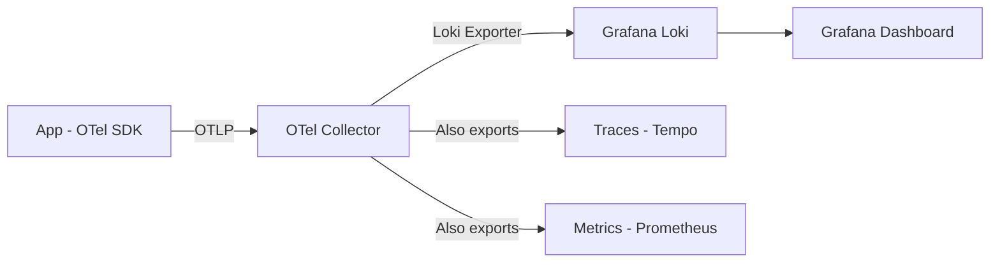

# How to Build a Log Analytics Dashboard from OpenTelemetry Log Signals in Grafana Loki

Author: [nawazdhandala](https://www.github.com/nawazdhandala)

Tags: OpenTelemetry, Grafana Loki, Log Analytics, Observability, Logging

Description: Build a log analytics dashboard in Grafana by shipping OpenTelemetry log signals to Loki with structured metadata.

OpenTelemetry added logs as a first-class signal alongside traces and metrics. This means you can now collect logs through the same pipeline you use for everything else - the OpenTelemetry Collector. Grafana Loki is a natural fit as the log storage backend because it indexes labels (not full text), keeping storage costs low while still allowing powerful queries through LogQL.

This post covers how to configure your applications to emit structured logs via OpenTelemetry, route them through the Collector into Loki, and build a Grafana dashboard that gives you real insight into your log data.

## Architecture Overview

The data flow is straightforward: applications emit logs via the OpenTelemetry SDK, the Collector receives them, processes and enriches them, and pushes them to Loki.



## Application-Side Log Instrumentation

Configure your application to emit structured logs through the OpenTelemetry logging bridge. Here is a Python example using the standard `logging` module wired into OTel.

```python
# logging_setup.py
import logging
from opentelemetry import trace
from opentelemetry._logs import set_logger_provider
from opentelemetry.sdk._logs import LoggerProvider, LoggingHandler
from opentelemetry.sdk._logs.export import BatchLogRecordProcessor
from opentelemetry.exporter.otlp.proto.grpc._log_exporter import OTLPLogExporter
from opentelemetry.sdk.resources import Resource

# Define the service resource
resource = Resource.create({
    "service.name": "order-service",
    "service.version": "1.4.2",
    "deployment.environment": "production",
})

# Set up the OTel log provider
logger_provider = LoggerProvider(resource=resource)
logger_provider.add_log_record_processor(
    BatchLogRecordProcessor(
        OTLPLogExporter(endpoint="http://otel-collector:4317", insecure=True)
    )
)
set_logger_provider(logger_provider)

# Attach the OTel handler to Python's standard logging
handler = LoggingHandler(level=logging.DEBUG, logger_provider=logger_provider)
logging.getLogger().addHandler(handler)

# Now standard logging calls automatically get shipped as OTel log records
logger = logging.getLogger("order-service")

def process_order(order_id, user_id):
    # These log messages will include trace context automatically
    # if there is an active span
    logger.info(
        "Processing order",
        extra={
            "order.id": order_id,
            "user.id": user_id,
            "order.total_items": 3,
        }
    )
```

## Collector Configuration with Loki Exporter

The Collector receives logs via OTLP and forwards them to Loki. The key configuration detail is mapping OpenTelemetry resource attributes and log attributes to Loki labels. Be selective - Loki performs best with a small number of high-cardinality labels.

```yaml
# otel-collector-loki.yaml
receivers:
  otlp:
    protocols:
      grpc:
        endpoint: 0.0.0.0:4317

processors:
  batch:
    timeout: 5s
    send_batch_size: 1024

  # Enrich logs with K8s metadata if running in Kubernetes
  k8sattributes:
    extract:
      metadata:
        - k8s.namespace.name
        - k8s.deployment.name
        - k8s.pod.name

  resource:
    attributes:
      # Add a static attribute for environment identification
      - key: cluster
        value: "us-east-prod"
        action: upsert

exporters:
  loki:
    endpoint: http://loki:3100/loki/api/v1/push
    # Map OTel attributes to Loki labels
    # Only promote low-cardinality attributes to labels
    default_labels_enabled:
      exporter: false
      job: true
    labels:
      attributes:
        severity: ""
        service.name: "service"
        deployment.environment: "env"
        k8s.namespace.name: "namespace"
      resource:
        cluster: ""

service:
  pipelines:
    logs:
      receivers: [otlp]
      processors: [k8sattributes, resource, batch]
      exporters: [loki]
```

## Grafana Dashboard Queries

With logs in Loki, use LogQL to build dashboard panels. Here are the queries for each panel.

Log volume over time, grouped by severity. This is your primary health indicator.

```logql
# Log volume by severity level over time
sum by (severity) (
  count_over_time({service="order-service"} [5m])
)
```

Error rate as a percentage of total logs. A spike here usually means something broke.

```logql
# Error rate percentage
sum(count_over_time({service="order-service", severity="ERROR"} [5m]))
/
sum(count_over_time({service="order-service"} [5m]))
* 100
```

Top error messages for quick triage. This shows which errors appear most frequently.

```logql
# Top 10 most frequent error messages
topk(10,
  sum by (body) (
    count_over_time({service="order-service", severity="ERROR"} [1h])
  )
)
```

Logs correlated with a specific trace. This is where the OTel integration shines - you can jump from a log line to the full distributed trace.

```logql
# Find all logs associated with a specific trace
{service="order-service"} | json | trace_id = "abc123def456"
```

## Dashboard Layout

Structure the Grafana dashboard with these panels:

**Row 1 - Overview**: Log volume time series (stacked by severity), error rate gauge, and a stat panel showing total log volume for the selected time range.

**Row 2 - Error Analysis**: A table of top error messages with counts, an error rate time series per service, and a panel showing new error patterns (errors that appeared for the first time in the last hour).

**Row 3 - Service Breakdown**: Log volume per service as a bar chart, p99 log line size (to catch services dumping huge payloads into logs), and a table of recent ERROR and FATAL log entries.

**Row 4 - Correlation**: A panel that shows logs alongside trace waterfall. Grafana supports this natively if you configure Loki and Tempo as linked data sources - clicking a log line with a `trace_id` opens the trace view.

## Linking Logs to Traces in Grafana

To enable the log-to-trace jump, configure Loki as a data source in Grafana with a derived field that links to Tempo.

```yaml
# Grafana datasource provisioning for Loki
apiVersion: 1
datasources:
  - name: Loki
    type: loki
    url: http://loki:3100
    jsonData:
      derivedFields:
        # Extract trace_id from log lines and link to Tempo
        - datasourceUid: tempo-datasource-uid
          matcherRegex: '"trace_id":"(\w+)"'
          name: TraceID
          url: "$${__value.raw}"
```

Once this is configured, every log line that contains a `trace_id` gets a clickable link in Grafana that opens the corresponding trace. This makes it trivial to go from "order-service is logging errors" to "here is the exact request that failed, across all services it touched."

## Retention and Cost Considerations

Loki's label-based indexing keeps storage costs manageable, but you should still configure retention policies. A common setup is to keep ERROR and FATAL logs for 90 days, WARNING for 30 days, and INFO/DEBUG for 7 days. You can implement this using Loki's per-tenant retention or by running separate Loki instances with different retention policies per severity label.
