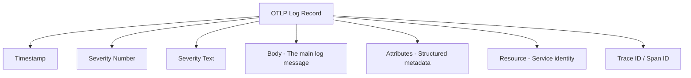

# How to Configure Log Body and Attribute Mapping in Log Collection

Author: [nawazdhandala](https://www.github.com/nawazdhandala)

Tags: OpenTelemetry, Logs, Collector, Log Parsing, Attribute Mapping, Observability, OTLP

Description: Learn how to configure OpenTelemetry log body parsing and attribute mapping to transform raw log data into structured, queryable telemetry.

---

Raw logs arrive at the OpenTelemetry Collector in all shapes and sizes. Some are structured JSON, some are plain text with embedded key-value pairs, and others follow framework-specific formats that need careful parsing. The Collector provides powerful operators for parsing log bodies, extracting attributes, and mapping fields to the OpenTelemetry log data model. Getting this mapping right is the difference between searchable, correlated logs and an opaque wall of text.

This guide covers the full lifecycle of log transformation: receiving raw logs, parsing their bodies, extracting attributes, and mapping everything to the right fields in the OTLP log record.

## The OpenTelemetry Log Data Model

Before diving into configuration, it helps to understand where data lives in an OTLP log record. The log data model has several distinct fields:



The **body** holds the main log message content. **Attributes** contain structured key-value metadata about the log event. **Resource** attributes describe the service or entity that produced the log. Getting your parsing right means putting the right data into the right field.

## Receiving and Parsing JSON Logs

JSON logs are the easiest to work with because they already have structure. The filelog receiver with a JSON parser extracts fields automatically:

```yaml
# Collecting JSON-formatted application logs
receivers:
  filelog/json:
    # Path to the log files to tail
    include:
      - /var/log/app/*.json
    # Start reading from the beginning of the file
    start_at: beginning
    operators:
      # Parse the entire log line as JSON
      - type: json_parser
        # The parsed JSON fields are placed into the log body as a map
        timestamp:
          # Extract timestamp from the JSON "ts" field
          parse_from: attributes.ts
          layout: "%Y-%m-%dT%H:%M:%S.%fZ"
        severity:
          # Map the JSON "level" field to OTLP severity
          parse_from: attributes.level
```

After the `json_parser` runs, each key from the JSON object becomes a log attribute. A log line like `{"ts": "2026-01-15T10:30:00Z", "level": "error", "msg": "connection refused", "host": "db-1"}` produces a log record with `msg`, `host`, `ts`, and `level` as attributes, with `ts` mapped to the OTLP timestamp and `level` mapped to severity.

## Moving Fields Between Body and Attributes

After initial parsing, you often need to reorganize where data lives. The `move` operator shifts fields between the body and attributes:

```yaml
receivers:
  filelog/structured:
    include:
      - /var/log/app/*.json
    operators:
      - type: json_parser

      # Move the "msg" attribute into the log body
      # This makes the message the primary body content
      - type: move
        from: attributes.msg
        to: body

      # Move request-specific fields into attributes for querying
      - type: move
        from: attributes.request_id
        to: attributes["request.id"]

      # Remove raw timestamp field since it was already parsed
      - type: remove
        field: attributes.ts
```

Moving the message field into the body follows OpenTelemetry's convention where the body contains the human-readable log message and attributes contain structured metadata. This matters for log viewers and query engines that treat the body as the primary display field.

## Parsing Unstructured Text Logs

Not all logs come as JSON. Legacy applications, system logs, and third-party software often produce plain text. The regex parser handles these cases:

```yaml
receivers:
  filelog/text:
    include:
      - /var/log/legacy-app/*.log
    operators:
      # Parse structured text logs with regex
      # Example format: 2026-01-15 10:30:00 ERROR [request-handler] Failed to process request id=abc123 duration=1.5s
      - type: regex_parser
        regex: '^(?P<timestamp>\d{4}-\d{2}-\d{2} \d{2}:\d{2}:\d{2}) (?P<severity>\w+) \[(?P<component>[^\]]+)\] (?P<message>.*)'
        timestamp:
          parse_from: attributes.timestamp
          layout: "%Y-%m-%d %H:%M:%S"
        severity:
          parse_from: attributes.severity

      # Move the captured message into the body
      - type: move
        from: attributes.message
        to: body

      # Parse key-value pairs from the message body
      # This extracts "id=abc123 duration=1.5s" into separate attributes
      - type: key_value_parser
        parse_from: body
        # Only extract key-value pairs, leave the rest of the body intact
        on_error: send
```

The regex parser uses named capture groups to extract fields. Each group name becomes an attribute key. After regex parsing, the `key_value_parser` digs into the message body to pull out embedded key-value pairs, giving you queryable attributes like `id` and `duration` that were originally buried in plain text.

## The Transform Processor for Advanced Mapping

When you need more complex transformations than the filelog operators provide, the `transform` processor gives you OTTL (OpenTelemetry Transformation Language) expressions:

```yaml
processors:
  transform/logs:
    log_statements:
      - context: log
        statements:
          # Set the body to a specific attribute value
          - set(body, attributes["message"]) where attributes["message"] != nil

          # Merge multiple fields into a structured body
          - set(attributes["http.method"], attributes["method"])
          - delete_key(attributes, "method")

          # Normalize severity text to uppercase
          - set(severity_text, ConvertCase(severity_text, "upper"))

          # Extract trace context from log attributes if present
          - set(trace_id.string, attributes["trace_id"]) where attributes["trace_id"] != nil
          - set(span_id.string, attributes["span_id"]) where attributes["span_id"] != nil

          # Clean up raw fields after extraction
          - delete_key(attributes, "trace_id")
          - delete_key(attributes, "span_id")

          # Add computed attributes
          - set(attributes["log.source"], "legacy-app") where resource.attributes["service.name"] == "legacy-service"
```

OTTL gives you conditional logic, string manipulation, and field-level control that simple parsers cannot match. The `where` clauses mean transformations only apply to matching log records, so you can handle multiple log formats in a single pipeline.

## Mapping Severity Levels

Different logging frameworks use different severity schemes. The severity mapping operator normalizes them to OTLP severity numbers:

```yaml
receivers:
  filelog/multi_format:
    include:
      - /var/log/app/*.log
    operators:
      - type: json_parser
      - type: severity_parser
        parse_from: attributes.level
        mapping:
          # Map framework-specific levels to OTLP severity
          trace: "TRACE"
          debug:
            - "DEBUG"
            - "debug"
            - "10"        # Numeric levels from some frameworks
          info:
            - "INFO"
            - "info"
            - "NOTICE"    # Syslog NOTICE maps to INFO
            - "20"
          warn:
            - "WARN"
            - "WARNING"
            - "warning"
            - "30"
          error:
            - "ERROR"
            - "error"
            - "ERR"       # Abbreviated form
            - "40"
          fatal:
            - "FATAL"
            - "CRITICAL"
            - "PANIC"
            - "EMERGENCY"
            - "50"
```

This mapping handles the reality that Java's log4j uses "FATAL", Python's logging uses "CRITICAL", Go applications might use "PANIC", and syslog uses "EMERGENCY". After mapping, they all become the same OTLP severity number, so you can query across services regardless of language or framework.

## Resource Attribute Mapping

Log records also carry resource attributes that identify the producing service. When collecting from files, you often need to infer resource attributes from the file path or log content:

```yaml
receivers:
  filelog/k8s:
    include:
      - /var/log/pods/*/*/*.log
    operators:
      # Extract Kubernetes metadata from the file path
      # Path format: /var/log/pods/<namespace>_<pod>_<uid>/<container>/<restart_count>.log
      - type: regex_parser
        regex: '/var/log/pods/(?P<namespace>[^_]+)_(?P<pod>[^_]+)_(?P<uid>[^/]+)/(?P<container>[^/]+)/'
        parse_from: attributes["log.file.path"]

      # Move extracted fields to resource attributes
      - type: move
        from: attributes.namespace
        to: resource["k8s.namespace.name"]
      - type: move
        from: attributes.pod
        to: resource["k8s.pod.name"]
      - type: move
        from: attributes.container
        to: resource["k8s.container.name"]
      - type: move
        from: attributes.uid
        to: resource["k8s.pod.uid"]
```

Extracting Kubernetes metadata from pod log file paths means you do not need the Kubernetes attributes processor for basic pod identification. The regex pulls namespace, pod name, container name, and pod UID directly from the standardized file path structure.

## Putting It All Together

Here is a complete collector configuration that handles multiple log formats with proper body and attribute mapping:

```yaml
receivers:
  filelog/app:
    include:
      - /var/log/app/*.json
    operators:
      - type: json_parser
        timestamp:
          parse_from: attributes.timestamp
          layout: "%Y-%m-%dT%H:%M:%S.%fZ"
        severity:
          parse_from: attributes.level
      # Place the message in the body
      - type: move
        from: attributes.msg
        to: body
      # Clean up parsed fields
      - type: remove
        field: attributes.timestamp
      - type: remove
        field: attributes.level

processors:
  # Enrich with resource detection
  resourcedetection:
    detectors: [system, env]

  # Apply final transformations
  transform/logs:
    log_statements:
      - context: log
        statements:
          # Ensure service name is set from log attributes if available
          - set(resource.attributes["service.name"], attributes["service"]) where resource.attributes["service.name"] == nil and attributes["service"] != nil
          - delete_key(attributes, "service")

  # Batch for efficient export
  batch:
    timeout: 5s
    send_batch_size: 500

exporters:
  otlp:
    endpoint: oneuptime-collector.example.com:4317

service:
  pipelines:
    logs:
      receivers: [filelog/app]
      processors: [resourcedetection, transform/logs, batch]
      exporters: [otlp]
```

This pipeline receives JSON logs from files, parses the body, extracts structured attributes, maps timestamps and severity, enriches with resource detection, applies final transformations, and exports via OTLP. Each step builds on the previous one, progressively transforming raw log data into well-structured OTLP log records.

The key principle throughout all of this is intentionality. Decide what belongs in the body (the human-readable message), what belongs in attributes (structured queryable fields), and what belongs in resource attributes (service identity). Then configure your operators and processors to put each piece of data exactly where it needs to be. This upfront investment in proper mapping pays off every time someone needs to search, filter, or correlate logs in your observability platform.
