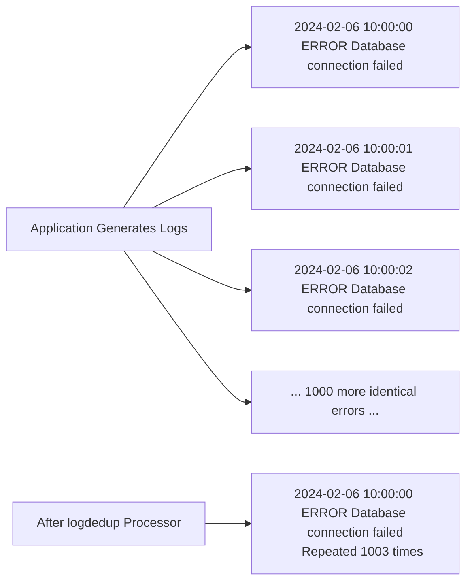

# How to Configure the Log Dedup Processor in the OpenTelemetry Collector

Author: [nawazdhandala](https://www.github.com/nawazdhandala)

Tags: OpenTelemetry, Collector, Processors, Logs, Deduplication, Cost Optimization, Noise Reduction

Description: Learn how to configure the log deduplication processor in OpenTelemetry Collector to eliminate duplicate log entries, reduce storage costs, minimize noise, and optimize log processing while preserving important log patterns and error messages.

---

Applications often generate duplicate log entries. A service might log the same error message hundreds of times per second when a downstream dependency fails. Database connection pools log identical errors for each failed connection attempt. Health check endpoints generate repetitive log entries every few seconds.

The log dedup processor (logdedup) in the OpenTelemetry Collector identifies and eliminates duplicate log entries, keeping only the first occurrence and optionally a count of how many times it repeated. This dramatically reduces log volume, cuts storage costs, and makes log analysis more manageable without losing critical information.

## Understanding Log Duplication

Log duplication happens for several reasons:

**Repeated Errors**: When a dependency fails, your application might log the same error on every request or retry attempt. A database connection failure can generate thousands of identical error logs per minute.

**Polling and Health Checks**: Services that perform health checks or polling operations often log the same message repeatedly. Load balancer health checks can generate identical log entries every 5-10 seconds.

**Verbose Debug Logging**: Debug-level logging in tight loops can generate massive volumes of duplicate entries, especially in high-throughput systems.



Without deduplication, you pay to store and index thousands of identical log entries. With deduplication, you store one entry with a count, achieving massive cost savings.

## Why You Need This Processor

The log dedup processor solves several production problems:

**Cost Reduction**: Log storage and indexing costs are often based on volume. Eliminating duplicate logs can reduce your bill by 50-80% in systems with repetitive logging.

**Noise Reduction**: When investigating issues, seeing the same error message repeated thousands of times makes it harder to spot other problems. Deduplication shows you distinct errors, making analysis faster.

**Performance Improvement**: Downstream log processors, exporters, and backends handle fewer log entries, reducing CPU and network usage throughout your pipeline.

**Rate Limiting Protection**: Some log backends rate-limit or reject excessive log ingestion. Deduplication ensures you stay within limits by reducing volume at the source.

## Basic Configuration

The processor requires you to specify which log attributes to use for identifying duplicates. Logs with identical values for these attributes are considered duplicates.

Here is a basic configuration that deduplicates based on log message:

```yaml
# RECEIVERS: Accept logs via OTLP
receivers:
  otlp:
    protocols:
      grpc:
        endpoint: 0.0.0.0:4317

# PROCESSORS: Deduplicate logs
processors:
  # Deduplicate logs based on message body
  logdedup:
    # Log records are considered duplicates if these fields match
    log_record_key:
      - body    # The log message itself

    # Time window for deduplication
    # Logs are deduplicated within this window
    interval: 60s

    # Timezone for interval calculations (optional)
    timezone: "UTC"

  # Batch for efficiency
  batch:
    send_batch_max_size: 1024
    timeout: 10s

# EXPORTERS: Send to backend
exporters:
  otlphttp:
    endpoint: https://oneuptime.com/otlp/v1/logs
    headers:
      x-oneuptime-token: ${ONEUPTIME_TOKEN}

# SERVICE: Define the logs pipeline
service:
  pipelines:
    logs:
      receivers: [otlp]
      processors: [logdedup, batch]
      exporters: [otlphttp]
```

This configuration deduplicates logs based on their message body. If two logs have identical messages within a 60-second window, only the first is kept. The processor adds a count attribute indicating how many duplicates were found.

## Deduplication Based on Multiple Attributes

In practice, you often want to deduplicate based on multiple attributes, not just the message. Consider logs that include severity, service name, and message.

Here is a configuration that deduplicates on multiple attributes:

```yaml
processors:
  # Deduplicate based on severity, service, and message
  logdedup:
    log_record_key:
      - attributes["severity"]      # Log level (ERROR, WARN, INFO)
      - resource["service.name"]    # Which service produced it
      - body                        # The actual message

    # Deduplicate within 5-minute windows
    interval: 300s

    # Add count of duplicates as an attribute
    count_attribute: "duplicate_count"

  batch:
    send_batch_max_size: 1024
    timeout: 10s

exporters:
  otlphttp:
    endpoint: https://oneuptime.com/otlp/v1/logs
    headers:
      x-oneuptime-token: ${ONEUPTIME_TOKEN}

service:
  pipelines:
    logs:
      receivers: [otlp]
      processors: [logdedup, batch]
      exporters: [otlphttp]
```

This configuration considers logs duplicates only if they match on all three criteria: same severity level, same service name, and same message body. An ERROR from service A and an ERROR from service B with the same message are treated as distinct logs.

The `count_attribute` parameter adds an attribute to deduplicated logs showing how many times they occurred. If a log appeared 47 times, the exported log includes `duplicate_count: 47`.

## Time Window Management

The `interval` parameter controls the time window for deduplication. Understanding how to set it is critical for balancing memory usage and deduplication effectiveness.

**Short intervals (30-60s)**: Use for high-frequency logs in high-throughput systems. Reduces memory usage but might miss duplicates that are slightly further apart.

**Medium intervals (5-10m)**: Good balance for most systems. Catches bursts of duplicates while keeping memory reasonable.

**Long intervals (30m-1h)**: Use when you have periodic errors that repeat over long time spans. Requires more memory but provides better deduplication.

Here is a configuration with time window tuning:

```yaml
processors:
  # Short window for high-frequency error logs
  logdedup/errors:
    log_record_key:
      - attributes["severity"]
      - body
    interval: 30s              # Short window for fast-moving errors

  # Longer window for INFO logs (less critical)
  logdedup/info:
    log_record_key:
      - body
    interval: 600s             # 10-minute window for INFO logs

  batch:
    send_batch_max_size: 1024
    timeout: 10s

exporters:
  otlphttp:
    endpoint: https://oneuptime.com/otlp/v1/logs
    headers:
      x-oneuptime-token: ${ONEUPTIME_TOKEN}

service:
  pipelines:
    # Pipeline for ERROR logs (short dedup window)
    logs/errors:
      receivers: [otlp]
      processors: [logdedup/errors, batch]
      exporters: [otlphttp]

    # Pipeline for INFO logs (long dedup window)
    logs/info:
      receivers: [otlp]
      processors: [logdedup/info, batch]
      exporters: [otlphttp]
```

This configuration uses different deduplication windows based on log severity. Error logs get a short 30-second window (because they're time-sensitive), while info logs get a longer 10-minute window (because they're less critical).

## Filtering Before Deduplication

Not all logs should be deduplicated. Unique transaction logs, audit logs, and security logs should be preserved exactly as generated. Use filtering to select which logs to deduplicate.

Here is a configuration that deduplicates only application errors:

```yaml
processors:
  # Filter to select only application error logs
  filter/errors:
    logs:
      include:
        match_type: regexp
        # Only include logs matching these patterns
        resource_attributes:
          - key: log.level
            value: "^(ERROR|FATAL)$"

  # Deduplicate the filtered error logs
  logdedup:
    log_record_key:
      - resource["service.name"]
      - attributes["error.type"]
      - body
    interval: 120s
    count_attribute: "duplicate_count"

  batch:
    send_batch_max_size: 1024
    timeout: 10s

exporters:
  otlphttp:
    endpoint: https://oneuptime.com/otlp/v1/logs
    headers:
      x-oneuptime-token: ${ONEUPTIME_TOKEN}

service:
  pipelines:
    logs:
      receivers: [otlp]
      processors:
        - filter/errors    # First filter
        - logdedup         # Then deduplicate
        - batch
      exporters: [otlphttp]
```

This configuration only deduplicates ERROR and FATAL logs. INFO, DEBUG, and WARN logs pass through without deduplication, preserving their full detail for analysis.

## Handling Structured Logs with Complex Attributes

Modern applications emit structured logs with nested attributes. The logdedup processor can deduplicate based on specific nested fields.

Here is a configuration for structured logs:

```yaml
processors:
  # Deduplicate based on structured log attributes
  logdedup:
    log_record_key:
      - resource["service.name"]
      - attributes["http.method"]         # HTTP method (GET, POST, etc.)
      - attributes["http.route"]          # Route pattern (/api/users/:id)
      - attributes["http.status_code"]    # Status code (200, 404, 500)
      - body                              # Error message

    interval: 300s
    count_attribute: "duplicate_count"

  batch:
    send_batch_max_size: 1024
    timeout: 10s

exporters:
  otlphttp:
    endpoint: https://oneuptime.com/otlp/v1/logs
    headers:
      x-oneuptime-token: ${ONEUPTIME_TOKEN}

service:
  pipelines:
    logs:
      receivers: [otlp]
      processors: [logdedup, batch]
      exporters: [otlphttp]
```

This configuration deduplicates HTTP error logs based on the combination of service, HTTP method, route pattern, status code, and message. An error on `POST /api/users/:id` with status 500 is deduplicated separately from a 404 on `GET /api/orders/:id`.

## Memory Management and Performance Tuning

The logdedup processor maintains in-memory state for every unique log signature it sees within the time window. In high-cardinality scenarios, this can consume significant memory.

Here is a production configuration with memory protection:

```yaml
processors:
  # Protect collector from memory exhaustion
  memory_limiter:
    limit_mib: 1024          # Hard limit: 1GB
    spike_limit_mib: 256
    check_interval: 1s

  # Reduce cardinality before deduplication
  attributes/drop_high_cardinality:
    actions:
      # Drop attributes that make each log unique
      - key: request_id
        action: delete
      - key: timestamp_ms
        action: delete
      - key: user_id
        action: delete

  # Deduplicate with controlled cardinality
  logdedup:
    log_record_key:
      - resource["service.name"]
      - attributes["severity"]
      - body
    interval: 120s
    count_attribute: "duplicate_count"

  batch:
    send_batch_max_size: 1024
    timeout: 10s

service:
  pipelines:
    logs:
      receivers: [otlp]
      processors:
        - memory_limiter                    # First line of defense
        - attributes/drop_high_cardinality  # Reduce cardinality
        - logdedup                          # Then deduplicate
        - batch
      exporters: [otlphttp]
```

The attributes processor removes high-cardinality fields like request IDs and user IDs before deduplication. This ensures logs that differ only in these fields are considered duplicates, significantly improving deduplication effectiveness and reducing memory usage.

## Preserving First and Last Occurrence

Some backends benefit from knowing both when a log first occurred and when it last occurred within the deduplication window.

Here is a configuration that preserves timing information:

```yaml
processors:
  # Deduplicate and track first/last occurrence
  logdedup:
    log_record_key:
      - resource["service.name"]
      - body
    interval: 300s

    # Add attributes for timing
    count_attribute: "duplicate_count"
    first_occurrence_attribute: "first_seen"
    last_occurrence_attribute: "last_seen"

  batch:
    send_batch_max_size: 1024
    timeout: 10s

exporters:
  otlphttp:
    endpoint: https://oneuptime.com/otlp/v1/logs
    headers:
      x-oneuptime-token: ${ONEUPTIME_TOKEN}

service:
  pipelines:
    logs:
      receivers: [otlp]
      processors: [logdedup, batch]
      exporters: [otlphttp]
```

The exported log includes:
- `duplicate_count`: Total number of occurrences (e.g., 47)
- `first_seen`: Timestamp of the first occurrence
- `last_seen`: Timestamp of the most recent occurrence

This information helps you understand whether an error occurred in a burst (first_seen and last_seen close together) or persistently over time (first_seen and last_seen far apart).

## Multi-Service Deduplication Strategy

In microservices architectures, the same error might propagate through multiple services. You might want service-specific deduplication or cross-service deduplication depending on your needs.

Here is a configuration for service-specific deduplication:

```yaml
processors:
  # Deduplicate per service (errors in different services are separate)
  logdedup:
    log_record_key:
      - resource["service.name"]      # Include service name in key
      - resource["service.version"]   # Also include version
      - attributes["severity"]
      - body

    interval: 300s
    count_attribute: "duplicate_count"

  batch:
    send_batch_max_size: 1024
    timeout: 10s

exporters:
  otlphttp:
    endpoint: https://oneuptime.com/otlp/v1/logs
    headers:
      x-oneuptime-token: ${ONEUPTIME_TOKEN}

service:
  pipelines:
    logs:
      receivers: [otlp]
      processors: [logdedup, batch]
      exporters: [otlphttp]
```

This configuration treats the same error from different services as distinct. An error in the API service and the same error in the database service are deduplicated separately.

For cross-service deduplication (treating the same error across services as one):

```yaml
processors:
  # Deduplicate across services (same error anywhere is a duplicate)
  logdedup:
    log_record_key:
      # Do NOT include service.name - ignore which service produced it
      - attributes["severity"]
      - attributes["error.type"]
      - body

    interval: 300s
    count_attribute: "duplicate_count"
```

This configuration deduplicates based only on severity, error type, and message, regardless of which service produced the log. Use this when cascading failures produce the same error across multiple services and you want to see it once.

## Handling Periodic Logs with Timestamps

Some logs include timestamps or sequence numbers in their message body, making each log technically unique even though they represent the same event.

Here is a configuration that normalizes logs before deduplication:

```yaml
processors:
  # Transform logs to remove timestamps from message
  transform/remove_timestamps:
    log_statements:
      - context: log
        statements:
          # Remove timestamps like "2024-02-06 10:30:45" from message
          - replace_pattern(body, "\\d{4}-\\d{2}-\\d{2} \\d{2}:\\d{2}:\\d{2}", "TIMESTAMP")
          # Remove millisecond timestamps like "1707217845123"
          - replace_pattern(body, "\\d{13}", "TIMESTAMP")
          # Remove request IDs like "req-abc-123-def"
          - replace_pattern(body, "req-[a-f0-9-]+", "REQUEST_ID")

  # Now deduplicate the normalized logs
  logdedup:
    log_record_key:
      - resource["service.name"]
      - body                    # Body now has TIMESTAMP instead of actual times
    interval: 300s
    count_attribute: "duplicate_count"

  batch:
    send_batch_max_size: 1024
    timeout: 10s

exporters:
  otlphttp:
    endpoint: https://oneuptime.com/otlp/v1/logs
    headers:
      x-oneuptime-token: ${ONEUPTIME_TOKEN}

service:
  pipelines:
    logs:
      receivers: [otlp]
      processors:
        - transform/remove_timestamps   # First normalize
        - logdedup                      # Then deduplicate
        - batch
      exporters: [otlphttp]
```

The transform processor uses regex patterns to replace timestamps and request IDs with placeholder text, making logs that differ only in these values appear identical for deduplication purposes.

## Integration with Sampling

Combine deduplication with sampling for maximum log volume reduction. Deduplicate first to eliminate exact duplicates, then sample to further reduce volume.

Here is a configuration combining both techniques:

```yaml
processors:
  # Step 1: Deduplicate exact duplicates
  logdedup:
    log_record_key:
      - resource["service.name"]
      - attributes["severity"]
      - body
    interval: 120s
    count_attribute: "duplicate_count"

  # Step 2: Sample the deduplicated logs
  probabilistic_sampler:
    sampling_percentage: 10    # Keep 10% of deduplicated logs

  batch:
    send_batch_max_size: 1024
    timeout: 10s

exporters:
  otlphttp:
    endpoint: https://oneuptime.com/otlp/v1/logs
    headers:
      x-oneuptime-token: ${ONEUPTIME_TOKEN}

service:
  pipelines:
    logs:
      receivers: [otlp]
      processors:
        - logdedup              # First deduplicate
        - probabilistic_sampler # Then sample
        - batch
      exporters: [otlphttp]
```

This two-stage approach first eliminates exact duplicates (potentially reducing volume by 80%), then samples the remaining logs (reducing by another 90%). The combined effect can reduce log volume by 98% while preserving error patterns and diversity.

## Monitoring Deduplication Effectiveness

To understand how much deduplication is helping, monitor the processor's metrics.

Here is a configuration with monitoring enabled:

```yaml
processors:
  logdedup:
    log_record_key:
      - resource["service.name"]
      - body
    interval: 300s
    count_attribute: "duplicate_count"

  batch:
    send_batch_max_size: 1024
    timeout: 10s

exporters:
  otlphttp:
    endpoint: https://oneuptime.com/otlp/v1/logs
    headers:
      x-oneuptime-token: ${ONEUPTIME_TOKEN}

  # Export collector internal metrics
  prometheus:
    endpoint: 0.0.0.0:8888

service:
  telemetry:
    metrics:
      level: detailed
      address: 0.0.0.0:8888

  pipelines:
    logs:
      receivers: [otlp]
      processors: [logdedup, batch]
      exporters: [otlphttp]
```

Monitor these collector metrics:
- `otelcol_processor_logdedup_logs_processed`: Total logs seen by the processor
- `otelcol_processor_logdedup_logs_dropped`: Logs dropped as duplicates
- Deduplication rate: `logs_dropped / logs_processed * 100%`

A 70-80% deduplication rate is common in production systems with repetitive errors. If you see lower rates, review your `log_record_key` configuration - you might be including too many attributes that make logs appear unique.

## Common Pitfalls and Solutions

**Problem**: Deduplication isn't reducing volume as much as expected.

**Solution**: Check your `log_record_key` configuration. If you include high-cardinality attributes like timestamps, request IDs, or user IDs, every log appears unique. Use the transform processor to normalize or remove these before deduplication.

**Problem**: Important distinct errors are being deduplicated together.

**Solution**: Add more attributes to your `log_record_key`. If different errors are being deduplicated because they have similar messages, include error type, error code, or stack trace hash in the deduplication key.

**Problem**: Collector memory usage is very high.

**Solution**: Reduce the `interval` parameter. Long intervals mean the processor tracks more unique log signatures. Also use the memory_limiter processor and consider dropping high-cardinality attributes before deduplication.

**Problem**: Duplicate counts seem inaccurate.

**Solution**: Verify that all logs from your services reach the same collector instance. In multi-collector deployments without consistent routing, the same log might hit different collectors, preventing proper deduplication. Use load balancing with consistent hashing if needed.

## Integration with OneUptime

OneUptime efficiently stores and indexes deduplicated logs, making the duplicate_count attribute queryable for analysis.

Here is a complete production configuration for OneUptime:

```yaml
receivers:
  otlp:
    protocols:
      grpc:
        endpoint: 0.0.0.0:4317
      http:
        endpoint: 0.0.0.0:4318

processors:
  memory_limiter:
    limit_mib: 1024
    spike_limit_mib: 256

  # Remove high-cardinality attributes
  attributes/cleanup:
    actions:
      - key: request_id
        action: delete
      - key: trace_id
        action: delete
      - key: span_id
        action: delete

  # Deduplicate with timing info
  logdedup:
    log_record_key:
      - resource["service.name"]
      - resource["deployment.environment"]
      - attributes["severity"]
      - body
    interval: 300s
    count_attribute: "duplicate_count"
    first_occurrence_attribute: "first_seen"
    last_occurrence_attribute: "last_seen"

  batch:
    send_batch_max_size: 1024
    timeout: 10s

exporters:
  otlphttp:
    endpoint: https://oneuptime.com/otlp/v1/logs
    headers:
      x-oneuptime-token: ${ONEUPTIME_TOKEN}
    retry_on_failure:
      enabled: true
      initial_interval: 5s
      max_interval: 30s

service:
  pipelines:
    logs:
      receivers: [otlp]
      processors:
        - memory_limiter
        - attributes/cleanup
        - logdedup
        - batch
      exporters: [otlphttp]
```

This configuration removes high-cardinality attributes, deduplicates logs with timing information, and exports to OneUptime. You can then query OneUptime to find logs with high duplicate counts, indicating persistent or high-frequency errors.

## Related Resources

For more information on log processing and optimization in OpenTelemetry:

- [OpenTelemetry Collector: What It Is, When You Need It, and When You Don't](https://oneuptime.com/blog/post/what-is-opentelemetry-collector-and-why-use-one/view)
- [How to Structure Logs Properly in OpenTelemetry](https://oneuptime.com/blog/post/2025-08-28-how-to-structure-logs-properly-in-opentelemetry/view)
- [How to Reduce Noise in OpenTelemetry](https://oneuptime.com/blog/post/2025-08-25-how-to-reduce-noise-in-opentelemetry/view)
- [Keep PII Out of Observability Telemetry](https://oneuptime.com/blog/post/2025-11-13-keep-pii-out-of-observability-telemetry/view)

## Conclusion

The log dedup processor is essential for managing log volume in production systems. By eliminating duplicate log entries while preserving occurrence counts and timing information, it dramatically reduces storage costs and processing overhead without losing critical observability data.

Configure it with appropriate log_record_key attributes based on your log structure, set reasonable time intervals balancing memory usage and deduplication effectiveness, and combine it with filtering and transformation processors for maximum efficiency. With OneUptime as your backend, you get a platform that efficiently stores deduplicated logs and makes duplicate counts queryable for identifying persistent issues.
