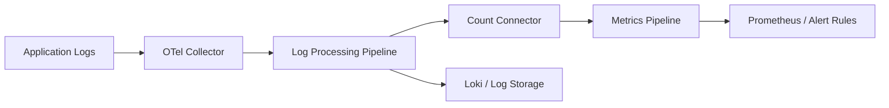

# How to Use Logs-to-Metrics Pipelines in the OpenTelemetry Collector to Generate

Author: [nawazdhandala](https://www.github.com/nawazdhandala)

Tags: OpenTelemetry, Log, Metric, Collector Pipeline

Description: Transform structured log data into actionable metrics using the OpenTelemetry Collector's processors and connectors, creating alert-ready time series from log events.

Not everything worth alerting on starts as a metric. Authentication failures, payment declines, rate limit hits, and feature flag evaluations are often only recorded in logs. Querying logs in real time for alerting is expensive and fragile. A better approach is to convert high-value log events into metrics at the Collector level, where they become first-class time series that any alerting system can consume.

## Why Convert Logs to Metrics

Metrics backends are built for fast aggregation and threshold comparison. Log backends are built for search and context. Alerting on logs typically means running frequent full-text queries against a log store, which is both slow and costly at scale. By extracting metrics from logs in the Collector pipeline, you get the speed of metric-based alerting with the richness of log-derived signals.


```mermaid
flowchart LR
    A[Application Logs] --> B[OTel Collector]
    B --> C[Log Processing Pipeline]
    C --> D[Count Connector]
    D --> E[Metrics Pipeline]
    E --> F[Prometheus / Alert Rules]
    C --> G[Loki / Log Storage]
```

## Step 1: Structure Your Logs for Extraction

The Collector can only extract metrics from logs that have parseable structure. If your application emits structured logs with consistent fields, the extraction is straightforward. Here is an example of well-structured log output:

```json
{
  "timestamp": "2026-02-06T14:23:01Z",
  "severity": "WARN",
  "body": "Payment declined",
  "attributes": {
    "payment.method": "credit_card",
    "payment.decline_reason": "insufficient_funds",
    "payment.amount": 49.99,
    "customer.tier": "premium"
  },
  "resource": {
    "service.name": "payments-service",
    "deployment.environment": "production"
  }
}
```

## Step 2: Use the Count Connector to Generate Metrics from Logs

The `count` connector in the OpenTelemetry Collector sits between a logs pipeline and a metrics pipeline. It counts log records that match specified conditions and emits those counts as metrics:

```yaml
# otel-collector-config.yaml

# Convert payment decline logs into metrics using the count connector
receivers:
  otlp:
    protocols:
      grpc:
        endpoint: "0.0.0.0:4317"

connectors:
  # Count connector turns log events into counter metrics
  count:
    logs:
      # Count all payment decline events, broken down by reason
      payment.declines:
        description: "Number of payment decline events"
        conditions:
          - 'body == "Payment declined"'
        attributes:
          - key: payment.decline_reason
          - key: payment.method
          - key: customer.tier

      # Count authentication failures by type
      auth.failures:
        description: "Number of authentication failures"
        conditions:
          - 'severity_number >= SEVERITY_NUMBER_WARN and attributes["event.name"] == "auth.failure"'
        attributes:
          - key: auth.failure_reason
          - key: auth.method

      # Count rate limit events
      ratelimit.hits:
        description: "Number of rate limit enforcement events"
        conditions:
          - 'attributes["event.name"] == "rate_limit.enforced"'
        attributes:
          - key: ratelimit.policy
          - key: http.route
          - key: customer.tier

processors:
  batch:
    timeout: 10s

exporters:
  prometheus:
    endpoint: "0.0.0.0:8889"
    resource_to_telemetry_conversion:
      enabled: true

  otlphttp/loki:
    endpoint: "http://loki:3100/otlp"

service:
  pipelines:
    # Logs pipeline feeds into the count connector
    logs:
      receivers: [otlp]
      processors: [batch]
      exporters: [otlphttp/loki, count]

    # Metrics pipeline receives counted log events
    metrics:
      receivers: [otlp, count]
      processors: [batch]
      exporters: [prometheus]
```

## Step 3: Use the Transform Processor for More Complex Extractions

When you need more control over the fields used for counting, the `transform` processor can normalize log attributes before the `count` connector sees them. For example, a legacy system might log request duration as a string; you can parse it and convert it into a bounded bucket label before counting:

```yaml
# Extract and transform log attributes before counting
processors:
  transform/logs:
    log_statements:
      # Parse a structured log field into a numeric attribute
      - context: log
        statements:
          - set(log.attributes["request.duration_ms"], Double(log.attributes["request.duration_ms"])) where log.attributes["request.duration_ms"] != nil
          - set(log.attributes["request.duration_bucket"], "under_100ms") where log.attributes["request.duration_ms"] < 100
          - set(log.attributes["request.duration_bucket"], "100ms_to_500ms") where log.attributes["request.duration_ms"] >= 100 and log.attributes["request.duration_ms"] < 500
          - set(log.attributes["request.duration_bucket"], "over_500ms") where log.attributes["request.duration_ms"] >= 500

      # Categorize log severity into buckets for metric labels
      - context: log
        statements:
          - set(log.attributes["severity_bucket"], "error")
              where log.severity_number >= SEVERITY_NUMBER_ERROR
          - set(log.attributes["severity_bucket"], "warning")
              where log.severity_number >= SEVERITY_NUMBER_WARN and log.severity_number < SEVERITY_NUMBER_ERROR
          - set(log.attributes["severity_bucket"], "info")
              where log.severity_number < SEVERITY_NUMBER_WARN

  # Filter out low-value logs before counting to keep cardinality manageable
  filter/high_value:
    error_mode: ignore
    log_conditions:
      - 'log.attributes["event.name"] == nil'
```

## Step 4: Write Alert Rules Against the Generated Metrics

The metrics generated by the count connector behave like any other Prometheus metric. Write standard alert rules against them:

```yaml
# prometheus-rules/log-derived-alerts.yaml
# Alert rules that fire based on metrics extracted from logs
groups:
  - name: log-derived-alerts
    rules:
      # Alert on high payment decline rate
      - alert: HighPaymentDeclineRate
        expr: |
          sum(rate(payment_declines_total[5m])) by (payment_decline_reason)
          /
          sum(rate(payment_declines_total[5m]))
          > 0.15
        for: 5m
        labels:
          severity: warning
          team: payments
        annotations:
          summary: "Payment decline rate for {{ $labels.payment_decline_reason }} is {{ $value | humanizePercentage }}"

      # Alert on sudden spike in auth failures
      - alert: AuthFailureSpike
        expr: |
          sum(rate(auth_failures_total[5m]))
          > 3 * sum(rate(auth_failures_total[5m] offset 1h))
        for: 3m
        labels:
          severity: critical
          team: security
        annotations:
          summary: "Authentication failures spiked to 3x the rate from 1 hour ago"

      # Alert when rate limiting kicks in for premium customers
      - alert: PremiumCustomerRateLimited
        expr: |
          sum(rate(ratelimit_hits_total{customer_tier="premium"}[5m])) by (http_route) > 0
        for: 2m
        labels:
          severity: warning
          team: platform
        annotations:
          summary: "Premium customers are hitting rate limits on {{ $labels.http_route }}"
```

## Cardinality Management

The biggest risk with logs-to-metrics conversion is cardinality explosion. A log field like `user_id` or `request_id` should never become a metric label because it would create millions of time series. Stick to bounded, categorical attributes:

```yaml
# Safe attributes for metric labels (low cardinality)
# - payment.method: credit_card, debit_card, paypal, etc.
# - payment.decline_reason: insufficient_funds, expired_card, fraud_suspected
# - customer.tier: free, premium, enterprise
# - http.route: /api/v1/checkout, /api/v1/auth (route templates, not full paths)

# Dangerous attributes (high cardinality - never use as labels)
# - user.id
# - request.id
# - session.id
# - http.url (includes query params)
```

You can use the `filter` processor to drop logs that should not be counted, and the `transform` or `attributes` processor to delete high-cardinality attributes before they reach the count connector.

## When to Use This Pattern

Logs-to-metrics conversion works best for business-logic events that applications naturally log but do not expose as metrics. Payment outcomes, feature flag decisions, security events, and compliance-relevant actions are all strong candidates. For operational metrics like latency and throughput, prefer direct instrumentation with the OpenTelemetry metrics SDK instead - it produces more accurate data with lower overhead than extracting the same signal from log lines.
