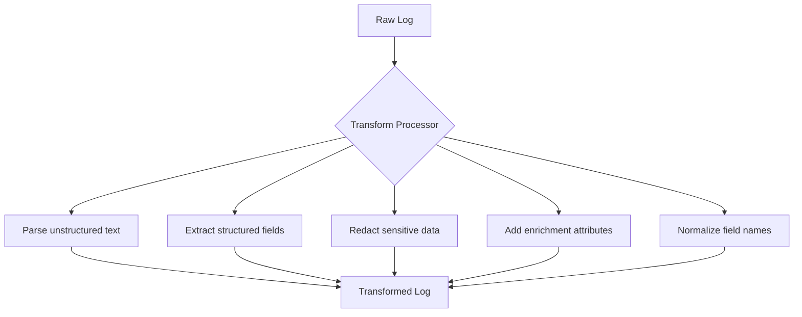

# How to Configure the Logs Transform Processor in the OpenTelemetry Collector

Author: [nawazdhandala](https://www.github.com/nawazdhandala)

Tags: OpenTelemetry, Collector, Processors, Logs, Transformation, OTTL, Data Processing, PII

Description: Learn how to configure the logs transform processor in OpenTelemetry Collector to manipulate log attributes, redact sensitive data, enrich logs with context, parse unstructured logs, and transform log data using the OpenTelemetry Transformation Language.

---

Raw logs from applications often need transformation before storage and analysis. You might need to parse unstructured log messages into structured fields, redact sensitive information like credit card numbers, add contextual attributes, or normalize inconsistent field names across different services.

The logs transform processor (transform) in the OpenTelemetry Collector provides a powerful way to manipulate log data using the OpenTelemetry Transformation Language (OTTL). This processor enables you to parse, enrich, filter, and transform logs at the collector level, centralizing data quality and privacy controls before logs reach your backend.

## Understanding OTTL for Log Transformation

The OpenTelemetry Transformation Language (OTTL) is a domain-specific language designed for telemetry transformation. It provides functions for string manipulation, regex matching, type conversion, mathematical operations, and more.

OTTL statements work on three contexts for logs:
- **resource**: Attributes describing the source (service name, host, environment)
- **scope**: Instrumentation scope information
- **log**: Individual log record attributes, body, severity, etc.



Each transformation statement specifies the context and the operation to perform. The processor executes statements in order, allowing you to chain transformations.

## Basic Configuration

The processor requires you to define transformation statements. Each statement targets a specific context and applies an operation.

Here is a basic configuration that adds a constant attribute to all logs:

```yaml
# RECEIVERS: Accept logs via OTLP
receivers:
  otlp:
    protocols:
      grpc:
        endpoint: 0.0.0.0:4317

# PROCESSORS: Transform logs
processors:
  # Add environment attribute to all logs
  transform:
    log_statements:
      - context: log
        statements:
          # Add a new attribute
          - set(attributes["deployment.environment"], "production")

  # Batch for efficiency
  batch:
    send_batch_max_size: 1024
    timeout: 10s

# EXPORTERS: Send to backend
exporters:
  otlphttp:
    endpoint: https://oneuptime.com/otlp/v1/logs
    headers:
      x-oneuptime-token: ${ONEUPTIME_TOKEN}

# SERVICE: Define the logs pipeline
service:
  pipelines:
    logs:
      receivers: [otlp]
      processors: [transform, batch]
      exporters: [otlphttp]
```

This configuration adds a `deployment.environment` attribute with value "production" to every log record. The `set()` function creates or updates attributes.

## Parsing Unstructured Logs

Many legacy applications emit unstructured text logs that need parsing into structured fields. OTTL provides regex functions for extraction.

Here is a configuration that parses Apache access logs:

```yaml
processors:
  # Parse Apache access log format into structured fields
  transform:
    log_statements:
      - context: log
        statements:
          # Example log: 192.168.1.1 - - [06/Feb/2024:10:30:45 +0000] "GET /api/users HTTP/1.1" 200 1234
          # Extract IP address
          - set(attributes["client.ip"], ExtractPatterns(body, "^(\\S+)")[0])

          # Extract timestamp
          - set(attributes["timestamp"], ExtractPatterns(body, "\\[([^\\]]+)\\]")[0])

          # Extract HTTP method
          - set(attributes["http.method"], ExtractPatterns(body, "\"(\\S+)")[0])

          # Extract URL path
          - set(attributes["http.target"], ExtractPatterns(body, "\"\\S+\\s+(\\S+)")[0])

          # Extract status code and convert to integer
          - set(attributes["http.status_code"], Int(ExtractPatterns(body, "\" (\\d+)")[0]))

          # Extract response size
          - set(attributes["http.response.size"], Int(ExtractPatterns(body, "\" \\d+ (\\d+)")[0]))

  batch:
    send_batch_max_size: 1024
    timeout: 10s

exporters:
  otlphttp:
    endpoint: https://oneuptime.com/otlp/v1/logs
    headers:
      x-oneuptime-token: ${ONEUPTIME_TOKEN}

service:
  pipelines:
    logs:
      receivers: [otlp]
      processors: [transform, batch]
      exporters: [otlphttp]
```

The `ExtractPatterns()` function uses regex to extract parts of the log message. Each regex returns an array of matches, and `[0]` selects the first match. The `Int()` function converts string numbers to integers.

After transformation, the unstructured log text is parsed into structured attributes that can be queried and analyzed efficiently.

## Redacting Sensitive Information

Logs often contain sensitive data like credit card numbers, social security numbers, API keys, or passwords. The transform processor can redact this information before export.

Here is a configuration that redacts common sensitive patterns:

```yaml
processors:
  # Redact sensitive information from logs
  transform:
    log_statements:
      - context: log
        statements:
          # Redact credit card numbers (16 digits with optional spaces/dashes)
          - replace_pattern(body, "\\b\\d{4}[\\s-]?\\d{4}[\\s-]?\\d{4}[\\s-]?\\d{4}\\b", "REDACTED_CC")

          # Redact email addresses
          - replace_pattern(body, "\\b[A-Za-z0-9._%+-]+@[A-Za-z0-9.-]+\\.[A-Z|a-z]{2,}\\b", "REDACTED_EMAIL")

          # Redact social security numbers (XXX-XX-XXXX)
          - replace_pattern(body, "\\b\\d{3}-\\d{2}-\\d{4}\\b", "REDACTED_SSN")

          # Redact API keys (Bearer tokens)
          - replace_pattern(body, "Bearer\\s+[A-Za-z0-9_\\-\\.]+", "Bearer REDACTED_TOKEN")

          # Redact passwords in URLs (password=...)
          - replace_pattern(body, "password=[^&\\s]+", "password=REDACTED")

          # Redact authorization headers
          - replace_pattern(attributes["http.request.header.authorization"], "Bearer\\s+.+", "Bearer REDACTED")

  batch:
    send_batch_max_size: 1024
    timeout: 10s

exporters:
  otlphttp:
    endpoint: https://oneuptime.com/otlp/v1/logs
    headers:
      x-oneuptime-token: ${ONEUPTIME_TOKEN}

service:
  pipelines:
    logs:
      receivers: [otlp]
      processors: [transform, batch]
      exporters: [otlphttp]
```

The `replace_pattern()` function searches for regex patterns and replaces matches with a redacted placeholder. This happens at the collector level, ensuring sensitive data never reaches your backend.

## Conditional Transformations

You often want to apply transformations only to specific logs. OTTL supports conditional logic with where clauses.

Here is a configuration with conditional transformations:

```yaml
processors:
  # Apply transformations conditionally
  transform:
    log_statements:
      - context: log
        statements:
          # Only for ERROR logs: add incident flag
          - set(attributes["requires_incident"], true) where severity_number >= 17

          # Only for HTTP logs: normalize status code
          - set(attributes["http.status_class"], Concat([Substring(attributes["http.status_code"], 0, 1), "xx"])) where attributes["http.status_code"] != nil

          # Only for database logs: extract query type
          - set(attributes["db.operation"], ExtractPatterns(body, "^(SELECT|INSERT|UPDATE|DELETE)")[0]) where attributes["db.statement"] != nil

          # Only for slow logs: flag for investigation
          - set(attributes["performance_issue"], true) where attributes["duration_ms"] > 1000

  batch:
    send_batch_max_size: 1024
    timeout: 10s

exporters:
  otlphttp:
    endpoint: https://oneuptime.com/otlp/v1/logs
    headers:
      x-oneuptime-token: ${ONEUPTIME_TOKEN}

service:
  pipelines:
    logs:
      receivers: [otlp]
      processors: [transform, batch]
      exporters: [otlphttp]
```

The `where` clause filters which logs receive the transformation. The first statement only adds `requires_incident` to logs with severity ERROR or higher (severity_number >= 17 in OTLP). The second only processes logs that have an http.status_code attribute.

## Enriching Logs with Contextual Information

Logs often benefit from additional context about the environment or service. The transform processor can add enrichment attributes based on existing log data.

Here is a configuration that adds contextual attributes:

```yaml
processors:
  # Enrich logs with additional context
  transform:
    log_statements:
      - context: log
        statements:
          # Add region based on availability zone
          - set(attributes["cloud.region"], Substring(attributes["cloud.availability_zone"], 0, 9)) where attributes["cloud.availability_zone"] != nil

          # Add environment based on service name suffix
          - set(attributes["deployment.environment"], "production") where resource["service.name"] matches ".*-prod$"
          - set(attributes["deployment.environment"], "staging") where resource["service.name"] matches ".*-staging$"

          # Add status category based on HTTP status code
          - set(attributes["http.status_category"], "success") where attributes["http.status_code"] >= 200 and attributes["http.status_code"] < 300
          - set(attributes["http.status_category"], "redirect") where attributes["http.status_code"] >= 300 and attributes["http.status_code"] < 400
          - set(attributes["http.status_category"], "client_error") where attributes["http.status_code"] >= 400 and attributes["http.status_code"] < 500
          - set(attributes["http.status_category"], "server_error") where attributes["http.status_code"] >= 500

          # Add business hours flag
          - set(attributes["business_hours"], true) where Int(Substring(String(time_unix_nano), 11, 2)) >= 9 and Int(Substring(String(time_unix_nano), 11, 2)) < 17

  batch:
    send_batch_max_size: 1024
    timeout: 10s

exporters:
  otlphttp:
    endpoint: https://oneuptime.com/otlp/v1/logs
    headers:
      x-oneuptime-token: ${ONEUPTIME_TOKEN}

service:
  pipelines:
    logs:
      receivers: [otlp]
      processors: [transform, batch]
      exporters: [otlphttp]
```

This configuration derives new attributes from existing ones: extracts region from availability zone, determines environment from service name patterns, categorizes HTTP status codes, and flags logs occurring during business hours.

## Normalizing Field Names Across Services

Different services might use different field names for the same concept. The transform processor can normalize these inconsistencies.

Here is a configuration that normalizes field names:

```yaml
processors:
  # Normalize inconsistent field names
  transform:
    log_statements:
      - context: log
        statements:
          # Normalize user identifier fields to standard name
          - set(attributes["user.id"], attributes["userId"]) where attributes["userId"] != nil
          - set(attributes["user.id"], attributes["user_id"]) where attributes["user_id"] != nil
          - set(attributes["user.id"], attributes["uid"]) where attributes["uid"] != nil
          - delete(attributes["userId"])
          - delete(attributes["user_id"])
          - delete(attributes["uid"])

          # Normalize request ID fields
          - set(attributes["request.id"], attributes["requestId"]) where attributes["requestId"] != nil
          - set(attributes["request.id"], attributes["request_id"]) where attributes["request_id"] != nil
          - set(attributes["request.id"], attributes["req_id"]) where attributes["req_id"] != nil
          - delete(attributes["requestId"])
          - delete(attributes["request_id"])
          - delete(attributes["req_id"])

          # Normalize error message fields
          - set(attributes["error.message"], attributes["errorMessage"]) where attributes["errorMessage"] != nil
          - set(attributes["error.message"], attributes["error_msg"]) where attributes["error_msg"] != nil
          - set(attributes["error.message"], attributes["err"]) where attributes["err"] != nil
          - delete(attributes["errorMessage"])
          - delete(attributes["error_msg"])
          - delete(attributes["err"])

  batch:
    send_batch_max_size: 1024
    timeout: 10s

exporters:
  otlphttp:
    endpoint: https://oneuptime.com/otlp/v1/logs
    headers:
      x-oneuptime-token: ${ONEUPTIME_TOKEN}

service:
  pipelines:
    logs:
      receivers: [otlp]
      processors: [transform, batch]
      exporters: [otlphttp]
```

This configuration copies various field name variants to standard OpenTelemetry semantic convention names, then deletes the original inconsistent fields. This creates uniform field names across all services.

## Parsing JSON Logs

Many applications emit logs with JSON payloads embedded in the log body. The transform processor can parse these JSON strings into structured attributes.

Here is a configuration for parsing JSON logs:

```yaml
processors:
  # Parse JSON log bodies into structured attributes
  transform:
    log_statements:
      - context: log
        statements:
          # Parse JSON body if it's a string
          - merge_maps(attributes, ParseJSON(body), "insert") where IsString(body)

          # After parsing, promote important fields to top-level attributes
          - set(attributes["http.method"], attributes["request"]["method"]) where attributes["request"]["method"] != nil
          - set(attributes["http.target"], attributes["request"]["url"]) where attributes["request"]["url"] != nil
          - set(attributes["http.status_code"], attributes["response"]["status"]) where attributes["response"]["status"] != nil

          # Clean up nested structures we've extracted
          - delete(attributes["request"])
          - delete(attributes["response"])

  batch:
    send_batch_max_size: 1024
    timeout: 10s

exporters:
  otlphttp:
    endpoint: https://oneuptime.com/otlp/v1/logs
    headers:
      x-oneuptime-token: ${ONEUPTIME_TOKEN}

service:
  pipelines:
    logs:
      receivers: [otlp]
      processors: [transform, batch]
      exporters: [otlphttp]
```

The `ParseJSON()` function parses JSON strings into maps. The `merge_maps()` function merges the parsed JSON into the log's attributes. After parsing, you can promote specific fields to top-level attributes for easier querying.

## Type Conversion and Validation

Logs from different sources might have inconsistent data types. String numbers need conversion to integers for numeric queries. The transform processor handles type conversion.

Here is a configuration with type conversion and validation:

```yaml
processors:
  # Convert and validate data types
  transform:
    log_statements:
      - context: log
        statements:
          # Convert string status codes to integers
          - set(attributes["http.status_code"], Int(attributes["http.status_code"])) where IsString(attributes["http.status_code"])

          # Convert string durations to floats
          - set(attributes["duration_ms"], Double(attributes["duration_ms"])) where IsString(attributes["duration_ms"])

          # Convert boolean strings to actual booleans
          - set(attributes["is_error"], true) where attributes["is_error"] == "true"
          - set(attributes["is_error"], false) where attributes["is_error"] == "false"

          # Validate and clamp numeric values
          - set(attributes["http.status_code"], 0) where attributes["http.status_code"] < 100 or attributes["http.status_code"] > 599
          - set(attributes["duration_ms"], 0) where attributes["duration_ms"] < 0

          # Ensure required fields exist with defaults
          - set(attributes["severity"], "INFO") where attributes["severity"] == nil
          - set(attributes["service.version"], "unknown") where resource["service.version"] == nil

  batch:
    send_batch_max_size: 1024
    timeout: 10s

exporters:
  otlphttp:
    endpoint: https://oneuptime.com/otlp/v1/logs
    headers:
      x-oneuptime-token: ${ONEUPTIME_TOKEN}

service:
  pipelines:
    logs:
      receivers: [otlp]
      processors: [transform, batch]
      exporters: [otlphttp]
```

The `Int()` and `Double()` functions convert strings to numbers. The `IsString()` function checks types before conversion. Validation statements clamp values to valid ranges and provide defaults for missing fields.

## Working with Resource Attributes

Transformations aren't limited to log attributes. You can also modify resource attributes that apply to all logs from a source.

Here is a configuration that transforms resource attributes:

```yaml
processors:
  # Transform resource attributes
  transform:
    log_statements:
      # Work on resource context instead of log context
      - context: resource
        statements:
          # Normalize service name to lowercase
          - set(attributes["service.name"], ToLower(attributes["service.name"]))

          # Add service tier based on service name pattern
          - set(attributes["service.tier"], "frontend") where attributes["service.name"] matches ".*-web|.*-ui|.*-app"
          - set(attributes["service.tier"], "backend") where attributes["service.name"] matches ".*-api|.*-service"
          - set(attributes["service.tier"], "data") where attributes["service.name"] matches ".*-db|.*-cache|.*-queue"

          # Derive cluster name from hostname
          - set(attributes["k8s.cluster.name"], ExtractPatterns(attributes["host.name"], "cluster-([^-]+)")[0]) where attributes["host.name"] matches "cluster-.*"

  batch:
    send_batch_max_size: 1024
    timeout: 10s

exporters:
  otlphttp:
    endpoint: https://oneuptime.com/otlp/v1/logs
    headers:
      x-oneuptime-token: ${ONEUPTIME_TOKEN}

service:
  pipelines:
    logs:
      receivers: [otlp]
      processors: [transform, batch]
      exporters: [otlphttp]
```

By using `context: resource`, the transformations apply to resource attributes rather than individual log attributes. These changes affect all logs from the same resource, making them efficient for adding metadata that applies to all logs from a service.

## Complex Multi-Step Transformations

Real-world scenarios often require chaining multiple transformation steps. The processor executes statements in order, allowing complex pipelines.

Here is a comprehensive configuration combining multiple techniques:

```yaml
processors:
  # Complex multi-step transformation pipeline
  transform:
    log_statements:
      - context: log
        statements:
          # Step 1: Parse structured data from unstructured logs
          - set(attributes["raw_message"], body)
          - set(attributes["level"], ExtractPatterns(body, "\\[(DEBUG|INFO|WARN|ERROR|FATAL)\\]")[0]) where body matches "\\[(DEBUG|INFO|WARN|ERROR|FATAL)\\]"

          # Step 2: Redact sensitive information
          - replace_pattern(body, "password=[^&\\s]+", "password=REDACTED")
          - replace_pattern(body, "token=[^&\\s]+", "token=REDACTED")

          # Step 3: Extract and structure error information
          - set(attributes["error.type"], ExtractPatterns(body, "Exception:\\s+(\\S+)")[0]) where body matches "Exception:"
          - set(attributes["error.message"], ExtractPatterns(body, "Exception:.*?-\\s+(.+)")[0]) where body matches "Exception:"

          # Step 4: Add contextual enrichment
          - set(attributes["is_error"], true) where severity_number >= 17
          - set(attributes["alert_priority"], "high") where attributes["is_error"] == true and resource["deployment.environment"] == "production"

          # Step 5: Normalize and validate
          - set(attributes["level"], ToUpper(attributes["level"])) where attributes["level"] != nil
          - set(severity_text, attributes["level"]) where attributes["level"] != nil

          # Step 6: Clean up temporary fields
          - delete(attributes["raw_message"]) where attributes["error.type"] != nil

  batch:
    send_batch_max_size: 1024
    timeout: 10s

exporters:
  otlphttp:
    endpoint: https://oneuptime.com/otlp/v1/logs
    headers:
      x-oneuptime-token: ${ONEUPTIME_TOKEN}

service:
  pipelines:
    logs:
      receivers: [otlp]
      processors: [transform, batch]
      exporters: [otlphttp]
```

This configuration demonstrates a complete transformation pipeline: parsing unstructured text, redacting sensitive data, extracting error information, adding business context, normalizing formats, and cleaning up intermediate fields.

## Performance Optimization

Complex transformations can impact collector performance. Optimize by minimizing regex operations and using efficient OTTL functions.

Here is a performance-optimized configuration:

```yaml
processors:
  # Protect collector from excessive CPU usage
  memory_limiter:
    limit_mib: 1024
    spike_limit_mib: 256

  # Optimize transformations for performance
  transform:
    log_statements:
      - context: log
        statements:
          # Use simple string operations instead of regex when possible
          - set(attributes["service_short"], Substring(resource["service.name"], 0, 10)) where Len(resource["service.name"]) > 10

          # Cache expensive regex results
          - set(attributes["has_error"], true) where body matches "error|exception|fatal"

          # Skip transformation if result already exists
          - set(attributes["normalized_status"], Int(attributes["status_code"])) where attributes["normalized_status"] == nil and attributes["status_code"] != nil

          # Use where clauses to skip unnecessary work
          - replace_pattern(body, "password=[^&\\s]+", "password=REDACTED") where body matches "password="

  batch:
    send_batch_max_size: 2048   # Larger batches = fewer processing cycles
    timeout: 5s

exporters:
  otlphttp:
    endpoint: https://oneuptime.com/otlp/v1/logs
    headers:
      x-oneuptime-token: ${ONEUPTIME_TOKEN}

service:
  pipelines:
    logs:
      receivers: [otlp]
      processors:
        - memory_limiter
        - transform
        - batch
      exporters: [otlphttp]
```

Use `where` clauses to avoid executing expensive operations on every log. Check if work is needed before doing it. Prefer simple string functions over regex when possible.

## Error Handling and Debugging

Transformation errors can cause the processor to drop logs. Configure error handling to manage failures gracefully.

Here is a configuration with error handling:

```yaml
processors:
  # Transform with error handling
  transform:
    error_mode: ignore   # Options: ignore, propagate, silent
                        # ignore: log error but continue processing
                        # propagate: fail the entire batch
                        # silent: ignore errors silently

    log_statements:
      - context: log
        statements:
          # These might fail if fields are missing or wrong type
          - set(attributes["status_code_int"], Int(attributes["status_code"]))
          - set(attributes["duration_float"], Double(attributes["duration"]))

  batch:
    send_batch_max_size: 1024
    timeout: 10s

exporters:
  otlphttp:
    endpoint: https://oneuptime.com/otlp/v1/logs
    headers:
      x-oneuptime-token: ${ONEUPTIME_TOKEN}

  # Add logging exporter for debugging
  logging:
    loglevel: debug
    sampling_initial: 10
    sampling_thereafter: 0

service:
  telemetry:
    logs:
      level: debug

  pipelines:
    logs:
      receivers: [otlp]
      processors: [transform, batch]
      exporters: [otlphttp, logging]  # Add logging for debugging
```

The `error_mode` parameter controls how transformation errors are handled. Use "ignore" in production to log errors without dropping logs. Use the logging exporter during development to see transformation results.

## Integration with OneUptime

OneUptime efficiently indexes transformed and structured logs, making enriched attributes queryable for fast analysis.

Here is a complete production configuration for OneUptime:

```yaml
receivers:
  otlp:
    protocols:
      grpc:
        endpoint: 0.0.0.0:4317
      http:
        endpoint: 0.0.0.0:4318

processors:
  memory_limiter:
    limit_mib: 1024
    spike_limit_mib: 256

  # Comprehensive log transformation
  transform:
    error_mode: ignore
    log_statements:
      - context: log
        statements:
          # Redact PII
          - replace_pattern(body, "\\b[A-Za-z0-9._%+-]+@[A-Za-z0-9.-]+\\.[A-Z|a-z]{2,}\\b", "REDACTED_EMAIL")
          - replace_pattern(body, "\\b\\d{4}[\\s-]?\\d{4}[\\s-]?\\d{4}[\\s-]?\\d{4}\\b", "REDACTED_CC")

          # Parse and structure
          - set(attributes["http.method"], ExtractPatterns(body, "\"(GET|POST|PUT|DELETE|PATCH)")[0]) where body matches "GET|POST|PUT|DELETE|PATCH"
          - set(attributes["http.status_code"], Int(ExtractPatterns(body, "\" (\\d{3})")[0])) where body matches "\" \\d{3}"

          # Enrich with context
          - set(attributes["is_error"], true) where severity_number >= 17
          - set(attributes["requires_alert"], true) where attributes["is_error"] == true and resource["deployment.environment"] == "production"

          # Normalize
          - set(attributes["service.name"], ToLower(resource["service.name"]))

  batch:
    send_batch_max_size: 1024
    timeout: 10s

exporters:
  otlphttp:
    endpoint: https://oneuptime.com/otlp/v1/logs
    headers:
      x-oneuptime-token: ${ONEUPTIME_TOKEN}
    retry_on_failure:
      enabled: true
      initial_interval: 5s
      max_interval: 30s

service:
  pipelines:
    logs:
      receivers: [otlp]
      processors:
        - memory_limiter
        - transform
        - batch
      exporters: [otlphttp]
```

This configuration redacts sensitive information, parses unstructured logs into structured fields, adds contextual enrichment, and normalizes data before sending to OneUptime. The structured attributes become queryable fields in OneUptime's log explorer.

## Related Resources

For more information on log processing and transformation in OpenTelemetry:

- [OpenTelemetry Collector: What It Is, When You Need It, and When You Don't](https://oneuptime.com/blog/post/what-is-opentelemetry-collector-and-why-use-one/view)
- [How to Structure Logs Properly in OpenTelemetry](https://oneuptime.com/blog/post/2025-08-28-how-to-structure-logs-properly-in-opentelemetry/view)
- [Keep PII Out of Observability Telemetry](https://oneuptime.com/blog/post/2025-11-13-keep-pii-out-of-observability-telemetry/view)
- [How to Reduce Noise in OpenTelemetry](https://oneuptime.com/blog/post/2025-08-25-how-to-reduce-noise-in-opentelemetry/view)

## Conclusion

The logs transform processor is one of the most powerful tools in the OpenTelemetry Collector. Using OTTL, you can parse unstructured logs, redact sensitive information, enrich logs with context, normalize inconsistent data, and transform logs in virtually any way needed before they reach your backend.

Start with simple transformations and build complexity incrementally. Use conditional logic to target specific logs, handle errors gracefully with appropriate error_mode settings, and optimize performance by minimizing expensive regex operations. With OneUptime as your backend, you get a platform that efficiently indexes and queries the structured attributes your transformations create, making log analysis fast and powerful.
