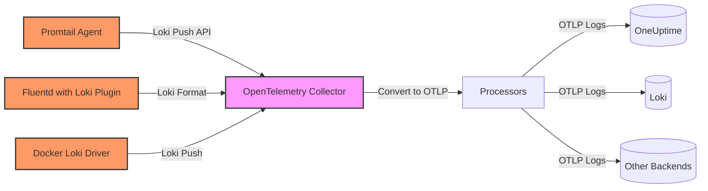
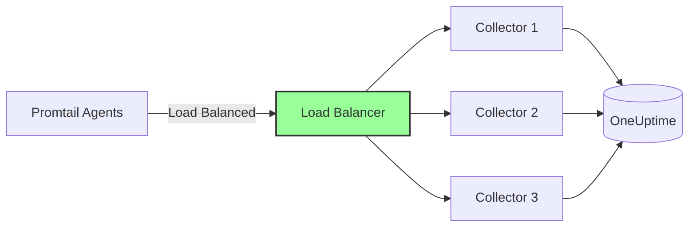

# How to Configure the Loki Receiver in the OpenTelemetry Collector

Author: [nawazdhandala](https://www.github.com/nawazdhandala)

Tags: OpenTelemetry, Collector, Loki, Grafana, Logs, Promtail, Migration

Description: Learn how to configure the Loki receiver in OpenTelemetry Collector to ingest logs from Promtail and other Loki-compatible clients for centralized log management.

---

The Loki receiver in the OpenTelemetry Collector enables you to accept logs in Grafana Loki's push format, allowing seamless integration with Promtail agents and other Loki-compatible log shippers. This receiver is particularly valuable for organizations using Grafana Loki who want to migrate to OpenTelemetry or consolidate logs from multiple sources into a unified observability pipeline.

By deploying the Loki receiver, you can maintain compatibility with existing Promtail deployments while routing logs to any OpenTelemetry-compatible backend, gaining flexibility in storage options and processing capabilities without changing your log collection infrastructure.

---

## What is the Loki Receiver?

The Loki receiver is an OpenTelemetry Collector component that implements the Grafana Loki push API. Loki is a horizontally scalable, highly available log aggregation system inspired by Prometheus. Promtail is the most common agent for shipping logs to Loki, but other tools like Fluentd, Logstash, and Docker logging drivers can also send logs to Loki-compatible endpoints.

The OpenTelemetry Collector's Loki receiver accepts log data in Loki's push format and converts it into OpenTelemetry log records, enabling you to:

- Migrate from Grafana Loki to alternative backends without reconfiguring Promtail
- Consolidate logs from Loki-compatible agents with OpenTelemetry-native instrumentation
- Apply OpenTelemetry processors for advanced filtering, sampling, and enrichment
- Route logs to multiple destinations based on labels or content
- Maintain label-based log organization while gaining OTLP export capabilities

**Supported features:**

- Loki push API v1 (`/loki/api/v1/push`)
- Label extraction and mapping to OpenTelemetry attributes
- Compressed payloads (snappy, gzip)
- Timestamp preservation from log entries
- Multi-stream log batches

---

## Architecture Overview

The Loki receiver sits between your Promtail agents (or other Loki clients) and observability backends, accepting Loki-formatted logs and converting them to OpenTelemetry format:



This architecture allows you to maintain Promtail deployments while gaining the flexibility of OpenTelemetry's processing and export capabilities.

---

## Prerequisites

Before configuring the Loki receiver, ensure you have:

1. **OpenTelemetry Collector** version 0.80.0 or later with the Loki receiver component
2. **Promtail or other Loki-compatible agents** configured to ship logs
3. **Network connectivity** from log shippers to the Collector endpoint
4. **Understanding of Loki labels** used in your current configuration

---

## Basic Configuration

The Loki receiver requires configuring an HTTP endpoint for the Loki push API. Here's a minimal working configuration:

```yaml
# RECEIVERS: Define how telemetry enters the Collector
receivers:
  # Loki receiver implements the Grafana Loki push API
  loki:
    # HTTP endpoint for Loki push API
    protocols:
      http:
        endpoint: 0.0.0.0:3100

    # Use default labels-to-attributes mapping
    use_incoming_timestamp: true

# EXPORTERS: Define where logs are sent
exporters:
  # Export logs to OneUptime using OTLP
  otlphttp:
    endpoint: https://oneuptime.com/otlp
    headers:
      x-oneuptime-token: ${ONEUPTIME_TOKEN}

# SERVICE: Wire receivers to exporters
service:
  pipelines:
    # Logs pipeline: receive from Loki clients, export to OneUptime
    logs:
      receivers: [loki]
      exporters: [otlphttp]
```

**Configuration breakdown:**

- `protocols.http.endpoint`: The address and port where the receiver listens for Loki push requests (default Loki port is 3100)
- `use_incoming_timestamp`: When true, the receiver preserves timestamps from log entries rather than using the ingestion time

---

## Production Configuration with Label Mapping

In production environments, you'll want to configure label mapping and add processors for enrichment and batching:

```yaml
receivers:
  loki:
    protocols:
      http:
        endpoint: 0.0.0.0:3100

    # Preserve timestamps from log entries
    use_incoming_timestamp: true

    # Map Loki labels to OpenTelemetry resource attributes
    # This preserves label-based organization in the new backend
    resource_attributes:
      "service.name":
        enabled: true
        # Map from Loki label 'job' to resource attribute 'service.name'
        from: job
      "deployment.environment":
        enabled: true
        from: env
      "host.name":
        enabled: true
        from: instance

processors:
  # Protect Collector from memory exhaustion
  memory_limiter:
    limit_mib: 512
    spike_limit_mib: 128
    check_interval: 2s

  # Batch logs to reduce network overhead
  batch:
    send_batch_max_size: 1024
    timeout: 10s

  # Add additional resource attributes
  resource:
    attributes:
      - key: telemetry.source
        value: loki-promtail
        action: upsert

  # Extract structured data from log lines
  # Example: Parse JSON logs
  transform:
    log_statements:
      - context: log
        statements:
          # Parse JSON body if present
          - merge_maps(cache, ParseJSON(body), "insert") where IsMatch(body, "^\\{")

          # Extract level from JSON
          - set(severity_text, cache["level"]) where cache["level"] != nil

          # Extract message from JSON
          - set(body, cache["message"]) where cache["message"] != nil

exporters:
  # Export to OneUptime with retry and timeout configuration
  otlphttp:
    endpoint: https://oneuptime.com/otlp
    headers:
      x-oneuptime-token: ${ONEUPTIME_TOKEN}
    retry_on_failure:
      enabled: true
      initial_interval: 5s
      max_interval: 30s
      max_elapsed_time: 300s
    timeout: 30s
    compression: gzip

service:
  # Enable telemetry for the Collector itself
  telemetry:
    logs:
      level: info
    metrics:
      address: localhost:8888

  pipelines:
    logs:
      receivers: [loki]
      processors: [memory_limiter, resource, transform, batch]
      exporters: [otlphttp]
```

**Key processing steps:**

1. **Label mapping:** Converts Loki labels to OpenTelemetry resource attributes
2. **Memory limiter:** Prevents excessive memory consumption under high load
3. **Transform processor:** Extracts structured data from log lines (JSON parsing, field extraction)
4. **Batch processor:** Groups logs for efficient export

---

## Configuring Promtail to Use the Receiver

After configuring the Loki receiver, point your Promtail agents to the Collector endpoint.

**Promtail configuration (promtail.yaml):**

```yaml
# Promtail server configuration
server:
  http_listen_port: 9080
  grpc_listen_port: 0

# Where to send logs (point to OpenTelemetry Collector)
clients:
  - url: http://otel-collector.example.com:3100/loki/api/v1/push
    # Optional: Add tenant ID header if using multi-tenancy
    # tenant_id: my-tenant

    # Batching configuration for performance
    batchwait: 1s
    batchsize: 102400

    # Timeout and retry settings
    timeout: 10s
    backoff_config:
      min_period: 500ms
      max_period: 5m
      max_retries: 10

# Scrape configuration
scrape_configs:
  # Scrape application logs from files
  - job_name: application-logs
    static_configs:
      - targets:
          - localhost
        labels:
          job: my-app
          env: production
          __path__: /var/log/myapp/*.log

  # Scrape system logs
  - job_name: system-logs
    static_configs:
      - targets:
          - localhost
        labels:
          job: system
          env: production
          __path__: /var/log/syslog

  # Scrape container logs
  - job_name: container-logs
    docker_sd_configs:
      - host: unix:///var/run/docker.sock
        refresh_interval: 5s
    relabel_configs:
      - source_labels: ['__meta_docker_container_name']
        target_label: 'container'
      - source_labels: ['__meta_docker_container_log_stream']
        target_label: 'stream'
```

**Key Promtail settings:**

- `clients.url`: Point to the Collector's Loki receiver endpoint
- `batchwait` and `batchsize`: Control batching for performance
- `labels`: Static labels attached to all logs from this scrape config (mapped to OpenTelemetry attributes by the receiver)

---

## Understanding Loki Label Mapping

Loki organizes logs using labels, similar to Prometheus metrics. The Loki receiver converts these labels into OpenTelemetry resource and log attributes.

**Loki label structure:**

```json
{
  "streams": [
    {
      "stream": {
        "job": "my-app",
        "env": "production",
        "instance": "app-server-01",
        "level": "error"
      },
      "values": [
        ["1675270800000000000", "Database connection failed: timeout after 30s"]
      ]
    }
  ]
}
```

**Converted to OpenTelemetry:**

- Labels in `stream` become resource attributes or log attributes
- `job` typically maps to `service.name`
- `env` maps to `deployment.environment`
- `instance` maps to `host.name`
- Additional labels become log attributes
- Log line becomes the log body
- Timestamp is preserved

**Customizing label mapping:**

Configure the receiver to control how labels are mapped:

```yaml
receivers:
  loki:
    protocols:
      http:
        endpoint: 0.0.0.0:3100

    use_incoming_timestamp: true

    # Define which labels become resource attributes
    # Labels not listed here become log attributes
    resource_attributes:
      "service.name":
        enabled: true
        from: job
      "deployment.environment":
        enabled: true
        from: env
      "host.name":
        enabled: true
        from: instance
      "service.namespace":
        enabled: true
        from: namespace
```

This mapping ensures your logs follow OpenTelemetry semantic conventions, improving compatibility with observability tools.

---

## Multi-Tenancy Support

Loki supports multi-tenancy through the `X-Scope-OrgID` header. The Loki receiver can preserve this header and use it for routing or filtering.

**Promtail configuration with tenant ID:**

```yaml
clients:
  - url: http://otel-collector.example.com:3100/loki/api/v1/push
    tenant_id: tenant-a
```

**Collector configuration for multi-tenant routing:**

```yaml
receivers:
  loki:
    protocols:
      http:
        endpoint: 0.0.0.0:3100

processors:
  # Extract tenant ID from context and add as attribute
  attributes:
    actions:
      - key: tenant.id
        action: insert
        from_context: X-Scope-OrgID

  # Route based on tenant ID
  routing:
    from_attribute: tenant.id
    table:
      - value: tenant-a
        exporters: [otlphttp/tenant_a]
      - value: tenant-b
        exporters: [otlphttp/tenant_b]
    default_exporters: [otlphttp/default]

exporters:
  otlphttp/tenant_a:
    endpoint: https://tenant-a.example.com/otlp
    headers:
      authorization: Bearer ${TENANT_A_TOKEN}

  otlphttp/tenant_b:
    endpoint: https://tenant-b.example.com/otlp
    headers:
      authorization: Bearer ${TENANT_B_TOKEN}

  otlphttp/default:
    endpoint: https://oneuptime.com/otlp
    headers:
      x-oneuptime-token: ${ONEUPTIME_TOKEN}

service:
  pipelines:
    logs:
      receivers: [loki]
      processors: [attributes, routing, batch]
      exporters: [otlphttp/tenant_a, otlphttp/tenant_b, otlphttp/default]
```

This configuration demonstrates tenant-based routing, useful for multi-customer SaaS platforms or large organizations with separate observability backends per team.

---

## Parsing Structured Logs

Promtail often ships raw log lines, but many applications emit structured logs (JSON, logfmt). The transform processor can extract fields from these formats.

**JSON log parsing:**

```yaml
processors:
  # Parse JSON logs and extract fields
  transform:
    log_statements:
      - context: log
        statements:
          # Check if body is JSON
          - merge_maps(cache, ParseJSON(body), "insert") where IsMatch(body, "^\\{")

          # Extract timestamp if present in JSON
          - set(time_unix_nano, Time(cache["timestamp"], "%Y-%m-%dT%H:%M:%S.%fZ")) where cache["timestamp"] != nil

          # Extract severity
          - set(severity_text, cache["level"]) where cache["level"] != nil

          # Extract message as body
          - set(body, cache["message"]) where cache["message"] != nil

          # Extract trace context for correlation
          - set(trace_id.string, cache["trace_id"]) where cache["trace_id"] != nil
          - set(span_id.string, cache["span_id"]) where cache["span_id"] != nil

          # Promote all other fields to attributes
          - set(attributes["user_id"], cache["user_id"]) where cache["user_id"] != nil
          - set(attributes["request_id"], cache["request_id"]) where cache["request_id"] != nil
```

**Example structured log:**

```json
{
  "timestamp": "2026-02-06T10:30:45.123Z",
  "level": "ERROR",
  "message": "Database query failed",
  "user_id": "user123",
  "request_id": "req-abc-123",
  "trace_id": "7d1f2a3b4c5d6e7f8a9b0c1d2e3f4a5b",
  "span_id": "1a2b3c4d5e6f7a8b",
  "error": "connection timeout"
}
```

After processing, this becomes a structured OpenTelemetry log record with proper severity, correlated trace context, and relevant attributes.

---

## Filtering and Sampling

For high-volume log environments, apply filtering and sampling to reduce costs and noise:

```yaml
receivers:
  loki:
    protocols:
      http:
        endpoint: 0.0.0.0:3100

processors:
  # Drop debug logs in production
  filter/severity:
    logs:
      exclude:
        match_type: strict
        log_records:
          - severity_text == "DEBUG"
          - severity_text == "TRACE"

  # Drop noisy health check logs
  filter/healthchecks:
    logs:
      exclude:
        match_type: regexp
        bodies:
          - ".*GET /health.*"
          - ".*GET /readiness.*"
          - ".*GET /liveness.*"

  # Sample info logs (keep 10%)
  probabilistic_sampler/info:
    sampling_percentage: 10
    # Only sample INFO logs
    filter:
      match_type: strict
      log_records:
        - severity_text == "INFO"

  # Always keep error and warning logs
  filter/important:
    logs:
      include:
        match_type: regexp
        log_records:
          - severity_text == "ERROR"
          - severity_text == "WARN"
          - severity_text == "FATAL"

exporters:
  otlphttp:
    endpoint: https://oneuptime.com/otlp
    headers:
      x-oneuptime-token: ${ONEUPTIME_TOKEN}

service:
  pipelines:
    logs:
      receivers: [loki]
      processors: [filter/severity, filter/healthchecks, probabilistic_sampler/info, batch]
      exporters: [otlphttp]
```

This configuration reduces log volume by dropping low-value logs while ensuring important events are always retained.

---

## Migration from Grafana Loki

When migrating from Grafana Loki to an OpenTelemetry-based stack, the Loki receiver provides a smooth transition.

**Migration strategy:**

1. **Deploy OpenTelemetry Collector** with Loki receiver configured
2. **Configure dual push** from Promtail (send to both Loki and Collector)
3. **Validate data quality** in your new backend
4. **Gradually switch Promtail agents** to point only to Collector
5. **Decommission Loki** once all agents are migrated

**Dual push configuration (Promtail):**

```yaml
# promtail.yaml - Send to both Loki and OpenTelemetry Collector
clients:
  # Existing Loki backend
  - url: http://loki.example.com:3100/loki/api/v1/push
    tenant_id: default

  # New OpenTelemetry Collector
  - url: http://otel-collector.example.com:3100/loki/api/v1/push
    tenant_id: default

scrape_configs:
  - job_name: application-logs
    static_configs:
      - targets:
          - localhost
        labels:
          job: my-app
          env: production
          __path__: /var/log/myapp/*.log
```

This configuration sends logs to both destinations, allowing you to compare results and ensure data completeness before fully cutting over.

---

## Performance Tuning

The Loki receiver can handle high throughput with proper configuration.

**High-volume configuration:**

```yaml
receivers:
  loki:
    protocols:
      http:
        endpoint: 0.0.0.0:3100

        # Increase maximum request body size for large batches
        max_recv_msg_size: 10485760  # 10 MB

        # Enable compression support
        compression: gzip

processors:
  # Increase memory limit for high-volume processing
  memory_limiter:
    limit_mib: 2048
    spike_limit_mib: 512
    check_interval: 1s

  # Larger batch sizes for better throughput
  batch:
    send_batch_max_size: 4096
    send_batch_size: 2048
    timeout: 5s

exporters:
  otlphttp:
    endpoint: https://oneuptime.com/otlp
    headers:
      x-oneuptime-token: ${ONEUPTIME_TOKEN}

    # Increase sending queue for burst handling
    sending_queue:
      enabled: true
      num_consumers: 20
      queue_size: 10000

    # Retry configuration for reliability
    retry_on_failure:
      enabled: true
      initial_interval: 1s
      max_interval: 30s
      max_elapsed_time: 300s

service:
  pipelines:
    logs:
      receivers: [loki]
      processors: [memory_limiter, batch]
      exporters: [otlphttp]
```

**Horizontal scaling:**

For very high volumes, deploy multiple Collector instances behind a load balancer:



Configure Promtail agents to send to the load balancer endpoint, which distributes traffic across multiple Collectors for optimal performance.

---

## Label-Based Routing

One of Loki's strengths is label-based log organization. The Loki receiver preserves these labels, enabling label-based routing in the Collector:

```yaml
receivers:
  loki:
    protocols:
      http:
        endpoint: 0.0.0.0:3100

processors:
  # Route based on service (job label)
  routing:
    from_attribute: service.name
    table:
      - value: critical-service
        exporters: [otlphttp/high_retention]
      - value: batch-jobs
        exporters: [otlphttp/low_retention]
    default_exporters: [otlphttp/standard]

exporters:
  # High retention for critical services (90 days)
  otlphttp/high_retention:
    endpoint: https://critical-logs.example.com/otlp
    headers:
      authorization: Bearer ${CRITICAL_TOKEN}

  # Low retention for batch jobs (7 days)
  otlphttp/low_retention:
    endpoint: https://batch-logs.example.com/otlp
    headers:
      authorization: Bearer ${BATCH_TOKEN}

  # Standard retention for most services (30 days)
  otlphttp/standard:
    endpoint: https://oneuptime.com/otlp
    headers:
      x-oneuptime-token: ${ONEUPTIME_TOKEN}

service:
  pipelines:
    logs:
      receivers: [loki]
      processors: [routing, batch]
      exporters: [otlphttp/high_retention, otlphttp/low_retention, otlphttp/standard]
```

This configuration demonstrates intelligent routing based on service importance, enabling cost optimization by applying different retention policies.

---

## Monitoring and Observability

Monitor the Loki receiver to ensure healthy operation and identify issues early.

**Enable Collector metrics:**

```yaml
exporters:
  prometheus:
    endpoint: 0.0.0.0:8889

service:
  telemetry:
    logs:
      level: info
    metrics:
      address: localhost:8888

  pipelines:
    logs:
      receivers: [loki]
      processors: [batch]
      exporters: [otlphttp]

    metrics/internal:
      receivers: [prometheus]
      exporters: [prometheus]
```

**Key metrics to monitor:**

- `otelcol_receiver_accepted_log_records`: Logs successfully received from Loki clients
- `otelcol_receiver_refused_log_records`: Logs rejected (invalid format, errors)
- `otelcol_exporter_send_failed_log_records`: Logs that failed to export
- `otelcol_processor_batch_batch_send_size`: Size of exported batches

**Promtail metrics:**

Monitor Promtail's own metrics to ensure healthy log shipping:

```bash
# Check Promtail metrics (exposed on port 9080 by default)
curl http://promtail:9080/metrics | grep promtail_sent

# Key metrics:
# promtail_sent_bytes_total - Total bytes sent to receiver
# promtail_dropped_bytes_total - Bytes dropped due to errors
# promtail_sent_entries_total - Total log entries sent
```

---

## Troubleshooting Common Issues

**1. Logs not appearing in backend:**

Promtail sends logs but they don't appear in the destination.

**Solution:**
- Check Collector logs for processing errors
- Verify exporter configuration (endpoint, authentication)
- Enable debug logging to see raw log data

```yaml
service:
  telemetry:
    logs:
      level: debug

exporters:
  debug:
    verbosity: detailed
```

**2. Label mapping issues:**

Labels from Promtail aren't appearing as expected in the backend.

**Solution:**
- Review `resource_attributes` configuration in the Loki receiver
- Check that label names match between Promtail and receiver config
- Use the debug exporter to inspect converted log records

**3. High memory usage:**

The Collector consumes excessive memory.

**Solution:**
- Reduce batch sizes to limit in-memory buffering
- Lower memory limiter thresholds
- Increase export frequency

```yaml
processors:
  memory_limiter:
    limit_mib: 512
    spike_limit_mib: 128

  batch:
    send_batch_max_size: 1024
    timeout: 5s
```

**4. Connection timeouts from Promtail:**

Promtail reports timeouts when sending to the Collector.

**Solution:**
- Increase timeout in Promtail configuration
- Scale Collector horizontally to handle load
- Optimize exporter performance (increase concurrency)

```yaml
# promtail.yaml
clients:
  - url: http://otel-collector.example.com:3100/loki/api/v1/push
    timeout: 30s  # Increase from default
    backoff_config:
      max_retries: 5
```

---

## Integration with OneUptime

OneUptime provides native support for OpenTelemetry logs, making it an ideal backend for Loki-ingested data:

```yaml
exporters:
  otlphttp:
    endpoint: https://oneuptime.com/otlp
    headers:
      x-oneuptime-token: ${ONEUPTIME_TOKEN}
    compression: gzip

service:
  pipelines:
    logs:
      receivers: [loki]
      processors: [memory_limiter, resource, batch]
      exporters: [otlphttp]
```

Benefits of using OneUptime as your backend:

- **Label preservation:** Loki labels become OpenTelemetry attributes, preserving your log organization
- **Correlation:** Correlate logs with traces and metrics from the same services
- **Cost-effective storage:** No per-GB pricing like commercial log aggregation services
- **Flexible querying:** Use the built-in log explorer with full-text search
- **Alerting:** Create alerts based on log patterns and rates

---

## Related Topics

For more information on OpenTelemetry Collector receivers and log management:

- [OpenTelemetry Collector: What It Is, When You Need It, and When You Don't](https://oneuptime.com/blog/post/what-is-opentelemetry-collector-and-why-use-one/view)
- [How to Configure the Splunk HEC Receiver in the OpenTelemetry Collector](https://oneuptime.com/blog/post/splunk-hec-receiver-opentelemetry-collector/view)
- [How to Configure the Datadog Receiver in the OpenTelemetry Collector](https://oneuptime.com/blog/post/datadog-receiver-opentelemetry-collector/view)
- [How to Structure Logs Properly in OpenTelemetry](https://oneuptime.com/blog/post/2025-08-28-how-to-structure-logs-properly-in-opentelemetry/view)

---

## Conclusion

The Loki receiver provides a practical migration path from Grafana Loki to OpenTelemetry-based observability. By accepting Loki's push format and converting it to OpenTelemetry logs, it allows you to preserve existing Promtail deployments while gaining the benefits of vendor neutrality, flexible routing, and cost control.

Configure the receiver with proper label mapping, add processors for filtering and enrichment, and export to cost-effective backends like OneUptime. This approach delivers comprehensive log management without the constraints of Loki's storage limitations or the complexity of maintaining a Loki cluster.

Whether you're conducting a full migration from Grafana Loki or simply integrating Promtail-based log collection into your OpenTelemetry stack, the Loki receiver provides the compatibility and flexibility needed for modern observability.
