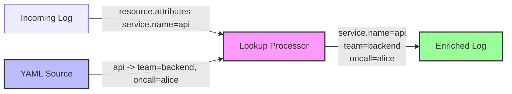

# How to Configure the Lookup Processor in the OpenTelemetry Collector

Author: [nawazdhandala](https://www.github.com/nawazdhandala)

Tags: OpenTelemetry, Collector, Processor, Lookup, Enrichment, Attribute

Description: Learn how to configure the Lookup processor in OpenTelemetry Collector to enrich telemetry data with external reference information for enhanced observability.

The Lookup processor enriches telemetry data by evaluating an OTTL value expression to extract a lookup key, querying a configured lookup source, and writing the result as new attributes. As currently documented in OpenTelemetry Collector Contrib, the processor is a development-status component for logs, with metrics and traces support planned.

## Why Enrichment Matters

Raw telemetry often contains identifiers like service names, host IDs, or customer IDs without additional context. The Lookup processor bridges this gap by correlating these identifiers with descriptive metadata, enabling:

- Associating service names with team ownership and escalation contacts
- Mapping host identifiers to operational metadata
- Linking customer IDs to subscription tiers and support levels
- Resolving client IP addresses to hostnames with reverse DNS lookups

This enrichment happens at collection time, ensuring downstream systems receive contextually complete log data without requiring separate lookup operations.

## Core Concepts

The Lookup processor operates on a simple principle: evaluate a key expression on each log record, query the configured lookup source with that key, and write selected lookup results to log or resource attributes.



The processor currently includes these built-in lookup sources:
- `noop` for testing
- `yaml` for key-value mappings loaded from a YAML file at startup
- `dns` for reverse DNS PTR lookups with caching

Because the Lookup processor is not listed in the standard Collector distributions, you need a Collector build that includes `github.com/open-telemetry/opentelemetry-collector-contrib/processor/lookupprocessor`.

## Basic Configuration

Start with a simple YAML lookup configuration that enriches logs based on the `service.name` resource attribute.

Create `/etc/otel-collector/service-metadata.yaml`:

```yaml
api:
  team: backend
  oncall: alice@example.com
web:
  team: frontend
  oncall: bob@example.com
auth:
  team: security
  oncall: charlie@example.com
```

Then configure the processor to use this file:

```yaml
# Basic Lookup processor configuration
receivers:
  otlp:
    protocols:
      grpc:
      http:

processors:
  lookup:
    source:
      type: yaml
      path: /etc/otel-collector/service-metadata.yaml
    lookups:
      - key: resource.attributes["service.name"]
        attributes:
          - source: team
            destination: team
            default: unknown
          - source: oncall
            destination: oncall
            default: oncall@example.com
  batch:

exporters:
  debug:

service:
  pipelines:
    logs:
      receivers: [otlp]
      processors: [lookup, batch]
      exporters: [debug]
```

With this configuration, a log record whose resource has `service.name=api` will receive `team=backend` and `oncall=alice@example.com` attributes.

## YAML File Lookups

For larger static datasets, use the YAML source. The file is read once when the processor starts and kept in memory.

Create `/etc/otel-collector/customer-metadata.yaml`:

```yaml
cust-001:
  tier: enterprise
  support_level: 24x7
cust-002:
  tier: starter
  support_level: business_hours
```

Then map fields from the lookup result into log attributes:

```yaml
# YAML file lookup configuration
processors:
  lookup:
    source:
      type: yaml
      path: /etc/otel-collector/customer-metadata.yaml
    lookups:
      - key: log.attributes["customer.id"]
        attributes:
          - source: tier
            destination: customer.tier
            default: unknown
          - source: support_level
            destination: customer.support_level
            default: standard
```

The processor performs lookups against the in-memory mapping loaded from the YAML file.

## DNS Lookups

The DNS source performs reverse DNS lookups for PTR records. This is useful when logs contain client IP addresses and you want to add a hostname attribute.

```yaml
# DNS lookup configuration
processors:
  lookup:
    source:
      type: dns
      record_type: PTR
      timeout: 1s
      cache:
        enabled: true
        size: 10000
        ttl: 5m
        negative_ttl: 1m
    lookups:
      - key: log.attributes["client.ip"]
        attributes:
          - destination: client.hostname
            default: unknown
```

The DNS source supports PTR lookups. A records, AAAA records, TXT records, CNAME records, MX records, and multiple DNS servers are not currently documented as supported.

## Multiple Lookup Rules

Complex scenarios often require multiple lookup operations. A single Lookup processor can run multiple lookup rules against the same source.

Create `/etc/otel-collector/enrichment.yaml`:

```yaml
api:
  team: backend
  repo: github.com/example/api
prod:
  alert_threshold: "0.95"
  sample_rate: "0.1"
staging:
  alert_threshold: "0.90"
  sample_rate: "0.5"
```

Configure multiple lookup rules:

```yaml
# Multiple lookup rules configuration
processors:
  lookup:
    source:
      type: yaml
      path: /etc/otel-collector/enrichment.yaml
    lookups:
      - key: resource.attributes["service.name"]
        attributes:
          - source: team
            destination: team
          - source: repo
            destination: repo
      - key: resource.attributes["deployment.environment"]
        attributes:
          - source: alert_threshold
            destination: alert_threshold
          - source: sample_rate
            destination: sample_rate
```

The processor evaluates lookups per log record and writes the configured destination attributes when values are found.

## Conditional Lookups

The Lookup processor does not currently document a `condition` field on lookup rules. To limit enrichment to specific records, place a filter or transform processor before the Lookup processor, or configure the lookup key so it evaluates only for the records you want to enrich.

```yaml
# Filter before lookup
processors:
  filter/premium_customers:
    logs:
      log_record:
        - 'log.attributes["customer.tier"] != "premium"'

  lookup:
    source:
      type: yaml
      path: /etc/otel-collector/premium-customers.yaml
    lookups:
      - key: log.attributes["customer.id"]
        attributes:
          - source: support_level
            destination: customer.support_level
            default: standard
```

This keeps the lookup configuration aligned with the documented processor schema.

## Dynamic File Reloading

The built-in YAML source reads its file during startup. It does not currently document a `reload_interval` option for automatic file reloading.

```yaml
# YAML files are loaded at processor startup
processors:
  lookup:
    source:
      type: yaml
      path: /etc/otel-collector/service-metadata.yaml
    lookups:
      - key: resource.attributes["service.name"]
        attributes:
          - source: team
            destination: team
```

If lookup data changes frequently, restart or roll the Collector after updating the YAML file, or implement a custom lookup source with the reload behavior your environment requires.

## Handling Missing Lookups

Configure default values on each destination attribute for cases where no matching lookup entry exists.

```yaml
# Missing lookup handling configuration
processors:
  lookup:
    source:
      type: yaml
      path: /etc/otel-collector/service-metadata.yaml
    lookups:
      - key: resource.attributes["service.name"]
        attributes:
          - source: team
            destination: team
            default: unknown
          - source: oncall
            destination: oncall
            default: oncall@example.com
```

When a log record has an unknown service name, the processor writes the configured defaults for those destination attributes.

## Complex Pipeline Integration

Integrate the Lookup processor with other processors for comprehensive log enrichment.

```yaml
# Complex logs pipeline with multiple processors
receivers:
  otlp:
    protocols:
      grpc:
      http:

processors:
  # Enrich with service metadata
  lookup/services:
    source:
      type: yaml
      path: /etc/otel-collector/services.yaml
    lookups:
      - key: resource.attributes["service.name"]
        attributes:
          - source: team
            destination: team
            default: unknown
          - source: oncall
            destination: oncall
            default: oncall@example.com

  # Resolve client IP addresses with reverse DNS
  lookup/client_dns:
    source:
      type: dns
      cache:
        enabled: true
        size: 10000
        ttl: 5m
        negative_ttl: 1m
    lookups:
      - key: log.attributes["client.ip"]
        attributes:
          - destination: client.hostname
            default: unknown

  # Add resource attributes
  resource:
    attributes:
      - key: collector.version
        value: "1.0.0"
        action: insert

  # Filter based on enriched attributes
  filter/by_team:
    logs:
      log_record:
        - 'log.attributes["team"] == "unknown"'

  # Batch for efficiency
  batch:
    timeout: 10s

exporters:
  debug:

service:
  pipelines:
    logs:
      receivers: [otlp]
      processors:
        - lookup/services
        - lookup/client_dns
        - resource
        - filter/by_team
        - batch
      exporters: [debug]
```

This pipeline demonstrates a complete enrichment workflow:
1. Enriches logs with service metadata from YAML
2. Resolves client IP addresses with reverse DNS
3. Adds resource attributes
4. Filters based on enriched data
5. Batches for transmission

## Use Cases

### Service Ownership Mapping

Automatically add ownership metadata to logs:

```yaml
processors:
  lookup:
    source:
      type: yaml
      path: /etc/otel-collector/service-owners.yaml
    lookups:
      - key: resource.attributes["service.name"]
        attributes:
          - source: team
            destination: team
          - source: slack_channel
            destination: slack_channel
          - source: pagerduty_key
            destination: pagerduty_key
```

### Hostname Resolution

Resolve client IP addresses in logs:

```yaml
processors:
  lookup:
    source:
      type: dns
      server: 8.8.8.8:53
      timeout: 1s
      cache:
        enabled: true
        size: 10000
        ttl: 5m
        negative_ttl: 1m
    lookups:
      - key: log.attributes["client.ip"]
        attributes:
          - destination: client.hostname
            default: unknown
```

### Customer Segmentation

Enrich customer interactions with tier and support metadata:

```yaml
processors:
  lookup:
    source:
      type: yaml
      path: /etc/otel-collector/customer-tiers.yaml
    lookups:
      - key: log.attributes["customer.id"]
        attributes:
          - source: tier
            destination: customer.tier
          - source: support_level
            destination: customer.support_level
```

## Performance Optimization

The YAML source loads lookup data into memory during startup. For large lookup tables:

1. **Use YAML maps**: YAML mappings are loaded into memory and accessed with Go map lookups.

2. **Monitor memory usage**: Each lookup table consumes memory proportional to its size. For very large tables, consider a custom source or an external enrichment service.

3. **Tune DNS caching**: For DNS lookups, configure cache size and TTL values to balance freshness, memory usage, and resolver load.

```yaml
# DNS cache configuration
processors:
  lookup:
    source:
      type: dns
      cache:
        enabled: true
        size: 50000
        ttl: 10m
        negative_ttl: 1m
    lookups:
      - key: log.attributes["client.ip"]
        attributes:
          - destination: client.hostname
            default: unknown
```

## Troubleshooting

**Lookups not applying**: Verify the OTTL key expression reads the correct attribute path. For service names, this often means `resource.attributes["service.name"]` rather than `log.attributes["service.name"]`.

**File not found errors**: Ensure file paths are absolute and the collector process has read permissions.

**Stale data after file updates**: The YAML source reads the file at startup. Restart or roll the Collector after changing the file.

**Unexpected DNS results**: The built-in DNS source performs PTR lookups. Confirm that reverse DNS records exist for the IP addresses in your logs.

## Security Considerations

Lookup files may contain sensitive information like oncall contacts or cost center data. Secure these files:

1. **File permissions**: Restrict read access to the collector process user
2. **Sensitive data**: Avoid storing secrets in lookup tables; use secret management systems instead
3. **Audit logging**: Monitor access to lookup files
4. **Encryption**: Encrypt lookup files at rest if they contain PII

## Related Resources

For more information on enriching and transforming telemetry data:

- [How to Write OTTL Statements for the Transform Processor](https://oneuptime.com/blog/post/2026-02-06-ottl-statements-transform-processor-opentelemetry-collector/view)
- [How to Use the Metrics Start Time Processor](https://oneuptime.com/blog/post/2026-02-06-metrics-start-time-processor-opentelemetry-collector/view)

The Lookup processor can enrich logs by correlating identifiers with YAML mappings or reverse DNS data. Because it is currently a development-status component for logs and is not listed in standard Collector distributions, verify that your Collector build includes the processor before deploying these configurations. Configure defaults for missing lookup results, monitor memory usage with large YAML mappings, tune DNS cache settings when using reverse DNS, and secure sensitive lookup data appropriately.
