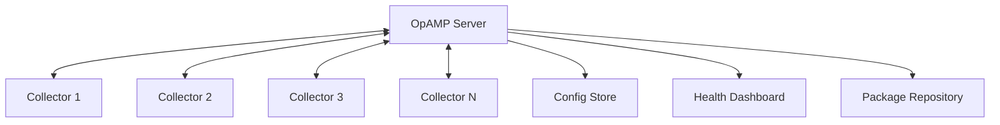

# How to Manage Collector Configuration with OpAMP

Author: [nawazdhandala](https://www.github.com/nawazdhandala)

Tags: OpenTelemetry, Collector, OpAMP, Configuration Management, Remote Management

Description: Implement centralized management and monitoring of OpenTelemetry Collector fleets using the Open Agent Management Protocol (OpAMP) for enterprise-scale deployments.

The Open Agent Management Protocol (OpAMP) is a network protocol for remote management of large fleets of telemetry agents, including OpenTelemetry Collectors. OpAMP provides bidirectional communication between agents and a management server, enabling configuration updates, health monitoring, and fleet-wide operations.

## Understanding OpAMP Architecture

OpAMP establishes a persistent connection between collectors (agents) and a management server. Unlike simple HTTP polling, OpAMP provides real-time bidirectional communication:



OpAMP supports several key capabilities:

- Remote configuration management
- Agent status and health reporting
- Package delivery and updates
- Connection settings management
- Custom capabilities and extensions

## Setting Up an OpAMP Server

First, create a basic OpAMP server that manages collector configurations:

```go
// opamp-server.go
package main

import (
    "context"
    "crypto/tls"
    "log"
    "net/http"
    "sync"
    "time"

    "github.com/google/uuid"
    "github.com/open-telemetry/opamp-go/protobufs"
    "github.com/open-telemetry/opamp-go/server"
    "github.com/open-telemetry/opamp-go/server/types"
)

// OpAMPServer manages the OpAMP server and connected agents
type OpAMPServer struct {
    server server.OpAMPServer

    // Connected agents
    mu     sync.RWMutex
    agents map[string]*AgentInfo
}

// AgentInfo stores information about a connected agent
type AgentInfo struct {
    InstanceID         string
    Status             *protobufs.AgentToServer
    LastHeartbeat      time.Time
    EffectiveConfig    *protobufs.AgentConfigMap
    RemoteConfig       *protobufs.AgentRemoteConfig
    RemoteConfigHash   []byte
}

// NewOpAMPServer creates a new OpAMP server instance
func NewOpAMPServer() *OpAMPServer {
    return &OpAMPServer{
        agents: make(map[string]*AgentInfo),
    }
}

// Start initializes and starts the OpAMP server
func (s *OpAMPServer) Start(addr string) error {
    settings := server.StartSettings{
        Settings: server.Settings{
            Callbacks: server.CallbacksStruct{
                OnConnectingFunc:         s.onConnecting,
                OnConnectedFunc:          s.onConnected,
                OnMessageFunc:            s.onMessage,
                OnConnectionCloseFunc:    s.onConnectionClose,
            },
        },
        ListenEndpoint: addr,
        ListenPath:     "/v1/opamp",

        // TLS configuration for secure communication
        TLSConfig: &tls.Config{
            MinVersion: tls.VersionTLS12,
        },
    }

    var err error
    s.server, err = server.New(&logger{})
    if err != nil {
        return err
    }

    return s.server.Start(settings)
}

// onConnecting is called when an agent attempts to connect
func (s *OpAMPServer) onConnecting(request *http.Request) types.ConnectionResponse {
    // Validate agent authentication
    apiKey := request.Header.Get("X-API-Key")
    if !s.validateAPIKey(apiKey) {
        return types.ConnectionResponse{
            Accept: false,
            HTTPStatusCode: http.StatusUnauthorized,
        }
    }

    return types.ConnectionResponse{
        Accept: true,
        ConnectionCallbacks: types.ConnectionCallbacksStruct{
            OnMessageFunc: s.onMessage,
        },
    }
}

// onConnected is called when an agent successfully connects
func (s *OpAMPServer) onConnected(ctx context.Context, conn types.Connection) {
    log.Printf("Agent connected: %s", conn.RemoteAddr())
}

// onMessage handles messages from connected agents
func (s *OpAMPServer) onMessage(
    ctx context.Context,
    conn types.Connection,
    message *protobufs.AgentToServer,
) *protobufs.ServerToAgent {
    // Extract agent instance ID
    instanceID := uuid.UUID(message.InstanceUid).String()

    // Update agent information
    s.updateAgentInfo(instanceID, message)

    // Build response message
    response := &protobufs.ServerToAgent{
        InstanceUid: message.InstanceUid,
    }

    // Send remote configuration if needed
    if s.shouldUpdateConfig(instanceID, message) {
        config := s.getConfigForAgent(instanceID, message)
        if config != nil {
            response.RemoteConfig = config
            response.Flags |= uint64(protobufs.ServerToAgentFlags_ServerToAgentFlags_ReportEffectiveConfig)
        }
    }

    // Request agent description if not provided
    if message.AgentDescription == nil {
        response.Flags |= uint64(protobufs.ServerToAgentFlags_ServerToAgentFlags_ReportAgentDescription)
    }

    // Request health status
    if message.Health == nil {
        response.Flags |= uint64(protobufs.ServerToAgentFlags_ServerToAgentFlags_ReportHealth)
    }

    return response
}

// onConnectionClose is called when an agent disconnects
func (s *OpAMPServer) onConnectionClose(conn types.Connection) {
    log.Printf("Agent disconnected: %s", conn.RemoteAddr())
}

// updateAgentInfo updates stored information about an agent
func (s *OpAMPServer) updateAgentInfo(instanceID string, message *protobufs.AgentToServer) {
    s.mu.Lock()
    defer s.mu.Unlock()

    agent, exists := s.agents[instanceID]
    if !exists {
        agent = &AgentInfo{
            InstanceID: instanceID,
        }
        s.agents[instanceID] = agent
    }

    agent.Status = message
    agent.LastHeartbeat = time.Now()

    if message.EffectiveConfig != nil {
        agent.EffectiveConfig = message.EffectiveConfig
    }

    log.Printf("Updated agent info: %s (healthy: %t)",
        instanceID,
        message.Health != nil && message.Health.Healthy)
}

// shouldUpdateConfig determines if agent needs configuration update
func (s *OpAMPServer) shouldUpdateConfig(
    instanceID string,
    message *protobufs.AgentToServer,
) bool {
    s.mu.RLock()
    defer s.mu.RUnlock()

    agent, exists := s.agents[instanceID]
    if !exists {
        return true
    }

    // Check if remote config hash matches
    if message.RemoteConfigStatus == nil {
        return true
    }

    if agent.RemoteConfigHash == nil {
        return true
    }

    // Compare hashes
    return !bytesEqual(message.RemoteConfigStatus.LastRemoteConfigHash, agent.RemoteConfigHash)
}

// getConfigForAgent returns configuration for a specific agent
func (s *OpAMPServer) getConfigForAgent(
    instanceID string,
    message *protobufs.AgentToServer,
) *protobufs.AgentRemoteConfig {
    // Determine configuration based on agent description
    var configBody []byte

    if message.AgentDescription != nil {
        // Extract agent labels/attributes
        attrs := message.AgentDescription.IdentifyingAttributes

        // Select configuration based on environment
        env := getAttributeValue(attrs, "environment")
        region := getAttributeValue(attrs, "region")

        configBody = s.loadConfigTemplate(env, region)
    } else {
        // Default configuration
        configBody = s.loadDefaultConfig()
    }

    // Calculate configuration hash
    hash := calculateHash(configBody)

    s.mu.Lock()
    defer s.mu.Unlock()

    agent := s.agents[instanceID]
    agent.RemoteConfigHash = hash

    return &protobufs.AgentRemoteConfig{
        Config: &protobufs.AgentConfigMap{
            ConfigMap: map[string]*protobufs.AgentConfigFile{
                "collector.yaml": {
                    Body: configBody,
                },
            },
        },
        ConfigHash: hash,
    }
}

// loadConfigTemplate loads configuration template for environment
func (s *OpAMPServer) loadConfigTemplate(env, region string) []byte {
    // Load configuration from storage based on environment and region
    // This is a simplified example
    config := `
receivers:
  otlp:
    protocols:
      grpc:
        endpoint: 0.0.0.0:4317

processors:
  batch:
    timeout: 10s

  resource:
    attributes:
      - key: environment
        value: ` + env + `
        action: upsert
      - key: region
        value: ` + region + `
        action: upsert

exporters:
  otlp:
    endpoint: tempo-` + env + `-` + region + `.monitoring.svc:4317

service:
  pipelines:
    traces:
      receivers: [otlp]
      processors: [resource, batch]
      exporters: [otlp]
`
    return []byte(config)
}

// loadDefaultConfig returns default collector configuration
func (s *OpAMPServer) loadDefaultConfig() []byte {
    config := `
receivers:
  otlp:
    protocols:
      grpc:
        endpoint: 0.0.0.0:4317

exporters:
  debug:
    verbosity: detailed

service:
  pipelines:
    traces:
      receivers: [otlp]
      exporters: [debug]
`
    return []byte(config)
}

// validateAPIKey validates agent API key
func (s *OpAMPServer) validateAPIKey(apiKey string) bool {
    // Implement proper API key validation
    return apiKey != ""
}

func main() {
    srv := NewOpAMPServer()

    log.Println("Starting OpAMP server on :4320")
    if err := srv.Start(":4320"); err != nil {
        log.Fatalf("Failed to start server: %v", err)
    }

    // Block forever
    select {}
}

// Helper functions
func bytesEqual(a, b []byte) bool {
    if len(a) != len(b) {
        return false
    }
    for i := range a {
        if a[i] != b[i] {
            return false
        }
    }
    return true
}

func getAttributeValue(attrs []*protobufs.KeyValue, key string) string {
    for _, attr := range attrs {
        if attr.Key == key {
            return attr.Value.GetStringValue()
        }
    }
    return ""
}

func calculateHash(data []byte) []byte {
    // Implement proper hash calculation (e.g., SHA256)
    // Simplified for this example
    return []byte("hash")
}

// logger implements OpAMP logger interface
type logger struct{}

func (l *logger) Debugf(format string, v ...interface{}) {
    log.Printf("[DEBUG] "+format, v...)
}

func (l *logger) Errorf(format string, v ...interface{}) {
    log.Printf("[ERROR] "+format, v...)
}
```

## Configuring Collector with OpAMP Client

Configure the OpenTelemetry Collector to connect to the OpAMP server:

```yaml
# collector-config.yaml
# OpAMP extension configuration
extensions:
  opamp:
    # OpAMP server endpoint
    server:
      ws:
        endpoint: wss://opamp-server.example.com:4320/v1/opamp
        headers:
          X-API-Key: ${OPAMP_API_KEY}

        # TLS configuration
        tls:
          insecure: false
          cert_file: /etc/certs/client.crt
          key_file: /etc/certs/client.key
          ca_file: /etc/certs/ca.crt

    # Agent instance ID (unique identifier)
    instance_uid: ${INSTANCE_ID}

    # Agent identification
    agent_description:
      identifying_attributes:
        - key: service.name
          string_value: otel-collector
        - key: environment
          string_value: ${ENVIRONMENT}
        - key: region
          string_value: ${REGION}
        - key: k8s.cluster.name
          string_value: ${CLUSTER_NAME}

      non_identifying_attributes:
        - key: os.type
          string_value: linux
        - key: host.arch
          string_value: amd64

    # Report effective configuration back to server
    capabilities:
      reports_effective_config: true
      reports_health: true
      reports_remote_config: true
      accepts_remote_config: true
      accepts_restart_command: true
      accepts_opamp_connection_settings: true

    # Heartbeat interval
    heartbeat_interval: 30s

# Initial fallback configuration
receivers:
  otlp:
    protocols:
      grpc:
        endpoint: 0.0.0.0:4317

exporters:
  debug:
    verbosity: basic

service:
  # Enable OpAMP extension
  extensions: [opamp]

  # Telemetry configuration
  telemetry:
    logs:
      level: info

  pipelines:
    traces:
      receivers: [otlp]
      exporters: [debug]
```

## Fleet Management Dashboard

Create a web dashboard to manage collector fleet:

```go
// dashboard.go
package main

import (
    "encoding/json"
    "html/template"
    "net/http"
    "time"
)

// DashboardServer provides web interface for fleet management
type DashboardServer struct {
    opampServer *OpAMPServer
}

// AgentStatus represents agent status for dashboard
type AgentStatus struct {
    InstanceID    string
    Environment   string
    Region        string
    Healthy       bool
    LastHeartbeat time.Time
    ConfigHash    string
}

// dashboardHandler serves the main dashboard page
func (d *DashboardServer) dashboardHandler(w http.ResponseWriter, r *http.Request) {
    tmpl := template.Must(template.New("dashboard").Parse(`
<!DOCTYPE html>
<html>
<head>
    <title>OpenTelemetry Collector Fleet</title>
    <style>
        body { font-family: Arial, sans-serif; margin: 20px; }
        table { border-collapse: collapse; width: 100%; }
        th, td { border: 1px solid #ddd; padding: 8px; text-align: left; }
        th { background-color: #4CAF50; color: white; }
        .healthy { color: green; }
        .unhealthy { color: red; }
        .button { padding: 5px 10px; background: #4CAF50; color: white; border: none; cursor: pointer; }
    </style>
</head>
<body>
    <h1>OpenTelemetry Collector Fleet</h1>
    <p>Total Collectors: {{.TotalAgents}}</p>
    <p>Healthy: {{.HealthyAgents}} | Unhealthy: {{.UnhealthyAgents}}</p>

    <table>
        <tr>
            <th>Instance ID</th>
            <th>Environment</th>
            <th>Region</th>
            <th>Status</th>
            <th>Last Heartbeat</th>
            <th>Config Hash</th>
            <th>Actions</th>
        </tr>
        {{range .Agents}}
        <tr>
            <td>{{.InstanceID}}</td>
            <td>{{.Environment}}</td>
            <td>{{.Region}}</td>
            <td class="{{if .Healthy}}healthy{{else}}unhealthy{{end}}">
                {{if .Healthy}}Healthy{{else}}Unhealthy{{end}}
            </td>
            <td>{{.LastHeartbeat.Format "2006-01-02 15:04:05"}}</td>
            <td>{{.ConfigHash}}</td>
            <td>
                <button class="button" onclick="updateConfig('{{.InstanceID}}')">Update Config</button>
                <button class="button" onclick="restartAgent('{{.InstanceID}}')">Restart</button>
            </td>
        </tr>
        {{end}}
    </table>

    <script>
        function updateConfig(instanceID) {
            fetch('/api/agents/' + instanceID + '/config', {method: 'POST'})
                .then(response => response.json())
                .then(data => alert('Config update initiated'))
                .catch(err => alert('Error: ' + err));
        }

        function restartAgent(instanceID) {
            fetch('/api/agents/' + instanceID + '/restart', {method: 'POST'})
                .then(response => response.json())
                .then(data => alert('Restart command sent'))
                .catch(err => alert('Error: ' + err));
        }

        // Auto-refresh every 10 seconds
        setTimeout(() => location.reload(), 10000);
    </script>
</body>
</html>
    `))

    data := d.getDashboardData()
    tmpl.Execute(w, data)
}

// getDashboardData prepares data for dashboard display
func (d *DashboardServer) getDashboardData() map[string]interface{} {
    d.opampServer.mu.RLock()
    defer d.opampServer.mu.RUnlock()

    agents := make([]AgentStatus, 0, len(d.opampServer.agents))
    healthyCount := 0
    unhealthyCount := 0

    for _, agent := range d.opampServer.agents {
        isHealthy := agent.Status != nil &&
            agent.Status.Health != nil &&
            agent.Status.Health.Healthy

        if isHealthy {
            healthyCount++
        } else {
            unhealthyCount++
        }

        // Extract environment and region
        env := ""
        region := ""
        if agent.Status != nil && agent.Status.AgentDescription != nil {
            env = getAttributeValue(agent.Status.AgentDescription.IdentifyingAttributes, "environment")
            region = getAttributeValue(agent.Status.AgentDescription.IdentifyingAttributes, "region")
        }

        agents = append(agents, AgentStatus{
            InstanceID:    agent.InstanceID,
            Environment:   env,
            Region:        region,
            Healthy:       isHealthy,
            LastHeartbeat: agent.LastHeartbeat,
            ConfigHash:    hashToString(agent.RemoteConfigHash),
        })
    }

    return map[string]interface{}{
        "TotalAgents":     len(agents),
        "HealthyAgents":   healthyCount,
        "UnhealthyAgents": unhealthyCount,
        "Agents":          agents,
    }
}

// apiUpdateConfigHandler handles configuration update requests
func (d *DashboardServer) apiUpdateConfigHandler(w http.ResponseWriter, r *http.Request) {
    // Extract instance ID from URL
    instanceID := r.URL.Path[len("/api/agents/"):]
    instanceID = instanceID[:len(instanceID)-len("/config")]

    // Trigger configuration update
    // This would send updated config via OpAMP
    d.opampServer.mu.Lock()
    agent, exists := d.opampServer.agents[instanceID]
    d.opampServer.mu.Unlock()

    if !exists {
        http.Error(w, "Agent not found", http.StatusNotFound)
        return
    }

    // Mark config as updated
    agent.RemoteConfigHash = nil

    w.Header().Set("Content-Type", "application/json")
    json.NewEncoder(w).Encode(map[string]string{
        "status":      "success",
        "instance_id": instanceID,
    })
}

func hashToString(hash []byte) string {
    if len(hash) == 0 {
        return "none"
    }
    return string(hash[:8]) + "..."
}
```

## Kubernetes Deployment

Deploy OpAMP server and collectors in Kubernetes:

```yaml
# k8s-opamp-server.yaml
apiVersion: apps/v1
kind: Deployment
metadata:
  name: opamp-server
  namespace: observability
spec:
  replicas: 2
  selector:
    matchLabels:
      app: opamp-server
  template:
    metadata:
      labels:
        app: opamp-server
    spec:
      containers:
      - name: opamp-server
        image: yourorg/opamp-server:latest
        ports:
        - containerPort: 4320
          name: opamp
        - containerPort: 8080
          name: dashboard
        env:
        - name: OPAMP_PORT
          value: "4320"
        - name: DASHBOARD_PORT
          value: "8080"
        volumeMounts:
        - name: configs
          mountPath: /configs
        - name: tls-certs
          mountPath: /etc/certs
          readOnly: true
      volumes:
      - name: configs
        configMap:
          name: collector-configs
      - name: tls-certs
        secret:
          secretName: opamp-tls

---
apiVersion: v1
kind: Service
metadata:
  name: opamp-server
  namespace: observability
spec:
  selector:
    app: opamp-server
  ports:
  - port: 4320
    targetPort: 4320
    name: opamp
  - port: 8080
    targetPort: 8080
    name: dashboard
  type: LoadBalancer
```

Collector DaemonSet with OpAMP:

```yaml
# k8s-collector-daemonset.yaml
apiVersion: apps/v1
kind: DaemonSet
metadata:
  name: otel-collector
  namespace: observability
spec:
  selector:
    matchLabels:
      app: otel-collector
  template:
    metadata:
      labels:
        app: otel-collector
    spec:
      containers:
      - name: otel-collector
        image: otel/opentelemetry-collector-contrib:latest
        args:
          - --config=/etc/otel/config.yaml
        env:
        - name: OPAMP_API_KEY
          valueFrom:
            secretKeyRef:
              name: opamp-secrets
              key: api-key
        - name: INSTANCE_ID
          valueFrom:
            fieldRef:
              fieldPath: metadata.uid
        - name: ENVIRONMENT
          value: "production"
        - name: REGION
          value: "us-east-1"
        - name: CLUSTER_NAME
          value: "prod-cluster"
        - name: NODE_NAME
          valueFrom:
            fieldRef:
              fieldPath: spec.nodeName
        volumeMounts:
        - name: config
          mountPath: /etc/otel
        - name: tls-certs
          mountPath: /etc/certs
          readOnly: true
        ports:
        - containerPort: 4317
          name: otlp-grpc
        - containerPort: 4318
          name: otlp-http
      volumes:
      - name: config
        configMap:
          name: otel-collector-config
      - name: tls-certs
        secret:
          secretName: collector-tls
```

## Best Practices

**Security**: Always use TLS for OpAMP connections and implement proper authentication with API keys or mutual TLS.

**High Availability**: Deploy multiple OpAMP server instances behind a load balancer for redundancy.

**Configuration Validation**: Validate configurations before pushing to agents to prevent deployment of invalid configs.

**Monitoring**: Track agent health, connectivity status, and configuration deployment success through metrics.

**Graceful Updates**: Implement staged rollouts when updating large collector fleets to minimize risk.

**Audit Logging**: Log all configuration changes and agent actions for compliance and troubleshooting.

For simpler configuration approaches, consider [environment variables](https://oneuptime.com/blog/post/environment-variables-opentelemetry-collector-configuration/view), [file providers](https://oneuptime.com/blog/post/file-provider-dynamic-collector-configuration/view), or [HTTP providers](https://oneuptime.com/blog/post/http-provider-remote-collector-configuration/view).

## Conclusion

OpAMP provides enterprise-grade management capabilities for OpenTelemetry Collector fleets. By establishing bidirectional communication between collectors and a management server, OpAMP enables real-time configuration updates, health monitoring, and fleet-wide operations. This protocol is essential for organizations operating large-scale observability infrastructure where manual configuration management becomes impractical.
