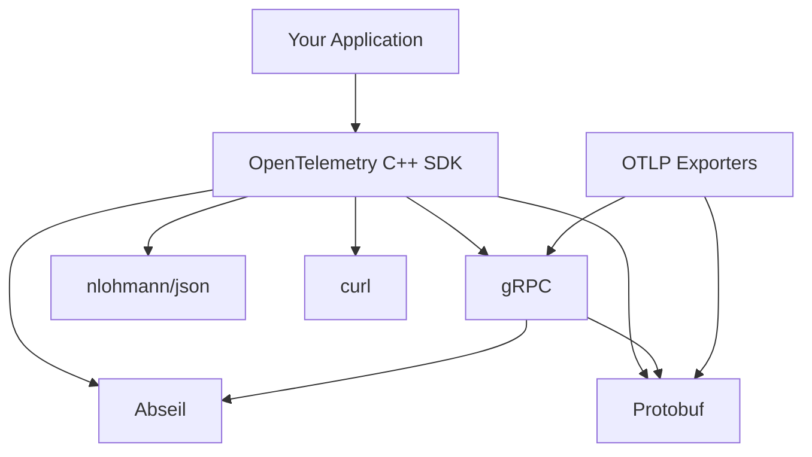
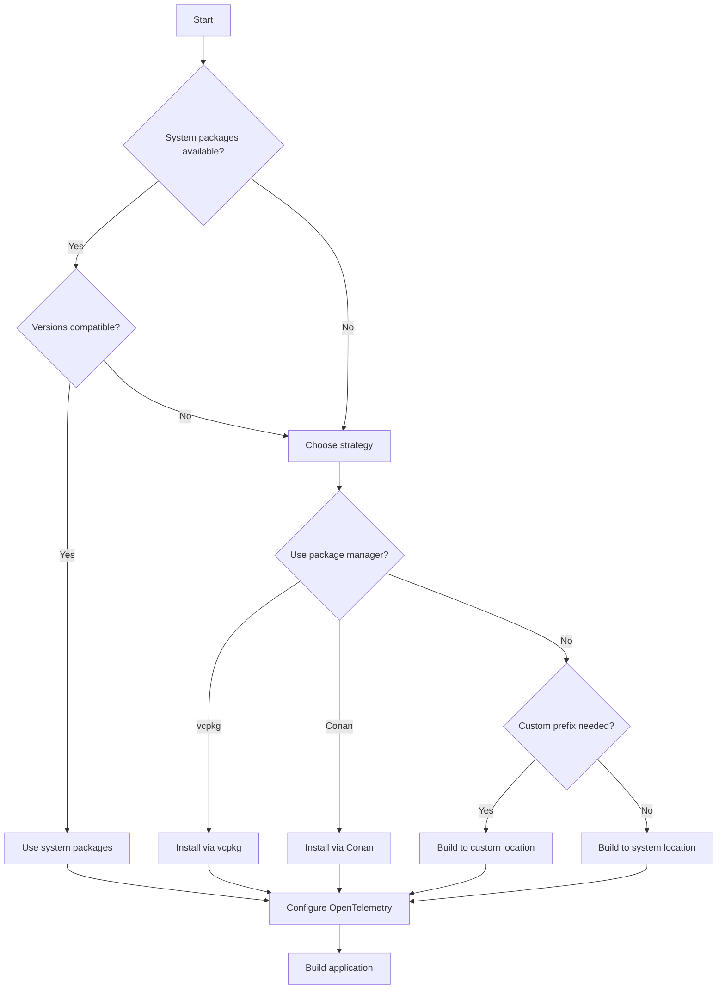

# How to Manage OpenTelemetry C++ Dependencies (Abseil, Protobuf, gRPC)

Author: [nawazdhandala](https://www.github.com/nawazdhandala)

Tags: OpenTelemetry, C++, Dependencies, Abseil, Protobuf, gRPC

Description: A comprehensive guide to managing OpenTelemetry C++ SDK dependencies including Abseil, Protobuf, and gRPC, covering version compatibility, build configurations, and troubleshooting common dependency conflicts.

Managing dependencies is one of the most challenging aspects of working with OpenTelemetry C++. The SDK relies on several complex libraries, and version mismatches can lead to difficult-to-debug compilation or runtime errors.

## Understanding the Dependency Tree

The OpenTelemetry C++ SDK has a hierarchical dependency structure:



Each dependency has specific version requirements that must align across the entire stack.

## Version Compatibility Matrix

As of early 2026, these versions work well together:

- OpenTelemetry C++: 1.14.x or later
- Abseil: 20240116.x (LTS branch)
- Protobuf: 3.21.x or 4.25.x
- gRPC: 1.60.x or later
- CMake: 3.20 or later

Using versions outside these ranges can cause compilation failures or runtime crashes.

## Strategy 1: Using System-Installed Dependencies

If your system has compatible versions, use them to reduce build time:

```bash
# Ubuntu/Debian
sudo apt-get update
sudo apt-get install \
    libabsl-dev \
    libprotobuf-dev \
    protobuf-compiler \
    libgrpc++-dev \
    libcurl4-openssl-dev \
    nlohmann-json3-dev

# Check installed versions
dpkg -l | grep libabsl
dpkg -l | grep libprotobuf
dpkg -l | grep libgrpc
```

Configure OpenTelemetry to use these system libraries:

```bash
cd opentelemetry-cpp
mkdir build && cd build

cmake .. \
  -DCMAKE_BUILD_TYPE=Release \
  -DBUILD_SHARED_LIBS=ON \
  -DWITH_OTLP_GRPC=ON \
  -DWITH_OTLP_HTTP=ON \
  -DWITH_ABSEIL=ON \
  -DCMAKE_INSTALL_PREFIX=/usr/local

cmake --build . -j$(nproc)
sudo cmake --install .
```

## Strategy 2: Building Dependencies from Source

When system packages are unavailable or incompatible, build dependencies from source.

### Building Abseil

Abseil provides foundational utilities used throughout the stack:

```bash
# Clone Abseil at a specific LTS version
git clone https://github.com/abseil/abseil-cpp.git
cd abseil-cpp
git checkout 20240116.2

mkdir build && cd build

# Configure Abseil
cmake .. \
  -DCMAKE_BUILD_TYPE=Release \
  -DCMAKE_CXX_STANDARD=17 \
  -DABSL_PROPAGATE_CXX_STD=ON \
  -DBUILD_SHARED_LIBS=ON \
  -DCMAKE_POSITION_INDEPENDENT_CODE=ON \
  -DCMAKE_INSTALL_PREFIX=/usr/local

cmake --build . -j$(nproc)
sudo cmake --install .
```

The `ABSL_PROPAGATE_CXX_STD` flag ensures Abseil uses the same C++ standard as your application.

### Building Protobuf

Protobuf serializes telemetry data in the OTLP format:

```bash
# Download and extract Protobuf
wget https://github.com/protocolbuffers/protobuf/releases/download/v25.3/protobuf-25.3.tar.gz
tar -xzf protobuf-25.3.tar.gz
cd protobuf-25.3

mkdir build && cd build

# Configure Protobuf
cmake .. \
  -DCMAKE_BUILD_TYPE=Release \
  -DCMAKE_CXX_STANDARD=17 \
  -Dprotobuf_BUILD_TESTS=OFF \
  -Dprotobuf_BUILD_SHARED_LIBS=ON \
  -Dprotobuf_ABSL_PROVIDER=package \
  -DCMAKE_INSTALL_PREFIX=/usr/local

cmake --build . -j$(nproc)
sudo cmake --install .
```

The `protobuf_ABSL_PROVIDER=package` tells Protobuf to use the Abseil you installed earlier.

### Building gRPC

gRPC provides the transport layer for OTLP:

```bash
# Clone gRPC with submodules
git clone --recurse-submodules -b v1.62.0 https://github.com/grpc/grpc
cd grpc

mkdir build && cd build

# Configure gRPC
cmake .. \
  -DCMAKE_BUILD_TYPE=Release \
  -DCMAKE_CXX_STANDARD=17 \
  -DgRPC_INSTALL=ON \
  -DgRPC_BUILD_TESTS=OFF \
  -DgRPC_ABSL_PROVIDER=package \
  -DgRPC_PROTOBUF_PROVIDER=package \
  -DgRPC_SSL_PROVIDER=package \
  -DBUILD_SHARED_LIBS=ON \
  -DCMAKE_INSTALL_PREFIX=/usr/local

cmake --build . -j$(nproc)
sudo cmake --install .
```

Setting providers to "package" ensures gRPC uses your installed dependencies.

## Strategy 3: Using OpenTelemetry's Bundled Dependencies

Let OpenTelemetry build all dependencies from its submodules:

```bash
cd opentelemetry-cpp
git submodule update --init --recursive

mkdir build && cd build

cmake .. \
  -DCMAKE_BUILD_TYPE=Release \
  -DBUILD_SHARED_LIBS=ON \
  -DWITH_OTLP_GRPC=ON \
  -DWITH_ABSEIL=OFF \
  -DCMAKE_INSTALL_PREFIX=/usr/local

cmake --build . -j$(nproc)
sudo cmake --install .
```

With `WITH_ABSEIL=OFF`, OpenTelemetry builds Abseil from the bundled submodule. This approach guarantees compatibility but increases build time significantly.

## Strategy 4: Using vcpkg Package Manager

vcpkg simplifies dependency management on all platforms:

```bash
# Install vcpkg
git clone https://github.com/microsoft/vcpkg.git
cd vcpkg
./bootstrap-vcpkg.sh

# Install dependencies
./vcpkg install abseil protobuf grpc opentelemetry-cpp

# Use in your project
cmake -DCMAKE_TOOLCHAIN_FILE=/path/to/vcpkg/scripts/buildsystems/vcpkg.cmake ..
```

vcpkg handles version compatibility automatically, making it ideal for cross-platform development.

## Strategy 5: Using Conan Package Manager

Conan is another excellent option for C++ dependency management:

```bash
# Install Conan
pip install conan

# Create conanfile.txt
cat > conanfile.txt << EOF
[requires]
abseil/20240116.2
protobuf/3.21.12
grpc/1.62.0
opentelemetry-cpp/1.14.2

[generators]
CMakeDeps
CMakeToolchain

[options]
opentelemetry-cpp:with_otlp_grpc=True
EOF

# Install dependencies
conan install . --build=missing -s compiler.cppstd=17

# Use in CMake
cmake -DCMAKE_TOOLCHAIN_FILE=conan_toolchain.cmake ..
```

## Resolving ABI Compatibility Issues

Different C++ standard versions create ABI incompatibilities. Ensure consistency:

```cmake
# In your CMakeLists.txt
set(CMAKE_CXX_STANDARD 17)
set(CMAKE_CXX_STANDARD_REQUIRED ON)

# When building dependencies, always specify the same standard
cmake -DCMAKE_CXX_STANDARD=17 ..
```

All libraries in your dependency chain must use the same C++ standard and compiler version.

## Handling Multiple Protobuf Versions

Systems often have multiple Protobuf versions installed. Force CMake to use the correct one:

```bash
# Uninstall conflicting versions
sudo apt-get remove libprotobuf-dev

# Or specify the exact version
cmake .. \
  -DProtobuf_PROTOC_EXECUTABLE=/usr/local/bin/protoc \
  -DProtobuf_LIBRARY=/usr/local/lib/libprotobuf.so \
  -DProtobuf_INCLUDE_DIR=/usr/local/include
```

## Custom Installation Prefix

Install all dependencies to a custom location to avoid system conflicts:

```bash
# Set a custom prefix
export INSTALL_PREFIX=$HOME/otel-deps
export CMAKE_PREFIX_PATH=$INSTALL_PREFIX

# Build Abseil
cd abseil-cpp/build
cmake .. -DCMAKE_INSTALL_PREFIX=$INSTALL_PREFIX
cmake --build . && cmake --install .

# Build Protobuf
cd protobuf/build
cmake .. -DCMAKE_INSTALL_PREFIX=$INSTALL_PREFIX
cmake --build . && cmake --install .

# Build gRPC
cd grpc/build
cmake .. \
  -DCMAKE_INSTALL_PREFIX=$INSTALL_PREFIX \
  -DCMAKE_PREFIX_PATH=$INSTALL_PREFIX \
  -DgRPC_ABSL_PROVIDER=package \
  -DgRPC_PROTOBUF_PROVIDER=package
cmake --build . && cmake --install .

# Build OpenTelemetry
cd opentelemetry-cpp/build
cmake .. \
  -DCMAKE_INSTALL_PREFIX=$INSTALL_PREFIX \
  -DCMAKE_PREFIX_PATH=$INSTALL_PREFIX
cmake --build . && cmake --install .
```

## Your Application's CMakeLists.txt

Configure your application to find all dependencies:

```cmake
cmake_minimum_required(VERSION 3.20)
project(MyApp CXX)

set(CMAKE_CXX_STANDARD 17)
set(CMAKE_CXX_STANDARD_REQUIRED ON)

# Set prefix path if using custom installation
list(APPEND CMAKE_PREFIX_PATH "$ENV{HOME}/otel-deps")

# Find all required packages
find_package(absl REQUIRED)
find_package(Protobuf REQUIRED)
find_package(gRPC REQUIRED)
find_package(opentelemetry-cpp REQUIRED)

add_executable(myapp main.cpp)

target_link_libraries(myapp
    PRIVATE
    opentelemetry-cpp::api
    opentelemetry-cpp::sdk
    opentelemetry-cpp::otlp_grpc_exporter
    gRPC::grpc++
    protobuf::libprotobuf
    absl::base
)
```

## Troubleshooting Common Issues

### Symbol Not Found Errors

Usually caused by mixing static and shared libraries:

```bash
# Ensure consistent library type
cmake .. -DBUILD_SHARED_LIBS=ON  # or OFF for all dependencies
```

### Undefined Reference to Abseil Symbols

Link against required Abseil components:

```cmake
target_link_libraries(myapp
    PRIVATE
    absl::strings
    absl::synchronization
    absl::time
    absl::variant
    absl::flat_hash_map
)
```

### Protobuf Version Mismatch

Runtime error about protobuf version:

```bash
# Verify versions match
protoc --version
pkg-config --modversion protobuf

# Rebuild everything with matching versions
```

## Docker-Based Development

Use Docker to manage dependencies consistently:

```dockerfile
FROM ubuntu:22.04

RUN apt-get update && apt-get install -y \
    build-essential \
    cmake \
    git \
    wget \
    libcurl4-openssl-dev \
    libssl-dev

# Install specific versions of dependencies
WORKDIR /deps

# Abseil
RUN git clone https://github.com/abseil/abseil-cpp.git && \
    cd abseil-cpp && git checkout 20240116.2 && \
    mkdir build && cd build && \
    cmake .. -DCMAKE_INSTALL_PREFIX=/usr/local -DCMAKE_CXX_STANDARD=17 && \
    make -j$(nproc) && make install

# Protobuf
RUN wget https://github.com/protocolbuffers/protobuf/releases/download/v25.3/protobuf-25.3.tar.gz && \
    tar -xzf protobuf-25.3.tar.gz && cd protobuf-25.3 && \
    mkdir build && cd build && \
    cmake .. -DCMAKE_INSTALL_PREFIX=/usr/local -Dprotobuf_ABSL_PROVIDER=package && \
    make -j$(nproc) && make install

# gRPC
RUN git clone -b v1.62.0 https://github.com/grpc/grpc && \
    cd grpc && git submodule update --init && \
    mkdir build && cd build && \
    cmake .. -DCMAKE_INSTALL_PREFIX=/usr/local \
             -DgRPC_ABSL_PROVIDER=package \
             -DgRPC_PROTOBUF_PROVIDER=package && \
    make -j$(nproc) && make install

# OpenTelemetry
RUN git clone https://github.com/open-telemetry/opentelemetry-cpp.git && \
    cd opentelemetry-cpp && \
    mkdir build && cd build && \
    cmake .. -DWITH_OTLP_GRPC=ON -DCMAKE_INSTALL_PREFIX=/usr/local && \
    make -j$(nproc) && make install

WORKDIR /app
```

## Dependency Management Flowchart



## Best Practices

1. Document exact dependency versions in your repository
2. Use the same C++ standard across all dependencies
3. Prefer package managers (vcpkg or Conan) for reproducibility
4. Test on a clean system to verify dependency resolution
5. Use custom prefixes during development to avoid system pollution
6. Pin dependency versions in production builds

Managing OpenTelemetry C++ dependencies requires careful attention to version compatibility and build configuration. Once you establish a working configuration, document it thoroughly and use containers or package managers to ensure reproducibility.
