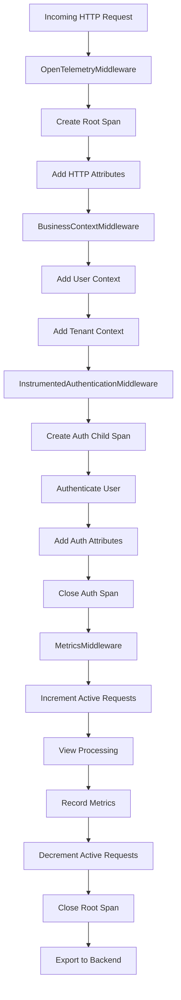

# How to Add Manual OpenTelemetry Instrumentation to Django Middleware

Author: [nawazdhandala](https://www.github.com/nawazdhandala)

Tags: OpenTelemetry, Django, Middleware, Python, Manual Instrumentation

Description: Master manual OpenTelemetry instrumentation in Django middleware to capture custom metrics, add business context to traces, and implement advanced observability patterns.

While auto-instrumentation provides basic observability, manual instrumentation in Django middleware gives you fine-grained control over what telemetry data gets collected. You can add custom attributes, create child spans for specific operations, record business metrics, and implement sophisticated context propagation across your service boundaries.

## Why Instrument Middleware Manually

Django middleware sits at the heart of your request processing pipeline. Every HTTP request passes through your middleware stack, making it the perfect place to:

- Add custom business context to traces (user ID, tenant ID, feature flags)
- Measure specific middleware operations (authentication, rate limiting, caching)
- Implement custom sampling strategies based on request attributes
- Add security-related attributes (IP address, user agent, authorization method)
- Track business metrics (API version usage, client type distribution)

Manual instrumentation gives you observability data that's tailored to your application's unique requirements, beyond what generic auto-instrumentation can provide.

## Setting Up the OpenTelemetry SDK

Before writing custom middleware, install the core OpenTelemetry SDK packages:

```bash
pip install opentelemetry-api opentelemetry-sdk opentelemetry-exporter-otlp
```

Initialize the OpenTelemetry SDK in your Django settings or a dedicated configuration module:

```python
# myproject/telemetry.py

from opentelemetry import trace
from opentelemetry.sdk.trace import TracerProvider
from opentelemetry.sdk.trace.export import BatchSpanProcessor
from opentelemetry.exporter.otlp.proto.http.trace_exporter import OTLPSpanExporter
from opentelemetry.sdk.resources import Resource

def initialize_telemetry():
    """Initialize OpenTelemetry SDK with OTLP exporter."""

    # Create a resource that identifies your service
    resource = Resource.create({
        "service.name": "django-api",
        "service.version": "1.0.0",
        "deployment.environment": "production",
    })

    # Set up the tracer provider
    provider = TracerProvider(resource=resource)

    # Configure OTLP exporter to send traces to your backend
    otlp_exporter = OTLPSpanExporter(
        endpoint="https://oneuptime.com/otlp/v1/traces",
        headers={"x-oneuptime-service-token": "your-token-here"}
    )

    # Use BatchSpanProcessor for async export with batching
    processor = BatchSpanProcessor(otlp_exporter)
    provider.add_span_processor(processor)

    # Set as global tracer provider
    trace.set_tracer_provider(provider)

# Call this during Django startup
initialize_telemetry()
```

Import this initialization in your `settings.py` or `wsgi.py`:

```python
# settings.py
from myproject.telemetry import initialize_telemetry

initialize_telemetry()
```

## Creating Basic Instrumentation Middleware

Here's a foundational middleware that creates a span for each request and adds basic attributes:

```python
# myproject/middleware/telemetry.py

from opentelemetry import trace
from opentelemetry.trace import SpanKind, Status, StatusCode
import time

class OpenTelemetryMiddleware:
    """Middleware that creates spans for all HTTP requests."""

    def __init__(self, get_response):
        self.get_response = get_response
        # Get a tracer instance for this middleware
        self.tracer = trace.get_tracer(__name__)

    def __call__(self, request):
        # Extract the current span context if it exists (for distributed tracing)
        # This is typically done by the auto-instrumentation, but we'll check anyway
        span_context = trace.get_current_span().get_span_context()

        # Create a new span for this request
        # Use SERVER kind since we're handling an incoming HTTP request
        with self.tracer.start_as_current_span(
            f"{request.method} {request.path}",
            kind=SpanKind.SERVER,
        ) as span:
            # Add standard HTTP semantic convention attributes
            span.set_attribute("http.method", request.method)
            span.set_attribute("http.url", request.build_absolute_uri())
            span.set_attribute("http.scheme", request.scheme)
            span.set_attribute("http.host", request.get_host())
            span.set_attribute("http.target", request.path)
            span.set_attribute("http.user_agent", request.META.get("HTTP_USER_AGENT", ""))

            # Add client IP address
            x_forwarded_for = request.META.get("HTTP_X_FORWARDED_FOR")
            if x_forwarded_for:
                span.set_attribute("http.client_ip", x_forwarded_for.split(",")[0].strip())
            else:
                span.set_attribute("http.client_ip", request.META.get("REMOTE_ADDR", ""))

            # Record start time
            start_time = time.time()

            try:
                # Process the request through the rest of the middleware stack
                response = self.get_response(request)

                # Add response attributes
                span.set_attribute("http.status_code", response.status_code)
                span.set_attribute("http.response.body.size", len(response.content))

                # Set span status based on HTTP status code
                if 200 <= response.status_code < 400:
                    span.set_status(Status(StatusCode.OK))
                elif 400 <= response.status_code < 500:
                    span.set_status(Status(StatusCode.ERROR, f"Client error: {response.status_code}"))
                else:
                    span.set_status(Status(StatusCode.ERROR, f"Server error: {response.status_code}"))

                return response

            except Exception as exc:
                # Record exception information
                span.record_exception(exc)
                span.set_status(Status(StatusCode.ERROR, str(exc)))
                raise

            finally:
                # Record total request duration
                duration = time.time() - start_time
                span.set_attribute("http.request.duration_ms", duration * 1000)
```

Add this middleware to your Django settings:

```python
# settings.py

MIDDLEWARE = [
    'django.middleware.security.SecurityMiddleware',
    'myproject.middleware.telemetry.OpenTelemetryMiddleware',  # Add near the top
    'django.middleware.common.CommonMiddleware',
    # ... rest of your middleware
]
```

## Adding Business Context to Spans

The real power of manual instrumentation comes from adding business-specific context. Here's an enhanced middleware that adds user and tenant information:

```python
# myproject/middleware/business_context.py

from opentelemetry import trace
from opentelemetry.trace import SpanKind

class BusinessContextMiddleware:
    """Add business context attributes to the current span."""

    def __init__(self, get_response):
        self.get_response = get_response

    def __call__(self, request):
        # Get the current span (created by previous middleware or auto-instrumentation)
        span = trace.get_current_span()

        # Add user information if authenticated
        if hasattr(request, 'user') and request.user.is_authenticated:
            span.set_attribute("user.id", str(request.user.id))
            span.set_attribute("user.username", request.user.username)
            span.set_attribute("user.email", request.user.email)

            # Add user groups or roles
            if request.user.groups.exists():
                groups = [g.name for g in request.user.groups.all()]
                span.set_attribute("user.groups", ",".join(groups))

        # Add tenant/organization context (if using multi-tenancy)
        if hasattr(request, 'tenant'):
            span.set_attribute("tenant.id", str(request.tenant.id))
            span.set_attribute("tenant.name", request.tenant.name)
            span.set_attribute("tenant.tier", request.tenant.subscription_tier)

        # Add API version from header or URL
        api_version = request.headers.get("X-API-Version") or request.GET.get("version", "v1")
        span.set_attribute("api.version", api_version)

        # Add request correlation ID (useful for log correlation)
        request_id = request.headers.get("X-Request-ID")
        if request_id:
            span.set_attribute("request.id", request_id)

        # Process request
        response = self.get_response(request)

        # Add response-time attributes
        if hasattr(response, 'x_processing_time'):
            span.set_attribute("app.processing_time_ms", response.x_processing_time)

        return response
```

## Creating Child Spans for Middleware Operations

For middleware that performs complex operations, create child spans to measure specific steps:

```python
# myproject/middleware/auth_telemetry.py

from opentelemetry import trace
from django.contrib.auth.middleware import AuthenticationMiddleware as DjangoAuthMiddleware
import time

class InstrumentedAuthenticationMiddleware(DjangoAuthMiddleware):
    """Authentication middleware with detailed span instrumentation."""

    def __init__(self, get_response):
        super().__init__(get_response)
        self.tracer = trace.get_tracer(__name__)

    def __call__(self, request):
        # Create a child span specifically for authentication
        with self.tracer.start_as_current_span("authenticate_request") as auth_span:
            auth_span.set_attribute("auth.method", self._detect_auth_method(request))

            start_time = time.time()

            # Call parent authentication logic
            try:
                response = super().__call__(request)

                # Add authentication result attributes
                if hasattr(request, 'user'):
                    auth_span.set_attribute("auth.success", request.user.is_authenticated)
                    if request.user.is_authenticated:
                        auth_span.set_attribute("auth.user_id", str(request.user.id))
                        auth_span.set_attribute("auth.backend",
                            request.user.backend if hasattr(request.user, 'backend') else "unknown")

                duration = (time.time() - start_time) * 1000
                auth_span.set_attribute("auth.duration_ms", duration)

                return response

            except Exception as exc:
                auth_span.record_exception(exc)
                auth_span.set_attribute("auth.success", False)
                auth_span.set_attribute("auth.error", str(exc))
                raise

    def _detect_auth_method(self, request):
        """Detect which authentication method is being used."""
        if request.headers.get("Authorization", "").startswith("Bearer"):
            return "bearer_token"
        elif request.headers.get("Authorization", "").startswith("Basic"):
            return "basic_auth"
        elif "sessionid" in request.COOKIES:
            return "session"
        else:
            return "none"
```

## Implementing Custom Metrics in Middleware

Beyond traces, you can record custom metrics for monitoring application behavior:

```python
# myproject/middleware/metrics.py

from opentelemetry import trace, metrics
from opentelemetry.metrics import get_meter
import time

class MetricsMiddleware:
    """Middleware that records custom metrics about requests."""

    def __init__(self, get_response):
        self.get_response = get_response

        # Get a meter for recording metrics
        meter = get_meter(__name__)

        # Create metric instruments
        self.request_counter = meter.create_counter(
            name="http.server.requests",
            description="Total number of HTTP requests",
            unit="1"
        )

        self.request_duration = meter.create_histogram(
            name="http.server.request.duration",
            description="HTTP request duration",
            unit="ms"
        )

        self.active_requests = meter.create_up_down_counter(
            name="http.server.active_requests",
            description="Number of active HTTP requests",
            unit="1"
        )

    def __call__(self, request):
        # Increment active request counter
        attributes = {
            "http.method": request.method,
            "http.scheme": request.scheme,
        }
        self.active_requests.add(1, attributes)

        start_time = time.time()

        try:
            response = self.get_response(request)

            # Add status code to attributes
            attributes["http.status_code"] = response.status_code

            # Calculate request duration
            duration = (time.time() - start_time) * 1000

            # Record metrics
            self.request_counter.add(1, attributes)
            self.request_duration.record(duration, attributes)

            return response

        finally:
            # Decrement active request counter
            self.active_requests.add(-1, attributes)
```

## Middleware Request Flow Visualization

Here's how requests flow through instrumented middleware:



## Context Propagation Patterns

When making outbound requests from middleware, propagate trace context to enable distributed tracing:

```python
# myproject/middleware/rate_limit.py

from opentelemetry import trace
from opentelemetry.propagate import inject
import requests

class RateLimitMiddleware:
    """Rate limiting middleware with distributed tracing support."""

    def __init__(self, get_response):
        self.get_response = get_response
        self.tracer = trace.get_tracer(__name__)

    def __call__(self, request):
        # Create span for rate limit check
        with self.tracer.start_as_current_span("check_rate_limit") as span:
            user_id = request.user.id if request.user.is_authenticated else None

            if user_id:
                span.set_attribute("rate_limit.user_id", str(user_id))

                # Check rate limit with external service
                allowed = self._check_rate_limit_service(user_id)
                span.set_attribute("rate_limit.allowed", allowed)

                if not allowed:
                    span.set_attribute("rate_limit.exceeded", True)
                    # Return 429 Too Many Requests
                    from django.http import HttpResponse
                    return HttpResponse("Rate limit exceeded", status=429)

        return self.get_response(request)

    def _check_rate_limit_service(self, user_id):
        """Check rate limit with external service, propagating trace context."""
        headers = {}

        # Inject current trace context into outbound request headers
        inject(headers)

        response = requests.get(
            f"http://rate-limiter:8080/check/{user_id}",
            headers=headers,
            timeout=0.5
        )

        return response.json().get("allowed", True)
```

## Error Handling and Exception Tracking

Properly instrument error handling to capture detailed exception information:

```python
# myproject/middleware/error_tracking.py

from opentelemetry import trace
from opentelemetry.trace import Status, StatusCode
import traceback
import sys

class ErrorTrackingMiddleware:
    """Middleware that adds detailed error information to spans."""

    def __init__(self, get_response):
        self.get_response = get_response

    def __call__(self, request):
        try:
            return self.get_response(request)
        except Exception as exc:
            # Get current span
            span = trace.get_current_span()

            # Record detailed exception information
            span.record_exception(exc)

            # Add custom error attributes
            span.set_attribute("error.type", type(exc).__name__)
            span.set_attribute("error.message", str(exc))
            span.set_attribute("error.stack", traceback.format_exc())

            # Mark span as error
            span.set_status(Status(StatusCode.ERROR, str(exc)))

            # Re-raise to let Django's error handling continue
            raise

    def process_exception(self, request, exception):
        """Django's exception processing hook."""
        span = trace.get_current_span()

        # Add request context to error
        span.set_attribute("error.request.path", request.path)
        span.set_attribute("error.request.method", request.method)

        if request.user.is_authenticated:
            span.set_attribute("error.user.id", str(request.user.id))

        return None  # Let Django handle the exception
```

## Performance Monitoring and Sampling

Implement smart sampling to control data volume while maintaining visibility:

```python
# myproject/middleware/sampling.py

from opentelemetry import trace
from opentelemetry.sdk.trace.sampling import Sampler, SamplingResult, Decision

class AdaptiveSamplingMiddleware:
    """Middleware that implements adaptive sampling based on request attributes."""

    def __init__(self, get_response):
        self.get_response = get_response

    def __call__(self, request):
        # Get current span
        span = trace.get_current_span()

        # Always sample error responses and slow requests
        response = self.get_response(request)

        # Add sampling decision attributes
        if response.status_code >= 400:
            span.set_attribute("sampling.reason", "error_response")
            span.set_attribute("sampling.important", True)
        elif hasattr(request, '_processing_time') and request._processing_time > 1.0:
            span.set_attribute("sampling.reason", "slow_request")
            span.set_attribute("sampling.important", True)
        else:
            span.set_attribute("sampling.reason", "normal")

        return response
```

## Testing Instrumented Middleware

Write tests to verify your instrumentation captures the expected data:

```python
# tests/test_telemetry_middleware.py

from django.test import TestCase, RequestFactory
from opentelemetry import trace
from opentelemetry.sdk.trace import TracerProvider
from opentelemetry.sdk.trace.export import SimpleSpanProcessor
from opentelemetry.sdk.trace.export.in_memory_span_exporter import InMemorySpanExporter

class TelemetryMiddlewareTestCase(TestCase):
    def setUp(self):
        # Set up in-memory exporter for testing
        self.exporter = InMemorySpanExporter()
        provider = TracerProvider()
        provider.add_span_processor(SimpleSpanProcessor(self.exporter))
        trace.set_tracer_provider(provider)

        self.factory = RequestFactory()

    def test_span_created_for_request(self):
        """Test that a span is created for each request."""
        from myproject.middleware.telemetry import OpenTelemetryMiddleware

        def dummy_view(request):
            from django.http import HttpResponse
            return HttpResponse("OK")

        middleware = OpenTelemetryMiddleware(dummy_view)
        request = self.factory.get('/test/')

        response = middleware(request)

        # Verify span was created and exported
        spans = self.exporter.get_finished_spans()
        self.assertEqual(len(spans), 1)

        span = spans[0]
        self.assertEqual(span.attributes["http.method"], "GET")
        self.assertEqual(span.attributes["http.target"], "/test/")
        self.assertEqual(span.attributes["http.status_code"], 200)
```

## Next Steps

With manual middleware instrumentation in place, you can:

- Add custom business logic spans within views
- Instrument database queries for detailed query analysis
- Track background task execution
- Monitor cache hit rates and performance

For API-specific observability, check out our guide on [tracing Django REST Framework endpoints with OpenTelemetry](https://oneuptime.com/blog/post/2026-02-06-trace-django-rest-framework-api-opentelemetry/view).

Manual middleware instrumentation gives you complete control over your observability data. Combined with auto-instrumentation for standard framework operations, you get comprehensive visibility into both technical performance and business metrics that matter to your application.
