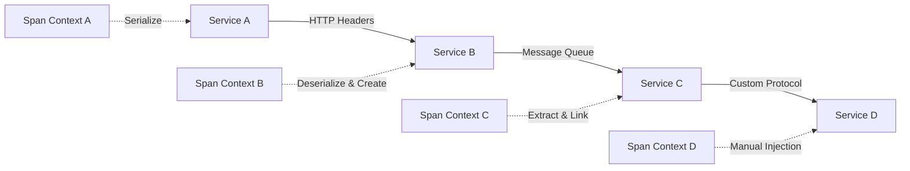

# How to Manually Set Span Context for Cross-Service Tracing in Python

Author: [nawazdhandala](https://www.github.com/nawazdhandala)

Tags: OpenTelemetry, Python, Span Context, Cross-Service, Distributed Tracing

Description: Learn how to manually create and propagate span contexts across service boundaries in Python OpenTelemetry for complete distributed trace visibility.

Cross-service tracing in distributed systems relies on propagating span context from one service to another. While OpenTelemetry's auto-instrumentation handles this automatically for common protocols like HTTP and gRPC, there are scenarios where you need manual control over span context creation and propagation.

## When Manual Context Management Matters

Auto-instrumentation works great for standard communication patterns, but real-world systems often use custom protocols, message queues, or proprietary RPC frameworks. You might be working with legacy systems that communicate through shared databases, file systems, or message brokers that aren't automatically instrumented. In these cases, manually managing span context becomes essential for maintaining trace continuity.

Another common scenario involves asynchronous processing where the correlation between incoming requests and background jobs isn't automatically tracked. Queue-based architectures, scheduled tasks, or event-driven systems all benefit from explicit span context management.

## Span Context Fundamentals

A span context contains the minimum information needed to correlate spans across process boundaries. This includes the trace ID (identifying the entire distributed transaction), span ID (identifying the current operation), trace flags (containing sampling decisions), and trace state (for vendor-specific data propagation).



## Understanding Span Context Components

Before manually creating span contexts, you need to understand what makes up a span context. Each component plays a specific role in distributed tracing.

```python
from opentelemetry import trace
from opentelemetry.trace import SpanContext, TraceFlags, TraceState
from opentelemetry.sdk.trace import TracerProvider
from opentelemetry.sdk.trace.export import ConsoleSpanExporter, BatchSpanProcessor

# Set up tracing infrastructure
provider = TracerProvider()
provider.add_span_processor(BatchSpanProcessor(ConsoleSpanExporter()))
trace.set_tracer_provider(provider)
tracer = trace.get_tracer(__name__)

def inspect_span_context():
    """
    Demonstrates the components of a span context.
    Understanding these components is crucial for manual context creation.
    """
    with tracer.start_as_current_span("example_span") as span:
        # Get the span context from the current span
        span_ctx = span.get_span_context()

        # Trace ID: 128-bit identifier for the entire distributed trace
        # All spans in a trace share the same trace_id
        print(f"Trace ID: {format(span_ctx.trace_id, '032x')}")

        # Span ID: 64-bit identifier for this specific span
        # Each span has a unique span_id
        print(f"Span ID: {format(span_ctx.span_id, '016x')}")

        # Trace Flags: 8-bit field containing sampling decision
        # 0x01 means sampled, 0x00 means not sampled
        print(f"Trace Flags: {span_ctx.trace_flags}")
        print(f"Is Sampled: {span_ctx.trace_flags.sampled}")

        # Trace State: vendor-specific key-value pairs
        # Used for additional propagation metadata
        print(f"Trace State: {span_ctx.trace_state}")

        # Remote: indicates if context came from another process
        print(f"Is Remote: {span_ctx.is_remote}")

        # Valid: ensures the context has valid trace and span IDs
        print(f"Is Valid: {span_ctx.is_valid}")

inspect_span_context()
```

## Creating Span Contexts Manually

When you need to manually create a span context, you're typically reconstructing it from serialized data received from another service or system.

```python
def create_manual_span_context(trace_id_hex: str, span_id_hex: str, sampled: bool = True):
    """
    Creates a span context manually from trace and span IDs.
    This is useful when receiving context from non-instrumented systems.
    """
    # Convert hex strings to integers
    # Trace ID is 128 bits (32 hex characters)
    trace_id = int(trace_id_hex, 16)

    # Span ID is 64 bits (16 hex characters)
    span_id = int(span_id_hex, 16)

    # Set trace flags based on sampling decision
    trace_flags = TraceFlags(0x01) if sampled else TraceFlags(0x00)

    # Create trace state (optional vendor-specific data)
    trace_state = TraceState([("vendor_key", "vendor_value")])

    # Construct the span context
    # is_remote=True indicates this context came from another process
    span_context = SpanContext(
        trace_id=trace_id,
        span_id=span_id,
        is_remote=True,
        trace_flags=trace_flags,
        trace_state=trace_state
    )

    return span_context

# Example usage
trace_id = "4bf92f3577b34da6a3ce929d0e0e4736"
span_id = "00f067aa0ba902b7"

manual_context = create_manual_span_context(trace_id, span_id)
print(f"Created manual context: {manual_context}")
print(f"Valid: {manual_context.is_valid()}")
```

## Using Manual Context as Parent Span

Once you've created a span context, you need to use it as the parent for new spans. This links your local spans to the distributed trace.

```python
from opentelemetry import context as otel_context
from opentelemetry.trace import set_span_in_context

def process_with_manual_parent(trace_id_hex: str, span_id_hex: str, data: dict):
    """
    Creates spans that are children of a manually-created parent context.
    This maintains trace continuity across service boundaries.
    """
    # Create the parent span context from received IDs
    parent_context = create_manual_span_context(trace_id_hex, span_id_hex)

    # Create a non-recording span with this context
    # This represents the remote parent span
    parent_span = trace.NonRecordingSpan(parent_context)

    # Set this span as the parent in the context
    ctx = set_span_in_context(parent_span)

    # Attach the context to make it current
    token = otel_context.attach(ctx)

    try:
        # New spans created here will be children of the remote parent
        with tracer.start_as_current_span("process_data") as span:
            span.set_attribute("data.size", len(str(data)))

            # This span's parent_id will be the span_id from the manual context
            # This span's trace_id will be the trace_id from the manual context
            result = perform_processing(data)

            # Create nested spans - they all belong to the same trace
            with tracer.start_as_current_span("validate_result") as validation_span:
                validation_span.set_attribute("result.valid", True)

            return result

    finally:
        # Always detach to restore previous context
        otel_context.detach(token)

def perform_processing(data: dict):
    """Nested operation that's part of the distributed trace."""
    with tracer.start_as_current_span("compute") as span:
        span.set_attribute("operation", "compute")
        return {"processed": True, "data": data}

# Simulate receiving context from another service
received_trace_id = "4bf92f3577b34da6a3ce929d0e0e4736"
received_span_id = "00f067aa0ba902b7"

result = process_with_manual_parent(
    received_trace_id,
    received_span_id,
    {"key": "value"}
)
```

## Serializing and Deserializing Context

For custom protocols or message formats, you need to manually serialize and deserialize span contexts.

```python
import json
from typing import Dict, Optional

def serialize_span_context(span: trace.Span) -> Dict[str, str]:
    """
    Serializes a span context to a dictionary for custom transport.
    Use this when you can't use standard HTTP headers or OTLP format.
    """
    span_ctx = span.get_span_context()

    return {
        "trace_id": format(span_ctx.trace_id, '032x'),
        "span_id": format(span_ctx.span_id, '016x'),
        "trace_flags": format(span_ctx.trace_flags, '02x'),
        "trace_state": str(span_ctx.trace_state) if span_ctx.trace_state else "",
        "is_remote": str(span_ctx.is_remote)
    }

def deserialize_span_context(data: Dict[str, str]) -> Optional[SpanContext]:
    """
    Deserializes a span context from a dictionary.
    Returns None if the data is invalid.
    """
    try:
        trace_id = int(data["trace_id"], 16)
        span_id = int(data["span_id"], 16)
        trace_flags = TraceFlags(int(data.get("trace_flags", "01"), 16))

        # Parse trace state if present
        trace_state_str = data.get("trace_state", "")
        trace_state = None
        if trace_state_str:
            # Parse trace state format: key1=value1,key2=value2
            pairs = []
            for item in trace_state_str.split(","):
                if "=" in item:
                    key, value = item.split("=", 1)
                    pairs.append((key.strip(), value.strip()))
            trace_state = TraceState(pairs) if pairs else None

        return SpanContext(
            trace_id=trace_id,
            span_id=span_id,
            is_remote=True,
            trace_flags=trace_flags,
            trace_state=trace_state
        )
    except (KeyError, ValueError) as e:
        print(f"Failed to deserialize span context: {e}")
        return None

# Example: Sending context through custom protocol
def send_custom_message(data: dict):
    """
    Sends a message using a custom protocol with embedded trace context.
    """
    with tracer.start_as_current_span("send_message") as span:
        # Serialize the current span context
        context_data = serialize_span_context(span)

        # Embed context in the message
        message = {
            "payload": data,
            "trace_context": context_data,
            "timestamp": "2026-02-06T10:30:00Z"
        }

        # Send message (simulated)
        send_to_custom_transport(json.dumps(message))

        span.set_attribute("message.sent", True)

def receive_custom_message(message_json: str):
    """
    Receives a message from a custom protocol and reconstructs trace context.
    """
    message = json.loads(message_json)

    # Deserialize the embedded trace context
    context_data = message.get("trace_context", {})
    parent_context = deserialize_span_context(context_data)

    if parent_context and parent_context.is_valid():
        # Create a non-recording span with the parent context
        parent_span = trace.NonRecordingSpan(parent_context)
        ctx = set_span_in_context(parent_span)

        token = otel_context.attach(ctx)

        try:
            # Process message with trace continuity
            with tracer.start_as_current_span("receive_message") as span:
                span.set_attribute("message.received", True)
                payload = message.get("payload", {})
                return process_message_payload(payload)

        finally:
            otel_context.detach(token)
    else:
        # No valid context, start a new trace
        with tracer.start_as_current_span("receive_message_new_trace") as span:
            span.set_attribute("trace.new", True)
            payload = message.get("payload", {})
            return process_message_payload(payload)

def send_to_custom_transport(message: str):
    print(f"Sending: {message}")

def process_message_payload(payload: dict):
    return {"status": "processed", "data": payload}
```

## Database-Based Context Propagation

Some systems use databases as communication channels. Here's how to propagate context through database records.

```python
import sqlite3
from datetime import datetime

def store_task_with_context(db_connection, task_data: dict):
    """
    Stores a task in the database with embedded trace context.
    A worker process will pick this up later and continue the trace.
    """
    with tracer.start_as_current_span("store_task") as span:
        # Serialize current span context
        context_data = serialize_span_context(span)

        # Store task with context in database
        cursor = db_connection.cursor()
        cursor.execute("""
            INSERT INTO tasks (task_data, trace_id, span_id, trace_flags, created_at)
            VALUES (?, ?, ?, ?, ?)
        """, (
            json.dumps(task_data),
            context_data["trace_id"],
            context_data["span_id"],
            context_data["trace_flags"],
            datetime.utcnow().isoformat()
        ))
        db_connection.commit()

        task_id = cursor.lastrowid
        span.set_attribute("task.id", task_id)
        span.set_attribute("storage.type", "database")

        return task_id

def process_task_from_database(db_connection, task_id: int):
    """
    Retrieves a task from the database and continues the distributed trace.
    The trace context stored with the task links this processing to the original request.
    """
    cursor = db_connection.cursor()
    cursor.execute("""
        SELECT task_data, trace_id, span_id, trace_flags
        FROM tasks
        WHERE id = ?
    """, (task_id,))

    row = cursor.fetchone()
    if not row:
        print(f"Task {task_id} not found")
        return None

    task_data, trace_id, span_id, trace_flags = row

    # Reconstruct span context from database fields
    context_dict = {
        "trace_id": trace_id,
        "span_id": span_id,
        "trace_flags": trace_flags
    }

    parent_context = deserialize_span_context(context_dict)

    if parent_context and parent_context.is_valid():
        parent_span = trace.NonRecordingSpan(parent_context)
        ctx = set_span_in_context(parent_span)

        token = otel_context.attach(ctx)

        try:
            # Process task with trace continuity
            with tracer.start_as_current_span("process_task") as span:
                span.set_attribute("task.id", task_id)
                span.set_attribute("source", "database")

                task_obj = json.loads(task_data)
                result = execute_task(task_obj)

                # Update task status
                cursor.execute("""
                    UPDATE tasks SET status = ?, completed_at = ?
                    WHERE id = ?
                """, ("completed", datetime.utcnow().isoformat(), task_id))
                db_connection.commit()

                return result

        finally:
            otel_context.detach(token)

def execute_task(task_data: dict):
    """Executes the actual task logic."""
    with tracer.start_as_current_span("execute") as span:
        span.set_attribute("task.type", task_data.get("type", "unknown"))
        return {"executed": True, "result": "success"}

# Example usage
db = sqlite3.connect(":memory:")
db.execute("""
    CREATE TABLE tasks (
        id INTEGER PRIMARY KEY,
        task_data TEXT,
        trace_id TEXT,
        span_id TEXT,
        trace_flags TEXT,
        status TEXT DEFAULT 'pending',
        created_at TEXT,
        completed_at TEXT
    )
""")

# Producer stores task
task_id = store_task_with_context(db, {"type": "email", "recipient": "user@example.com"})

# Consumer processes task (potentially in different process/worker)
result = process_task_from_database(db, task_id)
```

## Handling Context in Legacy Systems Integration

When integrating with legacy systems that know nothing about OpenTelemetry, you can inject context at the boundary and extract it on the way back.

```python
def call_legacy_system(endpoint: str, payload: dict):
    """
    Calls a legacy system that doesn't understand OpenTelemetry.
    We inject context in a way the legacy system passes through unchanged.
    """
    with tracer.start_as_current_span("call_legacy_system") as span:
        span.set_attribute("legacy.endpoint", endpoint)

        # Serialize context into a format the legacy system will echo back
        context_data = serialize_span_context(span)

        # Add context as a special field in the payload
        # The legacy system doesn't understand it but will include it in the response
        enhanced_payload = {
            **payload,
            "__trace_context": context_data
        }

        # Call legacy system (simulated)
        response = legacy_http_call(endpoint, enhanced_payload)

        span.set_attribute("legacy.response_received", True)

        return response

def handle_legacy_callback(callback_data: dict):
    """
    Handles a callback from a legacy system.
    The system echoes back our context data, allowing us to continue the trace.
    """
    # Extract the context we embedded in the original call
    context_data = callback_data.get("__trace_context")

    if context_data:
        parent_context = deserialize_span_context(context_data)

        if parent_context and parent_context.is_valid():
            parent_span = trace.NonRecordingSpan(parent_context)
            ctx = set_span_in_context(parent_span)

            token = otel_context.attach(ctx)

            try:
                # Process callback with trace continuity
                with tracer.start_as_current_span("handle_callback") as span:
                    span.set_attribute("callback.source", "legacy_system")

                    # Remove our context data before processing
                    clean_data = {k: v for k, v in callback_data.items()
                                  if k != "__trace_context"}

                    result = process_legacy_callback(clean_data)
                    return result

            finally:
                otel_context.detach(token)
    else:
        # No context available, start new trace
        with tracer.start_as_current_span("handle_callback_no_context") as span:
            span.set_attribute("trace.new", True)
            result = process_legacy_callback(callback_data)
            return result

def legacy_http_call(endpoint: str, payload: dict):
    """Simulates calling a legacy system."""
    # Legacy system echoes back the payload with its response
    return {
        "status": "success",
        "result": {"processed": True},
        "__trace_context": payload.get("__trace_context")
    }

def process_legacy_callback(data: dict):
    return {"callback_processed": True, "data": data}
```

## Context Propagation Best Practices

When manually managing span contexts, following these patterns ensures reliable distributed tracing.

```python
def safe_context_extraction(message: dict, context_key: str = "trace_context"):
    """
    Safely extracts and validates span context from messages.
    Returns None if context is missing or invalid.
    """
    context_data = message.get(context_key)

    if not context_data:
        return None

    try:
        span_context = deserialize_span_context(context_data)

        # Validate the context
        if span_context and span_context.is_valid():
            return span_context
        else:
            print("Invalid span context received")
            return None

    except Exception as e:
        print(f"Error extracting context: {e}")
        return None

def process_with_fallback(message: dict):
    """
    Processes a message with automatic fallback to new trace if context is invalid.
    This pattern ensures processing continues even if context propagation fails.
    """
    parent_context = safe_context_extraction(message)

    if parent_context:
        # Continue existing trace
        parent_span = trace.NonRecordingSpan(parent_context)
        ctx = set_span_in_context(parent_span)
        token = otel_context.attach(ctx)

        try:
            with tracer.start_as_current_span("process_message") as span:
                span.set_attribute("trace.continued", True)
                return handle_message(message)
        finally:
            otel_context.detach(token)
    else:
        # Start new trace
        with tracer.start_as_current_span("process_message_new_trace") as span:
            span.set_attribute("trace.new", True)
            span.set_attribute("reason", "no_parent_context")
            return handle_message(message)

def handle_message(message: dict):
    return {"status": "processed"}
```

Manual span context management gives you the flexibility to maintain distributed traces across any communication channel. Whether you're working with legacy systems, custom protocols, or asynchronous processing, these patterns ensure your traces remain connected and meaningful. The key is careful serialization and validation of context data to maintain trace integrity across service boundaries.
