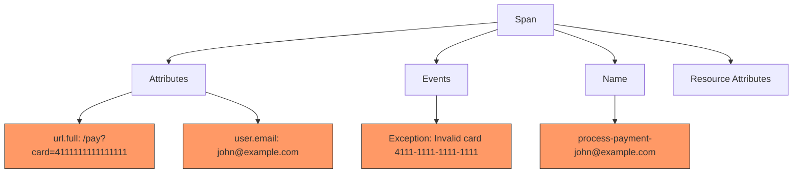
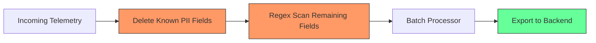

# How to Mask Credit Card Numbers and Email Addresses in OpenTelemetry Spans

Author: [nawazdhandala](https://www.github.com/nawazdhandala)

Tags: OpenTelemetry, Security, PII Masking, Traces, Data Privacy, PCI DSS, Collector

Description: Step-by-step guide to masking credit card numbers and email addresses in OpenTelemetry spans using SDK-level processors and Collector configuration.

---

Credit card numbers and email addresses are two of the most common types of sensitive data that leak into observability systems. A payment endpoint captures the card number in a span attribute. An error message includes the user's email. A database query logs the full credit card for a failed transaction. Once this data reaches your tracing backend, you have a compliance problem. PCI DSS prohibits storing full card numbers, and privacy regulations like GDPR require careful handling of personal data like email addresses.

The good news is that OpenTelemetry provides multiple layers where you can intercept and mask this data before it reaches your backend. This post shows you how to do it at both the SDK level and the Collector level, with working examples you can use directly.

## Where Sensitive Data Hides in Spans

Before writing masking rules, you need to understand where credit card numbers and emails typically appear in spans. Here are the most common locations:

- **Span attributes**: `http.url`, `http.target`, `url.full`, `url.query`, custom attributes like `payment.card_number`
- **Span events**: Exception messages often include the data that caused the error
- **Span names**: Sometimes applications dynamically build span names that include user data
- **Resource attributes**: Less common, but possible if service names or instance IDs are derived from user data



## SDK-Level Masking with a Custom SpanProcessor

The earliest point where you can mask data is inside your application, using a custom SpanProcessor. This approach catches sensitive data before it ever leaves the application process.

Here is a Python implementation that masks credit card numbers and email addresses in all span attributes.

```python
import re
from opentelemetry.sdk.trace import SpanProcessor

class PIIMaskingProcessor(SpanProcessor):
    """
    Masks credit card numbers and email addresses in span attributes.
    Runs inside the application process before data reaches the exporter.
    """

    # Regex for credit card numbers: 13-19 digits, with optional dashes or spaces
    # Covers Visa, Mastercard, Amex, Discover, and other major networks
    CC_PATTERN = re.compile(r'\b([0-9]{4})[\s\-]?[0-9]{4}[\s\-]?[0-9]{4}[\s\-]?([0-9]{1,4})\b')

    # Regex for email addresses
    EMAIL_PATTERN = re.compile(r'[a-zA-Z0-9._%+\-]+@[a-zA-Z0-9.\-]+\.[a-zA-Z]{2,}')

    def _mask_value(self, value):
        """Apply masking patterns to a string value."""
        if not isinstance(value, str):
            return value

        # Replace credit card numbers, keeping first 4 and last 4 digits
        # Example: 4111-1111-1111-1111 becomes 4111-****-****-1111
        result = self.CC_PATTERN.sub(r'\1-****-****-\2', value)

        # Replace email addresses with a masked version
        # Example: john@example.com becomes j***@***.com
        result = self.EMAIL_PATTERN.sub('[EMAIL-MASKED]', result)

        return result

    def on_start(self, span, parent_context=None):
        pass

    def on_end(self, span):
        """Mask sensitive data in all span attributes before export."""
        if not span.attributes:
            return

        # Build a new attributes dict with masked values
        masked_attrs = {}
        for key, value in span.attributes.items():
            masked_attrs[key] = self._mask_value(value)

        # Note: ReadableSpan attributes are immutable after end.
        # To modify them, you need to use a wrapper or modify before end.
        # In practice, use on_start or a custom exporter wrapper.

    def shutdown(self):
        pass

    def force_flush(self, timeout_millis=None):
        pass
```

A more practical approach for production is to wrap the exporter itself. Here is how to set up the masking processor with the tracer provider.

```python
from opentelemetry.sdk.trace import TracerProvider
from opentelemetry.sdk.trace.export import BatchSpanProcessor
from opentelemetry.exporter.otlp.proto.grpc.trace_exporter import OTLPSpanExporter

# Create the OTLP exporter
exporter = OTLPSpanExporter(endpoint="http://collector:4317")

# Create the tracer provider with the masking processor
provider = TracerProvider()

# Add the PII masking processor first
provider.add_span_processor(PIIMaskingProcessor())

# Then add the batch processor for export
provider.add_span_processor(BatchSpanProcessor(exporter))
```

For Java applications, you can achieve similar masking using a custom `SpanExporter` wrapper.

```java
// Java SpanExporter wrapper that masks PII before delegating to the real exporter
public class MaskingSpanExporter implements SpanExporter {

    private final SpanExporter delegate;
    // Pattern matches 16-digit credit card numbers with optional separators
    private static final Pattern CC_PATTERN =
        Pattern.compile("\\b(\\d{4})[\\s-]?\\d{4}[\\s-]?\\d{4}[\\s-]?(\\d{1,4})\\b");
    // Pattern matches standard email addresses
    private static final Pattern EMAIL_PATTERN =
        Pattern.compile("[a-zA-Z0-9._%+\\-]+@[a-zA-Z0-9.\\-]+\\.[a-zA-Z]{2,}");

    public MaskingSpanExporter(SpanExporter delegate) {
        this.delegate = delegate;
    }

    @Override
    public CompletableResultCode export(Collection<SpanData> spans) {
        // Create masked copies of each span before exporting
        List<SpanData> maskedSpans = spans.stream()
            .map(this::maskSpan)
            .collect(Collectors.toList());
        return delegate.export(maskedSpans);
    }

    private SpanData maskSpan(SpanData span) {
        // Iterate over attributes and apply masking to string values
        // Implementation would rebuild the span with masked attribute values
        // ...
        return span;
    }
}
```

## Collector-Level Masking with the Transform Processor

The Collector provides a second layer of defense. Even if the SDK-level masking misses something, the Collector can catch it before data reaches the backend.

Here is a Collector configuration that masks credit card numbers and email addresses using the transform processor.

```yaml
processors:
  # Mask credit card numbers in span attributes
  transform/mask-cc:
    trace_statements:
      - context: span
        statements:
          # Replace full credit card numbers with masked version
          # Matches 16 digits with optional dashes or spaces between groups
          - replace_pattern(attributes["payment.card_number"], "[0-9]{4}[\\-\\s]?[0-9]{4}[\\-\\s]?[0-9]{4}[\\-\\s]?[0-9]{4}", "[CC-MASKED]")

          # Scan URL query strings for credit card numbers
          - replace_pattern(attributes["url.query"], "[0-9]{4}[\\-\\s]?[0-9]{4}[\\-\\s]?[0-9]{4}[\\-\\s]?[0-9]{4}", "[CC-MASKED]")

          # Scan the full URL as well
          - replace_pattern(attributes["url.full"], "[0-9]{4}[\\-\\s]?[0-9]{4}[\\-\\s]?[0-9]{4}[\\-\\s]?[0-9]{4}", "[CC-MASKED]")

  # Mask email addresses in span attributes and log bodies
  transform/mask-email:
    trace_statements:
      - context: span
        statements:
          # Replace email addresses in common attributes
          - replace_pattern(attributes["user.email"], "[a-zA-Z0-9._%+\\-]+@[a-zA-Z0-9.\\-]+\\.[a-zA-Z]{2,}", "[EMAIL-MASKED]")
          - replace_pattern(attributes["url.full"], "[a-zA-Z0-9._%+\\-]+@[a-zA-Z0-9.\\-]+\\.[a-zA-Z]{2,}", "[EMAIL-MASKED]")
          - replace_pattern(attributes["url.query"], "[a-zA-Z0-9._%+\\-]+@[a-zA-Z0-9.\\-]+\\.[a-zA-Z]{2,}", "[EMAIL-MASKED]")

    log_statements:
      - context: log
        statements:
          # Scan log bodies for email addresses
          - replace_pattern(body, "[a-zA-Z0-9._%+\\-]+@[a-zA-Z0-9.\\-]+\\.[a-zA-Z]{2,}", "[EMAIL-MASKED]")
```

## Using the Attributes Processor for Known Fields

If you know exactly which attributes contain credit cards or emails, the simpler `attributes` processor can delete them entirely. This is faster than regex matching and guaranteed to remove the data.

```yaml
processors:
  # Delete known sensitive attribute keys entirely
  attributes/delete-pii:
    actions:
      # Remove the raw credit card number attribute
      - key: payment.card_number
        action: delete
      # Remove the CVV if it was captured
      - key: payment.cvv
        action: delete
      # Remove raw email - keep a hashed version for correlation
      - key: user.email
        action: hash
```

The `hash` action is useful for email addresses. It replaces the value with a SHA-256 hash, so you can still correlate spans by user without seeing the actual email address.

## Combining Both Approaches in a Full Pipeline

The most robust setup uses both the attributes processor for known fields and the transform processor for unknown or embedded PII.

```yaml
receivers:
  otlp:
    protocols:
      grpc:
        endpoint: 0.0.0.0:4317

processors:
  # Step 1: Delete known sensitive fields
  attributes/delete-sensitive:
    actions:
      - key: payment.card_number
        action: delete
      - key: payment.cvv
        action: delete
      - key: user.email
        action: hash
      - key: http.request.header.authorization
        action: delete

  # Step 2: Regex scan for PII in remaining attributes
  transform/mask-pii:
    trace_statements:
      - context: span
        statements:
          # Catch credit card numbers that might appear in unexpected attributes
          - replace_pattern(attributes["url.full"], "[0-9]{4}[\\-\\s]?[0-9]{4}[\\-\\s]?[0-9]{4}[\\-\\s]?[0-9]{4}", "[CC-MASKED]")
          - replace_pattern(attributes["url.query"], "[0-9]{4}[\\-\\s]?[0-9]{4}[\\-\\s]?[0-9]{4}[\\-\\s]?[0-9]{4}", "[CC-MASKED]")
          - replace_pattern(attributes["http.url"], "[0-9]{4}[\\-\\s]?[0-9]{4}[\\-\\s]?[0-9]{4}[\\-\\s]?[0-9]{4}", "[CC-MASKED]")
          # Catch email addresses in URL-related attributes
          - replace_pattern(attributes["url.full"], "[a-zA-Z0-9._%+\\-]+@[a-zA-Z0-9.\\-]+\\.[a-zA-Z]{2,}", "[EMAIL-MASKED]")
          - replace_pattern(attributes["url.query"], "[a-zA-Z0-9._%+\\-]+@[a-zA-Z0-9.\\-]+\\.[a-zA-Z]{2,}", "[EMAIL-MASKED]")

    log_statements:
      - context: log
        statements:
          - replace_pattern(body, "[0-9]{4}[\\-\\s]?[0-9]{4}[\\-\\s]?[0-9]{4}[\\-\\s]?[0-9]{4}", "[CC-MASKED]")
          - replace_pattern(body, "[a-zA-Z0-9._%+\\-]+@[a-zA-Z0-9.\\-]+\\.[a-zA-Z]{2,}", "[EMAIL-MASKED]")

  # Step 3: Batch for efficient export
  batch:
    timeout: 5s
    send_batch_size: 512

exporters:
  otlp:
    endpoint: backend.example.com:4317
    tls:
      insecure: false

service:
  pipelines:
    traces:
      receivers: [otlp]
      # Processors execute in the order listed
      processors: [attributes/delete-sensitive, transform/mask-pii, batch]
      exporters: [otlp]
    logs:
      receivers: [otlp]
      processors: [transform/mask-pii, batch]
      exporters: [otlp]
```



## Validating Your Masking Rules

After setting up your pipeline, you need to verify that the masking actually works. Send test data through with known credit card test numbers and email addresses, then inspect the output.

Use the Luhn-valid test card numbers for this purpose. These are publicly known test numbers that will not trigger real charges.

```bash
# Send a test span with a known test credit card number using the OTLP HTTP endpoint
curl -X POST http://localhost:4318/v1/traces \
  -H "Content-Type: application/json" \
  -d '{
    "resourceSpans": [{
      "resource": {"attributes": [{"key": "service.name", "value": {"stringValue": "test"}}]},
      "scopeSpans": [{
        "spans": [{
          "traceId": "5B8EFFF798038103D269B633813FC60C",
          "spanId": "EEE19B7EC3C1B174",
          "name": "test-masking",
          "kind": 1,
          "startTimeUnixNano": "1544712660000000000",
          "endTimeUnixNano": "1544712661000000000",
          "attributes": [
            {"key": "payment.card_number", "value": {"stringValue": "4111-1111-1111-1111"}},
            {"key": "user.email", "value": {"stringValue": "test@example.com"}},
            {"key": "url.full", "value": {"stringValue": "/pay?card=4111111111111111&email=test@example.com"}}
          ]
        }]
      }]
    }]
  }'
```

Then check your Collector logs or backend to confirm that:
- `payment.card_number` is deleted (not just masked)
- `user.email` is hashed
- The credit card number in `url.full` shows `[CC-MASKED]`
- The email in `url.full` shows `[EMAIL-MASKED]`

## Common Pitfalls

A few things to watch out for when implementing PII masking:

1. **URL encoding**: Credit card numbers or emails in URLs may be URL-encoded. The character `@` becomes `%40`, and spaces become `%20`. Your regex patterns need to account for this, or you need a URL-decode step before the masking.

2. **Partial matches**: The credit card regex `[0-9]{16}` will also match other 16-digit numbers that are not credit cards. If you need more precision, add Luhn checksum validation at the SDK level.

3. **Performance**: Every regex pattern adds processing overhead. For high-throughput systems (millions of spans per minute), profile your Collector to ensure the transform processor does not become a bottleneck.

4. **New attributes**: When your application adds new attributes, they will not automatically be covered by your masking rules. Make PII review part of your code review process for any changes that add new span attributes.

Masking credit cards and emails is a critical part of running a compliant observability pipeline. By combining SDK-level filtering with Collector-level regex masking, you create a defense-in-depth strategy that protects sensitive data even when individual layers have gaps.
