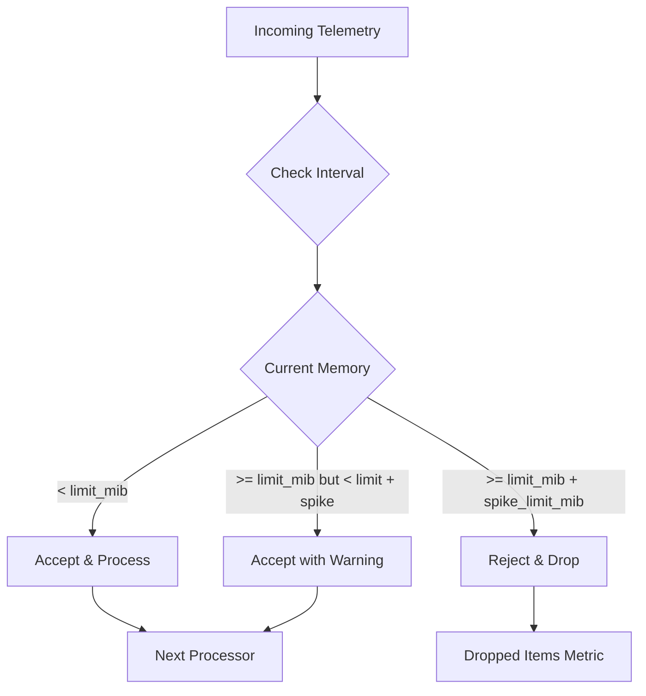

# How to Configure the Memory Limiter Processor in the OpenTelemetry Collector

Author: [nawazdhandala](https://www.github.com/nawazdhandala)

Tags: OpenTelemetry, Collector, Processors, Memory Limiter, Reliability, Resource Management

Description: Learn how to configure the memory limiter processor in OpenTelemetry Collector to prevent out-of-memory crashes, protect system stability, and handle traffic spikes gracefully.

The memory limiter processor is your collector's first line of defense against resource exhaustion. It monitors memory usage and applies back-pressure when consumption approaches configured limits, preventing out-of-memory (OOM) crashes that can bring down your entire observability pipeline.

Without a properly configured memory limiter, unexpected traffic spikes, downstream slowness, or misconfigured exporters can cause your collector to consume unbounded memory until the operating system kills the process. This guide shows you how to configure memory limits that protect your infrastructure while maximizing telemetry throughput.

## Why Memory Limiting Is Critical

OpenTelemetry Collector processes telemetry data through an internal pipeline of receivers, processors, and exporters. If exporters can't keep up with incoming data (due to network issues, backend slowness, or configuration problems), telemetry accumulates in memory.

Without limits, this accumulation continues until:

- **Linux OOM killer terminates the collector** (common in containerized environments)
- **System becomes unresponsive** due to memory pressure and swapping
- **Other processes fail** when system memory exhausts
- **Kubernetes evicts the pod** due to memory limit violations

The memory limiter prevents these scenarios by shedding load before memory exhaustion occurs.

## How Memory Limiter Works

The processor operates with two thresholds and a periodic check interval:



**Key concepts**:

1. **limit_mib**: Soft limit triggering back-pressure and warnings
2. **spike_limit_mib**: Headroom above limit before hard drops
3. **check_interval**: How frequently memory usage is evaluated

When memory exceeds `limit_mib`, the processor stops accepting new data temporarily. When memory exceeds `limit_mib + spike_limit_mib`, the processor starts dropping data to protect system stability.

## Basic Configuration

The memory limiter should be the first processor in every pipeline:

```yaml
receivers:
  otlp:
    protocols:
      grpc:
        endpoint: 0.0.0.0:4317
      http:
        endpoint: 0.0.0.0:4318

processors:
  memory_limiter:
    check_interval: 1s
    limit_mib: 512
    spike_limit_mib: 128

  batch:
    timeout: 5s
    send_batch_size: 1024

exporters:
  otlphttp:
    endpoint: https://oneuptime.com/otlp
    encoding: json
    headers:
      x-oneuptime-token: "YOUR_TOKEN"

service:
  pipelines:
    traces:
      receivers: [otlp]
      # Memory limiter MUST be first
      processors: [memory_limiter, batch]
      exporters: [otlphttp]
```

This configuration protects a collector with a 512 MiB soft limit and allows spikes up to 640 MiB (512 + 128) before dropping data.

## Core Configuration Parameters

### limit_mib

The soft memory limit in mebibytes (MiB). When exceeded, the processor applies back-pressure by refusing new data temporarily.

```yaml
processors:
  memory_limiter:
    limit_mib: 1024  # 1 GiB soft limit
```

**Sizing guidance**:

Calculate limit as a percentage of available memory:

```
limit_mib = (container_memory_limit × 0.8) - baseline_overhead
```

For example, with a 2 GiB container:

```
limit_mib = (2048 × 0.8) - 200 = 1438 MiB
```

The 0.8 factor provides safety margin, and baseline_overhead accounts for Go runtime and other fixed costs (typically 100-200 MiB).

### spike_limit_mib

Additional headroom above `limit_mib` before the processor starts dropping data.

```yaml
processors:
  memory_limiter:
    limit_mib: 1024
    spike_limit_mib: 256  # Drop data above 1280 MiB (1024 + 256)
```

**Spike limit purpose**:

Traffic doesn't arrive perfectly smoothly. Short bursts can push memory usage temporarily higher. The spike limit accommodates these bursts without dropping data, as long as memory returns below `limit_mib` quickly.

**Typical values**:
- **20-25% of limit_mib**: Standard recommendation for most workloads
- **10-15% of limit_mib**: Tighter control in memory-constrained environments
- **30-40% of limit_mib**: Burst-heavy workloads with good downstream capacity

### check_interval

How frequently the processor evaluates current memory usage.

```yaml
processors:
  memory_limiter:
    check_interval: 1s  # Check every second
```

**Trade-offs**:

- **Shorter interval (100ms-500ms)**: Faster reaction to memory spikes, more CPU overhead
- **Longer interval (2s-5s)**: Lower CPU overhead, slower reaction time
- **Default (1s)**: Balanced for most scenarios

In practice, 1 second works well. Memory exhaustion doesn't happen instantly; collectors typically have seconds of warning. Checking more frequently adds CPU cost with minimal benefit.

## Memory Sizing Strategy

Determining appropriate memory limits requires understanding your collector's memory profile.

### Step 1: Measure Baseline Memory

Deploy a collector without memory limits and observe steady-state usage:

```yaml
processors:
  # Temporarily disabled for measurement
  # memory_limiter:
  #   limit_mib: 512

exporters:
  otlphttp:
    endpoint: https://oneuptime.com/otlp

service:
  telemetry:
    metrics:
      address: 0.0.0.0:8888

  pipelines:
    traces:
      processors: [batch]
```

Monitor memory over 24-48 hours:

```bash
# Query collector process memory
ps aux | grep otelcol

# Or use container metrics
kubectl top pod <collector-pod>

# Or query Prometheus if scraping collector metrics
# Look for: process_runtime_go_mem_heap_alloc_bytes
curl http://localhost:8888/metrics | grep heap_alloc
```

Note the p95 and p99 memory usage during normal operations.

### Step 2: Account for Traffic Growth

Add headroom for expected traffic growth:

```
projected_memory = baseline_p95 × growth_factor
```

Use a growth factor of 1.5-2.0 to handle:
- Seasonal traffic patterns
- Product growth
- Marketing campaigns
- Incident-related spikes

### Step 3: Set Limits Based on Deployment Environment

Different environments have different constraints:

#### Kubernetes Deployment

```yaml
# Kubernetes Pod with 2 GiB memory limit
apiVersion: apps/v1
kind: Deployment
metadata:
  name: otel-collector
spec:
  template:
    spec:
      containers:
      - name: collector
        image: otel/opentelemetry-collector-contrib:latest
        resources:
          requests:
            memory: 1Gi
          limits:
            memory: 2Gi
```

Corresponding memory limiter configuration:

```yaml
processors:
  memory_limiter:
    check_interval: 1s
    # 80% of 2048 MiB = 1638, minus 200 MiB overhead = 1438
    limit_mib: 1438
    # 20% of 1438 = 287
    spike_limit_mib: 287
```

#### Docker Compose Deployment

```yaml
# docker-compose.yml
services:
  otel-collector:
    image: otel/opentelemetry-collector-contrib:latest
    mem_limit: 1g
    mem_reservation: 512m
```

```yaml
# collector-config.yaml
processors:
  memory_limiter:
    check_interval: 1s
    # 80% of 1024 MiB = 819, minus 150 MiB overhead = 669
    limit_mib: 669
    spike_limit_mib: 133
```

#### Bare Metal Deployment

```yaml
# More memory available, can be generous
processors:
  memory_limiter:
    check_interval: 1s
    limit_mib: 4096  # 4 GiB soft limit
    spike_limit_mib: 1024  # 1 GiB spike room
```

## Advanced Configuration Scenarios

### High-Throughput Production

For collectors handling millions of spans per minute:

```yaml
processors:
  memory_limiter:
    check_interval: 1s
    limit_mib: 8192  # 8 GiB for high volume
    spike_limit_mib: 2048  # Generous spike room

  batch:
    timeout: 10s
    send_batch_size: 8192
    send_batch_max_size: 16384

exporters:
  otlphttp:
    endpoint: https://oneuptime.com/otlp
    encoding: json
    compression: gzip
    timeout: 30s
    retry_on_failure:
      enabled: true
      initial_interval: 5s
      max_interval: 30s
```

Large memory limits combined with aggressive batching maximize throughput while maintaining stability.

### Memory-Constrained Edge Deployment

For edge collectors running on resource-limited devices:

```yaml
processors:
  memory_limiter:
    check_interval: 1s
    limit_mib: 128  # Tight memory budget
    spike_limit_mib: 32  # Small spike allowance

  batch:
    timeout: 2s
    send_batch_size: 256  # Smaller batches
    send_batch_max_size: 512

exporters:
  otlphttp:
    endpoint: https://oneuptime.com/otlp
    encoding: json
    compression: gzip
    sending_queue:
      enabled: false  # Disable queue to save memory
```

Aggressive memory limits combined with frequent batching keeps memory footprint minimal while maintaining functionality.

### Multi-Pipeline with Different Limits

Sometimes different telemetry types need different memory budgets:

```yaml
processors:
  # Separate memory limiters per pipeline
  memory_limiter/traces:
    check_interval: 1s
    limit_mib: 2048
    spike_limit_mib: 512

  memory_limiter/metrics:
    check_interval: 1s
    limit_mib: 1024
    spike_limit_mib: 256

  memory_limiter/logs:
    check_interval: 1s
    limit_mib: 512
    spike_limit_mib: 128

service:
  pipelines:
    traces:
      receivers: [otlp]
      processors: [memory_limiter/traces, batch]
      exporters: [otlphttp]

    metrics:
      receivers: [otlp]
      processors: [memory_limiter/metrics, batch]
      exporters: [otlphttp]

    logs:
      receivers: [otlp]
      processors: [memory_limiter/logs, batch]
      exporters: [otlphttp]
```

This approach allocates memory budget based on expected volume per signal type. Traces often consume more memory due to larger span data and deeper processing pipelines.

## Monitoring Memory Limiter Behavior

The memory limiter exposes critical metrics for understanding its operation:

### Key Metrics to Watch

```bash
# Query collector metrics endpoint
curl http://localhost:8888/metrics | grep memory_limiter

# Important metrics:
# - otelcol_processor_refused_spans: How many spans were refused
# - otelcol_processor_refused_metric_points: How many metrics were refused
# - otelcol_processor_refused_log_records: How many logs were refused
```

### Healthy vs. Unhealthy Patterns

**Healthy memory limiter operation**:

```
otelcol_processor_refused_spans: 0
otelcol_processor_refused_metric_points: 0
process_runtime_go_mem_heap_alloc_bytes: ~70% of limit_mib
```

Memory stays well below limits, no refusals occur. System is stable.

**Warning signs**:

```
otelcol_processor_refused_spans: increasing
process_runtime_go_mem_heap_alloc_bytes: consistently near limit_mib
```

The limiter is actively refusing data. This indicates:
- Exporters can't keep up with incoming volume
- Downstream backends are slow or unavailable
- Memory limits are too conservative

**Critical issues**:

```
otelcol_processor_refused_spans: rapidly increasing
Container restarted: OOMKilled
```

Memory limiter couldn't protect against exhaustion. Either:
- Limits exceed container resources
- Traffic spike exceeded spike_limit_mib too quickly
- Memory leak in collector or processor

## Troubleshooting Common Issues

### Issue 1: Collector OOMKilled Despite Memory Limiter

**Symptom**: Kubernetes or Docker kills collector with OOM, even with memory limiter configured.

**Causes and solutions**:

**Cause 1**: Memory limit exceeds container limit

```yaml
# BAD: limit_mib (2048) exceeds container limit (1024 MiB)
processors:
  memory_limiter:
    limit_mib: 2048

# GOOD: limit_mib stays well below container limit
processors:
  memory_limiter:
    limit_mib: 768  # 75% of 1024 MiB container limit
```

**Cause 2**: check_interval too long

```yaml
# BAD: 10-second check interval gives memory pressure too much time
processors:
  memory_limiter:
    check_interval: 10s

# GOOD: 1-second check interval reacts quickly
processors:
  memory_limiter:
    check_interval: 1s
```

**Cause 3**: Spike limit too generous

```yaml
# BAD: spike_limit allows exceeding container limit
processors:
  memory_limiter:
    limit_mib: 768
    spike_limit_mib: 512  # 768 + 512 = 1280, exceeds container

# GOOD: spike_limit keeps total below container limit
processors:
  memory_limiter:
    limit_mib: 768
    spike_limit_mib: 150  # 768 + 150 = 918, safe margin
```

### Issue 2: Excessive Refused Telemetry

**Symptom**: High `otelcol_processor_refused_*` metrics, significant data loss.

**Diagnosis**:

```bash
# Check if exporter is keeping up
curl http://localhost:8888/metrics | grep exporter_sent

# Check for exporter failures
curl http://localhost:8888/metrics | grep send_failed

# Check current memory usage
curl http://localhost:8888/metrics | grep heap_alloc
```

**Solution options**:

**Option 1**: Increase memory limits (if resources available)

```yaml
processors:
  memory_limiter:
    limit_mib: 2048  # Was: 1024
    spike_limit_mib: 512  # Was: 256
```

**Option 2**: Add more collector replicas (horizontal scaling)

```yaml
# Kubernetes Deployment
apiVersion: apps/v1
kind: Deployment
metadata:
  name: otel-collector
spec:
  replicas: 3  # Was: 1
```

**Option 3**: Optimize pipeline to reduce memory consumption

```yaml
processors:
  memory_limiter:
    limit_mib: 1024

  # Filter out noisy telemetry early
  filter:
    traces:
      span:
        - 'attributes["http.target"] == "/healthz"'
        - 'attributes["http.target"] == "/readyz"'

  # Batch more aggressively
  batch:
    timeout: 5s
    send_batch_size: 4096  # Was: 1024
```

### Issue 3: Memory Creep Over Time

**Symptom**: Memory usage slowly increases over hours/days, eventually hitting limits.

**Likely causes**:

1. **Exporter queue backlog**: Downstream slowness causes queue growth
2. **Memory leak**: Bug in collector or custom processor
3. **Traffic growth**: Gradual increase in telemetry volume

**Solution**:

```yaml
processors:
  memory_limiter:
    check_interval: 1s
    limit_mib: 1024
    spike_limit_mib: 256

exporters:
  otlphttp:
    endpoint: https://oneuptime.com/otlp
    sending_queue:
      enabled: true
      num_consumers: 10
      queue_size: 5000  # Cap queue size
    retry_on_failure:
      enabled: true
      max_elapsed_time: 300s  # Give up after 5 minutes
```

Capping exporter queue size prevents unbounded memory growth from downstream issues.

## Production Deployment Checklist

Before deploying a memory limiter to production:

- [ ] Container memory limit set in orchestration platform
- [ ] `limit_mib` configured to 70-80% of container memory
- [ ] `spike_limit_mib` set to 20-25% of `limit_mib`
- [ ] Total of `limit_mib + spike_limit_mib` stays below container memory
- [ ] `check_interval` set to 1 second (standard recommendation)
- [ ] Memory limiter placed as first processor in all pipelines
- [ ] Collector metrics endpoint exposed and monitored
- [ ] Alerts configured for refused telemetry metrics
- [ ] Load testing performed at 2x expected peak traffic
- [ ] Runbooks created for OOM and refused telemetry scenarios

## Testing Memory Limiter Configuration

Validate your setup with a controlled load test:

```yaml
# test-config.yaml
receivers:
  otlp:
    protocols:
      grpc:
        endpoint: 0.0.0.0:4317

processors:
  memory_limiter:
    check_interval: 1s
    limit_mib: 256  # Intentionally low for testing
    spike_limit_mib: 64

  batch:
    timeout: 5s
    send_batch_size: 1000

exporters:
  # Slow exporter to build up memory pressure
  otlphttp:
    endpoint: https://oneuptime.com/otlp
    timeout: 60s  # Artificially slow

  logging:
    verbosity: basic

service:
  telemetry:
    metrics:
      address: 0.0.0.0:8888

  pipelines:
    traces:
      receivers: [otlp]
      processors: [memory_limiter, batch]
      exporters: [otlphttp, logging]
```

Generate load and observe behavior:

```bash
# Start collector
otelcol --config test-config.yaml

# Monitor memory and refusals
watch -n 1 'curl -s http://localhost:8888/metrics | grep -E "(heap_alloc|refused_spans)"'

# Expected behavior:
# 1. Memory climbs toward limit_mib
# 2. Refused spans start incrementing as limit is hit
# 3. Memory stays below limit_mib + spike_limit_mib
# 4. Collector remains stable (doesn't crash)
```

This test validates that your limiter protects against memory exhaustion as designed.

## Integration with Other Components

### Memory Limiter + Batch Processor

The most critical pairing. Memory limiter must come first:

```yaml
processors:
  memory_limiter:
    limit_mib: 1024
    spike_limit_mib: 256

  batch:
    timeout: 5s
    send_batch_size: 2048

service:
  pipelines:
    traces:
      # CORRECT: memory_limiter before batch
      processors: [memory_limiter, batch]
```

This order ensures the limiter can apply back-pressure before batches accumulate.

### Memory Limiter + Tail Sampling

Tail sampling processors hold traces in memory for decision windows. Size limits carefully:

```yaml
processors:
  memory_limiter:
    limit_mib: 4096  # Generous for tail sampling
    spike_limit_mib: 1024

  tail_sampling:
    decision_wait: 10s
    num_traces: 50000  # Limit in-flight traces
    policies:
      - name: errors
        type: status_code

  batch:
    timeout: 5s

service:
  pipelines:
    traces:
      processors: [memory_limiter, tail_sampling, batch]
```

Monitor memory carefully with tail sampling; it's one of the most memory-intensive processors.

## Key Takeaways

The memory limiter processor is essential protection for production OpenTelemetry Collector deployments. It prevents out-of-memory crashes that can bring down your observability pipeline during traffic spikes or downstream issues.

Configure `limit_mib` to 70-80% of your container's memory limit, set `spike_limit_mib` to 20-25% of your limit, and always place the memory limiter first in your processor chain.

Monitor refused telemetry metrics continuously. Zero refusals indicates healthy operation; sustained refusals signal undersized limits or downstream capacity problems requiring investigation.

**Related Reading:**

- [How to Configure the Batch Processor in the OpenTelemetry Collector](https://oneuptime.com/blog/post/2026-02-06-batch-processor-opentelemetry-collector/view)
- [How to Configure the Filter Processor in the OpenTelemetry Collector](https://oneuptime.com/blog/post/2026-02-06-filter-processor-opentelemetry-collector/view)
- [What is OpenTelemetry Collector and why use one?](https://oneuptime.com/blog/post/2025-09-18-what-is-opentelemetry-collector-and-why-use-one/view)
