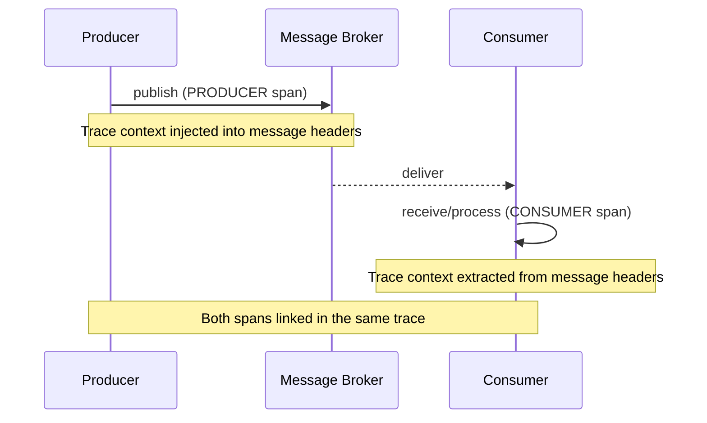

# How to Implement Messaging Semantic Conventions (Kafka, RabbitMQ, SQS)

Author: [nawazdhandala](https://www.github.com/nawazdhandala)

Tags: OpenTelemetry, Messaging, Kafka, RabbitMQ, SQS, Semantic Conventions, Distributed Tracing, Event-Driven Architecture

Description: Learn how to implement OpenTelemetry messaging semantic conventions for Kafka, RabbitMQ, and Amazon SQS to get consistent, traceable telemetry across your event-driven architectures.

---

Event-driven systems are notoriously difficult to debug. A message gets published on one service, passes through a broker, and gets consumed by another service minutes or even hours later. When something goes wrong, you need traces that connect the dots across all those asynchronous boundaries. OpenTelemetry's messaging semantic conventions define exactly how to instrument producers, consumers, and brokers so that your traces actually make sense.

This guide covers the messaging semantic conventions with hands-on examples for three of the most common messaging systems: Apache Kafka, RabbitMQ, and Amazon SQS.

## How Messaging Spans Differ from Synchronous Spans

In a typical HTTP request, the client span and server span happen in sequence and share the same trace. Messaging spans work differently because the producer and consumer are decoupled in time. The producer creates a span when it publishes a message, and the consumer creates a separate span when it processes that message. The trace context is propagated through message headers or attributes to link them together.



The semantic conventions define three span kinds for messaging:

- **PRODUCER**: Created when a message is sent to a broker
- **CONSUMER**: Created when a message is received and processed
- **CLIENT**: Used for synchronous request-reply patterns over messaging

## Core Messaging Attributes

Every messaging span should include a common set of attributes, regardless of which broker is being used.

```yaml
# Required for all messaging spans
messaging.system: "kafka"              # The messaging system (kafka, rabbitmq, aws_sqs, etc.)
messaging.operation.name: "publish"    # publish, receive, process, settle
messaging.destination.name: "orders"   # Topic, queue, or exchange name

# Recommended attributes
messaging.message.id: "msg-abc-123"    # Unique message identifier
messaging.destination.partition.id: "3" # Partition number (Kafka-specific)
messaging.consumer.group.name: "order-processors"  # Consumer group

# Server connection
server.address: "kafka-broker-1.internal"
server.port: 9092
```

## Kafka Producer Instrumentation in Java

Let us start with a Kafka producer example. Kafka is one of the most widely used messaging systems, and its instrumentation is well supported by OpenTelemetry.

```java
// KafkaTracingProducer.java - Kafka producer with semantic conventions
import io.opentelemetry.api.OpenTelemetry;
import io.opentelemetry.api.trace.Span;
import io.opentelemetry.api.trace.SpanKind;
import io.opentelemetry.api.trace.Tracer;
import io.opentelemetry.context.Context;
import io.opentelemetry.context.propagation.TextMapSetter;
import org.apache.kafka.clients.producer.KafkaProducer;
import org.apache.kafka.clients.producer.ProducerRecord;
import org.apache.kafka.common.header.Headers;

public class OrderEventProducer {
    private final KafkaProducer<String, String> producer;
    private final Tracer tracer;
    private final OpenTelemetry openTelemetry;

    // TextMapSetter injects trace context into Kafka message headers
    private static final TextMapSetter<Headers> HEADER_SETTER =
        (headers, key, value) -> headers.add(key, value.getBytes());

    public void publishOrderCreated(String orderId, String orderJson) {
        // Create a PRODUCER span following messaging semantic conventions
        Span span = tracer.spanBuilder("orders publish")
            .setSpanKind(SpanKind.PRODUCER)
            .setAttribute("messaging.system", "kafka")
            .setAttribute("messaging.operation.name", "publish")
            .setAttribute("messaging.destination.name", "orders")
            .setAttribute("messaging.kafka.message.key", orderId)
            .setAttribute("server.address", "kafka-broker-1.internal")
            .setAttribute("server.port", 9092)
            .startSpan();

        try {
            ProducerRecord<String, String> record =
                new ProducerRecord<>("orders", orderId, orderJson);

            // Inject the trace context into message headers for propagation
            openTelemetry.getPropagators().getTextMapPropagator()
                .inject(Context.current().with(span), record.headers(), HEADER_SETTER);

            // Send the message and capture partition/offset in the callback
            producer.send(record, (metadata, exception) -> {
                if (exception != null) {
                    span.setStatus(io.opentelemetry.api.trace.StatusCode.ERROR);
                    span.recordException(exception);
                } else {
                    // Record which partition the message landed in
                    span.setAttribute(
                        "messaging.destination.partition.id",
                        String.valueOf(metadata.partition())
                    );
                    span.setAttribute(
                        "messaging.kafka.message.offset",
                        metadata.offset()
                    );
                }
                span.end();
            });
        } catch (Exception e) {
            span.setStatus(io.opentelemetry.api.trace.StatusCode.ERROR);
            span.recordException(e);
            span.end();
            throw e;
        }
    }
}
```

The producer span name follows the convention `{destination} {operation}`, giving us "orders publish". The trace context is injected into the Kafka message headers using OpenTelemetry's propagation API. When a consumer reads this message, it can extract that context and continue the same trace.

Notice that the span is ended inside the producer callback rather than immediately after `send()`. This is because Kafka's `send()` is asynchronous, and we want the span duration to reflect the actual time it takes for the broker to acknowledge the message.

## Kafka Consumer Instrumentation

On the consumer side, we extract the trace context from the message headers and create a CONSUMER span that links back to the producer.

```java
// KafkaTracingConsumer.java - Kafka consumer with semantic conventions
import io.opentelemetry.context.propagation.TextMapGetter;
import org.apache.kafka.clients.consumer.ConsumerRecord;
import org.apache.kafka.clients.consumer.ConsumerRecords;
import org.apache.kafka.common.header.Header;

public class OrderEventConsumer {
    private final Tracer tracer;
    private final OpenTelemetry openTelemetry;

    // TextMapGetter extracts trace context from Kafka message headers
    private static final TextMapGetter<Headers> HEADER_GETTER = new TextMapGetter<>() {
        @Override
        public Iterable<String> keys(Headers headers) {
            List<String> keys = new ArrayList<>();
            headers.forEach(h -> keys.add(h.key()));
            return keys;
        }

        @Override
        public String get(Headers headers, String key) {
            Header header = headers.lastHeader(key);
            return header != null ? new String(header.value()) : null;
        }
    };

    public void processRecords(ConsumerRecords<String, String> records) {
        for (ConsumerRecord<String, String> record : records) {
            // Extract the trace context from the message headers
            Context extractedContext = openTelemetry.getPropagators()
                .getTextMapPropagator()
                .extract(Context.current(), record.headers(), HEADER_GETTER);

            // Create a CONSUMER span linked to the producer's trace
            Span span = tracer.spanBuilder("orders process")
                .setParent(extractedContext)
                .setSpanKind(SpanKind.CONSUMER)
                .setAttribute("messaging.system", "kafka")
                .setAttribute("messaging.operation.name", "process")
                .setAttribute("messaging.destination.name", "orders")
                .setAttribute("messaging.kafka.message.key", record.key())
                .setAttribute("messaging.kafka.message.offset", record.offset())
                .setAttribute("messaging.destination.partition.id",
                    String.valueOf(record.partition()))
                .setAttribute("messaging.consumer.group.name", "order-processors")
                .startSpan();

            try {
                // Process the message within the span context
                handleOrderEvent(record.value());
            } catch (Exception e) {
                span.setStatus(io.opentelemetry.api.trace.StatusCode.ERROR);
                span.recordException(e);
            } finally {
                span.end();
            }
        }
    }
}
```

The consumer span name is "orders process" because the operation is processing. The extracted context from message headers becomes the parent of the consumer span, which means both the producer and consumer spans appear in the same trace.

## RabbitMQ Instrumentation in Python

RabbitMQ uses a different model based on exchanges and queues. The semantic conventions adapt to this with RabbitMQ-specific attributes.

```python
# rabbitmq_producer.py - RabbitMQ publisher with semantic conventions
import pika
import json
from opentelemetry import trace, context
from opentelemetry.propagate import inject

tracer = trace.get_tracer("notification-service")

def publish_notification(user_id: str, message: str, notification_type: str):
    """Publish a notification event to RabbitMQ with full tracing."""

    # Create a PRODUCER span for the publish operation
    with tracer.start_as_current_span(
        name="notifications publish",
        kind=trace.SpanKind.PRODUCER,
        attributes={
            "messaging.system": "rabbitmq",
            "messaging.operation.name": "publish",
            "messaging.destination.name": "notifications",
            # RabbitMQ-specific: the exchange and routing key
            "messaging.rabbitmq.destination.routing_key": f"notify.{notification_type}",
            "server.address": "rabbitmq.internal",
            "server.port": 5672,
        },
    ) as span:
        # Build the message payload
        payload = json.dumps({
            "user_id": user_id,
            "message": message,
            "type": notification_type,
        })

        # Inject trace context into message headers for propagation
        headers = {}
        inject(headers)

        # Publish to the exchange with the routing key
        connection = pika.BlockingConnection(
            pika.ConnectionParameters("rabbitmq.internal")
        )
        channel = connection.channel()

        channel.basic_publish(
            exchange="notifications",
            routing_key=f"notify.{notification_type}",
            body=payload,
            properties=pika.BasicProperties(
                headers=headers,
                content_type="application/json",
                delivery_mode=2,  # persistent
            ),
        )

        span.set_attribute("messaging.message.body.size", len(payload))
        connection.close()
```

For RabbitMQ, the `messaging.rabbitmq.destination.routing_key` attribute captures the routing key used for exchange-based routing. This is critical for debugging because it tells you exactly which queue bindings matched.

```python
# rabbitmq_consumer.py - RabbitMQ consumer with semantic conventions
import pika
from opentelemetry import trace, context
from opentelemetry.propagate import extract

tracer = trace.get_tracer("notification-service")

def on_message(channel, method, properties, body):
    """Process a message from RabbitMQ with proper tracing."""

    # Extract trace context from message headers
    ctx = extract(properties.headers or {})

    # Create a CONSUMER span linked to the producer trace
    with tracer.start_as_current_span(
        name="notifications process",
        context=ctx,
        kind=trace.SpanKind.CONSUMER,
        attributes={
            "messaging.system": "rabbitmq",
            "messaging.operation.name": "process",
            "messaging.destination.name": "email-notifications",
            "messaging.rabbitmq.destination.routing_key": method.routing_key,
            "messaging.message.body.size": len(body),
            "server.address": "rabbitmq.internal",
            "server.port": 5672,
        },
    ) as span:
        try:
            notification = json.loads(body)
            send_email_notification(notification)
            # Acknowledge the message after successful processing
            channel.basic_ack(delivery_tag=method.delivery_tag)
        except Exception as e:
            span.set_status(trace.Status(trace.StatusCode.ERROR, str(e)))
            span.record_exception(e)
            # Reject and requeue the message
            channel.basic_nack(delivery_tag=method.delivery_tag, requeue=True)
```

The consumer extracts the trace context from the AMQP message properties and uses it as the parent context. This creates a continuous trace from the publisher through the broker to the consumer.

## Amazon SQS Instrumentation in Node.js

SQS is the most common messaging system in AWS-based architectures. The conventions treat it similarly to other messaging systems, with SQS-specific attributes for things like message group IDs.

```javascript
// sqs-producer.js - SQS publisher with semantic conventions
const { SQSClient, SendMessageCommand } = require('@aws-sdk/client-sqs');
const { trace, SpanKind, context } = require('@opentelemetry/api');
const { propagation } = require('@opentelemetry/api');

const tracer = trace.getTracer('payment-service');
const sqsClient = new SQSClient({ region: 'us-east-1' });

async function publishPaymentEvent(paymentId, amount, currency) {
  const queueUrl = 'https://sqs.us-east-1.amazonaws.com/123456789/payment-events';

  // Create a PRODUCER span for the SQS send operation
  const span = tracer.startSpan('payment-events publish', {
    kind: SpanKind.PRODUCER,
    attributes: {
      'messaging.system': 'aws_sqs',
      'messaging.operation.name': 'publish',
      'messaging.destination.name': 'payment-events',
      'cloud.region': 'us-east-1',
      'cloud.account.id': '123456789',
      'server.address': 'sqs.us-east-1.amazonaws.com',
    },
  });

  try {
    // Inject trace context into message attributes for propagation
    const messageAttributes = {};
    const carrier = {};
    propagation.inject(context.active(), carrier);

    // Convert trace context headers to SQS message attributes
    for (const [key, value] of Object.entries(carrier)) {
      messageAttributes[key] = {
        DataType: 'String',
        StringValue: value,
      };
    }

    const payload = JSON.stringify({ paymentId, amount, currency });

    const command = new SendMessageCommand({
      QueueUrl: queueUrl,
      MessageBody: payload,
      MessageAttributes: messageAttributes,
      // Use payment ID as deduplication key for FIFO queues
      MessageGroupId: 'payments',
    });

    const result = await sqsClient.send(command);

    // Record the SQS message ID returned by the service
    span.setAttribute('messaging.message.id', result.MessageId);
    span.setAttribute('messaging.message.body.size', Buffer.byteLength(payload));
  } catch (error) {
    span.setStatus({ code: 2, message: error.message });
    span.recordException(error);
    throw error;
  } finally {
    span.end();
  }
}
```

SQS uses message attributes (not headers) for metadata. The trace context is injected as SQS `MessageAttributes`, which allows the consumer to extract and continue the trace. The `messaging.system` is set to `"aws_sqs"` to distinguish it from other messaging systems.

```javascript
// sqs-consumer.js - SQS consumer with semantic conventions
const { SQSClient, ReceiveMessageCommand, DeleteMessageCommand } = require('@aws-sdk/client-sqs');
const { trace, SpanKind, context, propagation } = require('@opentelemetry/api');

const tracer = trace.getTracer('payment-processor');

async function pollAndProcess() {
  const queueUrl = 'https://sqs.us-east-1.amazonaws.com/123456789/payment-events';

  const receiveCommand = new ReceiveMessageCommand({
    QueueUrl: queueUrl,
    MaxNumberOfMessages: 10,
    MessageAttributeNames: ['All'],  // Retrieve trace context attributes
    WaitTimeSeconds: 20,
  });

  const response = await sqsClient.send(receiveCommand);

  for (const message of response.Messages || []) {
    // Extract trace context from SQS message attributes
    const carrier = {};
    for (const [key, attr] of Object.entries(message.MessageAttributes || {})) {
      carrier[key] = attr.StringValue;
    }
    const extractedContext = propagation.extract(context.active(), carrier);

    // Create a CONSUMER span linked to the producer trace
    const span = tracer.startSpan(
      'payment-events process',
      {
        kind: SpanKind.CONSUMER,
        attributes: {
          'messaging.system': 'aws_sqs',
          'messaging.operation.name': 'process',
          'messaging.destination.name': 'payment-events',
          'messaging.message.id': message.MessageId,
          'cloud.region': 'us-east-1',
          'server.address': 'sqs.us-east-1.amazonaws.com',
        },
      },
      extractedContext,
    );

    try {
      const payment = JSON.parse(message.Body);
      await processPayment(payment);

      // Delete message after successful processing
      await sqsClient.send(new DeleteMessageCommand({
        QueueUrl: queueUrl,
        ReceiptHandle: message.ReceiptHandle,
      }));
    } catch (error) {
      span.setStatus({ code: 2, message: error.message });
      span.recordException(error);
    } finally {
      span.end();
    }
  }
}
```

The consumer polls SQS, extracts the trace context from message attributes, and creates consumer spans that are children of the original producer spans. This gives you end-to-end visibility from the moment a payment event is created to the moment it is fully processed.

## Querying Messaging Telemetry

With consistent semantic conventions across all three messaging systems, you can write unified queries.

```sql
-- Message processing latency by system and destination
SELECT
    messaging.system,
    messaging.destination.name,
    messaging.operation.name,
    avg(duration_ms) as avg_processing_ms,
    p99(duration_ms) as p99_processing_ms,
    count(*) as message_count
FROM spans
WHERE messaging.system IS NOT NULL
  AND messaging.operation.name = 'process'
GROUP BY messaging.system, messaging.destination.name, messaging.operation.name
ORDER BY p99_processing_ms DESC;
```

This single query shows you processing latency across Kafka, RabbitMQ, and SQS. That is the power of semantic conventions.

## Wrapping Up

Messaging semantic conventions bring order to the chaos of event-driven architectures. The core pattern is the same across all brokers: set `messaging.system`, `messaging.operation.name`, and `messaging.destination.name` on every span. Inject trace context into message headers on the producer side and extract it on the consumer side. Add system-specific attributes like partition IDs for Kafka, routing keys for RabbitMQ, or message group IDs for SQS.

With these conventions in place, you get traces that span the full lifecycle of a message, from publication through broker delivery to consumer processing. When messages start failing or backing up, you will know exactly where to look.
