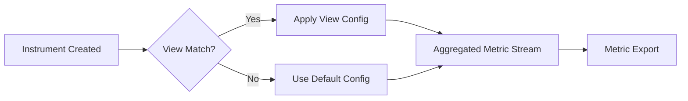

# How to Implement Metric Views to Control Aggregation and Bucket Boundaries

Author: [nawazdhandala](https://www.github.com/nawazdhandala)

Tags: OpenTelemetry, Metrics, Views, Aggregation, Histograms, SDK, Observability

Description: Learn how to use OpenTelemetry metric views to customize aggregation types, histogram bucket boundaries, and attribute filtering at the SDK level.

---

When you instrument your application with OpenTelemetry metrics, the SDK makes default decisions about how to aggregate your data. Counters sum values, histograms use predefined bucket boundaries, and all recorded attributes become metric dimensions. These defaults work for many cases, but production systems often need tighter control. You might need custom histogram buckets tuned to your latency profile, attribute filtering to reduce cardinality, or even changing the aggregation type entirely.

Metric views give you that control. A view is a configuration rule that matches specific instruments and overrides their default behavior. You define views when setting up the MeterProvider, and they apply to all matching instruments without changing your instrumentation code.

## How Views Work

Views sit between your instrumentation code and the metric export pipeline. When the SDK creates an instrument (counter, histogram, gauge), it checks registered views for a match. If a view matches, the SDK uses the view's configuration instead of the instrument's defaults.



This happens at the SDK level, before data reaches any exporter. Views can change the aggregation type, modify histogram boundaries, rename the metric stream, filter attributes, or even drop instruments entirely.

## Customizing Histogram Bucket Boundaries

The most common use of views is setting custom histogram buckets. The SDK default buckets are designed to be general-purpose, but they rarely match your application's actual latency distribution.

Here is how to configure custom buckets in Python:

```python
# Configuring custom histogram buckets with metric views
from opentelemetry.sdk.metrics import MeterProvider
from opentelemetry.sdk.metrics.export import PeriodicExportingMetricReader, ConsoleMetricExporter
from opentelemetry.sdk.metrics.view import View, ExplicitBucketHistogramAggregation

# Define a view that matches HTTP request duration histograms
# and applies custom bucket boundaries
http_duration_view = View(
    # Match instruments by name using wildcards
    instrument_name="http.server.request.duration",
    # Apply custom histogram buckets tuned for web request latencies
    aggregation=ExplicitBucketHistogramAggregation(
        # Buckets in seconds, focused on the 1ms to 10s range
        # where most web requests fall
        boundaries=[
            0.001,  # 1ms
            0.005,  # 5ms
            0.01,   # 10ms
            0.025,  # 25ms
            0.05,   # 50ms
            0.1,    # 100ms
            0.25,   # 250ms
            0.5,    # 500ms
            1.0,    # 1s
            2.5,    # 2.5s
            5.0,    # 5s
            10.0,   # 10s
        ]
    ),
)

# Create a MeterProvider with the custom view
reader = PeriodicExportingMetricReader(ConsoleMetricExporter())
provider = MeterProvider(
    metric_readers=[reader],
    views=[http_duration_view],
)
```

These custom buckets give you much better resolution in the 1ms to 1s range where most HTTP requests complete. The default SDK buckets often have gaps in this range, causing you to lose visibility into latency percentile shifts.

## Multiple Views for Different Instruments

Real applications have multiple instruments with different measurement profiles. Database queries, cache lookups, and background jobs all have different latency characteristics. Define separate views for each:

```python
# Multiple views for instruments with different latency profiles
from opentelemetry.sdk.metrics.view import View, ExplicitBucketHistogramAggregation

# Fast operations like cache lookups: microsecond to millisecond range
cache_view = View(
    instrument_name="cache.*.duration",
    aggregation=ExplicitBucketHistogramAggregation(
        boundaries=[
            0.0001,  # 100us
            0.0005,  # 500us
            0.001,   # 1ms
            0.005,   # 5ms
            0.01,    # 10ms
            0.025,   # 25ms
            0.05,    # 50ms
            0.1,     # 100ms
        ]
    ),
)

# Database queries: millisecond to second range
db_view = View(
    instrument_name="db.client.operation.duration",
    aggregation=ExplicitBucketHistogramAggregation(
        boundaries=[
            0.001,  # 1ms
            0.005,  # 5ms
            0.01,   # 10ms
            0.05,   # 50ms
            0.1,    # 100ms
            0.25,   # 250ms
            0.5,    # 500ms
            1.0,    # 1s
            2.5,    # 2.5s
            5.0,    # 5s
        ]
    ),
)

# Background jobs: seconds to minutes range
job_view = View(
    instrument_name="job.execution.duration",
    aggregation=ExplicitBucketHistogramAggregation(
        boundaries=[
            0.1,    # 100ms
            0.5,    # 500ms
            1.0,    # 1s
            5.0,    # 5s
            10.0,   # 10s
            30.0,   # 30s
            60.0,   # 1 min
            120.0,  # 2 min
            300.0,  # 5 min
        ]
    ),
)

# Register all views with the MeterProvider
provider = MeterProvider(
    metric_readers=[reader],
    views=[cache_view, db_view, job_view],
)
```

Each view uses wildcard matching on the instrument name. The cache view matches any instrument starting with `cache.` and ending with `.duration`. This lets you define one view that covers `cache.get.duration`, `cache.set.duration`, and any future cache instruments that follow the naming convention.

## Filtering Attributes to Control Cardinality

High-cardinality attributes are the number one cause of metric storage explosions. A single `user.id` attribute with a million unique values creates a million time series. Views let you control which attributes get recorded without changing your instrumentation:

```python
# Using views to filter attributes and control metric cardinality
from opentelemetry.sdk.metrics.view import View

# Only keep specific attributes for HTTP metrics
# This drops high-cardinality attributes like user IDs and request paths
http_filtered_view = View(
    instrument_name="http.server.request.duration",
    # Only these attributes will be recorded as metric dimensions
    # All other attributes are silently dropped
    attribute_keys=[
        "http.request.method",
        "http.response.status_code",
        "http.route",
        "server.address",
    ],
)

# For database metrics, only keep the operation type and system
db_filtered_view = View(
    instrument_name="db.client.operation.duration",
    attribute_keys=[
        "db.system",
        "db.operation.name",
        # Deliberately exclude db.statement to avoid high cardinality
        # and potential security issues with logged queries
    ],
)
```

Attribute filtering is a safety mechanism. Your instrumentation code can record rich context on every measurement, and views act as a gatekeeper that only lets low-cardinality attributes through to the metric pipeline. This separation means developers can instrument freely without worrying about the cost implications, while the platform team controls cardinality through views.

## Changing Aggregation Types

Sometimes the default aggregation for an instrument type is not what you need. Views can override the aggregation entirely:

```python
# Changing aggregation types with views
from opentelemetry.sdk.metrics.view import View, SumAggregation, LastValueAggregation, DropAggregation

# Convert a histogram instrument to a simple sum
# Useful when you only care about total duration, not distribution
total_duration_view = View(
    instrument_name="batch.processing.duration",
    # Use sum aggregation instead of histogram
    # This reduces storage cost when distribution data is not needed
    aggregation=SumAggregation(),
)

# Use last-value aggregation for a gauge-like measurement
# recorded through an observable counter
connection_pool_view = View(
    instrument_name="db.pool.active_connections",
    aggregation=LastValueAggregation(),
)

# Drop an instrument entirely if it generates noise
# This is useful for disabling auto-instrumentation metrics you do not need
drop_dns_view = View(
    instrument_name="dns.lookup.duration",
    aggregation=DropAggregation(),
)
```

The `DropAggregation` is especially useful with auto-instrumentation libraries that generate metrics you do not need. Instead of forking the library or writing a custom exporter to filter them out, just drop them with a view.

## Go Implementation

The Go SDK provides equivalent view functionality with a slightly different API:

```go
// Configuring metric views in Go
package main

import (
	"go.opentelemetry.io/otel/sdk/metric"
)

func newMeterProvider() *metric.MeterProvider {
	// Custom histogram boundaries for HTTP latency
	httpView := metric.NewView(
		// Match instrument by name
		metric.Instrument{Name: "http.server.request.duration"},
		// Override with custom histogram buckets
		metric.Stream{
			Aggregation: metric.AggregationExplicitBucketHistogram{
				Boundaries: []float64{
					0.001, 0.005, 0.01, 0.025, 0.05,
					0.1, 0.25, 0.5, 1.0, 2.5, 5.0, 10.0,
				},
			},
		},
	)

	// Filter attributes for all metrics from a specific meter
	filteredView := metric.NewView(
		metric.Instrument{
			// Match all instruments from a specific instrumentation scope
			Scope: instrumentation.Scope{
				Name: "go.opentelemetry.io/contrib/instrumentation/net/http",
			},
		},
		metric.Stream{
			// Only allow these attribute keys through
			AttributeFilter: func(kv attribute.KeyValue) bool {
				allowed := map[string]bool{
					"http.request.method":      true,
					"http.response.status_code": true,
					"http.route":               true,
				}
				return allowed[string(kv.Key)]
			},
		},
	)

	// Drop noisy metrics entirely
	dropView := metric.NewView(
		metric.Instrument{Name: "runtime.go.mem.heap_alloc"},
		metric.Stream{Aggregation: metric.AggregationDrop{}},
	)

	return metric.NewMeterProvider(
		metric.WithReader(reader),
		metric.WithView(httpView, filteredView, dropView),
	)
}
```

Go's `AttributeFilter` function gives you even more flexibility than a simple allowlist. You could implement dynamic filtering logic, pattern matching, or any custom predicate.

## View Matching Priority

When multiple views could match the same instrument, the SDK applies the first matching view. Order matters:

```python
# View ordering example: more specific views come first
views = [
    # Specific view for one particular instrument
    View(
        instrument_name="http.server.request.duration",
        attribute_keys=["http.request.method", "http.response.status_code", "http.route"],
        aggregation=ExplicitBucketHistogramAggregation(
            boundaries=[0.005, 0.01, 0.025, 0.05, 0.1, 0.25, 0.5, 1.0, 5.0]
        ),
    ),

    # Broader wildcard view for all other duration histograms
    View(
        instrument_name="*.duration",
        aggregation=ExplicitBucketHistogramAggregation(
            boundaries=[0.01, 0.05, 0.1, 0.5, 1.0, 5.0, 10.0, 30.0]
        ),
    ),

    # Catch-all view that drops unrecognized attributes from all instruments
    View(
        instrument_name="*",
        attribute_keys=[
            "service.name",
            "deployment.environment",
        ],
    ),
]
```

Place specific views before general ones. The HTTP duration view with its tailored buckets and attribute list takes priority over the generic duration view. If you reversed the order, the generic view would match first and the specific HTTP configuration would never apply.

## Practical Tips

When working with views, start by auditing what your current instruments actually produce. Export to a debug exporter or console first and look at the cardinality of each metric stream. High cardinality shows you where attribute filtering views are needed.

For histogram buckets, analyze your actual latency distributions. If 95% of your requests complete under 100ms, having half your buckets above 1s wastes resolution. Concentrate buckets where your data actually lives.

Use the `DropAggregation` liberally for auto-instrumented metrics you do not consume. Every metric stream has a storage and processing cost, and dropping unused metrics at the SDK level is the cheapest place to filter.

Views transform OpenTelemetry metrics from a "record everything with defaults" approach into a "record what matters with precision" strategy. Define them once in your SDK setup, and your entire application benefits from tuned aggregations, controlled cardinality, and efficient metric storage.
