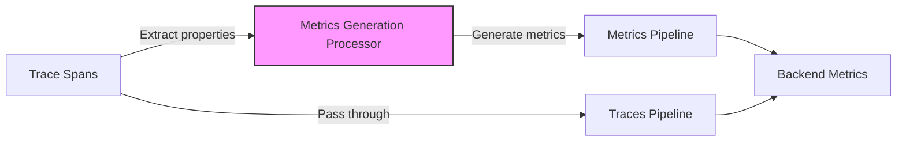

# How to Configure the Metrics Generation Processor in the OpenTelemetry Collector

Author: [nawazdhandala](https://www.github.com/nawazdhandala)

Tags: OpenTelemetry, Collector, Processors, Metrics, Traces, Observability, RED Metrics, Aggregation

Description: Learn how to configure the Metrics Generation Processor in OpenTelemetry Collector to automatically derive RED metrics from trace spans for comprehensive observability.

Traces provide detailed request-level visibility, but metrics give you the aggregated view needed for dashboards and alerts. The Metrics Generation Processor bridges this gap by automatically generating metrics from trace spans. This gives you the best of both worlds: detailed traces for debugging and aggregated metrics for monitoring, without instrumenting twice.

## What Is the Metrics Generation Processor?

The Metrics Generation Processor (also known as spanmetrics processor) analyzes trace spans flowing through the Collector and generates metrics based on span properties. It can create request counts, duration histograms, and error rates automatically. This produces RED metrics (Rate, Errors, Duration) from your existing trace data without additional instrumentation.

This is useful when:

- You want RED metrics without separate metric instrumentation
- Your services emit traces but lack comprehensive metrics
- You need metrics that exactly match trace semantics
- You want to derive service-level metrics from distributed traces
- You need to aggregate metrics across span attributes

## Architecture Overview

The Metrics Generation Processor converts trace spans into metrics:



Spans flow through the processor, which generates metrics based on span attributes, then both traces and derived metrics are exported to backends.

## Basic Configuration

Here's a minimal Metrics Generation Processor configuration that creates basic RED metrics:

```yaml
# Configure receivers to accept traces
receivers:
  otlp:
    protocols:
      grpc:
        endpoint: 0.0.0.0:4317
      http:
        endpoint: 0.0.0.0:4318

# Define the Metrics Generation Processor
processors:
  # The spanmetrics processor generates metrics from spans
  spanmetrics:
    # Metrics exported by this processor will have this prefix
    # Example: calls_total, duration_milliseconds
    metrics_exporter: otlphttp

    # Aggregation temporality for generated metrics
    # Options: AGGREGATION_TEMPORALITY_CUMULATIVE, AGGREGATION_TEMPORALITY_DELTA
    aggregation_temporality: AGGREGATION_TEMPORALITY_CUMULATIVE

    # Dimensions to include in generated metrics
    # These span attributes become metric labels
    dimensions:
      # Include HTTP method as a dimension
      - name: http.method
        # Use default value if attribute not present
        default: "UNKNOWN"

      # Include HTTP status code
      - name: http.status_code
        default: "0"

      # Include service name from resource attributes
      - name: service.name
        default: "unknown-service"

    # Histogram buckets for duration metrics (in milliseconds)
    # Customize these based on your latency SLOs
    histogram:
      explicit:
        buckets: [10, 25, 50, 100, 250, 500, 1000, 2500, 5000, 10000]

  # Batch processor for efficient export
  batch:
    timeout: 10s
    send_batch_size: 1024

# Configure export destination
exporters:
  otlphttp:
    endpoint: https://oneuptime.com/otlp
    headers:
      x-oneuptime-token: ${ONEUPTIME_TOKEN}

# Wire everything together in pipelines
service:
  pipelines:
    # Traces pipeline - processes spans and generates metrics
    traces:
      receivers: [otlp]
      processors: [spanmetrics, batch]
      exporters: [otlphttp]

    # Metrics pipeline - exports generated metrics
    metrics:
      receivers: [otlp]
      processors: [batch]
      exporters: [otlphttp]
```

## Understanding Generated Metrics

The Metrics Generation Processor creates three primary metric types:

### Request Rate Metrics

Counts of spans grouped by dimensions:

```yaml
# Generated metric: calls_total
# Type: Counter
# Description: Total number of spans
# Labels: http.method, http.status_code, service.name, span.name, span.kind

# Example queries:
# - rate(calls_total[5m])  # Request rate per second
# - sum(rate(calls_total[5m])) by (service.name)  # Rate by service
```

### Duration Metrics

Histogram of span durations:

```yaml
# Generated metric: duration_milliseconds
# Type: Histogram
# Description: Duration of spans in milliseconds
# Labels: http.method, http.status_code, service.name, span.name, span.kind
# Buckets: Configurable histogram buckets

# Example queries:
# - histogram_quantile(0.95, rate(duration_milliseconds_bucket[5m]))  # p95 latency
# - histogram_quantile(0.99, rate(duration_milliseconds_bucket[5m]))  # p99 latency
```

### Error Rate Metrics

Automatic calculation based on span status:

```yaml
# Derived from calls_total with status.code = ERROR
# Error rate = calls_total{status.code="ERROR"} / calls_total

# Example queries:
# - sum(rate(calls_total{status_code="ERROR"}[5m])) / sum(rate(calls_total[5m]))  # Overall error rate
# - rate(calls_total{http.status_code=~"5.."}[5m])  # 5xx error rate
```

## Advanced Configuration

### Custom Dimensions and Filtering

Control which attributes become metric dimensions:

```yaml
processors:
  spanmetrics:
    metrics_exporter: otlphttp

    # Fine-grained dimension control
    dimensions:
      # Include HTTP method
      - name: http.method
        default: "UNKNOWN"

      # Include HTTP route (normalized path)
      - name: http.route
        default: "UNKNOWN"

      # Include HTTP status code
      - name: http.status_code
        default: "0"

      # Include service name
      - name: service.name
        default: "unknown-service"

      # Include deployment environment
      - name: deployment.environment
        default: "unknown"

      # Include customer tier for segmented metrics
      - name: customer.tier
        default: "standard"

    # Exclude specific span names to reduce cardinality
    exclude_dimensions:
      span.name:
        - "/health"
        - "/metrics"
        - "/readiness"

    # Only generate metrics for server spans
    span_kind:
      - SERVER

    # Custom metric names
    metrics:
      calls:
        name: "span.calls.total"
        description: "Total number of spans"

      duration:
        name: "span.duration.milliseconds"
        description: "Span duration in milliseconds"
        unit: "ms"

    histogram:
      explicit:
        # Custom buckets for API latency SLOs
        buckets: [5, 10, 25, 50, 75, 100, 250, 500, 750, 1000, 2000, 5000]
```

### Multi-Dimensional Aggregation

Generate metrics with different dimension sets for different use cases:

```yaml
processors:
  # High-cardinality metrics with detailed dimensions
  spanmetrics/detailed:
    metrics_exporter: otlphttp/detailed

    dimensions:
      - name: service.name
      - name: http.method
      - name: http.route
      - name: http.status_code
      - name: deployment.environment
      - name: k8s.pod.name

    # Store detailed metrics for 7 days
    metrics:
      calls:
        name: "detailed.calls.total"

  # Low-cardinality metrics for long-term storage
  spanmetrics/summary:
    metrics_exporter: otlphttp/summary

    dimensions:
      - name: service.name
      - name: deployment.environment
      - name: http.status_code

    # Store summary metrics for 1 year
    metrics:
      calls:
        name: "summary.calls.total"
```

### Resource Attribute Integration

Include resource attributes as metric dimensions:

```yaml
processors:
  spanmetrics:
    metrics_exporter: otlphttp

    # Include resource attributes as dimensions
    dimensions:
      # Service metadata
      - name: service.name
      - name: service.namespace
      - name: service.version

      # Deployment metadata
      - name: deployment.environment
      - name: deployment.region

      # Kubernetes metadata
      - name: k8s.cluster.name
      - name: k8s.namespace.name
      - name: k8s.deployment.name

      # Cloud metadata
      - name: cloud.provider
      - name: cloud.region
      - name: cloud.availability_zone

      # Span attributes
      - name: http.method
      - name: http.route
      - name: http.status_code
```

## Production Configuration Example

Here's a complete production-ready configuration with comprehensive metrics generation:

```yaml
receivers:
  otlp:
    protocols:
      grpc:
        endpoint: 0.0.0.0:4317
        max_recv_msg_size_mib: 16
      http:
        endpoint: 0.0.0.0:4318

processors:
  # Memory limiter prevents OOM issues
  memory_limiter:
    check_interval: 1s
    limit_mib: 2048
    spike_limit_mib: 512

  # Generate detailed metrics for server spans
  spanmetrics/server:
    metrics_exporter: otlphttp

    # Only process server spans
    span_kind:
      - SERVER

    dimensions:
      # Service identification
      - name: service.name
        default: "unknown-service"

      - name: service.namespace
        default: "default"

      # HTTP attributes
      - name: http.method
        default: "UNKNOWN"

      - name: http.route
        default: "UNKNOWN"

      - name: http.status_code
        default: "0"

      # Deployment context
      - name: deployment.environment
        default: "unknown"

      # Status code category
      - name: http.status_code.class
        default: "unknown"

    # Custom metric names
    metrics:
      calls:
        name: "http.server.request.count"
        description: "Number of HTTP server requests"

      duration:
        name: "http.server.request.duration"
        description: "HTTP server request duration"
        unit: "ms"

    # Histogram buckets aligned with SLOs
    histogram:
      explicit:
        buckets: [10, 25, 50, 75, 100, 150, 200, 300, 500, 750, 1000, 2000, 5000]

  # Generate metrics for database operations
  spanmetrics/database:
    metrics_exporter: otlphttp

    # Filter to database spans only
    dimensions_cache_size: 10000

    dimensions:
      - name: service.name
      - name: db.system
        default: "unknown"
      - name: db.operation
        default: "unknown"
      - name: db.name
        default: "unknown"

    # Include only spans with db.system attribute
    span_filter:
      include:
        match_type: strict
        attributes:
          - key: db.system
            value: ".*"
            match_type: regexp

    metrics:
      calls:
        name: "db.client.operation.count"

      duration:
        name: "db.client.operation.duration"
        unit: "ms"

    histogram:
      explicit:
        # Database query latency buckets
        buckets: [1, 5, 10, 25, 50, 100, 250, 500, 1000, 2500, 5000, 10000]

  # Generate metrics for RPC calls
  spanmetrics/rpc:
    metrics_exporter: otlphttp

    dimensions:
      - name: service.name
      - name: rpc.system
        default: "unknown"
      - name: rpc.service
        default: "unknown"
      - name: rpc.method
        default: "unknown"
      - name: rpc.grpc.status_code
        default: "0"

    span_filter:
      include:
        match_type: strict
        attributes:
          - key: rpc.system
            value: ".*"
            match_type: regexp

    metrics:
      calls:
        name: "rpc.client.request.count"

      duration:
        name: "rpc.client.request.duration"
        unit: "ms"

  # Add computed attributes before metric generation
  attributes/enrich:
    actions:
      # Add HTTP status code class (2xx, 3xx, 4xx, 5xx)
      - key: http.status_code.class
        value: "2xx"
        action: insert
        if: attributes["http.status_code"] >= 200 and attributes["http.status_code"] < 300

      - key: http.status_code.class
        value: "3xx"
        action: upsert
        if: attributes["http.status_code"] >= 300 and attributes["http.status_code"] < 400

      - key: http.status_code.class
        value: "4xx"
        action: upsert
        if: attributes["http.status_code"] >= 400 and attributes["http.status_code"] < 500

      - key: http.status_code.class
        value: "5xx"
        action: upsert
        if: attributes["http.status_code"] >= 500

  # Batch processors
  batch/traces:
    timeout: 10s
    send_batch_size: 1024

  batch/metrics:
    timeout: 30s
    send_batch_size: 2048

exporters:
  # Primary backend for all telemetry
  otlphttp:
    endpoint: https://oneuptime.com/otlp
    headers:
      x-oneuptime-token: ${ONEUPTIME_TOKEN}
    compression: gzip
    retry_on_failure:
      enabled: true
      initial_interval: 5s
      max_interval: 30s
      max_elapsed_time: 300s

  # Debug logging
  logging:
    loglevel: info
    sampling_initial: 5
    sampling_thereafter: 100

service:
  extensions: [health_check, pprof]

  pipelines:
    # Traces pipeline - generates metrics from spans
    traces:
      receivers: [otlp]
      processors:
        - memory_limiter
        - attributes/enrich
        - spanmetrics/server
        - spanmetrics/database
        - spanmetrics/rpc
        - batch/traces
      exporters: [otlphttp, logging]

    # Metrics pipeline - exports generated metrics
    metrics:
      receivers: [otlp]
      processors:
        - memory_limiter
        - batch/metrics
      exporters: [otlphttp]

extensions:
  health_check:
    endpoint: 0.0.0.0:13133
  pprof:
    endpoint: 0.0.0.0:1777
```

## Deployment in Kubernetes

Deploy the Metrics Generation Processor in Kubernetes:

```yaml
apiVersion: v1
kind: ConfigMap
metadata:
  name: otel-collector-config
  namespace: observability
data:
  collector.yaml: |
    receivers:
      otlp:
        protocols:
          grpc:
            endpoint: 0.0.0.0:4317
          http:
            endpoint: 0.0.0.0:4318

    processors:
      memory_limiter:
        check_interval: 1s
        limit_mib: 2048

      # Generate HTTP server metrics
      spanmetrics/http:
        metrics_exporter: otlphttp
        span_kind:
          - SERVER
        dimensions:
          - name: service.name
          - name: http.method
          - name: http.route
          - name: http.status_code
          - name: deployment.environment
        metrics:
          calls:
            name: "http.server.request.count"
          duration:
            name: "http.server.request.duration"
            unit: "ms"
        histogram:
          explicit:
            buckets: [10, 25, 50, 100, 250, 500, 1000, 2500, 5000]

      # Generate database metrics
      spanmetrics/database:
        metrics_exporter: otlphttp
        dimensions:
          - name: service.name
          - name: db.system
          - name: db.operation
        metrics:
          calls:
            name: "db.client.operation.count"
          duration:
            name: "db.client.operation.duration"
            unit: "ms"
        histogram:
          explicit:
            buckets: [1, 5, 10, 25, 50, 100, 250, 500, 1000, 2500]

      batch/traces:
        timeout: 10s
        send_batch_size: 1024

      batch/metrics:
        timeout: 30s
        send_batch_size: 2048

    exporters:
      otlphttp:
        endpoint: https://oneuptime.com/otlp
        headers:
          x-oneuptime-token: ${ONEUPTIME_TOKEN}
        compression: gzip

    service:
      pipelines:
        traces:
          receivers: [otlp]
          processors: [memory_limiter, spanmetrics/http, spanmetrics/database, batch/traces]
          exporters: [otlphttp]
        metrics:
          receivers: [otlp]
          processors: [memory_limiter, batch/metrics]
          exporters: [otlphttp]
---
apiVersion: apps/v1
kind: Deployment
metadata:
  name: otel-collector
  namespace: observability
spec:
  replicas: 3
  selector:
    matchLabels:
      app: otel-collector
  template:
    metadata:
      labels:
        app: otel-collector
      annotations:
        prometheus.io/scrape: "true"
        prometheus.io/port: "8888"
        prometheus.io/path: "/metrics"
    spec:
      containers:
      - name: otel-collector
        image: otel/opentelemetry-collector-contrib:0.93.0
        args:
          - "--config=/conf/collector.yaml"
        env:
        - name: ONEUPTIME_TOKEN
          valueFrom:
            secretKeyRef:
              name: oneuptime-credentials
              key: token
        volumeMounts:
        - name: config
          mountPath: /conf
        ports:
        - containerPort: 4317
          name: otlp-grpc
        - containerPort: 4318
          name: otlp-http
        - containerPort: 8888
          name: metrics
        resources:
          requests:
            memory: "2Gi"
            cpu: "1000m"
          limits:
            memory: "4Gi"
            cpu: "2000m"
        livenessProbe:
          httpGet:
            path: /
            port: 13133
          initialDelaySeconds: 30
          periodSeconds: 10
      volumes:
      - name: config
        configMap:
          name: otel-collector-config
---
apiVersion: v1
kind: Service
metadata:
  name: otel-collector
  namespace: observability
spec:
  type: ClusterIP
  selector:
    app: otel-collector
  ports:
  - name: otlp-grpc
    port: 4317
    targetPort: 4317
  - name: otlp-http
    port: 4318
    targetPort: 4318
  - name: metrics
    port: 8888
    targetPort: 8888
```

## Querying Generated Metrics

### RED Metrics Dashboard

Create a complete RED metrics dashboard:

```
# Request Rate (Rate)
sum(rate(http.server.request.count[5m])) by (service.name)

# Error Rate (Errors)
sum(rate(http.server.request.count{http.status_code=~"5.."}[5m])) by (service.name)
/
sum(rate(http.server.request.count[5m])) by (service.name)

# Request Duration (Duration)
histogram_quantile(0.95, sum(rate(http.server.request.duration_bucket[5m])) by (service.name, le))
```

### Service-Level Metrics

Monitor individual service performance:

```
# Requests per second by service and route
sum(rate(http.server.request.count[5m])) by (service.name, http.route)

# p50, p95, p99 latency by service
histogram_quantile(0.50, sum(rate(http.server.request.duration_bucket[5m])) by (service.name, le))
histogram_quantile(0.95, sum(rate(http.server.request.duration_bucket[5m])) by (service.name, le))
histogram_quantile(0.99, sum(rate(http.server.request.duration_bucket[5m])) by (service.name, le))

# Error rate by status code
sum(rate(http.server.request.count[5m])) by (service.name, http.status_code)
```

### Database Performance Metrics

Track database operation performance:

```
# Database operations per second
sum(rate(db.client.operation.count[5m])) by (service.name, db.system, db.operation)

# Database query latency
histogram_quantile(0.95, sum(rate(db.client.operation.duration_bucket[5m])) by (db.system, db.operation, le))

# Slow query rate (queries > 1s)
sum(rate(db.client.operation.duration_bucket{le="1000"}[5m])) by (db.system, db.operation)
```

## Cardinality Management

High-cardinality dimensions can explode metric series. Manage cardinality carefully:

### Dimension Selection

Choose dimensions that provide value without excessive cardinality:

```yaml
processors:
  spanmetrics:
    dimensions:
      # Low cardinality (good)
      - name: service.name
      - name: http.method
      - name: http.status_code
      - name: deployment.environment

      # Medium cardinality (acceptable)
      - name: http.route  # Normalized paths like /users/{id}

      # High cardinality (avoid)
      # - name: http.target  # Raw paths like /users/12345
      # - name: user.id
      # - name: trace.id
```

### Aggregation Rules

Use aggregation to reduce cardinality:

```yaml
processors:
  # Pre-aggregate spans before metrics generation
  groupbytrace:
    # Aggregate spans within the same trace
    num_traces: 10000
    wait_duration: 10s

  spanmetrics:
    metrics_exporter: otlphttp

    # Use aggregated attributes
    dimensions:
      - name: service.name
      - name: http.method
      - name: http.status_code.class  # "2xx" instead of "200", "201", etc.
```

## Monitoring Metrics Generation

Track the processor's performance:

```yaml
service:
  telemetry:
    logs:
      level: info
    metrics:
      level: detailed
      address: 0.0.0.0:8888

# Monitor these metrics:
# - otelcol_processor_spanmetrics_calls_total
# - otelcol_processor_spanmetrics_duration_milliseconds
# - otelcol_processor_spanmetrics_dimensions_cache_size
# - otelcol_processor_spanmetrics_processing_time_seconds
```

Create alerts for:

- Dimension cache size approaching limits
- Processing time increasing
- Generated metric series count exploding

## Common Use Cases

### SLO Monitoring

Generate metrics for SLO tracking:

```yaml
processors:
  spanmetrics/slo:
    metrics_exporter: otlphttp

    dimensions:
      - name: service.name
      - name: slo.indicator
        # Derived from span attributes or computed

    metrics:
      calls:
        name: "slo.requests.total"

      duration:
        name: "slo.requests.duration"

    # Custom buckets aligned with SLO thresholds
    histogram:
      explicit:
        buckets: [50, 100, 200, 500, 1000]  # SLO: 95% < 500ms
```

### Service Mesh Metrics

Generate service-to-service metrics:

```yaml
processors:
  spanmetrics/service_mesh:
    metrics_exporter: otlphttp

    dimensions:
      - name: source.service.name
      - name: destination.service.name
      - name: http.status_code

    metrics:
      calls:
        name: "service.mesh.request.count"

      duration:
        name: "service.mesh.request.duration"
```

### Regional Performance

Track performance by geographic region:

```yaml
processors:
  spanmetrics/regional:
    metrics_exporter: otlphttp

    dimensions:
      - name: service.name
      - name: cloud.region
      - name: cloud.availability_zone
      - name: http.status_code

    metrics:
      calls:
        name: "regional.request.count"

      duration:
        name: "regional.request.duration"
```

## Troubleshooting

### Metrics Not Generated

If metrics aren't being created:

```yaml
processors:
  spanmetrics:
    # Enable debug logging
    debug:
      enabled: true

    dimensions:
      - name: service.name
        default: "unknown-service"

    # Verify spans are flowing through
    span_kind:
      - SERVER
      - CLIENT
```

Check logs:

```bash
kubectl logs -n observability deployment/otel-collector | grep "spanmetrics"

# Expected output:
# Generated 150 metrics from 1500 spans in last interval
# Dimension cache size: 342 series
```

### High Cardinality Issues

If metric series count explodes:

```yaml
processors:
  spanmetrics:
    # Limit dimension cache size
    dimensions_cache_size: 5000

    # Use fewer dimensions
    dimensions:
      - name: service.name
      - name: http.method
      # Remove high-cardinality dimensions

    # Filter spans before metric generation
    span_filter:
      exclude:
        match_type: strict
        span_names:
          - "/metrics"
          - "/health"
```

## Best Practices

1. **Start with standard RED metrics**: Request rate, error rate, duration percentiles
2. **Choose dimensions carefully**: Balance observability value against cardinality cost
3. **Align histogram buckets with SLOs**: Use bucket boundaries that match your service level objectives
4. **Monitor cardinality**: Track dimension cache size and adjust as needed
5. **Use multiple processors**: Create separate metric sets for different analysis needs

## Performance Considerations

The Metrics Generation Processor adds overhead:

- Memory usage scales with number of unique dimension combinations
- Processing time scales with span volume
- Histogram calculations add CPU cost

Optimize with:

```yaml
processors:
  spanmetrics:
    # Limit cache size
    dimensions_cache_size: 10000

    # Use delta temporality for lower memory
    aggregation_temporality: AGGREGATION_TEMPORALITY_DELTA

    # Fewer histogram buckets
    histogram:
      explicit:
        buckets: [10, 50, 100, 500, 1000, 5000]
```

## Related Resources

- [What is OpenTelemetry Collector and Why Use One](https://oneuptime.com/blog/post/2025-09-18-what-is-opentelemetry-collector-and-why-use-one/view)
- [How to Reduce Noise in OpenTelemetry](https://oneuptime.com/blog/post/2025-08-25-how-to-reduce-noise-in-opentelemetry/view)
- [How to Configure the Interval Processor in OpenTelemetry Collector](https://oneuptime.com/blog/post/interval-processor-opentelemetry-collector/view)

## Final Thoughts

The Metrics Generation Processor eliminates the need for dual instrumentation by automatically deriving metrics from traces. This ensures your metrics and traces stay perfectly synchronized, reduces instrumentation overhead, and simplifies your observability stack.

Start with basic RED metrics for server spans, add database and RPC metrics as needed, and carefully manage cardinality through dimension selection. With the Metrics Generation Processor, you get comprehensive metrics coverage from your existing trace data, enabling powerful monitoring, alerting, and SLO tracking without additional instrumentation effort.
