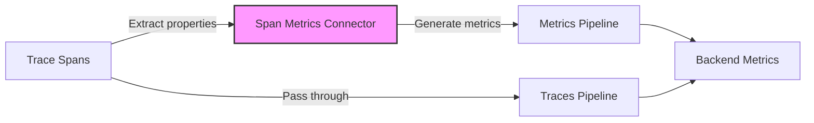

# How to Configure the Metrics Generation Processor in the OpenTelemetry Collector

Author: [nawazdhandala](https://www.github.com/nawazdhandala)

Tags: OpenTelemetry, Collector, Processor, Metric, Trace, Observability, RED Metrics, Aggregation

Description: Learn how to configure the Metrics Generation Processor in OpenTelemetry Collector to automatically derive RED metrics from trace spans for comprehensive observability.

Traces provide detailed request-level visibility, but metrics give you the aggregated view needed for dashboards and alerts. The Span Metrics Connector bridges this gap by automatically generating metrics from trace spans. This gives you the best of both worlds: detailed traces for debugging and aggregated metrics for monitoring, without instrumenting twice.

## What Is the Span Metrics Connector?

The Span Metrics Connector analyzes trace spans flowing through the Collector and generates metrics based on span properties. It can create request counts, duration histograms, and error rates automatically. This produces RED metrics (Rate, Errors, Duration) from your existing trace data without additional instrumentation.

This is useful when:

- You want RED metrics without separate metric instrumentation
- Your services emit traces but lack comprehensive metrics
- You need metrics that exactly match trace semantics
- You want to derive service-level metrics from distributed traces
- You need to aggregate metrics across span attributes

## Architecture Overview

The Span Metrics Connector converts trace spans into metrics:


```mermaid
graph LR
    A[Trace Spans] -->|Extract properties| B[Span Metrics Connector]
    B -->|Generate metrics| C[Metrics Pipeline]
    A -->|Pass through| D[Traces Pipeline]
    C --> E[Backend Metrics]
    D --> E

    style B fill:#f9f,stroke:#333,stroke-width:2px
```

Spans flow through the connector, which generates metrics based on span attributes, then both traces and derived metrics are exported to backends.

## Basic Configuration

Here's a minimal Span Metrics Connector configuration that creates basic RED metrics:

```yaml
# Configure receivers to accept traces

receivers:
  otlp:
    protocols:
      grpc:
        endpoint: 0.0.0.0:4317
      http:
        endpoint: 0.0.0.0:4318

# Define processors used by the pipelines
processors:
  # Batch processor for efficient export
  batch:
    timeout: 10s
    send_batch_size: 1024

# Define the Span Metrics Connector
connectors:
  # The Span Metrics Connector generates metrics from spans
  span_metrics:
    # Aggregation temporality for generated metrics
    # Options: AGGREGATION_TEMPORALITY_CUMULATIVE, AGGREGATION_TEMPORALITY_DELTA
    aggregation_temporality: AGGREGATION_TEMPORALITY_CUMULATIVE

    # Dimensions to include in generated metrics
    # These span or resource attributes become metric attributes.
    # service.name, span.name, span.kind, status.code, and collector.instance.id
    # are included by default.
    dimensions:
      # Include HTTP method as a dimension
      - name: http.method
        # Use default value if attribute not present
        default: "UNKNOWN"

      # Include HTTP status code
      - name: http.status_code
        default: "0"

    # Histogram buckets for duration metrics (in milliseconds)
    # Customize these based on your latency SLOs
    histogram:
      unit: ms
      explicit:
        buckets: [10ms, 25ms, 50ms, 100ms, 250ms, 500ms, 1s, 2500ms, 5s, 10s]

# Configure export destination
exporters:
  otlphttp:
    endpoint: https://oneuptime.com/otlp
    headers:
      x-oneuptime-token: ${ONEUPTIME_TOKEN}

# Wire everything together in pipelines
service:
  pipelines:
    # Traces pipeline - processes spans and generates metrics
    traces:
      receivers: [otlp]
      processors: [batch]
      exporters: [span_metrics, otlphttp]

    # Metrics pipeline - exports generated metrics
    metrics:
      receivers: [span_metrics]
      processors: [batch]
      exporters: [otlphttp]
```

## Understanding Generated Metrics

The Span Metrics Connector creates three primary metric types:

### Request Rate Metrics

Counts of spans grouped by dimensions:

```yaml
# Generated metric: traces.span.metrics.calls
# Type: Sum
# Description: Total number of spans
# Attributes: service.name, span.name, span.kind, status.code, collector.instance.id,
#             plus configured dimensions such as http.method and http.status_code

# Example Prometheus queries when metric names/attributes are normalized:
# - rate(traces_span_metrics_calls_total[5m])  # Request rate per second
# - sum(rate(traces_span_metrics_calls_total[5m])) by (service_name)  # Rate by service
```

### Duration Metrics

Histogram of span durations:

```yaml
# Generated metric: traces.span.metrics.duration
# Type: Histogram
# Description: Duration of spans
# Attributes: service.name, span.name, span.kind, status.code, collector.instance.id,
#             plus configured dimensions such as http.method and http.status_code
# Buckets: Configurable histogram buckets

# Example Prometheus queries when metric names/attributes are normalized:
# - histogram_quantile(0.95, rate(traces_span_metrics_duration_bucket[5m]))  # p95 latency
# - histogram_quantile(0.99, rate(traces_span_metrics_duration_bucket[5m]))  # p99 latency
```

### Error Rate Metrics

Automatic calculation based on span status:

```yaml
# Derived from traces.span.metrics.calls with status.code = Error
# Error rate = traces.span.metrics.calls{status.code="Error"} / traces.span.metrics.calls

# Example Prometheus queries when metric names/attributes are normalized:
# - sum(rate(traces_span_metrics_calls_total{status_code="STATUS_CODE_ERROR"}[5m])) / sum(rate(traces_span_metrics_calls_total[5m]))  # Overall error rate
# - rate(traces_span_metrics_calls_total{http_status_code=~"5.."}[5m])  # 5xx error rate
```

## Advanced Configuration

### Custom Dimensions and Filtering

Control which attributes become metric dimensions:

```yaml
connectors:
  span_metrics:
    # Fine-grained dimension control
    dimensions:
      # Include HTTP method
      - name: http.method
        default: "UNKNOWN"

      # Include HTTP route (normalized path)
      - name: http.route
        default: "UNKNOWN"

      # Include HTTP status code
      - name: http.status_code
        default: "0"

      # Include deployment environment
      - name: deployment.environment
        default: "unknown"

      # Include customer tier for segmented metrics
      - name: customer.tier
        default: "standard"

    # Exclude default dimensions you do not need
    exclude_dimensions: ["collector.instance.id"]

    histogram:
      unit: ms
      explicit:
        # Custom buckets for API latency SLOs
        buckets: [5ms, 10ms, 25ms, 50ms, 75ms, 100ms, 250ms, 500ms, 750ms, 1s, 2s, 5s]
```

### Multi-Dimensional Aggregation

Generate metrics with different dimension sets for different use cases:

```yaml
connectors:
  # High-cardinality metrics with detailed dimensions
  span_metrics/detailed:
    dimensions:
      - name: http.method
      - name: http.route
      - name: http.status_code
      - name: deployment.environment
      - name: k8s.pod.name

    # Prefix generated metrics with detailed.span.metrics
    namespace: detailed.span.metrics

  # Low-cardinality metrics for long-term storage
  span_metrics/summary:
    dimensions:
      - name: deployment.environment
      - name: http.status_code

    # Prefix generated metrics with summary.span.metrics
    namespace: summary.span.metrics
```

Resource Attribute Integration

Include resource attributes as metric dimensions:

```yaml
connectors:
  span_metrics:
    # Include resource attributes as dimensions
    dimensions:
      # Service metadata
      - name: service.namespace
      - name: service.version

      # Deployment metadata
      - name: deployment.environment
      - name: deployment.region

      # Kubernetes metadata
      - name: k8s.cluster.name
      - name: k8s.namespace.name
      - name: k8s.deployment.name

      # Cloud metadata
      - name: cloud.provider
      - name: cloud.region
      - name: cloud.availability_zone

      # Span attributes
      - name: http.method
      - name: http.route
      - name: http.status_code
```

## Production Configuration Example

Here's a complete production-ready configuration with comprehensive Span Metrics Connector:

```yaml
receivers:
  otlp:
    protocols:
      grpc:
        endpoint: 0.0.0.0:4317
        max_recv_msg_size_mib: 16
      http:
        endpoint: 0.0.0.0:4318

processors:
  # Memory limiter prevents OOM issues
  memory_limiter:
    check_interval: 1s
    limit_mib: 2048
    spike_limit_mib: 512

  # Add computed attributes before metric generation
  transform/enrich:
    error_mode: ignore
    trace_statements:
      - context: span
        statements:
          # Add HTTP status code class (2xx, 3xx, 4xx, 5xx)
          - set(attributes["http.status_code.class"], "2xx") where attributes["http.status_code"] >= 200 and attributes["http.status_code"] < 300
          - set(attributes["http.status_code.class"], "3xx") where attributes["http.status_code"] >= 300 and attributes["http.status_code"] < 400
          - set(attributes["http.status_code.class"], "4xx") where attributes["http.status_code"] >= 400 and attributes["http.status_code"] < 500
          - set(attributes["http.status_code.class"], "5xx") where attributes["http.status_code"] >= 500

  filter/server_spans:
    error_mode: ignore
    trace_conditions:
      - span.kind != SPAN_KIND_SERVER

  filter/database_spans:
    error_mode: ignore
    trace_conditions:
      - span.attributes["db.system"] == nil

  filter/rpc_spans:
    error_mode: ignore
    trace_conditions:
      - span.attributes["rpc.system"] == nil

  # Batch processors
  batch/traces:
    timeout: 10s
    send_batch_size: 1024

  batch/metrics:
    timeout: 30s
    send_batch_size: 2048

connectors:
  # Generate detailed metrics for server spans
  span_metrics/server:
    dimensions:
      # Service metadata
      - name: service.namespace
        default: "default"

      # HTTP attributes
      - name: http.method
        default: "UNKNOWN"

      - name: http.route
        default: "UNKNOWN"

      - name: http.status_code
        default: "0"

      # Deployment context
      - name: deployment.environment
        default: "unknown"

      # Status code category
      - name: http.status_code.class
        default: "unknown"

    namespace: http.server.request

    # Histogram buckets aligned with SLOs
    histogram:
      unit: ms
      explicit:
        buckets: [10ms, 25ms, 50ms, 75ms, 100ms, 150ms, 200ms, 300ms, 500ms, 750ms, 1s, 2s, 5s]

  # Generate metrics for database operations
  span_metrics/database:
    # Limit tracked dimension combinations
    aggregation_cardinality_limit: 10000

    dimensions:
      - name: db.system
        default: "unknown"
      - name: db.operation
        default: "unknown"
      - name: db.name
        default: "unknown"

    namespace: db.client.operation

    histogram:
      unit: ms
      explicit:
        # Database query latency buckets
        buckets: [1ms, 5ms, 10ms, 25ms, 50ms, 100ms, 250ms, 500ms, 1s, 2500ms, 5s, 10s]

  # Generate metrics for RPC calls
  span_metrics/rpc:
    dimensions:
      - name: rpc.system
        default: "unknown"
      - name: rpc.service
        default: "unknown"
      - name: rpc.method
        default: "unknown"
      - name: rpc.grpc.status_code
        default: "0"

    namespace: rpc.client.request

exporters:
  # Primary backend for all telemetry
  otlphttp:
    endpoint: https://oneuptime.com/otlp
    headers:
      x-oneuptime-token: ${ONEUPTIME_TOKEN}
    compression: gzip
    retry_on_failure:
      enabled: true
      initial_interval: 5s
      max_interval: 30s
      max_elapsed_time: 300s

  # Debug logging
  debug:
    verbosity: basic

service:
  extensions: [health_check, pprof]

  pipelines:
    # Traces pipeline - generates metrics from spans
    traces:
      receivers: [otlp]
      processors:
        - memory_limiter
        - transform/enrich
        - batch/traces
      exporters: [otlphttp, debug]

    traces/server_metrics:
      receivers: [otlp]
      processors:
        - memory_limiter
        - transform/enrich
        - filter/server_spans
        - batch/traces
      exporters: [span_metrics/server]

    traces/database_metrics:
      receivers: [otlp]
      processors:
        - memory_limiter
        - filter/database_spans
        - batch/traces
      exporters: [span_metrics/database]

    traces/rpc_metrics:
      receivers: [otlp]
      processors:
        - memory_limiter
        - filter/rpc_spans
        - batch/traces
      exporters: [span_metrics/rpc]

    # Metrics pipeline - exports generated metrics
    metrics:
      receivers: [span_metrics/server, span_metrics/database, span_metrics/rpc]
      processors:
        - memory_limiter
        - batch/metrics
      exporters: [otlphttp]

extensions:
  health_check:
    endpoint: 0.0.0.0:13133
  pprof:
    endpoint: 0.0.0.0:1777
```

## Deployment in Kubernetes

Deploy the Span Metrics Connector in Kubernetes:

```yaml
apiVersion: v1
kind: ConfigMap
metadata:
  name: otel-collector-config
  namespace: observability
data:
  collector.yaml: |
    receivers:
      otlp:
        protocols:
          grpc:
            endpoint: 0.0.0.0:4317
          http:
            endpoint: 0.0.0.0:4318

    processors:
      memory_limiter:
        check_interval: 1s
        limit_mib: 2048

      batch/traces:
        timeout: 10s
        send_batch_size: 1024

      batch/metrics:
        timeout: 30s
        send_batch_size: 2048

    connectors:
      # Generate HTTP server metrics
      span_metrics/http:
        dimensions:
          - name: http.method
          - name: http.route
          - name: http.status_code
          - name: deployment.environment
        namespace: http.server.request
        histogram:
          unit: ms
          explicit:
            buckets: [10ms, 25ms, 50ms, 100ms, 250ms, 500ms, 1s, 2500ms, 5s]

      # Generate database metrics
      span_metrics/database:
        dimensions:
          - name: db.system
          - name: db.operation
        namespace: db.client.operation
        histogram:
          unit: ms
          explicit:
            buckets: [1ms, 5ms, 10ms, 25ms, 50ms, 100ms, 250ms, 500ms, 1s, 2500ms]

    exporters:
      otlphttp:
        endpoint: https://oneuptime.com/otlp
        headers:
          x-oneuptime-token: ${ONEUPTIME_TOKEN}
        compression: gzip

    extensions:
      health_check:
        endpoint: 0.0.0.0:13133

    service:
      extensions: [health_check]
      pipelines:
        traces:
          receivers: [otlp]
          processors: [memory_limiter, batch/traces]
          exporters: [otlphttp, span_metrics/http, span_metrics/database]
        metrics:
          receivers: [span_metrics/http, span_metrics/database]
          processors: [memory_limiter, batch/metrics]
          exporters: [otlphttp]
---
apiVersion: apps/v1
kind: Deployment
metadata:
  name: otel-collector
  namespace: observability
spec:
  replicas: 3
  selector:
    matchLabels:
      app: otel-collector
  template:
    metadata:
      labels:
        app: otel-collector
      annotations:
        prometheus.io/scrape: "true"
        prometheus.io/port: "8888"
        prometheus.io/path: "/metrics"
    spec:
      containers:
      - name: otel-collector
        image: otel/opentelemetry-collector-contrib:0.153.0
        args:
          - "--config=/conf/collector.yaml"
        env:
        - name: ONEUPTIME_TOKEN
          valueFrom:
            secretKeyRef:
              name: oneuptime-credentials
              key: token
        volumeMounts:
        - name: config
          mountPath: /conf
        ports:
        - containerPort: 4317
          name: otlp-grpc
        - containerPort: 4318
          name: otlp-http
        - containerPort: 8888
          name: metrics
        - containerPort: 13133
          name: health
        resources:
          requests:
            memory: "2Gi"
            cpu: "1000m"
          limits:
            memory: "4Gi"
            cpu: "2000m"
        livenessProbe:
          httpGet:
            path: /
            port: 13133
          initialDelaySeconds: 30
          periodSeconds: 10
      volumes:
      - name: config
        configMap:
          name: otel-collector-config
---
apiVersion: v1
kind: Service
metadata:
  name: otel-collector
  namespace: observability
spec:
  type: ClusterIP
  selector:
    app: otel-collector
  ports:
  - name: otlp-grpc
    port: 4317
    targetPort: 4317
  - name: otlp-http
    port: 4318
    targetPort: 4318
  - name: metrics
    port: 8888
    targetPort: 8888
```

## Querying Generated Metrics

### RED Metrics Dashboard

Create a complete RED metrics dashboard:

```text
# Request Rate (Rate)
sum(rate(http_server_request_calls_total[5m])) by (service_name)

# Error Rate (Errors)
sum(rate(http_server_request_calls_total{http_status_code=~"5.."}[5m])) by (service_name)
/
sum(rate(http_server_request_calls_total[5m])) by (service_name)

# Request Duration (Duration)
histogram_quantile(0.95, sum(rate(http_server_request_duration_bucket[5m])) by (service_name, le))
```

### Service-Level Metrics

Monitor individual service performance:

```text
# Requests per second by service and route
sum(rate(http_server_request_calls_total[5m])) by (service_name, http_route)

# p50, p95, p99 latency by service
histogram_quantile(0.50, sum(rate(http_server_request_duration_bucket[5m])) by (service_name, le))
histogram_quantile(0.95, sum(rate(http_server_request_duration_bucket[5m])) by (service_name, le))
histogram_quantile(0.99, sum(rate(http_server_request_duration_bucket[5m])) by (service_name, le))

# Error rate by status code
sum(rate(http_server_request_calls_total[5m])) by (service_name, http_status_code)
```

### Database Performance Metrics

Track database operation performance:

```text
# Database operations per second
sum(rate(db_client_operation_calls_total[5m])) by (service_name, db_system, db_operation)

# Database query latency
histogram_quantile(0.95, sum(rate(db_client_operation_duration_bucket[5m])) by (db_system, db_operation, le))

# Slow query rate (queries > 1s)
sum(rate(db_client_operation_calls_total[5m])) by (db_system, db_operation)
-
sum(rate(db_client_operation_duration_bucket{le="1000"}[5m])) by (db_system, db_operation)
```

## Cardinality Management

High-cardinality dimensions can explode metric series. Manage cardinality carefully:

### Dimension Selection

Choose dimensions that provide value without excessive cardinality:

```yaml
connectors:
  span_metrics:
    dimensions:
      # Low cardinality (good)
      - name: http.method
      - name: http.status_code
      - name: deployment.environment

      # Medium cardinality (acceptable)
      - name: http.route  # Normalized paths like /users/{id}

      # High cardinality (avoid)
      # - name: http.target  # Raw paths like /users/12345
      # - name: user.id
      # - name: trace.id
```

### Aggregation Rules

Use aggregation to reduce cardinality:

```yaml
processors:
  # Add a lower-cardinality HTTP status class before Span Metrics Connector
  transform/http_status_class:
    error_mode: ignore
    trace_statements:
      - context: span
        statements:
          - set(attributes["http.status_code.class"], "2xx") where attributes["http.status_code"] >= 200 and attributes["http.status_code"] < 300
          - set(attributes["http.status_code.class"], "3xx") where attributes["http.status_code"] >= 300 and attributes["http.status_code"] < 400
          - set(attributes["http.status_code.class"], "4xx") where attributes["http.status_code"] >= 400 and attributes["http.status_code"] < 500
          - set(attributes["http.status_code.class"], "5xx") where attributes["http.status_code"] >= 500

connectors:
  span_metrics:
    # Use lower-cardinality attributes
    dimensions:
      - name: http.method
      - name: http.status_code.class  # "2xx" instead of "200", "201", etc.
```

## Monitoring Metrics Generation

Track the connector's performance:

```yaml
service:
  telemetry:
    logs:
      level: info
    metrics:
      level: detailed

# Monitor these metrics:
# - otelcol_receiver_accepted_spans
# - otelcol_receiver_refused_spans
# - otelcol_exporter_sent_metric_points
# - otelcol_exporter_send_failed_metric_points
```

Create alerts for:

- Aggregation cardinality approaching configured limits
- Processing time increasing
- Generated metric series count exploding

## Common Use Cases

### SLO Monitoring

Generate metrics for SLO tracking:

```yaml
connectors:
  span_metrics/slo:
    dimensions:
      - name: slo.indicator
        # Derived from span attributes or computed

    namespace: slo.requests

    # Custom buckets aligned with SLO thresholds
    histogram:
      unit: ms
      explicit:
        buckets: [50ms, 100ms, 200ms, 500ms, 1s]  # SLO: 95% < 500ms
```

### Service Mesh Metrics

Generate service-to-service metrics:

```yaml
connectors:
  span_metrics/service_mesh:
    dimensions:
      - name: source.service.name
      - name: destination.service.name
      - name: http.status_code

    namespace: service.mesh.request
```

### Regional Performance

Track performance by geographic region:

```yaml
connectors:
  span_metrics/regional:
    dimensions:
      - name: cloud.region
      - name: cloud.availability_zone
      - name: http.status_code

    namespace: regional.request
```

## Troubleshooting

### Metrics Not Generated

If metrics aren't being created:

```yaml
connectors:
  span_metrics:
    dimensions:
      - name: http.method
        default: "UNKNOWN"

service:
  telemetry:
    logs:
      level: debug
    metrics:
      level: detailed
```

Check logs:

```bash
kubectl logs -n observability deployment/otel-collector | grep "span_metrics"

# Look for connector startup, configuration, and error messages.
```

### High Cardinality Issues

If metric series count explodes:

```yaml
connectors:
  span_metrics:
    # Limit tracked dimension combinations
    aggregation_cardinality_limit: 5000

    # Use fewer dimensions
    dimensions:
      - name: http.method
      # Remove high-cardinality dimensions

processors:
  # Filter spans before Span Metrics Connector
  filter/drop_health_checks:
    error_mode: ignore
    trace_conditions:
      - span.name == "/metrics"
      - span.name == "/health"
```

## Best Practices

1. **Start with standard RED metrics**: Request rate, error rate, duration percentiles
2. **Choose dimensions carefully**: Balance observability value against cardinality cost
3. **Align histogram buckets with SLOs**: Use bucket boundaries that match your service level objectives
4. **Monitor cardinality**: Track dimension cache size and adjust as needed
5. **Use multiple connectors**: Create separate metric sets for different analysis needs

## Performance Considerations

The Span Metrics Connector adds overhead:

- Memory usage scales with number of unique dimension combinations
- Processing time scales with span volume
- Histogram calculations add CPU cost

Optimize with:

```yaml
connectors:
  span_metrics:
    # Limit tracked dimension combinations
    aggregation_cardinality_limit: 10000

    # Use delta temporality for lower memory
    aggregation_temporality: AGGREGATION_TEMPORALITY_DELTA

    # Fewer histogram buckets
    histogram:
      unit: ms
      explicit:
        buckets: [10ms, 50ms, 100ms, 500ms, 1s, 5s]
```

## Related Resources

- [What is OpenTelemetry Collector and Why Use One](https://oneuptime.com/blog/post/2025-09-18-what-is-opentelemetry-collector-and-why-use-one/view)
- [How to Reduce Noise in OpenTelemetry](https://oneuptime.com/blog/post/2025-08-25-how-to-reduce-noise-in-opentelemetry/view)
- [How to Configure the Interval Processor in OpenTelemetry Collector](https://oneuptime.com/blog/post/2026-02-06-interval-processor-opentelemetry-collector/view)

## Final Thoughts

The Span Metrics Connector eliminates the need for dual instrumentation by automatically deriving metrics from traces. This ensures your metrics and traces stay perfectly synchronized, reduces instrumentation overhead, and simplifies your observability stack.

Start with basic RED metrics for server spans, add database and RPC metrics as needed, and carefully manage cardinality through dimension selection. With the Span Metrics Connector, you get comprehensive metrics coverage from your existing trace data, enabling powerful monitoring, alerting, and SLO tracking without additional instrumentation effort.
