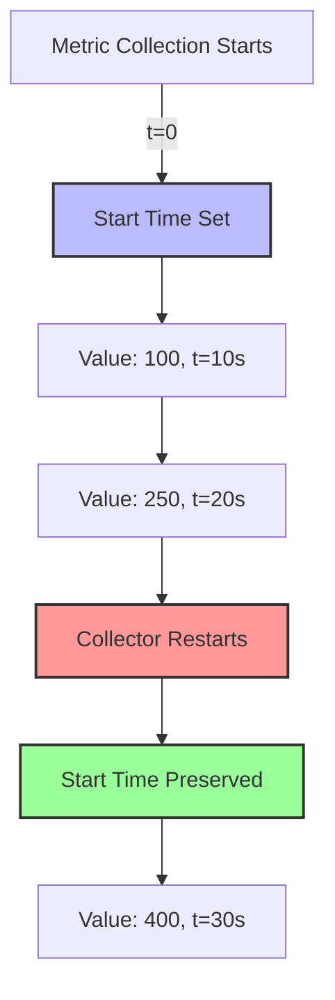

# How to Use the Metrics Start Time Processor in the OpenTelemetry Collector

Author: [nawazdhandala](https://www.github.com/nawazdhandala)

Tags: OpenTelemetry, Collector, Processors, Metrics, Start Time, Cumulative Metrics

Description: Master the Metrics Start Time processor in the OpenTelemetry Collector to correctly manage cumulative metric start times and prevent data accuracy issues.

Cumulative metrics in OpenTelemetry track values that accumulate over time, such as request counts, error totals, or bytes transferred. The Metrics Start Time processor addresses a critical challenge with these metrics: ensuring the start time accurately reflects when accumulation began. Incorrect start times can lead to misleading visualizations, inaccurate rate calculations, and flawed alerting decisions.

## The Start Time Problem

Cumulative metrics include two timestamps: the observation time (when the metric was recorded) and the start time (when accumulation began). When collectors restart, exporters change, or data flows through multiple collectors, start times can become inconsistent or reset incorrectly.

Consider a request counter that has accumulated 10,000 requests over 24 hours. If the collector restarts and the start time resets to the restart moment, downstream systems might interpret the 10,000 requests as occurring within seconds rather than over the full day. This distorts rate calculations and makes historical analysis impossible.

The Metrics Start Time processor solves this by tracking and preserving correct start times across collector restarts and configuration changes.

## Understanding Metric Start Times

OpenTelemetry defines start times differently for metric types:

**Cumulative Sum Metrics**: Start time indicates when the counter began accumulating. This should remain constant unless the counter explicitly resets.

**Cumulative Histogram Metrics**: Start time shows when bucket counts started accumulating.

**Gauge Metrics**: No start time needed since gauges represent point-in-time values, not accumulation.



The diagram shows how the processor maintains the original start time (set at t=0) even when the collector restarts.

## Basic Configuration

The Metrics Start Time processor requires minimal configuration. By default, it tracks all cumulative metrics and preserves their start times.

Here is a basic configuration:

```yaml
# Basic Metrics Start Time processor configuration
processors:
  metricsstarttime:
    # Track all cumulative metrics (default behavior)
    # No additional configuration needed for basic usage

service:
  pipelines:
    metrics:
      receivers: [prometheus]
      processors: [metricsstarttime, batch]
      exporters: [otlp]
```

This configuration automatically identifies cumulative metrics and manages their start times appropriately.

## Selective Metric Processing

In some scenarios, you may want to process start times only for specific metrics. The processor supports include and exclude patterns for fine-grained control.

```yaml
# Selective metric processing configuration
processors:
  metricsstarttime:
    # Only process HTTP request metrics
    include:
      match_type: regexp
      metric_names:
        - ^http\.server\.request\.count$
        - ^http\.client\.request\.count$

service:
  pipelines:
    metrics:
      receivers: [prometheus]
      processors: [metricsstarttime, batch]
      exporters: [otlp]
```

This configuration processes start times only for HTTP request counter metrics, leaving other metrics untouched.

Alternatively, exclude specific metrics:

```yaml
# Exclude specific metrics from processing
processors:
  metricsstarttime:
    # Process all metrics except test metrics
    exclude:
      match_type: regexp
      metric_names:
        - ^test\..*
        - ^debug\..*

service:
  pipelines:
    metrics:
      receivers: [prometheus]
      processors: [metricsstarttime, batch]
      exporters: [otlp]
```

## Handling Metric Reset Detection

The processor can detect when source applications reset their cumulative metrics and adjust start times accordingly. This prevents confusion when applications restart or counters intentionally reset.

```yaml
# Configuration with reset detection
processors:
  metricsstarttime:
    # Enable reset detection
    detect_resets: true
    # Time window for considering value decreases as resets
    reset_threshold: 1s

service:
  pipelines:
    metrics:
      receivers: [prometheus]
      processors: [metricsstarttime, batch]
      exporters: [otlp]
```

When `detect_resets` is enabled, the processor monitors cumulative metric values. If a value decreases (indicating a reset), the processor updates the start time to reflect the reset point.

## Resource Attribute Tracking

Different metric series (identified by unique label combinations) require independent start time tracking. The processor automatically handles this by tracking start times per metric series.

```yaml
# Configuration for multi-tenant environments
processors:
  metricsstarttime:
    # Processor automatically tracks start times per series
    # based on metric name and label combinations

service:
  pipelines:
    metrics:
      receivers: [prometheus]
      processors: [metricsstarttime, batch]
      exporters: [otlp]
```

For example, if you have request counts labeled by service name:
- `http.requests{service="api"}` maintains its own start time
- `http.requests{service="web"}` maintains a separate start time
- `http.requests{service="auth"}` maintains yet another start time

The processor tracks each series independently, ensuring accurate start times for all.

## State Persistence

For production deployments, configure the processor to persist start time state to disk. This ensures start times survive collector restarts.

```yaml
# Configuration with state persistence
processors:
  metricsstarttime:
    # Enable state persistence to file
    state_file: /var/lib/otel-collector/metricsstarttime.state
    # Save state every 5 minutes
    save_interval: 5m

service:
  pipelines:
    metrics:
      receivers: [prometheus]
      processors: [metricsstarttime, batch]
      exporters: [otlp]
```

The processor saves tracked start times to the specified file at regular intervals. On restart, it loads the state and continues with consistent start times.

Ensure the collector process has read and write permissions for the state file location.

## Complex Pipeline Configuration

In production environments, combine the Metrics Start Time processor with other processors for comprehensive metric handling.

```yaml
# Production-ready metrics pipeline
processors:
  # Filter out unwanted metrics first
  filter/drop_debug:
    metrics:
      exclude:
        match_type: regexp
        metric_names:
          - ^debug\..*

  # Manage start times for cumulative metrics
  metricsstarttime:
    detect_resets: true
    state_file: /var/lib/otel-collector/metricsstarttime.state
    save_interval: 5m

  # Add resource attributes
  resource:
    attributes:
      - key: deployment.environment
        value: production
        action: insert

  # Transform metric names if needed
  metricstransform:
    transforms:
      - include: ^legacy\.(.*)
        match_type: regexp
        action: update
        new_name: app.$${1}

  # Batch for efficiency
  batch:
    timeout: 10s
    send_batch_size: 1000

service:
  pipelines:
    metrics:
      receivers: [prometheus, otlp]
      processors:
        - filter/drop_debug
        - metricsstarttime
        - resource
        - metricstransform
        - batch
      exporters: [otlp/backend]
```

This configuration demonstrates a complete production pipeline:
1. Filters unwanted metrics
2. Manages start times with persistence
3. Adds resource attributes
4. Transforms metric names
5. Batches for efficient transmission

## Rate Calculation Accuracy

Accurate start times directly impact rate calculations in downstream systems. Without proper start time management, rate calculations can be wildly inaccurate.

Consider this scenario without the Metrics Start Time processor:

```yaml
# Without Metrics Start Time processor - PROBLEMATIC
service:
  pipelines:
    metrics:
      receivers: [prometheus]
      processors: [batch]
      exporters: [otlp]
```

When the collector restarts:
- Cumulative counter: 5000 requests
- Start time: resets to restart time (say, 1 second ago)
- Calculated rate: 5000 requests/second
- Actual rate: 5 requests/second (over ~1000 seconds)

With the Metrics Start Time processor:

```yaml
# With Metrics Start Time processor - CORRECT
service:
  pipelines:
    metrics:
      receivers: [prometheus]
      processors: [metricsstarttime, batch]
      exporters: [otlp]
```

After collector restart:
- Cumulative counter: 5000 requests
- Start time: preserved from original collection start (1000 seconds ago)
- Calculated rate: 5 requests/second
- Actual rate: 5 requests/second

## Multi-Collector Scenarios

When telemetry flows through multiple collectors (edge collectors forwarding to central collectors), proper start time handling becomes crucial.

```yaml
# Edge collector configuration
processors:
  metricsstarttime/edge:
    state_file: /var/lib/otel-collector/edge-starttime.state
    save_interval: 5m

service:
  pipelines:
    metrics:
      receivers: [prometheus]
      processors: [metricsstarttime/edge, batch]
      exporters: [otlp/central]
```

```yaml
# Central collector configuration
processors:
  # Central collector may also track start times
  metricsstarttime/central:
    state_file: /var/lib/otel-collector/central-starttime.state
    save_interval: 5m

service:
  pipelines:
    metrics:
      receivers: [otlp]
      processors: [metricsstarttime/central, batch]
      exporters: [otlp/backend]
```

Both collectors maintain start time state independently, providing redundancy and consistency across the collection infrastructure.

## Monitoring and Validation

Monitor the Metrics Start Time processor to ensure it operates correctly:

```yaml
# Enable telemetry for the processor
service:
  telemetry:
    logs:
      level: info
    metrics:
      level: detailed
      address: 0.0.0.0:8888

  pipelines:
    metrics:
      receivers: [prometheus]
      processors: [metricsstarttime, batch]
      exporters: [otlp]
```

The processor exposes metrics about its operation:
- Number of metric series tracked
- State save operations
- Reset detections
- Processing errors

## Troubleshooting Common Issues

**Start times still resetting**: Verify state file configuration and check file permissions. Ensure the state file path exists and is writable.

**Memory usage growing**: The processor tracks state for every unique metric series. In high-cardinality scenarios, implement metric filtering before the processor.

```yaml
# Reduce cardinality before start time processing
processors:
  filter/reduce_cardinality:
    metrics:
      exclude:
        match_type: regexp
        metric_names:
          - .*high_cardinality.*

  metricsstarttime:
    state_file: /var/lib/otel-collector/metricsstarttime.state

service:
  pipelines:
    metrics:
      receivers: [prometheus]
      processors: [filter/reduce_cardinality, metricsstarttime, batch]
      exporters: [otlp]
```

**Incorrect rate calculations**: Verify the processor is positioned early in the pipeline, before any transformations that might affect metric identity.

**State file corruption**: Implement regular backups of the state file. The processor handles corrupted files by starting fresh, but backups prevent data loss.

## Performance Considerations

The Metrics Start Time processor adds minimal latency but does consume memory proportional to the number of unique metric series tracked. For high-cardinality metrics (thousands of unique series), monitor memory usage and consider:

1. Filtering high-cardinality metrics before the processor
2. Increasing state save intervals to reduce disk I/O
3. Using multiple collectors to distribute the tracking load

## Related Resources

For more information on metrics processing in the OpenTelemetry Collector:

- [How to Configure the Lookup Processor](https://oneuptime.com/blog/post/lookup-processor-opentelemetry-collector/view)
- [How to Write OTTL Statements for the Transform Processor](https://oneuptime.com/blog/post/ottl-statements-transform-processor-opentelemetry-collector/view)

The Metrics Start Time processor is essential for maintaining accurate cumulative metrics in production OpenTelemetry deployments. By preserving start times across collector restarts and configuration changes, it ensures rate calculations remain accurate and historical analysis stays meaningful. Configure state persistence for production use, monitor memory consumption with high-cardinality metrics, and position the processor early in your pipeline for best results.
