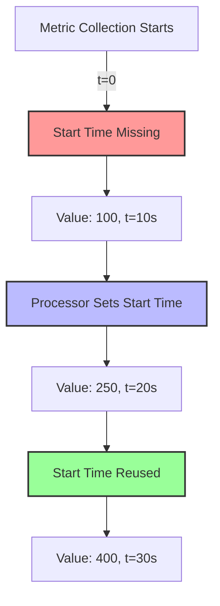

# How to Use the Metrics Start Time Processor in the OpenTelemetry Collector

Author: [nawazdhandala](https://www.github.com/nawazdhandala)

Tags: OpenTelemetry, Collector, Processor, Metric, Start Time, Cumulative Metrics

Description: Master the Metrics Start Time processor in the OpenTelemetry Collector to correctly manage cumulative metric start times and prevent data accuracy issues.

Cumulative metrics in OpenTelemetry track values that accumulate over time, such as request counts, error totals, or bytes transferred. The Metric Start Time processor addresses a critical challenge with these metrics: setting a start time when cumulative metric points arrive without one. Incorrect or missing start times can lead to misleading visualizations, inaccurate rate calculations, and flawed alerting decisions.

## The Start Time Problem

Cumulative metrics include two timestamps: the observation time (when the metric was recorded) and the start time (the beginning of the time window for that point). Some receivers, such as the Prometheus receiver, can produce cumulative metric points without a start time. Downstream systems then need help distinguishing a newly observed cumulative stream from a counter that really reset.

Consider a request counter that has accumulated 10,000 requests over 24 hours. If the first point seen by a backend is treated as if all 10,000 requests occurred since the backend started observing the stream, downstream systems might calculate an inflated rate. This distorts rate calculations and makes historical analysis difficult.

The Metric Start Time processor solves this by setting start times for cumulative metric points that do not already have them.

## Understanding Metric Start Times

OpenTelemetry defines start times differently for metric types:

**Cumulative Sum Metrics**: Start time indicates the beginning of the time window covered by the cumulative value. For an unbroken cumulative stream, subsequent points use the same start time as the initial observation.

**Cumulative Histogram Metrics**: Start time shows the beginning of the time window covered by the accumulated bucket counts.

**Gauge Metrics**: No start time needed since gauges represent point-in-time values, not accumulation.


```mermaid
graph TD
    A[Metric Collection Starts] -->|t=0| B[Start Time Missing]
    B --> C[Value: 100, t=10s]
    C --> D[Processor Sets Start Time]
    D --> E[Value: 250, t=20s]
    E --> F[Start Time Reused]
    F --> G[Value: 400, t=30s]

    style B fill:#f99,stroke:#333,stroke-width:2px
    style D fill:#bbf,stroke:#333,stroke-width:2px
    style F fill:#9f9,stroke:#333,stroke-width:2px
```

The diagram shows how the processor sets a start time when a cumulative stream arrives without one, then reuses that start time for later points in the same unbroken stream.

## Basic Configuration

The Metric Start Time processor requires minimal configuration. By default, it uses the `true_reset_point` strategy for cumulative metric points that are missing a start time.

Here is a basic configuration:

```yaml
# Basic Metric Start Time processor configuration

processors:
  metric_start_time:
    # Uses the true_reset_point strategy by default.
    # No additional configuration needed for basic usage.

service:
  pipelines:
    metrics:
      receivers: [prometheus]
      processors: [metric_start_time, batch]
      exporters: [otlp]
```

This configuration automatically handles cumulative metric points that are missing start times.

## Selective Metric Processing

In some scenarios, you may want to process start times only for specific metrics. The Metric Start Time processor does not support its own include and exclude patterns, so use the Filter processor before it when you need fine-grained control.

```yaml
# Selective metric processing configuration
processors:
  filter/keep_http_requests:
    error_mode: ignore
    metric_conditions:
      - metric.name != "http.server.request.count" and metric.name != "http.client.request.count"

  metric_start_time:
    strategy: true_reset_point

service:
  pipelines:
    metrics:
      receivers: [prometheus]
      processors: [filter/keep_http_requests, metric_start_time, batch]
      exporters: [otlp]
```

This configuration processes start times only for HTTP request counter metrics that remain after filtering.

Alternatively, exclude specific metrics before the processor:

```yaml
# Exclude specific metrics from processing
processors:
  filter/drop_test_metrics:
    error_mode: ignore
    metric_conditions:
      - IsMatch(metric.name, "^test\\..*")
      - IsMatch(metric.name, "^debug\\..*")

  metric_start_time:
    strategy: true_reset_point

service:
  pipelines:
    metrics:
      receivers: [prometheus]
      processors: [filter/drop_test_metrics, metric_start_time, batch]
      exporters: [otlp]
```

## Handling Metric Reset Detection

The processor handles unknown cumulative start times by using one of three strategies. Choose the strategy that matches your backend and data source behavior.

```yaml
# Configuration with the default true reset point strategy
processors:
  metric_start_time:
    strategy: true_reset_point

service:
  pipelines:
    metrics:
      receivers: [prometheus]
      processors: [metric_start_time, batch]
      exporters: [otlp]
```

With `true_reset_point`, the first point in a stream gets a start time equal to its end timestamp. Subsequent points reuse that start time, which helps consumers identify an unknown-start reset point.

Resource Attribute Tracking

Different metric series (identified by resource attributes, scope, metric identity, and data point attributes) require independent start time tracking. The processor automatically handles this by tracking start times per stream.

```yaml
# Configuration for multi-tenant environments
processors:
  metric_start_time:
    # Processor automatically tracks start times per stream.
    gc_interval: 10m

service:
  pipelines:
    metrics:
      receivers: [prometheus]
      processors: [metric_start_time, batch]
      exporters: [otlp]
```

For example, if you have request counts labeled by service name:
- `http.requests{service="api"}` maintains its own start time
- `http.requests{service="web"}` maintains a separate start time
- `http.requests{service="auth"}` maintains yet another start time

The processor tracks each stream independently, ensuring accurate start times for all.

## State Persistence

The Metric Start Time processor keeps state in memory and does not provide a `state_file` or `save_interval` option. To control how long inactive streams stay in memory, configure `gc_interval`.

```yaml
# Configuration with cache garbage collection
processors:
  metric_start_time:
    strategy: true_reset_point
    # Remove inactive streams from the cache after this interval.
    gc_interval: 30m

service:
  pipelines:
    metrics:
      receivers: [prometheus]
      processors: [metric_start_time, batch]
      exporters: [otlp]
```

When the collector restarts, the processor starts with an empty in-memory cache. If your source emits a start time metric such as `process_start_time`, consider the `start_time_metric` strategy so the processor can derive the start time from the source application.

## Complex Pipeline Configuration

In production environments, combine the Metric Start Time processor with other processors for comprehensive metric handling.

```yaml
# Production-ready metrics pipeline
processors:
  # Filter out unwanted metrics first
  filter/drop_debug:
    error_mode: ignore
    metric_conditions:
      - IsMatch(metric.name, "^debug\\..*")

  # Set start times for cumulative metrics missing start times
  metric_start_time:
    strategy: start_time_metric
    gc_interval: 30m
    start_time_metric_regex: "^process_start_time$"

  # Add resource attributes
  resource:
    attributes:
      - key: deployment.environment
        value: production
        action: insert

  # Transform metric names if needed
  metrics_transform:
    transforms:
      - include: ^legacy\.(.*)
        match_type: regexp
        action: update
        new_name: app.$${1}

  # Batch for efficiency
  batch:
    timeout: 10s
    send_batch_size: 1000

service:
  pipelines:
    metrics:
      receivers: [prometheus, otlp]
      processors:
        - filter/drop_debug
        - metric_start_time
        - resource
        - metrics_transform
        - batch
      exporters: [otlp/backend]
```

This configuration demonstrates a complete production pipeline:
1. Filters unwanted metrics
2. Sets missing cumulative metric start times
3. Adds resource attributes
4. Transforms metric names
5. Batches for efficient transmission

## Rate Calculation Accuracy

Accurate start times directly impact rate calculations in downstream systems. Without proper start time management, rate calculations can be wildly inaccurate.

Consider this scenario without the Metric Start Time processor:

```yaml
# Without Metric Start Time processor - PROBLEMATIC
service:
  pipelines:
    metrics:
      receivers: [prometheus]
      processors: [batch]
      exporters: [otlp]
```

When a cumulative stream is first observed without a start time:
- Cumulative counter: 5000 requests
- Start time: unknown
- Backend behavior: may treat the first point as a reset or miscalculate the initial rate
- Actual rate: depends on the previous point in the stream

With the Metric Start Time processor:

```yaml
# With Metric Start Time processor - CORRECT
service:
  pipelines:
    metrics:
      receivers: [prometheus]
      processors: [metric_start_time, batch]
      exporters: [otlp]
```

After processing:
- Cumulative counter: 5000 requests
- Start time: set according to the configured strategy
- Initial point: marked consistently as an unknown-start or derived-start stream
- Subsequent rates: calculated from the stream's later points instead of guessing the first interval

## Multi-Collector Scenarios

When telemetry flows through multiple collectors (edge collectors forwarding to central collectors), proper start time handling becomes crucial.

```yaml
# Edge collector configuration
processors:
  metric_start_time/edge:
    strategy: start_time_metric
    gc_interval: 30m

service:
  pipelines:
    metrics:
      receivers: [prometheus]
      processors: [metric_start_time/edge, batch]
      exporters: [otlp/central]
```

```yaml
# Central collector configuration
processors:
  # Central collector can set start times for streams that still arrive without them
  metric_start_time/central:
    strategy: true_reset_point
    gc_interval: 30m

service:
  pipelines:
    metrics:
      receivers: [otlp]
      processors: [metric_start_time/central, batch]
      exporters: [otlp/backend]
```

The edge collector is usually the best place to set missing start times because it sees the original Prometheus scrape batches. A central collector can still run the processor for any cumulative points that arrive without start times.

## Monitoring and Validation

Monitor the Metric Start Time processor to ensure it operates correctly:

```yaml
# Enable telemetry for the processor
service:
  telemetry:
    logs:
      level: INFO
    metrics:
      level: detailed
      readers:
        - pull:
            exporter:
              prometheus:
                host: '0.0.0.0'
                port: 8888

  pipelines:
    metrics:
      receivers: [prometheus]
      processors: [metric_start_time, batch]
      exporters: [otlp]
```

The collector exposes internal metrics about pipeline operation:
- Processor incoming items
- Processor outgoing items
- Exporter send failures
- Process memory usage

## Troubleshooting Common Issues

**Start times still resetting**: Verify that the incoming cumulative metric points are missing start times and that the processor is running before batching. If you use `start_time_metric`, make sure the source start time metric is present in the same batch.

**Memory usage growing**: The processor tracks state for streams in memory. In high-cardinality scenarios, implement metric filtering before the processor and tune `gc_interval`.

```yaml
# Reduce cardinality before start time processing
processors:
  filter/reduce_cardinality:
    error_mode: ignore
    metric_conditions:
      - IsMatch(metric.name, ".*high_cardinality.*")

  metric_start_time:
    strategy: true_reset_point
    gc_interval: 10m

service:
  pipelines:
    metrics:
      receivers: [prometheus]
      processors: [filter/reduce_cardinality, metric_start_time, batch]
      exporters: [otlp]
```

**Incorrect rate calculations**: Verify the processor is positioned before batching, especially when using the `start_time_metric` strategy. For that strategy, a batch should contain metrics from a single application so the source start time metric applies to the other cumulative points in the batch.

**Unexpected first-point behavior**: Some backends reject zero-duration points where the start and end timestamps are equal. If that affects your backend, consider the `subtract_initial_point` strategy, which drops the first point and subtracts the initial value from later points.

## Performance Considerations

The Metric Start Time processor adds minimal latency but does consume memory proportional to the number of active streams tracked. For high-cardinality metrics (thousands of unique series), monitor memory usage and consider:

1. Filtering high-cardinality metrics before the processor
2. Decreasing `gc_interval` to remove inactive streams sooner
3. Using multiple collectors to distribute the tracking load

## Related Resources

For more information on metrics processing in the OpenTelemetry Collector:

- [How to Configure the Lookup Processor](https://oneuptime.com/blog/post/2026-02-06-lookup-processor-opentelemetry-collector/view)
- [How to Write OTTL Statements for the Transform Processor](https://oneuptime.com/blog/post/2026-02-06-ottl-statements-transform-processor-opentelemetry-collector/view)

The Metric Start Time processor is essential for maintaining accurate cumulative metrics in production OpenTelemetry deployments when incoming points are missing start times. By setting start times with the right strategy, it helps downstream systems calculate rates consistently and interpret cumulative streams correctly. Tune `gc_interval` for production use, monitor memory consumption with high-cardinality metrics, and position the processor before batching for best results.
