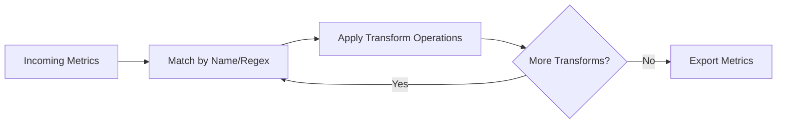

# How to Configure the Metrics Transform Processor in the OpenTelemetry Collector

Author: [nawazdhandala](https://www.github.com/nawazdhandala)

Tags: OpenTelemetry, Collector, Processors, Metrics, Data Transformation, Observability

Description: Learn how to configure the metrics transform processor in OpenTelemetry Collector to rename metrics, modify labels, aggregate data points, and transform metric types for standardization.

The metrics transform processor allows you to modify metrics as they flow through the collector. You can rename metrics, add or remove labels, change metric types, apply mathematical operations, and aggregate data points. This is essential when integrating metrics from different sources that use inconsistent naming conventions or when you need to adapt metrics to match your backend's requirements.

## Why Metrics Transformation Matters

Different systems produce metrics with different naming conventions. Prometheus uses underscores (`http_requests_total`), while some systems use dots (`http.requests.total`). Labels might be named differently (`service` vs `service_name`), or you might need to convert between metric types (gauge to counter, cumulative to delta). The metrics transform processor standardizes these differences before export.

For more context on metrics in OpenTelemetry, see our guide on [what are metrics in OpenTelemetry](https://oneuptime.com/blog/post/2025-08-26-what-are-metrics-in-opentelemetry/view).

## How Metrics Transform Works

The processor applies transformations sequentially to incoming metrics. Each transformation can match metrics by name (exact or regex), then apply operations like renaming, label manipulation, aggregation, or type conversion.



## Basic Configuration

Here's a simple configuration that renames a metric:

```yaml
# Basic metrics transform configuration
# Renames metrics and modifies labels
receivers:
  otlp:
    protocols:
      grpc:
        endpoint: 0.0.0.0:4317

processors:
  # Metrics transform processor modifies metrics
  # Transformations are applied in order
  metricstransform:
    transforms:
      # Rename a single metric
      - include: http_request_duration_seconds
        action: update
        new_name: http.request.duration

exporters:
  otlp:
    endpoint: https://oneuptime.com/otlp
    headers:
      x-oneuptime-token: YOUR_ONEUPTIME_TOKEN

service:
  pipelines:
    metrics:
      receivers: [otlp]
      processors: [metricstransform]
      exporters: [otlp]
```

## Matching Metrics

### Exact Name Matching

Match metrics by exact name:

```yaml
processors:
  metricstransform:
    transforms:
      # Match exact metric name
      - include: http_requests_total
        action: update
        new_name: http.requests.count

      # Match another metric
      - include: memory_usage_bytes
        action: update
        new_name: memory.usage.bytes
```

### Regex Matching

Match multiple metrics with regular expressions:

```yaml
processors:
  metricstransform:
    transforms:
      # Match all HTTP metrics
      # ^http_ matches any metric starting with "http_"
      - include: ^http_.*
        match_type: regexp
        action: update
        # Use capture groups in new_name
        # $$1 refers to first capture group
        new_name: http.$$1

      # Match all metrics ending with _total
      - include: ^(.*)_total$$
        match_type: regexp
        action: update
        new_name: $$1.count

      # Match specific pattern
      - include: ^process_(.*)_bytes$$
        match_type: regexp
        action: update
        new_name: process.$$1.bytes
```

### Strict Matching

Control whether to match only exact metric names:

```yaml
processors:
  metricstransform:
    transforms:
      # Strict matching (default)
      # Only matches if name is exactly "http_requests_total"
      - include: http_requests_total
        match_type: strict
        action: update
        new_name: http.requests.total

      # Regexp matching
      # Matches any metric with "http" in the name
      - include: .*http.*
        match_type: regexp
        action: update
        new_name: http.$$1
```

## Label Operations

### Adding Labels

Add new labels to metrics:

```yaml
processors:
  metricstransform:
    transforms:
      - include: cpu_usage_percent
        action: update
        operations:
          # Add static label
          - action: add_label
            new_label: unit
            new_value: percent

          - action: add_label
            new_label: source
            new_value: system

          - action: add_label
            new_label: aggregation
            new_value: average
```

### Updating Labels

Modify existing label values:

```yaml
processors:
  metricstransform:
    transforms:
      - include: http_requests_total
        action: update
        operations:
          # Update label value
          - action: update_label
            label: method
            # Replace GET with get (normalize to lowercase)
            value_actions:
              - value: GET
                new_value: get
              - value: POST
                new_value: post
              - value: PUT
                new_value: put
              - value: DELETE
                new_value: delete
```

### Renaming Labels

Change label names:

```yaml
processors:
  metricstransform:
    transforms:
      - include: http_requests_total
        action: update
        operations:
          # Rename label from "service" to "service_name"
          - action: rename_label
            label: service
            new_label: service_name

          # Rename "status" to "http_status"
          - action: rename_label
            label: status
            new_label: http_status
```

### Deleting Labels

Remove labels from metrics:

```yaml
processors:
  metricstransform:
    transforms:
      - include: http_requests_total
        action: update
        operations:
          # Delete high-cardinality label
          - action: delete_label_value
            label: user_id

          # Delete internal label
          - action: delete_label_value
            label: internal_tracking_id
```

### Aggregating by Labels

Combine data points by aggregating across labels:

```yaml
processors:
  metricstransform:
    transforms:
      - include: http_requests_total
        action: update
        operations:
          # Aggregate by removing high-cardinality labels
          # Sum all requests regardless of path
          - action: aggregate_labels
            label_set: [method, status]
            aggregation_type: sum

      # Example: Aggregate memory metrics by service only
      - include: memory_usage_bytes
        action: update
        operations:
          - action: aggregate_labels
            # Keep only service label, sum across all other dimensions
            label_set: [service]
            aggregation_type: sum
```

### Label Value Mapping

Map label values using regex:

```yaml
processors:
  metricstransform:
    transforms:
      - include: http_requests_total
        action: update
        operations:
          # Normalize HTTP status codes to classes
          - action: update_label
            label: status
            value_actions:
              # Map 2xx to success
              - value: ^2.*
                new_value: success
              # Map 4xx to client_error
              - value: ^4.*
                new_value: client_error
              # Map 5xx to server_error
              - value: ^5.*
                new_value: server_error
```

## Metric Type Conversion

### Converting Gauge to Sum

Convert gauge metrics to cumulative sums:

```yaml
processors:
  metricstransform:
    transforms:
      # Convert gauge to cumulative sum
      - include: active_connections
        action: update
        operations:
          - action: toggle_scalar_data_type
```

Note: The metrics transform processor has limited type conversion capabilities. For complex conversions, use the cumulative to delta processor or metrics generation processor.

## Aggregating Metrics

### Aggregation by Label Set

Aggregate data points while keeping specific labels:

```yaml
processors:
  metricstransform:
    transforms:
      # Aggregate HTTP requests by method and status only
      # Removes path, user_agent, and other labels
      - include: http_requests_total
        action: update
        operations:
          - action: aggregate_labels
            # Keep these labels
            label_set: [method, status, service]
            # Sum all matching data points
            aggregation_type: sum

      # Aggregate database queries by operation type
      - include: db_query_duration_seconds
        action: update
        operations:
          - action: aggregate_labels
            label_set: [operation, database]
            # Calculate average duration
            aggregation_type: mean
```

Supported aggregation types:
- `sum` - Add all values
- `mean` - Calculate average
- `min` - Keep minimum value
- `max` - Keep maximum value

## Combining Multiple Operations

Apply multiple operations to a single metric:

```yaml
processors:
  metricstransform:
    transforms:
      # Transform HTTP request metrics comprehensively
      - include: http_server_duration_milliseconds
        action: update
        new_name: http.server.duration
        operations:
          # Add unit label
          - action: add_label
            new_label: unit
            new_value: ms

          # Normalize HTTP methods
          - action: update_label
            label: method
            value_actions:
              - value: GET
                new_value: get
              - value: POST
                new_value: post

          # Rename route label
          - action: rename_label
            label: route
            new_label: http.route

          # Remove high-cardinality label
          - action: delete_label_value
            label: client_ip

          # Aggregate by important dimensions only
          - action: aggregate_labels
            label_set: [method, http.route, status]
            aggregation_type: mean
```

## Filtering Metrics

### Include and Exclude Patterns

Use multiple transforms to filter metrics:

```yaml
processors:
  metricstransform:
    transforms:
      # Keep only production metrics
      - include: .*
        match_type: regexp
        action: update
        operations:
          - action: update_label
            label: environment
            value_actions:
              # Drop non-production metrics
              - value: development
                action: drop
              - value: staging
                action: drop

      # Keep only HTTP and database metrics
      - include: ^(http|db)_.*
        match_type: regexp
        action: update

  # Use filter processor for more complex filtering
  filter:
    metrics:
      # Exclude internal metrics
      exclude:
        match_type: regexp
        metric_names:
          - ^internal_.*
          - ^debug_.*
```

## Production Configuration

Here's a comprehensive production setup with multiple transformations:

```yaml
receivers:
  otlp:
    protocols:
      grpc:
        endpoint: 0.0.0.0:4317
      http:
        endpoint: 0.0.0.0:4318

  # Also receive Prometheus metrics
  prometheus:
    config:
      scrape_configs:
        - job_name: 'services'
          static_configs:
            - targets: ['localhost:8080']

processors:
  # Batch for efficiency
  batch:
    timeout: 10s
    send_batch_size: 1024

  # Transform metrics for standardization
  metricstransform:
    transforms:
      # Normalize HTTP metrics from Prometheus format
      - include: ^http_request_duration_seconds.*
        match_type: regexp
        action: update
        new_name: http.server.duration
        operations:
          - action: add_label
            new_label: unit
            new_value: seconds

          - action: update_label
            label: method
            value_actions:
              - value: ^(.*)$$
                new_value: $$1

          - action: aggregate_labels
            label_set: [method, status, service]
            aggregation_type: mean

      # Normalize counter metrics
      - include: ^(.*)_total$$
        match_type: regexp
        action: update
        new_name: $$1.count

      # Convert memory metrics
      - include: ^memory_.*_bytes$$
        match_type: regexp
        action: update
        new_name: memory.$$1.bytes
        operations:
          - action: add_label
            new_label: unit
            new_value: bytes

      # Add environment to all metrics
      - include: .*
        match_type: regexp
        action: update
        operations:
          - action: add_label
            new_label: deployment.environment
            new_value: ${ENVIRONMENT:production}

      # Normalize status codes
      - include: ^http.*
        match_type: regexp
        action: update
        operations:
          - action: update_label
            label: status_code
            value_actions:
              - value: ^2\d{2}$$
                new_value: 2xx
              - value: ^3\d{2}$$
                new_value: 3xx
              - value: ^4\d{2}$$
                new_value: 4xx
              - value: ^5\d{2}$$
                new_value: 5xx

      # Remove sensitive labels
      - include: .*
        match_type: regexp
        action: update
        operations:
          - action: delete_label_value
            label: api_key
          - action: delete_label_value
            label: token
          - action: delete_label_value
            label: password

  # Add resource attributes
  resource:
    attributes:
      - key: service.name
        value: ${SERVICE_NAME}
        action: insert
      - key: service.version
        value: ${SERVICE_VERSION}
        action: insert

exporters:
  otlp:
    endpoint: ${OTEL_EXPORTER_OTLP_ENDPOINT:https://oneuptime.com/otlp}
    headers:
      x-oneuptime-token: ${OTEL_EXPORTER_OTLP_TOKEN}

    timeout: 30s
    retry_on_failure:
      enabled: true
      initial_interval: 5s
      max_interval: 30s

    compression: gzip

service:
  pipelines:
    metrics:
      receivers: [otlp, prometheus]
      processors: [batch, metricstransform, resource]
      exporters: [otlp]

  # Monitor transform performance
  telemetry:
    metrics:
      level: detailed
      readers:
        - periodic:
            exporter:
              otlp:
                protocol: http/protobuf
                endpoint: ${OTEL_EXPORTER_OTLP_ENDPOINT}
                headers:
                  x-oneuptime-token: ${OTEL_EXPORTER_OTLP_TOKEN}
```

## Standardizing Metrics from Multiple Sources

When collecting from multiple sources with different conventions:

```yaml
processors:
  metricstransform:
    transforms:
      # Standardize Prometheus metrics to OTel semantic conventions
      - include: ^http_request_duration_seconds$
        match_type: regexp
        action: update
        new_name: http.server.request.duration
        operations:
          - action: add_label
            new_label: unit
            new_value: s

      - include: ^http_requests_total$
        match_type: regexp
        action: update
        new_name: http.server.request.count

      # Standardize custom application metrics
      - include: app_response_time_ms
        action: update
        new_name: http.server.request.duration
        operations:
          - action: add_label
            new_label: unit
            new_value: ms

      # Standardize database metrics
      - include: ^db_query_time$
        action: update
        new_name: db.client.operation.duration
        operations:
          - action: rename_label
            label: query_type
            new_label: db.operation
          - action: rename_label
            label: db
            new_label: db.name
```

## Reducing Cardinality

Control metric cardinality to reduce storage costs:

```yaml
processors:
  metricstransform:
    transforms:
      # Reduce cardinality of HTTP metrics
      - include: http.server.request.duration
        action: update
        operations:
          # Remove high-cardinality path label
          - action: delete_label_value
            label: http.target

          # Keep only route template
          # This requires the route to already be a template (e.g., /users/:id)

          # Aggregate status codes into classes
          - action: update_label
            label: http.status_code
            value_actions:
              - value: ^2\d{2}$$
                new_value: 2xx
              - value: ^3\d{2}$$
                new_value: 3xx
              - value: ^4\d{2}$$
                new_value: 4xx
              - value: ^5\d{2}$$
                new_value: 5xx

          # Remove user-specific labels
          - action: delete_label_value
            label: user_id
          - action: delete_label_value
            label: session_id

          # Aggregate by remaining labels
          - action: aggregate_labels
            label_set: [method, http.route, http.status_code, service]
            aggregation_type: mean
```

## Unit Conversion

Convert metric units using the transform processor:

```yaml
processors:
  metricstransform:
    transforms:
      # Note: metrics transform doesn't support mathematical operations
      # Use metrics generation processor for unit conversion
      # This example shows labeling units

      - include: response_time_ms
        action: update
        new_name: http.server.request.duration
        operations:
          - action: add_label
            new_label: unit
            new_value: ms

      - include: response_time_seconds
        action: update
        new_name: http.server.request.duration
        operations:
          - action: add_label
            new_label: unit
            new_value: s

      - include: memory_kb
        action: update
        new_name: system.memory.usage
        operations:
          - action: add_label
            new_label: unit
            new_value: kb
```

For actual unit conversion (e.g., milliseconds to seconds), use a different processor or handle it at the application level.

## Troubleshooting

### Transforms Not Applied

**Issue**: Metrics not being transformed as expected.

**Solutions**:
- Check metric name spelling (case-sensitive)
- Verify regex patterns with online regex tester
- Use `match_type: regexp` for pattern matching
- Check processor logs for errors
- Ensure transform is in correct pipeline

### Labels Not Renamed

**Issue**: Labels keep their original names.

**Solutions**:
- Verify label exists on metric
- Check label name spelling (case-sensitive)
- Ensure `rename_label` operation is configured correctly
- Confirm metric matches the `include` pattern

### High CPU Usage

**Issue**: Transform processor using excessive CPU.

**Solutions**:
- Reduce number of regex matches
- Use exact matching instead of regex when possible
- Apply transforms to specific metrics, not `.*`
- Move complex operations to application code
- Consider batching before transform

### Metrics Disappearing

**Issue**: Metrics missing after transformation.

**Solutions**:
- Check if aggregation is too aggressive
- Verify operations don't delete all data points
- Look for conflicting transformations
- Check for dropped metrics in logs
- Ensure new_name doesn't conflict with existing metrics

## Performance Considerations

The metrics transform processor can impact performance:

- **CPU**: Regex matching and aggregation can be expensive
- **Memory**: Aggregation buffers data points temporarily
- **Latency**: Complex transforms add processing time

Optimize by:
- Using exact matching instead of regex when possible
- Limiting the scope of transforms (specific metrics, not `.*`)
- Applying transforms after batching
- Aggregating metrics at the source when possible

## Summary

| Operation | Purpose | Key Parameter |
|-----------|---------|---------------|
| **update** | Rename metric | new_name |
| **add_label** | Add new label | new_label, new_value |
| **update_label** | Change label value | label, value_actions |
| **rename_label** | Rename label | label, new_label |
| **delete_label_value** | Remove label | label |
| **aggregate_labels** | Aggregate data points | label_set, aggregation_type |
| **toggle_scalar_data_type** | Convert type | (no params) |

The metrics transform processor provides powerful capabilities for standardizing, enriching, and optimizing metrics as they flow through the collector. By renaming metrics, normalizing labels, and aggregating data points, you can ensure consistent metric formats across different sources and reduce storage costs.

For more on metrics handling, see our guides on [cumulative to delta conversion](https://oneuptime.com/blog/post/2026-02-06-cumulative-to-delta-processor-opentelemetry-collector/view) and [what are metrics in OpenTelemetry](https://oneuptime.com/blog/post/2025-08-26-what-are-metrics-in-opentelemetry/view).
