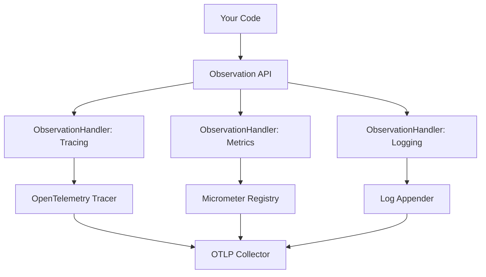

# How to Bridge Micrometer Observations to OpenTelemetry Traces in Spring Boot 3

Author: [nawazdhandala](https://www.github.com/nawazdhandala)

Tags: OpenTelemetry, Micrometer, Spring Boot 3, Observations, Bridge

Description: Learn how to use the Micrometer Observation API as a bridge to OpenTelemetry in Spring Boot 3 for unified observability across metrics, traces, and logs.

Spring Boot 3 introduced the Micrometer Observation API, a powerful abstraction that unifies metrics, tracing, and logging instrumentation. Rather than forcing a choice between Micrometer and OpenTelemetry, the Observation API acts as a facade that can emit telemetry to multiple backends simultaneously. This approach gives you the flexibility to instrument once and export everywhere.

## Understanding Micrometer Observations

The Observation API represents a higher-level abstraction than traditional tracing or metrics APIs. An observation captures the full lifecycle of an operation and can produce multiple telemetry signals from a single instrumentation point.



An observation automatically generates:
- **Traces**: Spans with timing and attributes
- **Metrics**: Timers and counters
- **Logs**: Structured log events with context

## Setting Up the Bridge

Configure Spring Boot 3 to bridge observations to OpenTelemetry traces and metrics.

```xml
<!-- pom.xml -->
<dependencies>
    <!-- Spring Boot 3 Starter -->
    <dependency>
        <groupId>org.springframework.boot</groupId>
        <artifactId>spring-boot-starter-web</artifactId>
        <version>3.2.0</version>
    </dependency>

    <!-- Micrometer Observation API -->
    <dependency>
        <groupId>io.micrometer</groupId>
        <artifactId>micrometer-observation</artifactId>
    </dependency>

    <!-- Micrometer Tracing Bridge for OpenTelemetry -->
    <dependency>
        <groupId>io.micrometer</groupId>
        <artifactId>micrometer-tracing-bridge-otel</artifactId>
    </dependency>

    <!-- OpenTelemetry Exporter -->
    <dependency>
        <groupId>io.opentelemetry</groupId>
        <artifactId>opentelemetry-exporter-otlp</artifactId>
    </dependency>

    <!-- Spring Boot Actuator (optional, for metrics endpoint) -->
    <dependency>
        <groupId>org.springframework.boot</groupId>
        <artifactId>spring-boot-starter-actuator</artifactId>
    </dependency>

    <!-- Micrometer Registry for Prometheus (optional) -->
    <dependency>
        <groupId>io.micrometer</groupId>
        <artifactId>micrometer-registry-prometheus</artifactId>
    </dependency>
</dependencies>
```

For Gradle:

```groovy
dependencies {
    implementation 'org.springframework.boot:spring-boot-starter-web:3.2.0'
    implementation 'io.micrometer:micrometer-observation'
    implementation 'io.micrometer:micrometer-tracing-bridge-otel'
    implementation 'io.opentelemetry:opentelemetry-exporter-otlp'
    implementation 'org.springframework.boot:spring-boot-starter-actuator'
    implementation 'io.micrometer:micrometer-registry-prometheus'
}
```

## Basic Configuration

Configure the observation bridge to export to OpenTelemetry:

```yaml
# application.yml
spring:
  application:
    name: payment-service

# Micrometer Tracing Configuration (bridges to OpenTelemetry)
management:
  tracing:
    enabled: true
    sampling:
      probability: 1.0  # Sample 100% for development

  # Metrics configuration
  metrics:
    enabled: true
    export:
      prometheus:
        enabled: true

  # Actuator endpoints
  endpoints:
    web:
      exposure:
        include: health,metrics,prometheus

# OpenTelemetry exporter configuration
otel:
  exporter:
    otlp:
      endpoint: http://localhost:4318
      protocol: http/protobuf

  service:
    name: ${spring.application.name}

  resource:
    attributes:
      deployment.environment: development
      service.namespace: payments
```

## Creating Basic Observations

Use the Observation API to instrument your code:

```java
package com.example.payment;

import io.micrometer.observation.Observation;
import io.micrometer.observation.ObservationRegistry;
import org.springframework.stereotype.Service;
import org.springframework.beans.factory.annotation.Autowired;

/**
 * Payment service demonstrating Observation API usage.
 * Observations automatically create traces and metrics.
 */
@Service
public class PaymentService {

    @Autowired
    private ObservationRegistry observationRegistry;

    /**
     * Process a payment with automatic observability.
     * Creates a trace span and records timing metrics.
     */
    public void processPayment(String paymentId, BigDecimal amount) {
        // Create an observation for this operation
        Observation observation = Observation.createNotStarted("payment.process", observationRegistry)
            .lowCardinalityKeyValue("payment.method", "credit_card")
            .highCardinalityKeyValue("payment.id", paymentId)
            .start();

        try {
            // Business logic
            validatePayment(paymentId, amount);
            chargeCustomer(paymentId, amount);
            recordTransaction(paymentId);

            // Mark as successful
            observation.event(Observation.Event.of("payment.completed"));

        } catch (Exception e) {
            // Record error
            observation.error(e);
            throw e;
        } finally {
            // Stop observation (creates span and records metrics)
            observation.stop();
        }
    }

    /**
     * Nested observation automatically becomes a child span.
     */
    private void validatePayment(String paymentId, BigDecimal amount) {
        Observation observation = Observation.createNotStarted("payment.validate", observationRegistry)
            .highCardinalityKeyValue("payment.id", paymentId)
            .start();

        try {
            if (amount.compareTo(BigDecimal.ZERO) <= 0) {
                throw new PaymentValidationException("Invalid amount");
            }
            observation.event(Observation.Event.of("validation.passed"));
        } catch (Exception e) {
            observation.error(e);
            throw e;
        } finally {
            observation.stop();
        }
    }
}
```

## Using Scoped Observations

Simplify observation management with scoped observations:

```java
package com.example.payment;

import io.micrometer.observation.Observation;
import io.micrometer.observation.ObservationRegistry;
import org.springframework.stereotype.Service;

/**
 * Payment service using scoped observations.
 * The observe() method automatically handles start/stop.
 */
@Service
public class PaymentService {

    private final ObservationRegistry observationRegistry;

    public PaymentService(ObservationRegistry observationRegistry) {
        this.observationRegistry = observationRegistry;
    }

    /**
     * Process payment using scoped observation.
     * Automatically starts and stops the observation.
     */
    public void processPayment(String paymentId, BigDecimal amount) {
        Observation.createNotStarted("payment.process", observationRegistry)
            .lowCardinalityKeyValue("payment.method", "credit_card")
            .highCardinalityKeyValue("payment.id", paymentId)
            .observe(() -> {
                // All code in this block is observed
                validatePayment(paymentId, amount);
                chargeCustomer(paymentId, amount);
                recordTransaction(paymentId);
            });
    }

    /**
     * Observation with return value.
     */
    public PaymentResult processPaymentWithResult(String paymentId, BigDecimal amount) {
        return Observation.createNotStarted("payment.process", observationRegistry)
            .lowCardinalityKeyValue("payment.method", "credit_card")
            .highCardinalityKeyValue("payment.id", paymentId)
            .observe(() -> {
                validatePayment(paymentId, amount);
                String transactionId = chargeCustomer(paymentId, amount);
                recordTransaction(paymentId);
                return new PaymentResult(transactionId, "success");
            });
    }
}
```

## Understanding Key Values

Observations support two types of key-value pairs with different cardinality characteristics:

```java
package com.example.payment;

import io.micrometer.observation.Observation;
import io.micrometer.observation.ObservationRegistry;
import org.springframework.stereotype.Service;

/**
 * Demonstrates proper use of low vs high cardinality key-values.
 */
@Service
public class ObservationKeyValueExample {

    private final ObservationRegistry observationRegistry;

    public ObservationKeyValueExample(ObservationRegistry observationRegistry) {
        this.observationRegistry = observationRegistry;
    }

    public void demonstrateCardinality(String paymentId, String userId) {
        Observation.createNotStarted("payment.process", observationRegistry)
            // Low cardinality: Limited set of values (good for metrics)
            // These become metric tags and can aggregate effectively
            .lowCardinalityKeyValue("payment.method", "credit_card")  // ~5 values
            .lowCardinalityKeyValue("payment.status", "success")      // ~3 values
            .lowCardinalityKeyValue("region", "us-east-1")           // ~10 values

            // High cardinality: Unlimited values (only for traces)
            // These only appear in traces, not in metrics
            .highCardinalityKeyValue("payment.id", paymentId)        // Millions of values
            .highCardinalityKeyValue("user.id", userId)              // Millions of values
            .highCardinalityKeyValue("transaction.timestamp", Instant.now().toString())

            .observe(() -> {
                // Process payment
            });
    }
}
```

**Low cardinality**: Use for fields with limited possible values (payment method, status, region). These become metric dimensions.

**High cardinality**: Use for unique identifiers (payment IDs, user IDs). These only appear in trace spans, not metrics.

## Custom Observation Conventions

Define custom conventions for consistent observation naming and attributes:

```java
package com.example.payment.observation;

import io.micrometer.observation.Observation;
import io.micrometer.observation.ObservationConvention;
import io.micrometer.common.KeyValues;

/**
 * Custom observation convention for payment operations.
 * Ensures consistent naming and attributes across the application.
 */
public class PaymentObservationConvention implements ObservationConvention<PaymentContext> {

    @Override
    public String getName() {
        return "payment.process";
    }

    @Override
    public KeyValues getLowCardinalityKeyValues(PaymentContext context) {
        return KeyValues.of(
            "payment.method", context.getPaymentMethod(),
            "payment.status", context.getStatus(),
            "payment.currency", context.getCurrency()
        );
    }

    @Override
    public KeyValues getHighCardinalityKeyValues(PaymentContext context) {
        return KeyValues.of(
            "payment.id", context.getPaymentId(),
            "user.id", context.getUserId(),
            "merchant.id", context.getMerchantId()
        );
    }

    @Override
    public boolean supportsContext(Observation.Context context) {
        return context instanceof PaymentContext;
    }
}

/**
 * Custom context for payment observations.
 */
public class PaymentContext extends Observation.Context {
    private String paymentId;
    private String userId;
    private String merchantId;
    private String paymentMethod;
    private String status;
    private String currency;

    // Getters and setters
    public String getPaymentId() { return paymentId; }
    public void setPaymentId(String paymentId) { this.paymentId = paymentId; }

    public String getUserId() { return userId; }
    public void setUserId(String userId) { this.userId = userId; }

    public String getMerchantId() { return merchantId; }
    public void setMerchantId(String merchantId) { this.merchantId = merchantId; }

    public String getPaymentMethod() { return paymentMethod; }
    public void setPaymentMethod(String paymentMethod) { this.paymentMethod = paymentMethod; }

    public String getStatus() { return status; }
    public void setStatus(String status) { this.status = status; }

    public String getCurrency() { return currency; }
    public void setCurrency(String currency) { this.currency = currency; }
}
```

Use the custom convention:

```java
package com.example.payment;

import com.example.payment.observation.PaymentContext;
import com.example.payment.observation.PaymentObservationConvention;
import io.micrometer.observation.Observation;
import io.micrometer.observation.ObservationRegistry;
import org.springframework.stereotype.Service;

/**
 * Service using custom observation convention.
 */
@Service
public class PaymentService {

    private final ObservationRegistry observationRegistry;
    private final PaymentObservationConvention convention;

    public PaymentService(ObservationRegistry observationRegistry) {
        this.observationRegistry = observationRegistry;
        this.convention = new PaymentObservationConvention();
    }

    public void processPayment(String paymentId, String userId, BigDecimal amount) {
        // Create context with all relevant data
        PaymentContext context = new PaymentContext();
        context.setPaymentId(paymentId);
        context.setUserId(userId);
        context.setMerchantId("merchant_123");
        context.setPaymentMethod("credit_card");
        context.setStatus("pending");
        context.setCurrency("USD");

        // Create observation with custom convention
        Observation.createNotStarted(convention, context, observationRegistry)
            .observe(() -> {
                // Process payment
                validatePayment(amount);
                chargeCustomer(paymentId, amount);
                context.setStatus("completed");
            });
    }
}
```

## Integrating with Spring MVC

Spring Boot 3 automatically creates observations for HTTP requests. Customize this behavior:

```java
package com.example.payment.config;

import io.micrometer.observation.ObservationRegistry;
import io.micrometer.observation.aop.ObservedAspect;
import org.springframework.context.annotation.Bean;
import org.springframework.context.annotation.Configuration;

/**
 * Configuration for observation instrumentation.
 */
@Configuration
public class ObservationConfig {

    /**
     * Enable @Observed annotation on methods.
     * Methods annotated with @Observed automatically create observations.
     */
    @Bean
    public ObservedAspect observedAspect(ObservationRegistry observationRegistry) {
        return new ObservedAspect(observationRegistry);
    }
}
```

Use the `@Observed` annotation for automatic instrumentation:

```java
package com.example.payment.controller;

import io.micrometer.observation.annotation.Observed;
import org.springframework.web.bind.annotation.*;

/**
 * Controller with automatic observation via annotations.
 * Each method automatically creates traces and metrics.
 */
@RestController
@RequestMapping("/api/payments")
public class PaymentController {

    private final PaymentService paymentService;

    public PaymentController(PaymentService paymentService) {
        this.paymentService = paymentService;
    }

    /**
     * Automatically observed endpoint.
     * Creates observation with custom name and attributes.
     */
    @Observed(
        name = "payment.create",
        contextualName = "create-payment",
        lowCardinalityKeyValues = {"endpoint", "/api/payments"}
    )
    @PostMapping
    public PaymentResponse createPayment(@RequestBody PaymentRequest request) {
        String transactionId = paymentService.processPayment(
            request.getPaymentId(),
            request.getUserId(),
            request.getAmount()
        );

        return new PaymentResponse(transactionId, "success");
    }

    /**
     * Another observed endpoint with custom attributes.
     */
    @Observed(
        name = "payment.status",
        contextualName = "get-payment-status"
    )
    @GetMapping("/{paymentId}")
    public PaymentStatus getPaymentStatus(@PathVariable String paymentId) {
        return paymentService.getStatus(paymentId);
    }
}
```

## Custom Observation Handlers

Create custom handlers to process observations in specific ways:

```java
package com.example.payment.observation;

import io.micrometer.observation.Observation;
import io.micrometer.observation.ObservationHandler;
import org.slf4j.Logger;
import org.slf4j.LoggerFactory;

/**
 * Custom handler that logs observation events.
 * Runs alongside OpenTelemetry handler.
 */
public class LoggingObservationHandler implements ObservationHandler<Observation.Context> {

    private static final Logger log = LoggerFactory.getLogger(LoggingObservationHandler.class);

    @Override
    public void onStart(Observation.Context context) {
        log.info("Observation started: {} with context: {}",
            context.getName(),
            context.getAllKeyValues());
    }

    @Override
    public void onError(Observation.Context context) {
        log.error("Observation error: {} - {}",
            context.getName(),
            context.getError() != null ? context.getError().getMessage() : "unknown");
    }

    @Override
    public void onStop(Observation.Context context) {
        log.info("Observation stopped: {} (duration: {}ms)",
            context.getName(),
            System.currentTimeMillis() - context.get("startTime"));
    }

    @Override
    public boolean supportsContext(Observation.Context context) {
        return true;  // Handle all observations
    }
}
```

Register the custom handler:

```java
package com.example.payment.config;

import com.example.payment.observation.LoggingObservationHandler;
import io.micrometer.observation.ObservationRegistry;
import jakarta.annotation.PostConstruct;
import org.springframework.beans.factory.annotation.Autowired;
import org.springframework.context.annotation.Configuration;

/**
 * Register custom observation handlers.
 */
@Configuration
public class ObservationHandlerConfig {

    @Autowired
    private ObservationRegistry observationRegistry;

    @PostConstruct
    public void registerHandlers() {
        // Add custom logging handler
        observationRegistry
            .observationConfig()
            .observationHandler(new LoggingObservationHandler());
    }
}
```

## Filtering and Predicates

Control which observations are created using predicates:

```java
package com.example.payment.config;

import io.micrometer.observation.ObservationPredicate;
import io.micrometer.observation.ObservationRegistry;
import jakarta.annotation.PostConstruct;
import org.springframework.beans.factory.annotation.Autowired;
import org.springframework.context.annotation.Configuration;

/**
 * Configure observation filtering.
 */
@Configuration
public class ObservationFilterConfig {

    @Autowired
    private ObservationRegistry observationRegistry;

    @PostConstruct
    public void configureFilters() {
        // Don't create observations for health check endpoints
        observationRegistry
            .observationConfig()
            .observationPredicate((name, context) -> {
                // Skip observations for actuator endpoints
                if (name.startsWith("http.server.requests")) {
                    String uri = context.getLowCardinalityKeyValue("uri");
                    if (uri != null && uri.startsWith("/actuator")) {
                        return false;  // Don't observe
                    }
                }
                return true;  // Observe everything else
            });

        // Add predicate to skip certain payment methods
        observationRegistry
            .observationConfig()
            .observationPredicate((name, context) -> {
                if ("payment.process".equals(name)) {
                    String method = context.getLowCardinalityKeyValue("payment.method");
                    // Skip test payments
                    return !"test".equals(method);
                }
                return true;
            });
    }
}
```

## Accessing OpenTelemetry Directly

When you need direct access to OpenTelemetry API alongside observations:

```java
package com.example.payment;

import io.micrometer.observation.Observation;
import io.micrometer.observation.ObservationRegistry;
import io.opentelemetry.api.trace.Span;
import io.opentelemetry.api.trace.Tracer;
import org.springframework.stereotype.Service;

/**
 * Service that uses both Observations and OpenTelemetry API.
 * Useful when you need OTel-specific features.
 */
@Service
public class HybridPaymentService {

    private final ObservationRegistry observationRegistry;
    private final Tracer tracer;

    public HybridPaymentService(
            ObservationRegistry observationRegistry,
            Tracer tracer) {
        this.observationRegistry = observationRegistry;
        this.tracer = tracer;
    }

    public void processPayment(String paymentId, BigDecimal amount) {
        // Use Observation API for high-level instrumentation
        Observation.createNotStarted("payment.process", observationRegistry)
            .highCardinalityKeyValue("payment.id", paymentId)
            .observe(() -> {
                // Get current OpenTelemetry span for advanced features
                Span currentSpan = Span.current();

                // Add OTel-specific attributes
                currentSpan.setAttribute("payment.amount.cents",
                    amount.multiply(new BigDecimal("100")).longValue());

                // Add OTel event with attributes
                currentSpan.addEvent("payment.validated",
                    Attributes.of(
                        AttributeKey.stringKey("validator"), "stripe",
                        AttributeKey.booleanKey("fraud_check_passed"), true
                    ));

                // Process payment
                validatePayment(paymentId, amount);
                chargeCustomer(paymentId, amount);
            });
    }
}
```

## Testing Observations

Test observation creation in unit tests:

```java
package com.example.payment;

import io.micrometer.observation.ObservationRegistry;
import io.micrometer.observation.tck.TestObservationRegistry;
import io.micrometer.observation.tck.TestObservationRegistryAssert;
import org.junit.jupiter.api.Test;
import org.springframework.beans.factory.annotation.Autowired;
import org.springframework.boot.test.context.SpringBootTest;
import org.springframework.boot.test.context.TestConfiguration;
import org.springframework.context.annotation.Bean;
import org.springframework.context.annotation.Primary;

import java.math.BigDecimal;

/**
 * Test observation creation and attributes.
 */
@SpringBootTest
class PaymentServiceObservationTest {

    @TestConfiguration
    static class TestConfig {
        @Bean
        @Primary
        public ObservationRegistry observationRegistry() {
            return TestObservationRegistry.create();
        }
    }

    @Autowired
    private PaymentService paymentService;

    @Autowired
    private TestObservationRegistry observationRegistry;

    @Test
    void shouldCreatePaymentObservation() {
        // Execute operation
        paymentService.processPayment("pay_123", new BigDecimal("99.99"));

        // Assert observation was created
        TestObservationRegistryAssert.assertThat(observationRegistry)
            .hasObservationWithNameEqualTo("payment.process")
            .that()
            .hasLowCardinalityKeyValue("payment.method", "credit_card")
            .hasHighCardinalityKeyValue("payment.id", "pay_123")
            .hasBeenStarted()
            .hasBeenStopped();
    }

    @Test
    void shouldCreateNestedObservations() {
        // Execute operation
        paymentService.processPayment("pay_456", new BigDecimal("150.00"));

        // Assert parent observation
        TestObservationRegistryAssert.assertThat(observationRegistry)
            .hasObservationWithNameEqualTo("payment.process");

        // Assert child observation
        TestObservationRegistryAssert.assertThat(observationRegistry)
            .hasObservationWithNameEqualTo("payment.validate");
    }
}
```

## Performance Considerations

Observations have minimal overhead, but follow these best practices:

```java
// Good: Reuse observation registry (injected as singleton)
private final ObservationRegistry observationRegistry;

// Good: Use low cardinality for metrics
.lowCardinalityKeyValue("status", status)  // Limited values

// Bad: Use high cardinality for unique values
.highCardinalityKeyValue("request.id", id)  // Unlimited values

// Good: Use scoped observations for automatic cleanup
Observation.createNotStarted("operation", registry)
    .observe(() -> doWork());

// Good: Filter out noisy observations
observationConfig.observationPredicate((name, ctx) ->
    !name.contains("health"));
```

The Micrometer Observation API provides a forward-compatible path for Spring Boot 3 applications. By instrumenting with observations, you maintain flexibility to change backends while producing comprehensive telemetry signals that feed into OpenTelemetry's unified observability pipeline.
