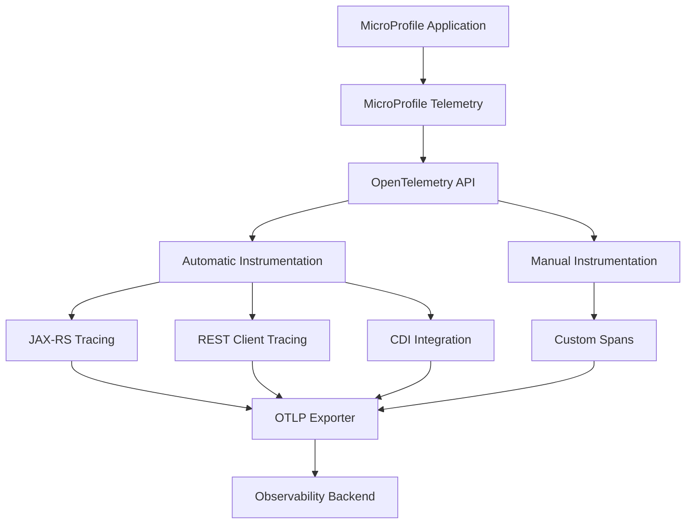

# How to Integrate MicroProfile Telemetry with OpenTelemetry in Open Liberty

Author: [nawazdhandala](https://www.github.com/nawazdhandala)

Tags: OpenTelemetry, MicroProfile, Open Liberty, Java, Telemetry

Description: Complete guide to implementing MicroProfile Telemetry 1.1 with OpenTelemetry in Open Liberty applications for standardized observability across Jakarta EE microservices.

MicroProfile Telemetry provides a standardized API for distributed tracing in MicroProfile applications, built directly on OpenTelemetry. Open Liberty, IBM's cloud-native Jakarta EE and MicroProfile runtime, offers native support for MicroProfile Telemetry, making it straightforward to add enterprise-grade observability to your microservices.

## Understanding MicroProfile Telemetry

MicroProfile Telemetry 1.1 bridges the gap between MicroProfile applications and OpenTelemetry. Rather than creating a new tracing API, it adopts OpenTelemetry APIs directly, providing automatic instrumentation for MicroProfile components while allowing developers to use standard OpenTelemetry APIs for custom spans.



The key advantage of MicroProfile Telemetry is that it provides automatic instrumentation for MicroProfile specifications including JAX-RS, REST Client, and CDI, while giving you full access to OpenTelemetry APIs for custom instrumentation.

## Setting Up Open Liberty for MicroProfile Telemetry

Start by configuring your Open Liberty server to enable MicroProfile Telemetry. Create or modify your `server.xml`:

```xml
<?xml version="1.0" encoding="UTF-8"?>
<server description="Open Liberty Server with MicroProfile Telemetry">

    <featureManager>
        <!-- Core MicroProfile and Jakarta EE features -->
        <feature>jakartaee-10.0</feature>
        <feature>microProfile-6.1</feature>

        <!-- MicroProfile Telemetry enables OpenTelemetry integration -->
        <feature>mpTelemetry-1.1</feature>

        <!-- Optional: Additional features for complete stack -->
        <feature>mpConfig-3.1</feature>
        <feature>mpRestClient-3.0</feature>
    </featureManager>

    <httpEndpoint id="defaultHttpEndpoint"
                  httpPort="9080"
                  httpsPort="9443" />

    <!-- Application configuration -->
    <webApplication location="myapp.war" contextRoot="/">
        <classloader delegation="parentLast" />
    </webApplication>

    <!-- MicroProfile Telemetry configuration -->
    <mpTelemetry>
        <!-- Service name for identification in traces -->
        <serviceName>liberty-microservice</serviceName>

        <!-- OTLP exporter configuration -->
        <exporter>
            <otlp>
                <endpoint>http://localhost:4317</endpoint>
                <protocol>grpc</protocol>
            </otlp>
        </exporter>
    </mpTelemetry>

    <!-- Optional: Configure logging for telemetry -->
    <logging traceSpecification="com.ibm.ws.microprofile.telemetry.*=all" />

</server>
```

## Maven Dependencies

Add the required dependencies to your `pom.xml`:

```xml
<properties>
    <maven.compiler.source>11</maven.compiler.source>
    <maven.compiler.target>11</maven.compiler.target>
    <project.build.sourceEncoding>UTF-8</project.build.sourceEncoding>
    <liberty.var.default.http.port>9080</liberty.var.default.http.port>
    <liberty.var.default.https.port>9443</liberty.var.default.https.port>
</properties>

<dependencies>
    <!-- MicroProfile Telemetry API -->
    <dependency>
        <groupId>org.eclipse.microprofile.telemetry</groupId>
        <artifactId>microprofile-telemetry-api</artifactId>
        <version>1.1</version>
        <scope>provided</scope>
    </dependency>

    <!-- OpenTelemetry API (provided by MicroProfile Telemetry) -->
    <dependency>
        <groupId>io.opentelemetry</groupId>
        <artifactId>opentelemetry-api</artifactId>
        <version>1.32.0</version>
        <scope>provided</scope>
    </dependency>

    <!-- MicroProfile APIs -->
    <dependency>
        <groupId>org.eclipse.microprofile</groupId>
        <artifactId>microprofile</artifactId>
        <version>6.1</version>
        <type>pom</type>
        <scope>provided</scope>
    </dependency>

    <!-- Jakarta EE APIs -->
    <dependency>
        <groupId>jakarta.platform</groupId>
        <artifactId>jakarta.jakartaee-api</artifactId>
        <version>10.0.0</version>
        <scope>provided</scope>
    </dependency>
</dependencies>

<build>
    <finalName>myapp</finalName>
    <plugins>
        <plugin>
            <groupId>io.openliberty.tools</groupId>
            <artifactId>liberty-maven-plugin</artifactId>
            <version>3.10</version>
        </plugin>
        <plugin>
            <groupId>org.apache.maven.plugins</groupId>
            <artifactId>maven-war-plugin</artifactId>
            <version>3.4.0</version>
        </plugin>
    </plugins>
</build>
```

## Configuration with MicroProfile Config

MicroProfile Telemetry integrates with MicroProfile Config for flexible configuration. Create `microprofile-config.properties` in `src/main/resources/META-INF/`:

```properties
# Service identification
otel.service.name=liberty-microservice
otel.resource.attributes=service.namespace=production,service.version=1.0.0,deployment.environment=prod

# OTLP Exporter configuration
otel.exporter.otlp.endpoint=http://localhost:4317
otel.exporter.otlp.protocol=grpc
otel.traces.exporter=otlp
otel.metrics.exporter=otlp
otel.logs.exporter=otlp

# Sampling configuration
otel.traces.sampler=parentbased_traceidratio
otel.traces.sampler.arg=1.0

# Span processor configuration
otel.bsp.schedule.delay=5000
otel.bsp.max.queue.size=2048
otel.bsp.max.export.batch.size=512

# SDK configuration
otel.sdk.disabled=false

# Instrumentation configuration
otel.instrumentation.common.default-enabled=true
```

## Using Automatic Instrumentation

MicroProfile Telemetry automatically instruments JAX-RS endpoints. Create a REST resource to see automatic tracing:

```java
package com.example.api;

import jakarta.enterprise.context.ApplicationScoped;
import jakarta.ws.rs.*;
import jakarta.ws.rs.core.MediaType;
import jakarta.ws.rs.core.Response;
import java.util.HashMap;
import java.util.Map;

@Path("/products")
@ApplicationScoped
@Produces(MediaType.APPLICATION_JSON)
@Consumes(MediaType.APPLICATION_JSON)
public class ProductResource {

    // This endpoint is automatically traced by MicroProfile Telemetry
    @GET
    public Response getAllProducts() {
        Map<String, Object> response = new HashMap<>();
        response.put("products", getProducts());
        response.put("count", 10);
        return Response.ok(response).build();
    }

    @GET
    @Path("/{id}")
    public Response getProduct(@PathParam("id") Long id) {
        Map<String, Object> product = new HashMap<>();
        product.put("id", id);
        product.put("name", "Product " + id);
        product.put("price", 99.99);
        return Response.ok(product).build();
    }

    @POST
    public Response createProduct(Map<String, Object> product) {
        product.put("id", System.currentTimeMillis());
        return Response.status(Response.Status.CREATED)
            .entity(product)
            .build();
    }

    private Object getProducts() {
        // Simulated product list
        return new Object[]{"Product 1", "Product 2", "Product 3"};
    }
}
```

## Manual Instrumentation with Injected Tracer

For custom spans, inject the OpenTelemetry Tracer using CDI:

```java
package com.example.service;

import io.opentelemetry.api.trace.Span;
import io.opentelemetry.api.trace.SpanKind;
import io.opentelemetry.api.trace.StatusCode;
import io.opentelemetry.api.trace.Tracer;
import io.opentelemetry.context.Scope;

import jakarta.enterprise.context.ApplicationScoped;
import jakarta.inject.Inject;
import java.util.ArrayList;
import java.util.List;
import java.util.Map;

@ApplicationScoped
public class ProductService {

    // MicroProfile Telemetry automatically provides the Tracer
    @Inject
    private Tracer tracer;

    public List<Map<String, Object>> findAllProducts() {
        // Create a custom span for this operation
        Span span = tracer.spanBuilder("ProductService.findAllProducts")
            .setSpanKind(SpanKind.INTERNAL)
            .startSpan();

        try (Scope scope = span.makeCurrent()) {
            // Add custom attributes
            span.setAttribute("service.operation", "find_all");
            span.setAttribute("db.system", "postgresql");

            // Simulate database query
            List<Map<String, Object>> products = queryDatabase();

            // Add result metadata
            span.setAttribute("result.count", products.size());
            span.setStatus(StatusCode.OK);

            return products;

        } catch (Exception e) {
            // Record exception information
            span.recordException(e);
            span.setStatus(StatusCode.ERROR, e.getMessage());
            throw e;
        } finally {
            span.end();
        }
    }

    public Map<String, Object> findProductById(Long id) {
        Span span = tracer.spanBuilder("ProductService.findProductById")
            .setSpanKind(SpanKind.INTERNAL)
            .startSpan();

        try (Scope scope = span.makeCurrent()) {
            span.setAttribute("product.id", id);
            span.setAttribute("db.system", "postgresql");
            span.setAttribute("db.operation", "SELECT");

            // Simulate database query
            Map<String, Object> product = queryProductById(id);

            if (product != null) {
                span.setAttribute("product.found", true);
                span.setAttribute("product.name", (String) product.get("name"));
            } else {
                span.setAttribute("product.found", false);
            }

            span.setStatus(StatusCode.OK);
            return product;

        } catch (Exception e) {
            span.recordException(e);
            span.setStatus(StatusCode.ERROR, e.getMessage());
            throw e;
        } finally {
            span.end();
        }
    }

    public void processOrder(Long productId, int quantity) {
        Span span = tracer.spanBuilder("ProductService.processOrder")
            .setSpanKind(SpanKind.INTERNAL)
            .startSpan();

        try (Scope scope = span.makeCurrent()) {
            span.setAttribute("product.id", productId);
            span.setAttribute("order.quantity", quantity);

            // Create child span for inventory check
            Span inventorySpan = tracer.spanBuilder("checkInventory")
                .setSpanKind(SpanKind.INTERNAL)
                .startSpan();

            try (Scope inventoryScope = inventorySpan.makeCurrent()) {
                boolean available = checkInventory(productId, quantity);
                inventorySpan.setAttribute("inventory.available", available);
                inventorySpan.setStatus(StatusCode.OK);

                if (!available) {
                    throw new IllegalStateException("Insufficient inventory");
                }
            } finally {
                inventorySpan.end();
            }

            // Create child span for payment processing
            Span paymentSpan = tracer.spanBuilder("processPayment")
                .setSpanKind(SpanKind.INTERNAL)
                .startSpan();

            try (Scope paymentScope = paymentSpan.makeCurrent()) {
                processPayment(productId, quantity);
                paymentSpan.setAttribute("payment.status", "success");
                paymentSpan.setStatus(StatusCode.OK);
            } finally {
                paymentSpan.end();
            }

            span.setAttribute("order.status", "completed");
            span.setStatus(StatusCode.OK);

        } catch (Exception e) {
            span.recordException(e);
            span.setStatus(StatusCode.ERROR, e.getMessage());
            throw e;
        } finally {
            span.end();
        }
    }

    // Simulated methods
    private List<Map<String, Object>> queryDatabase() {
        return new ArrayList<>();
    }

    private Map<String, Object> queryProductById(Long id) {
        return Map.of("id", id, "name", "Product " + id);
    }

    private boolean checkInventory(Long productId, int quantity) {
        return true;
    }

    private void processPayment(Long productId, int quantity) {
        // Payment processing logic
    }
}
```

## Instrumenting REST Client Calls

MicroProfile Telemetry automatically traces outgoing REST Client calls. Define a REST client interface:

```java
package com.example.client;

import jakarta.ws.rs.*;
import jakarta.ws.rs.core.MediaType;
import org.eclipse.microprofile.rest.client.inject.RegisterRestClient;
import java.util.Map;

@Path("/api/inventory")
@RegisterRestClient(configKey = "inventory-api")
@Produces(MediaType.APPLICATION_JSON)
@Consumes(MediaType.APPLICATION_JSON)
public interface InventoryClient {

    @GET
    @Path("/{productId}")
    Map<String, Object> getInventory(@PathParam("productId") Long productId);

    @POST
    @Path("/{productId}/reserve")
    Map<String, Object> reserveInventory(
        @PathParam("productId") Long productId,
        @QueryParam("quantity") int quantity
    );
}
```

Configure the REST client in `microprofile-config.properties`:

```properties
# Inventory service REST client configuration
inventory-api/mp-rest/url=http://localhost:9081/inventory
inventory-api/mp-rest/scope=jakarta.inject.Singleton

# Connection timeouts
inventory-api/mp-rest/connectTimeout=5000
inventory-api/mp-rest/readTimeout=10000
```

Use the REST client with automatic tracing:

```java
package com.example.service;

import com.example.client.InventoryClient;
import io.opentelemetry.api.trace.Span;
import io.opentelemetry.api.trace.Tracer;

import jakarta.enterprise.context.ApplicationScoped;
import jakarta.inject.Inject;
import org.eclipse.microprofile.rest.client.inject.RestClient;
import java.util.Map;

@ApplicationScoped
public class OrderService {

    @Inject
    @RestClient
    private InventoryClient inventoryClient;

    @Inject
    private Tracer tracer;

    public void createOrder(Long productId, int quantity) {
        Span span = tracer.spanBuilder("OrderService.createOrder")
            .startSpan();

        try (var scope = span.makeCurrent()) {
            span.setAttribute("product.id", productId);
            span.setAttribute("order.quantity", quantity);

            // This REST client call is automatically traced
            // and the trace context is propagated
            Map<String, Object> inventory = inventoryClient.getInventory(productId);

            Integer availableQuantity = (Integer) inventory.get("available");
            span.setAttribute("inventory.available", availableQuantity);

            if (availableQuantity < quantity) {
                throw new IllegalStateException("Insufficient inventory");
            }

            // Reserve inventory (also automatically traced)
            inventoryClient.reserveInventory(productId, quantity);

            span.setAttribute("order.status", "created");

        } catch (Exception e) {
            span.recordException(e);
            throw e;
        } finally {
            span.end();
        }
    }
}
```

## Adding Custom Span Attributes

Enrich spans with business-specific attributes:

```java
package com.example.service;

import io.opentelemetry.api.trace.Span;
import io.opentelemetry.api.common.Attributes;
import io.opentelemetry.api.common.AttributeKey;

import jakarta.enterprise.context.ApplicationScoped;

@ApplicationScoped
public class UserService {

    public void authenticateUser(String username, String sessionId) {
        // Get the current span (created by JAX-RS automatic instrumentation)
        Span currentSpan = Span.current();

        // Add business-specific attributes
        currentSpan.setAttribute("user.name", username);
        currentSpan.setAttribute("session.id", sessionId);
        currentSpan.setAttribute("auth.method", "oauth2");

        // Add custom attributes with specific types
        currentSpan.setAttribute(
            AttributeKey.booleanKey("user.authenticated"),
            true
        );
        currentSpan.setAttribute(
            AttributeKey.longKey("auth.timestamp"),
            System.currentTimeMillis()
        );

        // Add multiple attributes at once
        Attributes customAttrs = Attributes.builder()
            .put("user.role", "admin")
            .put("user.department", "engineering")
            .put("user.active", true)
            .build();

        // Note: Individual setAttribute calls are preferred
        // This is just showing the Attributes API
        customAttrs.forEach((key, value) ->
            currentSpan.setAttribute((AttributeKey<Object>) key, value)
        );
    }
}
```

## Recording Events and Exceptions

Add structured events to spans for detailed diagnostics:

```java
package com.example.service;

import io.opentelemetry.api.common.Attributes;
import io.opentelemetry.api.trace.Span;
import io.opentelemetry.api.trace.StatusCode;
import io.opentelemetry.api.trace.Tracer;

import jakarta.enterprise.context.ApplicationScoped;
import jakarta.inject.Inject;

@ApplicationScoped
public class PaymentService {

    @Inject
    private Tracer tracer;

    public void processPayment(String orderId, double amount) {
        Span span = tracer.spanBuilder("PaymentService.processPayment")
            .startSpan();

        try (var scope = span.makeCurrent()) {
            span.setAttribute("order.id", orderId);
            span.setAttribute("payment.amount", amount);

            // Record an event for payment initiation
            span.addEvent("payment_initiated",
                Attributes.builder()
                    .put("payment.method", "credit_card")
                    .put("payment.currency", "USD")
                    .build()
            );

            // Simulate payment processing
            if (amount > 10000) {
                // Record event for special handling
                span.addEvent("high_value_payment_review_required",
                    Attributes.builder()
                        .put("review.reason", "amount_exceeds_threshold")
                        .put("threshold.value", 10000.0)
                        .build()
                );
            }

            boolean success = executePayment(orderId, amount);

            if (success) {
                span.addEvent("payment_completed",
                    Attributes.builder()
                        .put("transaction.id", generateTransactionId())
                        .build()
                );
                span.setStatus(StatusCode.OK);
            } else {
                span.addEvent("payment_failed",
                    Attributes.builder()
                        .put("failure.reason", "insufficient_funds")
                        .build()
                );
                span.setStatus(StatusCode.ERROR, "Payment failed");
            }

        } catch (Exception e) {
            // Record detailed exception information
            span.recordException(e,
                Attributes.builder()
                    .put("error.handled", false)
                    .put("error.severity", "high")
                    .build()
            );
            span.setStatus(StatusCode.ERROR, e.getMessage());
            throw e;
        } finally {
            span.end();
        }
    }

    private boolean executePayment(String orderId, double amount) {
        return true;
    }

    private String generateTransactionId() {
        return "TXN-" + System.currentTimeMillis();
    }
}
```

## Configuring Sampling

Control which traces are recorded using sampling configuration:

```properties
# Always sample (100% of traces)
otel.traces.sampler=always_on

# Never sample (useful for testing)
otel.traces.sampler=always_off

# Sample based on trace ID ratio (50% of traces)
otel.traces.sampler=traceidratio
otel.traces.sampler.arg=0.5

# Parent-based sampling (follow parent decision, default to ratio)
otel.traces.sampler=parentbased_traceidratio
otel.traces.sampler.arg=1.0
```

For programmatic sampling, create a custom sampler:

```java
package com.example.telemetry;

import io.opentelemetry.api.common.Attributes;
import io.opentelemetry.api.trace.SpanKind;
import io.opentelemetry.context.Context;
import io.opentelemetry.sdk.trace.data.LinkData;
import io.opentelemetry.sdk.trace.samplers.Sampler;
import io.opentelemetry.sdk.trace.samplers.SamplingResult;

import java.util.List;

public class CustomSampler implements Sampler {

    @Override
    public SamplingResult shouldSample(
            Context parentContext,
            String traceId,
            String name,
            SpanKind spanKind,
            Attributes attributes,
            List<LinkData> parentLinks) {

        // Always sample errors
        if (name.contains("error") || name.contains("exception")) {
            return SamplingResult.recordAndSample();
        }

        // Sample admin operations
        String userRole = attributes.get(
            io.opentelemetry.api.common.AttributeKey.stringKey("user.role")
        );
        if ("admin".equals(userRole)) {
            return SamplingResult.recordAndSample();
        }

        // Sample 10% of other requests
        if (Math.abs(traceId.hashCode() % 100) < 10) {
            return SamplingResult.recordAndSample();
        }

        return SamplingResult.drop();
    }

    @Override
    public String getDescription() {
        return "CustomSampler{error=always,admin=always,other=10%}";
    }
}
```

## Running and Testing

Build and deploy your application to Open Liberty:

```bash
# Build the application
mvn clean package

# Start Open Liberty in development mode
mvn liberty:dev

# Or deploy to a running Liberty server
cp target/myapp.war $LIBERTY_HOME/usr/servers/defaultServer/apps/
```

Test your instrumented endpoints:

```bash
# Test the products endpoint
curl http://localhost:9080/products

# Test with specific ID
curl http://localhost:9080/products/123

# Create a new product
curl -X POST http://localhost:9080/products \
  -H "Content-Type: application/json" \
  -d '{"name":"Test Product","price":49.99}'
```

Check the Liberty logs to verify telemetry is working:

```bash
tail -f $LIBERTY_HOME/usr/servers/defaultServer/logs/messages.log
```

You should see output indicating spans are being exported to your OTLP endpoint.

## Docker Deployment

Deploy your Liberty application with MicroProfile Telemetry in Docker:

```dockerfile
FROM icr.io/appcafe/open-liberty:full-java17-openj9-ubi

# Copy server configuration
COPY --chown=1001:0 src/main/liberty/config/server.xml /config/

# Copy application
COPY --chown=1001:0 target/myapp.war /config/apps/

# Copy MicroProfile config
COPY --chown=1001:0 src/main/resources/META-INF/microprofile-config.properties \
     /config/

# Expose ports
EXPOSE 9080 9443

# Run Liberty
CMD ["/opt/ol/wlp/bin/server", "run", "defaultServer"]
```

Use Docker Compose to run with an OpenTelemetry Collector:

```yaml
version: '3.8'

services:
  liberty-app:
    build: .
    ports:
      - "9080:9080"
      - "9443:9443"
    environment:
      - OTEL_EXPORTER_OTLP_ENDPOINT=http://otel-collector:4317
      - OTEL_SERVICE_NAME=liberty-microservice
    depends_on:
      - otel-collector
    networks:
      - telemetry

  otel-collector:
    image: otel/opentelemetry-collector:latest
    command: ["--config=/etc/otel-collector-config.yaml"]
    volumes:
      - ./otel-collector-config.yaml:/etc/otel-collector-config.yaml
    ports:
      - "4317:4317"
      - "4318:4318"
      - "55679:55679"
    networks:
      - telemetry

  jaeger:
    image: jaegertracing/all-in-one:latest
    ports:
      - "16686:16686"
      - "14250:14250"
    networks:
      - telemetry

networks:
  telemetry:
```

MicroProfile Telemetry in Open Liberty provides a powerful, standardized approach to observability. The automatic instrumentation handles common scenarios, while the OpenTelemetry API gives you complete control for custom tracing. This combination delivers enterprise-grade observability with minimal code and configuration.
