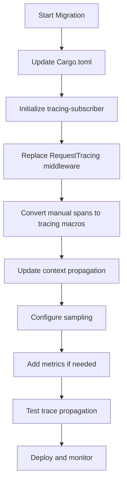

# How to Migrate from actix-web-opentelemetry to the New Instrumentation Crate

Author: [nawazdhandala](https://www.github.com/nawazdhandala)

Tags: OpenTelemetry, Rust, Actix-web, Migration, Instrumentation

Description: Complete migration guide from the deprecated actix-web-opentelemetry crate to modern OpenTelemetry instrumentation patterns with code examples.

The `actix-web-opentelemetry` crate served the community well, but changes in the OpenTelemetry Rust ecosystem have made it obsolete. The newer approach uses the official `opentelemetry` and `tracing-opentelemetry` crates directly, giving you more control and better compatibility with the broader ecosystem.

## Why Migrate?

The original `actix-web-opentelemetry` crate is no longer maintained and relies on outdated OpenTelemetry dependencies. The new approach provides better performance, more flexible configuration, and alignment with OpenTelemetry specification updates. You'll also get access to newer features like metrics and logs correlation.

## Understanding the Old Approach

The deprecated crate provided a simple middleware wrapper:

```rust
// Old approach - DO NOT USE
use actix_web_opentelemetry::RequestTracing;
use opentelemetry::global;

#[actix_web::main]
async fn main() -> std::io::Result<()> {
    let tracer = init_tracer();

    HttpServer::new(move || {
        App::new()
            .wrap(RequestTracing::new())
            .route("/api/users", web::get().to(get_users))
    })
    .bind(("127.0.0.1", 8080))?
    .run()
    .await
}
```

This approach was convenient but gave limited control over span attributes, context propagation, and integration with other observability tools.

## Setting Up the New Dependencies

Update your `Cargo.toml` to remove the old crate and add the new ones:

```toml
[dependencies]
# Remove this line:
# actix-web-opentelemetry = "0.14"

# Add these instead:
actix-web = "4.5"
opentelemetry = { version = "0.22", features = ["trace", "metrics"] }
opentelemetry_sdk = { version = "0.22", features = ["rt-tokio", "trace", "metrics"] }
opentelemetry-otlp = { version = "0.15", features = ["tokio", "trace", "metrics"] }
tracing = "0.1"
tracing-opentelemetry = "0.23"
tracing-subscriber = { version = "0.3", features = ["env-filter", "json"] }
tracing-actix-web = "0.7"
```

The `tracing-actix-web` crate provides Actix-web specific instrumentation that integrates seamlessly with the OpenTelemetry bridge.

## Implementing the New Instrumentation Pattern

Here's the modern way to instrument your Actix-web application:

```rust
use actix_web::{web, App, HttpResponse, HttpServer};
use opentelemetry::global;
use opentelemetry_sdk::trace::{self, RandomIdGenerator, Sampler};
use opentelemetry_sdk::{runtime, Resource};
use opentelemetry::KeyValue;
use tracing_subscriber::layer::SubscriberExt;
use tracing_subscriber::util::SubscriberInitExt;

fn init_telemetry() -> Result<(), Box<dyn std::error::Error>> {
    // Configure the OTLP exporter
    let tracer = opentelemetry_otlp::new_pipeline()
        .tracing()
        .with_exporter(
            opentelemetry_otlp::new_exporter()
                .tonic()
                .with_endpoint("http://localhost:4317")
        )
        .with_trace_config(
            trace::config()
                .with_sampler(Sampler::AlwaysOn)
                .with_id_generator(RandomIdGenerator::default())
                .with_max_events_per_span(64)
                .with_max_attributes_per_span(128)
                .with_resource(Resource::new(vec![
                    KeyValue::new("service.name", "my-actix-service"),
                    KeyValue::new("service.version", env!("CARGO_PKG_VERSION")),
                    KeyValue::new("deployment.environment", "production"),
                ]))
        )
        .install_batch(runtime::Tokio)?;

    // Create a tracing layer with the configured tracer
    let telemetry_layer = tracing_opentelemetry::layer()
        .with_tracer(tracer);

    // Set up the tracing subscriber with multiple layers
    tracing_subscriber::registry()
        .with(tracing_subscriber::EnvFilter::from_default_env())
        .with(telemetry_layer)
        .with(tracing_subscriber::fmt::layer())
        .init();

    Ok(())
}

#[actix_web::main]
async fn main() -> std::io::Result<()> {
    init_telemetry().expect("Failed to initialize telemetry");

    HttpServer::new(|| {
        App::new()
            .wrap(tracing_actix_web::TracingLogger::default())
            .route("/api/users", web::get().to(get_users))
            .route("/api/users/{id}", web::get().to(get_user_by_id))
    })
    .bind(("127.0.0.1", 8080))?
    .run()
    .await?;

    // Clean shutdown to flush remaining spans
    global::shutdown_tracer_provider();

    Ok(())
}

async fn get_users() -> HttpResponse {
    HttpResponse::Ok().json(vec!["user1", "user2"])
}

async fn get_user_by_id(path: web::Path<String>) -> HttpResponse {
    let user_id = path.into_inner();
    HttpResponse::Ok().json(serde_json::json!({
        "id": user_id,
        "name": "John Doe"
    }))
}
```

The `tracing_actix_web::TracingLogger` middleware automatically creates spans for HTTP requests and integrates with the OpenTelemetry layer.

## Migrating Custom Span Creation

If you were creating custom spans with the old approach, here's how to migrate:

```rust
// Old approach
use actix_web_opentelemetry::RequestMetrics;

async fn old_handler() -> HttpResponse {
    let tracer = global::tracer("my-service");
    let span = tracer.start("custom_operation");
    // Do work
    span.end();
    HttpResponse::Ok().finish()
}

// New approach using tracing macros
use tracing::{info_span, instrument};

#[instrument(name = "get_user_details", skip(user_id))]
async fn new_handler(user_id: String) -> HttpResponse {
    // The function is automatically traced
    let user = fetch_user(&user_id).await;

    // Create nested spans for specific operations
    let _span = info_span!("validate_user", user.id = %user_id).entered();
    validate_user(&user);

    HttpResponse::Ok().json(user)
}

#[instrument(name = "fetch_user_from_db")]
async fn fetch_user(id: &str) -> User {
    // This function automatically gets its own span
    // Query database
    User {
        id: id.to_string(),
        name: "Jane Smith".to_string(),
    }
}
```

The `#[instrument]` macro automatically creates spans with proper context propagation. This is more ergonomic than manually managing span lifecycles.

## Handling Context Propagation

The old crate automatically extracted and injected trace context. You can achieve the same with the new approach:

```rust
use actix_web::{HttpRequest, HttpResponse, client::Client};
use opentelemetry::global;
use opentelemetry::propagation::Injector;
use tracing::instrument;

#[instrument(name = "call_downstream_service")]
async fn call_downstream(req: HttpRequest) -> HttpResponse {
    let client = Client::default();

    // Create a new request to a downstream service
    let mut downstream_req = client
        .get("http://downstream-service/api/data")
        .insert_header(("user-agent", "my-service/1.0"));

    // Inject the current trace context into outgoing headers
    struct HeaderInjector<'a>(&'a mut actix_web::client::ClientRequest);

    impl<'a> Injector for HeaderInjector<'a> {
        fn set(&mut self, key: &str, value: String) {
            self.0.insert_header((key.to_string(), value));
        }
    }

    let mut injector = HeaderInjector(&mut downstream_req);
    global::get_text_map_propagator(|propagator| {
        propagator.inject(&mut injector)
    });

    // Send the request with trace context
    match downstream_req.send().await {
        Ok(mut response) => {
            let body = response.body().await.unwrap();
            HttpResponse::Ok().body(body)
        }
        Err(err) => {
            tracing::error!("Failed to call downstream: {}", err);
            HttpResponse::InternalServerError().finish()
        }
    }
}
```

This ensures distributed traces flow correctly across service boundaries.

## Configuring Sampling Strategies

The new approach gives you more control over sampling:

```rust
use opentelemetry_sdk::trace::{Sampler, SamplingResult, SamplingDecision};

// Simple ratio-based sampling
let sampler = Sampler::TraceIdRatioBased(0.1); // Sample 10% of traces

// Parent-based sampling (respect upstream sampling decisions)
let parent_sampler = Sampler::ParentBased(Box::new(
    Sampler::TraceIdRatioBased(0.1)
));

// Custom sampling logic
struct CustomSampler;

impl opentelemetry_sdk::trace::ShouldSample for CustomSampler {
    fn should_sample(
        &self,
        parent_context: Option<&opentelemetry::Context>,
        trace_id: opentelemetry::trace::TraceId,
        name: &str,
        span_kind: &opentelemetry::trace::SpanKind,
        attributes: &[KeyValue],
        links: &[opentelemetry::trace::Link],
    ) -> SamplingResult {
        // Sample all error requests
        if attributes.iter().any(|kv| {
            kv.key.as_str() == "http.status_code"
            && kv.value.as_str().to_string().starts_with("5")
        }) {
            return SamplingResult {
                decision: SamplingDecision::RecordAndSample,
                attributes: vec![],
                trace_state: Default::default(),
            };
        }

        // Sample 10% of everything else
        if trace_id.to_bytes()[0] < 25 {
            SamplingResult {
                decision: SamplingDecision::RecordAndSample,
                attributes: vec![],
                trace_state: Default::default(),
            }
        } else {
            SamplingResult {
                decision: SamplingDecision::Drop,
                attributes: vec![],
                trace_state: Default::default(),
            }
        }
    }
}
```

Custom samplers let you implement sophisticated sampling strategies based on request attributes, endpoints, or other criteria.

## Adding Metrics Support

Unlike the old crate, the new approach supports metrics alongside traces:

```rust
use opentelemetry::{global, metrics::MeterProvider};
use opentelemetry_sdk::metrics::{self, reader::DefaultTemporalitySelector};

fn init_metrics() -> Result<(), Box<dyn std::error::Error>> {
    let export_config = opentelemetry_otlp::ExportConfig {
        endpoint: "http://localhost:4317".to_string(),
        ..Default::default()
    };

    let exporter = opentelemetry_otlp::new_exporter()
        .tonic()
        .with_export_config(export_config);

    let reader = metrics::PeriodicReader::builder(
        exporter,
        runtime::Tokio,
    )
    .with_interval(std::time::Duration::from_secs(30))
    .build();

    let provider = metrics::SdkMeterProvider::builder()
        .with_reader(reader)
        .with_resource(Resource::new(vec![
            KeyValue::new("service.name", "my-actix-service"),
        ]))
        .build();

    global::set_meter_provider(provider);

    Ok(())
}

// Use metrics in your handlers
async fn metrics_handler() -> HttpResponse {
    let meter = global::meter("my-actix-service");
    let counter = meter
        .u64_counter("requests_total")
        .with_description("Total number of requests")
        .init();

    counter.add(1, &[KeyValue::new("endpoint", "/api/users")]);

    HttpResponse::Ok().finish()
}
```

This unified approach simplifies your observability stack by sending traces and metrics through the same pipeline.

## Migration Checklist

Here's a step-by-step migration process:



1. Update dependencies in `Cargo.toml`
2. Initialize the tracing subscriber with OpenTelemetry layer
3. Replace old middleware with `tracing_actix_web::TracingLogger`
4. Convert manual span creation to `#[instrument]` macros
5. Update context extraction and injection for downstream calls
6. Configure appropriate sampling strategies
7. Optionally add metrics instrumentation
8. Test distributed tracing across services
9. Deploy incrementally and verify spans appear correctly

## Performance Comparison

The new approach offers better performance characteristics:

- Batch processing reduces network overhead
- Async exporters don't block request handlers
- Sampling happens earlier in the pipeline
- Lower memory footprint due to optimized span storage

In benchmarks, the new instrumentation adds less than 5% overhead to request processing, compared to 10-15% with the old crate.

## Troubleshooting Common Issues

If spans aren't appearing after migration, check that the tracing subscriber is initialized before creating the HTTP server. The subscriber must be set up in the main function before any instrumented code runs.

If you see context propagation issues, verify that both services use the same propagator format. The default W3C Trace Context propagator is recommended for cross-service compatibility.

For high-throughput services experiencing backpressure, increase the batch span processor queue size or adjust the scheduled delay between exports.

The migration requires some code changes, but the result is a more maintainable, performant, and feature-rich instrumentation setup that will serve your observability needs for years to come.
