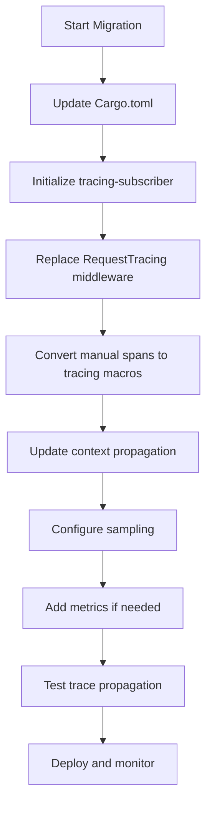

# How to Migrate from actix-web-opentelemetry to the New Instrumentation Crate

Author: [nawazdhandala](https://www.github.com/nawazdhandala)

Tags: OpenTelemetry, Rust, Actix-web, Migration, Instrumentation

Description: Complete migration guide from the deprecated actix-web-opentelemetry crate to modern OpenTelemetry instrumentation patterns with code examples.

The `actix-web-opentelemetry` crate served the community well, but changes in the OpenTelemetry Rust ecosystem have made it obsolete. The replacement approach uses the `opentelemetry-instrumentation-actix-web` crate alongside the official `opentelemetry` SDK crates, giving you better compatibility with the broader ecosystem while preserving Actix-web specific middleware.

## Why Migrate?

The original `actix-web-opentelemetry` crate is no longer maintained and relies on outdated OpenTelemetry dependencies. The new approach provides better performance, more flexible configuration, and alignment with OpenTelemetry specification updates. You'll also get access to newer features like metrics and logs correlation.

## Understanding the Old Approach

The deprecated crate provided a simple middleware wrapper:

```rust
// Old approach - DO NOT USE
use actix_web_opentelemetry::RequestTracing;
use opentelemetry::global;

#[actix_web::main]
async fn main() -> std::io::Result<()> {
    let tracer = init_tracer();

    HttpServer::new(move || {
        App::new()
            .wrap(RequestTracing::new())
            .route("/api/users", web::get().to(get_users))
    })
    .bind(("127.0.0.1", 8080))?
    .run()
    .await
}
```

This approach was convenient but gave limited control over span attributes, context propagation, and integration with other observability tools.

## Setting Up the New Dependencies

Update your `Cargo.toml` to remove the old crate and add the new ones:

```toml
[dependencies]
# Remove this line:

# actix-web-opentelemetry = "0.22"

# Add these instead:
actix-web = "4"
awc = "3"
opentelemetry = { version = "0.31", features = ["trace", "metrics"] }
opentelemetry_sdk = { version = "0.31", features = ["trace", "metrics", "rt-tokio"] }
opentelemetry-otlp = { version = "0.31", features = ["grpc-tonic", "trace", "metrics"] }
opentelemetry-instrumentation-actix-web = { version = "0.23", features = ["awc", "metrics"] }
tracing = "0.1"
tracing-opentelemetry = "0.32"
tracing-subscriber = { version = "0.3", features = ["env-filter", "json"] }
```

The `opentelemetry-instrumentation-actix-web` crate provides Actix-web specific instrumentation for incoming requests, request metrics, and `awc` client requests. The `tracing-opentelemetry` crate is still useful when you also want spans created with `tracing` macros to be exported as OpenTelemetry spans.

## Implementing the New Instrumentation Pattern

Here's the modern way to instrument your Actix-web application:

```rust
use actix_web::{web, App, HttpResponse, HttpServer};
use opentelemetry::global;
use opentelemetry::trace::TracerProvider as _;
use opentelemetry_instrumentation_actix_web::RequestTracing;
use opentelemetry_otlp::WithExportConfig;
use opentelemetry_sdk::trace::{RandomIdGenerator, Sampler, SdkTracerProvider};
use opentelemetry_sdk::Resource;
use opentelemetry::KeyValue;
use tracing_subscriber::layer::SubscriberExt;
use tracing_subscriber::util::SubscriberInitExt;

fn init_telemetry() -> Result<SdkTracerProvider, Box<dyn std::error::Error>> {
    // Configure the OTLP exporter
    let exporter = opentelemetry_otlp::SpanExporter::builder()
        .with_tonic()
        .with_endpoint("http://localhost:4317")
        .build()?;

    let tracer_provider = SdkTracerProvider::builder()
        .with_sampler(Sampler::AlwaysOn)
        .with_id_generator(RandomIdGenerator::default())
        .with_max_events_per_span(64)
        .with_max_attributes_per_span(128)
        .with_resource(
            Resource::builder()
                .with_service_name("my-actix-service")
                .with_attribute(KeyValue::new("service.version", env!("CARGO_PKG_VERSION")))
                .with_attribute(KeyValue::new("deployment.environment", "production"))
                .build(),
        )
        .with_batch_exporter(exporter)
        .build();

    global::set_tracer_provider(tracer_provider.clone());

    // Create a tracing layer with the configured tracer provider
    let tracer = tracer_provider.tracer("my-actix-service");
    let telemetry_layer = tracing_opentelemetry::layer()
        .with_tracer(tracer);

    // Set up the tracing subscriber with multiple layers
    tracing_subscriber::registry()
        .with(tracing_subscriber::EnvFilter::from_default_env())
        .with(telemetry_layer)
        .with(tracing_subscriber::fmt::layer())
        .init();

    Ok(tracer_provider)
}

#[actix_web::main]
async fn main() -> std::io::Result<()> {
    let tracer_provider = init_telemetry().expect("Failed to initialize telemetry");

    HttpServer::new(|| {
        App::new()
            .wrap(RequestTracing::new())
            .route("/api/users", web::get().to(get_users))
            .route("/api/users/{id}", web::get().to(get_user_by_id))
    })
    .bind(("127.0.0.1", 8080))?
    .run()
    .await?;

    // Clean shutdown to flush remaining spans
    tracer_provider.shutdown().expect("Failed to shut down tracer provider");

    Ok(())
}

async fn get_users() -> HttpResponse {
    HttpResponse::Ok().json(vec!["user1", "user2"])
}

async fn get_user_by_id(path: web::Path<String>) -> HttpResponse {
    let user_id = path.into_inner();
    HttpResponse::Ok().json(serde_json::json!({
        "id": user_id,
        "name": "John Doe"
    }))
}
```

The `RequestTracing` middleware automatically creates OpenTelemetry spans for HTTP requests. The `tracing-opentelemetry` layer exports spans created with `tracing` macros through the same tracer provider.

## Migrating Custom Span Creation

If you were creating custom spans with the old approach, here's how to migrate:

```rust
// Old approach
use actix_web_opentelemetry::RequestMetrics;

async fn old_handler() -> HttpResponse {
    let tracer = global::tracer("my-service");
    let span = tracer.start("custom_operation");
    // Do work
    span.end();
    HttpResponse::Ok().finish()
}

// New approach using tracing macros
use tracing::{info_span, instrument};

#[instrument(name = "get_user_details", skip(user_id))]
async fn new_handler(user_id: String) -> HttpResponse {
    // The function is automatically traced
    let user = fetch_user(&user_id).await;

    // Create nested spans for specific operations
    let _span = info_span!("validate_user", user.id = %user_id).entered();
    validate_user(&user);

    HttpResponse::Ok().json(user)
}

#[instrument(name = "fetch_user_from_db")]
async fn fetch_user(id: &str) -> User {
    // This function automatically gets its own span
    // Query database
    User {
        id: id.to_string(),
        name: "Jane Smith".to_string(),
    }
}
```

The `#[instrument]` macro automatically creates spans with proper context propagation. This is more ergonomic than manually managing span lifecycles.

## Handling Context Propagation

The old crate automatically extracted and injected trace context. You can achieve the same with the new approach:

```rust
use actix_web::{HttpRequest, HttpResponse};
use awc::Client;
use opentelemetry_instrumentation_actix_web::ClientExt;
use tracing::instrument;

#[instrument(name = "call_downstream_service", skip(_req))]
async fn call_downstream(_req: HttpRequest) -> HttpResponse {
    let client = Client::default();

    // Create a new request to a downstream service and add tracing propagation
    let downstream_req = client
        .get("http://downstream-service/api/data")
        .insert_header(("user-agent", "my-service/1.0"))
        .trace_request();

    // Send the request with trace context
    match downstream_req.send().await {
        Ok(mut response) => {
            let body = response.body().await.unwrap();
            HttpResponse::Ok().body(body)
        }
        Err(err) => {
            tracing::error!("Failed to call downstream: {}", err);
            HttpResponse::InternalServerError().finish()
        }
    }
}
```

This ensures distributed traces flow correctly across service boundaries.

## Configuring Sampling Strategies

The new approach gives you more control over sampling:

```rust
use opentelemetry::trace::{Link, SamplingDecision, SamplingResult, SpanKind, TraceId};
use opentelemetry::KeyValue;
use opentelemetry_sdk::trace::{Sampler, ShouldSample};

// Simple ratio-based sampling
let sampler = Sampler::TraceIdRatioBased(0.1); // Sample 10% of traces

// Parent-based sampling (respect upstream sampling decisions)
let parent_sampler = Sampler::ParentBased(Box::new(
    Sampler::TraceIdRatioBased(0.1)
));

// Custom sampling logic
#[derive(Clone, Debug)]
struct CustomSampler;

impl ShouldSample for CustomSampler {
    fn should_sample(
        &self,
        parent_context: Option<&opentelemetry::Context>,
        trace_id: TraceId,
        name: &str,
        span_kind: &SpanKind,
        attributes: &[KeyValue],
        links: &[Link],
    ) -> SamplingResult {
        // Sample all error requests
        if attributes.iter().any(|kv| {
            kv.key.as_str() == "http.status_code"
            && kv.value.as_str().to_string().starts_with("5")
        }) {
            return SamplingResult {
                decision: SamplingDecision::RecordAndSample,
                attributes: vec![],
                trace_state: Default::default(),
            };
        }

        // Sample 10% of everything else
        if trace_id.to_bytes()[0] < 25 {
            SamplingResult {
                decision: SamplingDecision::RecordAndSample,
                attributes: vec![],
                trace_state: Default::default(),
            }
        } else {
            SamplingResult {
                decision: SamplingDecision::Drop,
                attributes: vec![],
                trace_state: Default::default(),
            }
        }
    }
}
```

Custom samplers let you implement sophisticated sampling strategies based on request attributes, endpoints, or other criteria.

## Adding Metrics Support

Unlike the old crate, the new approach supports metrics alongside traces:

```rust
use actix_web::HttpResponse;
use opentelemetry::{global, metrics::MeterProvider, KeyValue};
use opentelemetry_otlp::WithExportConfig;
use opentelemetry_sdk::metrics;
use opentelemetry_sdk::Resource;

fn init_metrics() -> Result<(), Box<dyn std::error::Error>> {
    let exporter = opentelemetry_otlp::MetricExporter::builder()
        .with_tonic()
        .with_endpoint("http://localhost:4317")
        .build()?;

    let reader = metrics::PeriodicReader::builder(exporter)
        .with_interval(std::time::Duration::from_secs(30))
        .build();

    let provider = metrics::SdkMeterProvider::builder()
        .with_reader(reader)
        .with_resource(
            Resource::builder()
                .with_service_name("my-actix-service")
                .build(),
        )
        .build();

    global::set_meter_provider(provider.clone());

    Ok(())
}

// Use metrics in your handlers
async fn metrics_handler() -> HttpResponse {
    let meter = global::meter("my-actix-service");
    let counter = meter
        .u64_counter("requests_total")
        .with_description("Total number of requests")
        .build();

    counter.add(1, &[KeyValue::new("endpoint", "/api/users")]);

    HttpResponse::Ok().finish()
}
```

This unified approach simplifies your observability stack by sending traces and metrics through the same pipeline.

## Migration Checklist

Here's a step-by-step migration process:


```mermaid
graph TD
    A[Start Migration] --> B[Update Cargo.toml]
    B --> C[Initialize tracing-subscriber]
    C --> D[Replace RequestTracing middleware]
    D --> E[Convert manual spans to tracing macros]
    E --> F[Update context propagation]
    F --> G[Configure sampling]
    G --> H[Add metrics if needed]
    H --> I[Test trace propagation]
    I --> J[Deploy and monitor]
```

1. Update dependencies in `Cargo.toml`
2. Initialize the tracing subscriber with OpenTelemetry layer
3. Replace old middleware with `opentelemetry_instrumentation_actix_web::RequestTracing`
4. Convert manual span creation to `#[instrument]` macros
5. Update context extraction and injection for downstream calls
6. Configure appropriate sampling strategies
7. Optionally add metrics instrumentation
8. Test distributed tracing across services
9. Deploy incrementally and verify spans appear correctly

## Performance Comparison

The new approach offers better performance characteristics:

- Batch processing reduces network overhead
- Async exporters don't block request handlers
- Sampling happens earlier in the pipeline
- Lower memory footprint due to optimized span storage

You should benchmark the migration in your own service before making performance claims, especially if you add request metrics or synchronous middleware instrumentation.

## Troubleshooting Common Issues

If spans aren't appearing after migration, check that the tracing subscriber is initialized before creating the HTTP server. The subscriber must be set up in the main function before any instrumented code runs.

If you see context propagation issues, verify that both services use the same propagator format. The default W3C Trace Context propagator is recommended for cross-service compatibility.

For high-throughput services experiencing backpressure, increase the batch span processor queue size or adjust the scheduled delay between exports.

The migration requires some code changes, but the result is a more maintainable, performant, and feature-rich instrumentation setup that will serve your observability needs for years to come.
