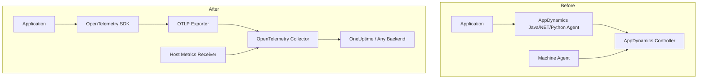

# How to Migrate from AppDynamics to OpenTelemetry

Author: [nawazdhandala](https://www.github.com/nawazdhandala)

Tags: OpenTelemetry, AppDynamics, Migration, Observability, APM, Java, .NET, Python, Tracing

Description: A practical guide to migrating from AppDynamics to OpenTelemetry, covering agent removal, SDK setup, and telemetry mapping for Java, .NET, and Python applications.

---

> AppDynamics has been a powerful APM tool for enterprise environments, but its proprietary agent model and per-core licensing can become expensive and inflexible. OpenTelemetry offers a vendor-neutral alternative that gives you full control over your telemetry data while eliminating agent lock-in.

This guide covers the end-to-end process of replacing AppDynamics agents with OpenTelemetry instrumentation. We will focus on the most common languages (Java, .NET, and Python), walk through the concept mapping, and provide practical code examples for each step.

---

## Why Move Away from AppDynamics?

There are several practical reasons teams migrate from AppDynamics:

- **Cost**: AppDynamics licensing is typically per-CPU-core, which adds up quickly in containerized environments where core counts fluctuate.
- **Vendor lock-in**: The proprietary agent format means all your instrumentation knowledge and configuration is tied to one vendor.
- **Flexibility**: OpenTelemetry lets you export telemetry to any compatible backend, or even multiple backends simultaneously.
- **Community**: OpenTelemetry is backed by the CNCF with contributions from every major cloud provider and observability vendor.

---

## Concept Mapping

Before diving into code, it helps to understand how AppDynamics concepts translate to OpenTelemetry:

| AppDynamics Concept | OpenTelemetry Equivalent |
|---|---|
| Business Transaction | Trace (root span) |
| Tier / Node | Service (resource attribute) |
| Exit Call | Client span |
| Snapshot | Detailed trace with all spans |
| Custom Metric | Meter instrument (counter, histogram) |
| Information Point | Span with custom attributes |
| Health Rule | Alert rules on your backend |
| Machine Agent | Host metrics via Collector |

---

## Migration Architecture

The migration follows a clear path from proprietary agents to open standards:



---

## Step 1: Remove AppDynamics Agents

### Java Applications

For Java applications, AppDynamics typically runs as a javaagent. Remove it from your startup command:

```bash
# BEFORE: Java application with AppDynamics agent attached
# The -javaagent flag loads the AppDynamics bytecode instrumentation
# java -javaagent:/opt/appdynamics/javaagent/javaagent.jar \
#      -Dappdynamics.controller.hostName=controller.example.com \
#      -Dappdynamics.controller.port=443 \
#      -Dappdynamics.agent.applicationName=MyApp \
#      -Dappdynamics.agent.tierName=WebTier \
#      -Dappdynamics.agent.nodeName=node1 \
#      -jar myapp.jar

# AFTER: Clean startup without any proprietary agent
java -jar myapp.jar
```

Also remove the AppDynamics agent files from your Docker images or deployment packages. If you are using Kubernetes, remove any init containers that download the AppDynamics agent.

### .NET Applications

For .NET, remove the AppDynamics profiler environment variables and NuGet packages:

```bash
# Remove these environment variables from your deployment
# CORECLR_ENABLE_PROFILING=1
# CORECLR_PROFILER={57e1aa68-2229-41aa-9f73-2e0a5d1b7e0c}
# CORECLR_PROFILER_PATH=/opt/appdynamics/libappdprofiler.so

# Remove the AppDynamics NuGet package
dotnet remove package AppDynamics.Agent.Distrib.Net.Linux
```

### Python Applications

For Python, remove the AppDynamics package and the agent initialization code:

```bash
# Remove the AppDynamics Python agent package
pip uninstall appdynamics
```

```python
# REMOVE this initialization code from your application
# from appdynamics.agent import api as appd
# appd.init()
```

---

## Step 2: Install OpenTelemetry (Java)

For Java applications, the OpenTelemetry Java agent provides automatic instrumentation similar to what AppDynamics offered. The difference is that it uses open standards:

```bash
# Download the OpenTelemetry Java auto-instrumentation agent
# This single JAR provides instrumentation for 100+ libraries
curl -L -o opentelemetry-javaagent.jar \
  https://github.com/open-telemetry/opentelemetry-java-instrumentation/releases/latest/download/opentelemetry-javaagent.jar
```

Configure and run your application with the OpenTelemetry agent:

```bash
# Run with OpenTelemetry Java agent
# The -javaagent flag attaches automatic instrumentation at startup
java -javaagent:opentelemetry-javaagent.jar \
     -Dotel.service.name=my-java-service \
     -Dotel.exporter.otlp.endpoint=https://oneuptime.com/otlp \
     -Dotel.exporter.otlp.headers=x-oneuptime-token=your-token-here \
     -Dotel.resource.attributes=deployment.environment=production \
     -jar myapp.jar
```

The Java agent automatically instruments Spring Boot, JAX-RS, JDBC, Hibernate, Kafka, gRPC, and many other libraries. In most cases, the coverage is comparable to what AppDynamics provided.

---

## Step 3: Install OpenTelemetry (.NET)

For .NET applications, add the OpenTelemetry packages and configure them in your startup code:

```bash
# Install OpenTelemetry packages for .NET
dotnet add package OpenTelemetry.Extensions.Hosting
dotnet add package OpenTelemetry.Exporter.OpenTelemetryProtocol
dotnet add package OpenTelemetry.Instrumentation.AspNetCore
dotnet add package OpenTelemetry.Instrumentation.Http
dotnet add package OpenTelemetry.Instrumentation.SqlClient
```

Configure OpenTelemetry in your `Program.cs`. This replaces the AppDynamics agent configuration that was done through environment variables or XML config files:

```csharp
// Program.cs
using OpenTelemetry.Resources;
using OpenTelemetry.Trace;
using OpenTelemetry.Metrics;

var builder = WebApplication.CreateBuilder(args);

// Configure resource attributes
// service.name replaces AppDynamics tier name
// service.namespace replaces AppDynamics application name
var resourceBuilder = ResourceBuilder
    .CreateDefault()
    .AddService("my-dotnet-service", serviceVersion: "1.0.0")
    .AddAttributes(new Dictionary<string, object>
    {
        ["service.namespace"] = "MyApplication",           // was: appd application name
        ["deployment.environment"] = "production"
    });

builder.Services.AddOpenTelemetry()
    .WithTracing(tracing =>
    {
        tracing
            .SetResourceBuilder(resourceBuilder)
            .AddAspNetCoreInstrumentation()    // replaces AppDynamics BT detection
            .AddHttpClientInstrumentation()     // replaces AppDynamics exit calls
            .AddSqlClientInstrumentation(opt =>
            {
                opt.SetDbStatementForText = true;  // capture SQL like AppDynamics snapshots
                opt.RecordException = true;
            })
            .AddOtlpExporter(options =>
            {
                options.Endpoint = new Uri("https://oneuptime.com/otlp");
                options.Headers = "x-oneuptime-token=your-token-here";
            });
    })
    .WithMetrics(metrics =>
    {
        metrics
            .SetResourceBuilder(resourceBuilder)
            .AddAspNetCoreInstrumentation()
            .AddHttpClientInstrumentation()
            .AddOtlpExporter(options =>
            {
                options.Endpoint = new Uri("https://oneuptime.com/otlp");
                options.Headers = "x-oneuptime-token=your-token-here";
            });
    });

var app = builder.Build();
app.Run();
```

---

## Step 4: Install OpenTelemetry (Python)

For Python applications, OpenTelemetry provides both auto-instrumentation and manual instrumentation options:

```bash
# Install OpenTelemetry Python packages
pip install opentelemetry-api \
            opentelemetry-sdk \
            opentelemetry-exporter-otlp \
            opentelemetry-distro \
            opentelemetry-instrumentation

# Auto-detect and install instrumentations for your libraries
opentelemetry-bootstrap -a install
```

Run your application with auto-instrumentation. This replaces the AppDynamics Python agent that you previously initialized in code:

```bash
# Configure and run with OpenTelemetry auto-instrumentation
export OTEL_SERVICE_NAME="my-python-service"
export OTEL_EXPORTER_OTLP_ENDPOINT="https://oneuptime.com/otlp"
export OTEL_EXPORTER_OTLP_HEADERS="x-oneuptime-token=your-token-here"
export OTEL_RESOURCE_ATTRIBUTES="deployment.environment=production"

# The opentelemetry-instrument wrapper replaces the appd agent init
opentelemetry-instrument python app.py
```

---

## Step 5: Replace the Machine Agent

AppDynamics Machine Agent collects host-level metrics like CPU, memory, disk, and network usage. In the OpenTelemetry world, the OpenTelemetry Collector handles this with the Host Metrics Receiver:

```yaml
# otel-collector-config.yaml
# This configuration replaces the AppDynamics Machine Agent

receivers:
  # Host metrics receiver collects system-level metrics
  # Replaces AppDynamics Machine Agent functionality
  hostmetrics:
    collection_interval: 30s
    scrapers:
      cpu:         # CPU utilization per core
      memory:      # Memory usage and availability
      disk:        # Disk I/O and usage
      network:     # Network interface statistics
      filesystem:  # Filesystem capacity and usage
      load:        # System load averages
      process:     # Per-process resource usage

  # OTLP receiver accepts telemetry from your applications
  otlp:
    protocols:
      grpc:
        endpoint: 0.0.0.0:4317
      http:
        endpoint: 0.0.0.0:4318

processors:
  # Batch processor groups telemetry for efficient export
  batch:
    timeout: 10s
    send_batch_size: 1024

  # Add resource attributes to all telemetry
  resource:
    attributes:
      - key: host.name
        from_attribute: host.name
        action: upsert

exporters:
  otlp:
    endpoint: https://oneuptime.com/otlp
    headers:
      x-oneuptime-token: your-token-here

service:
  pipelines:
    traces:
      receivers: [otlp]
      processors: [batch, resource]
      exporters: [otlp]
    metrics:
      receivers: [otlp, hostmetrics]
      processors: [batch, resource]
      exporters: [otlp]
```

---

## Step 6: Migrate Custom Business Metrics

If you used AppDynamics custom metrics or information points, convert them to OpenTelemetry instruments. Here is an example in Java:

```java
// BEFORE: AppDynamics custom metric reporting
// MetricPublisher publisher =
//     appd.getMetricPublisher();
// publisher.reportMetric(
//     "Custom Metrics|Orders|Processing Time",
//     processingTimeMs);

// AFTER: OpenTelemetry custom metrics in Java
import io.opentelemetry.api.GlobalOpenTelemetry;
import io.opentelemetry.api.metrics.LongCounter;
import io.opentelemetry.api.metrics.DoubleHistogram;
import io.opentelemetry.api.metrics.Meter;

// Create a Meter instance for your business metrics
Meter meter = GlobalOpenTelemetry.getMeter("com.myapp.orders");

// Counter for tracking order volume (replaces custom event count)
LongCounter ordersPlaced = meter
    .counterBuilder("orders.placed")
    .setDescription("Total number of orders placed")
    .setUnit("orders")
    .build();

// Histogram for tracking processing time distribution
DoubleHistogram processingTime = meter
    .histogramBuilder("orders.processing_time")
    .setDescription("Order processing duration")
    .setUnit("ms")
    .build();

// Record metrics with attributes for filtering
public void processOrder(Order order) {
    long startTime = System.currentTimeMillis();

    // Process the order
    doOrderProcessing(order);

    long duration = System.currentTimeMillis() - startTime;

    // Record the metrics with dimensional attributes
    // These replace the flat metric paths in AppDynamics
    ordersPlaced.add(1,
        Attributes.of(AttributeKey.stringKey("order.type"), order.getType()));
    processingTime.record(duration,
        Attributes.of(AttributeKey.stringKey("order.type"), order.getType()));
}
```

---

## Phased Migration Strategy

For large deployments, a phased approach works best:

1. **Deploy the OpenTelemetry Collector** alongside your existing AppDynamics setup. This gives you infrastructure metrics without touching application code.

2. **Migrate one service at a time**. Pick a non-critical service, replace the AppDynamics agent with OpenTelemetry, and verify that you get equivalent visibility.

3. **Run in parallel** for a transition period. Some teams run both AppDynamics and OpenTelemetry simultaneously for a few weeks to validate coverage.

4. **Remove AppDynamics agents** once you are confident in the OpenTelemetry data. This is also when you can negotiate down or cancel your AppDynamics license.

---

## Common Pitfalls

**Missing library instrumentation.** AppDynamics auto-detects many frameworks. With OpenTelemetry, you may need to explicitly add instrumentation packages for specific libraries. Check the OpenTelemetry registry for available instrumentations.

**Business transaction naming.** AppDynamics has sophisticated BT detection rules. In OpenTelemetry, span names are set by the instrumentation library. You may need to customize span names using span processors or SDK configuration to match your previous naming scheme.

**Alert migration.** AppDynamics health rules do not transfer automatically. You will need to recreate your alerting logic in your new backend.

**Dashboard recreation.** Plan time to rebuild dashboards. The good news is that OpenTelemetry's semantic conventions make it easier to build dashboards that work across services.

---

## Conclusion

Migrating from AppDynamics to OpenTelemetry is a significant undertaking for large organizations, but it pays off in reduced licensing costs, vendor flexibility, and alignment with industry standards. The key is to approach it incrementally, validate each service as you go, and give your team time to learn the new tooling.

OpenTelemetry provides equivalent or better coverage for most use cases, and the ecosystem is growing rapidly. Once you have made the switch, you will never have to worry about agent vendor lock-in again.

---

*Ready to receive your OpenTelemetry data? [OneUptime](https://oneuptime.com) provides a complete observability platform with native OTLP support, alerting, and dashboards. Try it free today.*
