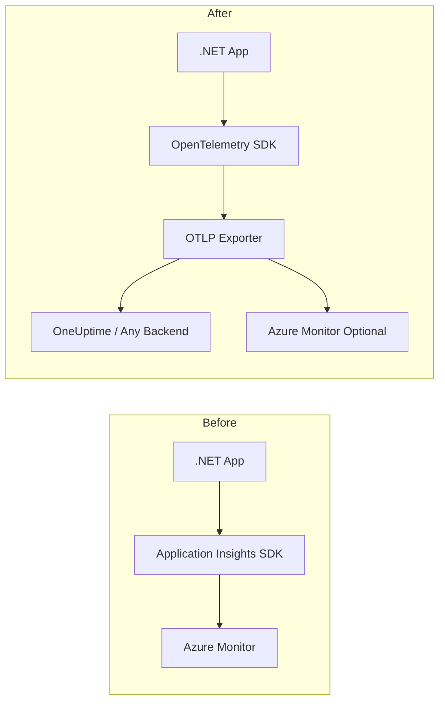

# How to Migrate from Application Insights to OpenTelemetry in .NET

Author: [nawazdhandala](https://www.github.com/nawazdhandala)

Tags: OpenTelemetry, .NET, Application Insights, Azure, Migration, Observability, Tracing, Metrics

Description: A step-by-step guide to migrating .NET applications from Azure Application Insights to OpenTelemetry, covering traces, metrics, and logs with practical code examples.

---

> Azure Application Insights has served .NET developers well for years, but the observability landscape has shifted. OpenTelemetry is now the industry standard for instrumentation, and Microsoft themselves are investing heavily in it. Migrating to OpenTelemetry gives you vendor neutrality, broader community support, and the freedom to send telemetry to any backend you choose.

This guide walks you through a practical migration from Application Insights to OpenTelemetry in .NET applications. We will cover the key differences, show you how to replace each piece of the Application Insights SDK, and help you avoid common pitfalls along the way.

---

## Why Migrate?

Application Insights locks your telemetry data into the Azure ecosystem. If you ever want to switch backends, use multiple backends, or run outside Azure, you are stuck rewriting instrumentation code. OpenTelemetry solves this by providing a single, vendor-neutral API that works with dozens of backends.

Microsoft has also signaled the future direction. The Azure Monitor OpenTelemetry Distro is now the recommended path for new .NET applications. The classic Application Insights SDK is in maintenance mode.

---

## Architecture Comparison

Here is how the data flow changes between the two approaches:



With OpenTelemetry, your application talks to a standard API. You can export to any OTLP-compatible backend, or even multiple backends at the same time.

---

## Prerequisites

Before starting the migration, make sure you have:
- .NET 6.0 or higher (though .NET 8+ is recommended)
- An existing application using the Application Insights SDK
- An OTLP-compatible backend like [OneUptime](https://oneuptime.com)

---

## Step 1: Remove Application Insights Packages

Start by removing the old Application Insights NuGet packages from your project. This ensures there are no conflicts with the new OpenTelemetry packages:

```bash
# Remove the classic Application Insights packages
# These will be fully replaced by OpenTelemetry equivalents
dotnet remove package Microsoft.ApplicationInsights.AspNetCore
dotnet remove package Microsoft.ApplicationInsights.WorkerService
dotnet remove package Microsoft.ApplicationInsights
```

Also clean up any Application Insights configuration from your `appsettings.json`. Remove the `ApplicationInsights` section and the instrumentation key entries:

```json
// REMOVE these sections from appsettings.json
// "ApplicationInsights": {
//     "InstrumentationKey": "your-key-here",
//     "ConnectionString": "InstrumentationKey=..."
// }
```

---

## Step 2: Install OpenTelemetry Packages

Install the OpenTelemetry packages that replace Application Insights functionality. Each package handles a specific part of the telemetry pipeline:

```bash
# Core OpenTelemetry packages for ASP.NET Core
dotnet add package OpenTelemetry.Extensions.Hosting
dotnet add package OpenTelemetry.Exporter.OpenTelemetryProtocol

# Tracing instrumentation for incoming HTTP requests
dotnet add package OpenTelemetry.Instrumentation.AspNetCore

# Tracing instrumentation for outgoing HTTP calls
dotnet add package OpenTelemetry.Instrumentation.Http

# SQL Server instrumentation (replaces AI dependency tracking)
dotnet add package OpenTelemetry.Instrumentation.SqlClient

# Metrics instrumentation for runtime and process metrics
dotnet add package OpenTelemetry.Instrumentation.Runtime
```

---

## Step 3: Configure OpenTelemetry in Program.cs

Replace the `AddApplicationInsightsTelemetry()` call with OpenTelemetry configuration. This is the core of the migration. Here is a complete example for an ASP.NET Core application:

```csharp
// Program.cs
using OpenTelemetry.Logs;
using OpenTelemetry.Metrics;
using OpenTelemetry.Resources;
using OpenTelemetry.Trace;

var builder = WebApplication.CreateBuilder(args);

// Define resource attributes that identify this service
// These replace the Application Insights cloud role name
var resourceBuilder = ResourceBuilder
    .CreateDefault()
    .AddService(
        serviceName: "my-dotnet-service",    // replaces CloudRoleName
        serviceVersion: "1.0.0"              // version tracking
    )
    .AddAttributes(new Dictionary<string, object>
    {
        ["deployment.environment"] = builder.Environment.EnvironmentName
    });

// Configure OpenTelemetry tracing
// This replaces Application Insights request and dependency tracking
builder.Services.AddOpenTelemetry()
    .WithTracing(tracing =>
    {
        tracing
            .SetResourceBuilder(resourceBuilder)
            // Instrument incoming HTTP requests (replaces AI request telemetry)
            .AddAspNetCoreInstrumentation(options =>
            {
                // Filter out health check endpoints to reduce noise
                options.Filter = httpContext =>
                    !httpContext.Request.Path.StartsWithSegments("/health");
            })
            // Instrument outgoing HTTP calls (replaces AI dependency tracking)
            .AddHttpClientInstrumentation()
            // Instrument SQL queries (replaces AI SQL dependency tracking)
            .AddSqlClientInstrumentation(options =>
            {
                options.SetDbStatementForText = true;  // capture query text
                options.RecordException = true;         // capture SQL errors
            })
            // Export traces via OTLP to your backend
            .AddOtlpExporter(options =>
            {
                options.Endpoint = new Uri("https://oneuptime.com/otlp");
                options.Headers = "x-oneuptime-token=your-token-here";
            });
    })
    // Configure metrics collection
    // This replaces Application Insights performance counters and custom metrics
    .WithMetrics(metrics =>
    {
        metrics
            .SetResourceBuilder(resourceBuilder)
            // Collect HTTP request metrics (request rate, duration, errors)
            .AddAspNetCoreInstrumentation()
            // Collect outgoing HTTP call metrics
            .AddHttpClientInstrumentation()
            // Collect .NET runtime metrics (GC, thread pool, etc.)
            .AddRuntimeInstrumentation()
            // Export metrics via OTLP
            .AddOtlpExporter(options =>
            {
                options.Endpoint = new Uri("https://oneuptime.com/otlp");
                options.Headers = "x-oneuptime-token=your-token-here";
            });
    });

// Configure logging to export via OpenTelemetry
// This replaces Application Insights trace telemetry
builder.Logging.AddOpenTelemetry(logging =>
{
    logging
        .SetResourceBuilder(resourceBuilder)
        .AddOtlpExporter(options =>
        {
            options.Endpoint = new Uri("https://oneuptime.com/otlp");
            options.Headers = "x-oneuptime-token=your-token-here";
        });
});

var app = builder.Build();

app.MapGet("/", () => "Hello World!");
app.MapGet("/health", () => Results.Ok(new { status = "healthy" }));

app.Run();
```

The key mapping between Application Insights and OpenTelemetry concepts is straightforward. Request telemetry becomes incoming HTTP spans. Dependency telemetry becomes outgoing HTTP and database spans. Trace telemetry becomes log records. Custom metrics use the OpenTelemetry Metrics API.

---

## Step 4: Migrate Custom Telemetry

If you used `TelemetryClient` to send custom events and metrics, you need to replace those calls with OpenTelemetry equivalents.

### Replacing TelemetryClient.TrackEvent

Application Insights custom events map to span events in OpenTelemetry. Here is how to convert them:

```csharp
// BEFORE: Application Insights custom event tracking
// var telemetryClient = new TelemetryClient();
// telemetryClient.TrackEvent("OrderPlaced", new Dictionary<string, string>
// {
//     { "OrderId", orderId },
//     { "CustomerId", customerId }
// });

// AFTER: OpenTelemetry span with events
using System.Diagnostics;

// Create an ActivitySource (equivalent to a tracer)
// Use a descriptive name that identifies your component
private static readonly ActivitySource ActivitySource =
    new("MyApp.OrderService");

public void PlaceOrder(string orderId, string customerId)
{
    // Start a new activity (span) for this operation
    using var activity = ActivitySource.StartActivity("PlaceOrder");

    // Set attributes (replaces custom properties)
    activity?.SetTag("order.id", orderId);
    activity?.SetTag("customer.id", customerId);

    // Add an event within the span (replaces TrackEvent)
    activity?.AddEvent(new ActivityEvent("OrderPlaced",
        tags: new ActivityTagsCollection
        {
            { "order.id", orderId },
            { "order.total", 99.99 }
        }));

    // Your business logic here
    ProcessOrder(orderId);
}
```

### Replacing TelemetryClient.TrackMetric

Custom metrics use the `System.Diagnostics.Metrics` API, which OpenTelemetry collects automatically:

```csharp
using System.Diagnostics.Metrics;

// Create a Meter for your application (similar to TelemetryClient for metrics)
private static readonly Meter AppMeter = new("MyApp.Metrics", "1.0.0");

// Create counter (replaces TrackMetric for counting events)
private static readonly Counter<long> OrdersPlaced =
    AppMeter.CreateCounter<long>("orders.placed", "orders",
        "Total number of orders placed");

// Create histogram (replaces TrackMetric for distributions)
private static readonly Histogram<double> OrderProcessingTime =
    AppMeter.CreateHistogram<double>("orders.processing_time", "ms",
        "Time to process an order");

public void ProcessOrder(string orderId)
{
    var stopwatch = Stopwatch.StartNew();

    // Your order processing logic here

    stopwatch.Stop();

    // Record metrics (replaces telemetryClient.TrackMetric)
    OrdersPlaced.Add(1, new KeyValuePair<string, object?>("region", "us-east"));
    OrderProcessingTime.Record(stopwatch.Elapsed.TotalMilliseconds);
}
```

Remember to register your custom meter in the OpenTelemetry configuration so it gets exported:

```csharp
// In Program.cs, add your custom meter to the metrics configuration
.WithMetrics(metrics =>
{
    metrics
        .SetResourceBuilder(resourceBuilder)
        .AddMeter("MyApp.Metrics")  // register your custom meter
        .AddAspNetCoreInstrumentation()
        .AddOtlpExporter(options => { /* ... */ });
})
```

---

## Step 5: Migrate Exception Tracking

Application Insights exception tracking translates directly to span status and exception recording in OpenTelemetry:

```csharp
// BEFORE: Application Insights exception tracking
// telemetryClient.TrackException(exception, new Dictionary<string, string>
// {
//     { "Operation", "ProcessPayment" }
// });

// AFTER: OpenTelemetry exception recording on spans
using var activity = ActivitySource.StartActivity("ProcessPayment");

try
{
    // Your code that might throw
    ChargeCustomer(amount);
}
catch (Exception ex)
{
    // Record the exception on the current span
    // This captures the full stack trace and exception details
    activity?.SetStatus(ActivityStatusCode.Error, ex.Message);
    activity?.RecordException(ex);
    throw;
}
```

---

## Step 6: Register ActivitySource

One step that is easy to forget: you need to register your custom `ActivitySource` names in the tracing configuration. Without this, your custom spans will not be captured:

```csharp
.WithTracing(tracing =>
{
    tracing
        .SetResourceBuilder(resourceBuilder)
        // Register your custom ActivitySource so spans are captured
        .AddSource("MyApp.OrderService")
        .AddSource("MyApp.PaymentService")
        .AddAspNetCoreInstrumentation()
        .AddHttpClientInstrumentation()
        .AddOtlpExporter(options => { /* ... */ });
})
```

---

## Common Pitfalls

**Forgetting to register ActivitySource names.** If you create an `ActivitySource` but do not add it with `.AddSource()`, none of your custom spans will appear. This is the most common issue during migration.

**Not filtering health check endpoints.** Without filtering, health check probes generate massive amounts of trace data. Use the filter option on `AddAspNetCoreInstrumentation` to exclude them.

**Missing SQL query capture.** By default, `SqlClientInstrumentation` does not capture query text. Set `SetDbStatementForText = true` if you want to see the actual SQL queries in your traces.

**Environment variable conflicts.** If you set `APPLICATIONINSIGHTS_CONNECTION_STRING` in your environment, remove it. Leftover configuration can cause unexpected behavior.

---

## Verification Checklist

After migration, verify that everything works:
- Incoming HTTP requests generate trace spans
- Outgoing HTTP calls appear as child spans
- Database queries are captured with timing information
- Custom metrics are being exported
- Logs are flowing to your backend with trace correlation
- Exception details appear on error spans

---

## Conclusion

Migrating from Application Insights to OpenTelemetry in .NET is a well-defined process. The .NET ecosystem has excellent OpenTelemetry support through the `System.Diagnostics` APIs, and the mapping between Application Insights concepts and OpenTelemetry is straightforward.

The biggest benefit you gain is vendor neutrality. Your instrumentation code no longer ties you to Azure Monitor. You can send telemetry to OneUptime, Jaeger, Prometheus, or any other OTLP-compatible backend, and you can switch between them without touching your application code.

Start with a non-critical service, verify that telemetry flows correctly, and then roll the migration out to the rest of your .NET applications.

---

*Looking for an OpenTelemetry-native observability platform? [OneUptime](https://oneuptime.com) provides full support for OpenTelemetry traces, metrics, and logs with built-in alerting and dashboards. Get started with our free tier today.*
