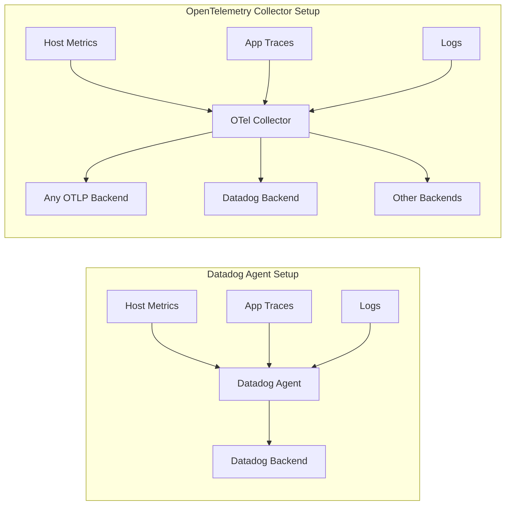

# How to Migrate from Datadog Agent to OpenTelemetry Collector Step by Step

Author: [nawazdhandala](https://www.github.com/nawazdhandala)

Tags: OpenTelemetry, Datadog, Migration, Observability, Collector, Monitoring

Description: A practical step-by-step guide to migrating from the Datadog Agent to the OpenTelemetry Collector for vendor-neutral observability.

---

If you have been running the Datadog Agent for a while, you probably appreciate how much it handles out of the box. It collects metrics from your hosts, pulls logs from containers, and forwards APM traces with minimal configuration. But the costs add up, the lock-in gets uncomfortable, and sooner or later the question comes up: can we do the same thing with something open and vendor-neutral? The answer is yes, and the tool you want is the OpenTelemetry Collector.

This guide walks you through migrating from the Datadog Agent to the OpenTelemetry Collector in concrete, tested steps. We will cover infrastructure metrics, application traces, and log forwarding so you can replace the Datadog Agent completely.

## Why Move Away from the Datadog Agent?

There are a few practical reasons teams make this switch:

1. **Cost control**: Datadog pricing scales with the number of hosts, custom metrics, and ingested logs. The OpenTelemetry Collector is open source with zero licensing fees.
2. **Vendor neutrality**: With OpenTelemetry you can send the same telemetry to multiple backends simultaneously. If you decide to switch from one backend to another next year, you only change exporter config.
3. **Community and standards**: OpenTelemetry is the second most active CNCF project after Kubernetes. The community moves fast and the specification is well-documented.
4. **Flexibility**: The Collector's pipeline architecture lets you filter, transform, and route data in ways the Datadog Agent does not support natively.

## Architecture Comparison

The following diagram shows how data flows through each setup. Notice that the OpenTelemetry Collector uses an explicit pipeline model with receivers, processors, and exporters.



## Step 1: Install the OpenTelemetry Collector

Start by installing the OpenTelemetry Collector Contrib distribution, which includes the receivers and exporters you will need. The contrib build has hundreds of components while the core build is minimal.

The following command pulls and runs the collector using Docker. We mount a local config file and expose the standard OTLP ports so your applications can start sending data right away.

```bash
# Pull the contrib distribution which includes Datadog-compatible components
# We use contrib instead of core because it has the hostmetrics receiver,
# the filelog receiver, and the datadog exporter built in
docker run -d \
  --name otel-collector \
  -v $(pwd)/otel-config.yaml:/etc/otelcol-contrib/config.yaml \
  -p 4317:4317 \
  -p 4318:4318 \
  -p 8888:8888 \
  otel/opentelemetry-collector-contrib:latest
```

If you are running on Kubernetes, the OpenTelemetry Operator or a Helm chart are better options. For this guide we will stick with a standalone deployment to keep things straightforward.

## Step 2: Configure Host Metrics Collection

The Datadog Agent collects system metrics like CPU, memory, disk, and network by default. The OpenTelemetry Collector does the same thing with the `hostmetrics` receiver.

This configuration sets up collection intervals that match what the Datadog Agent reports by default. Each scraper targets a specific category of system metrics.

```yaml
# otel-config.yaml - Host metrics receiver configuration
# This replaces the Datadog Agent's built-in system check
receivers:
  hostmetrics:
    # Collect metrics every 15 seconds, matching Datadog's default interval
    collection_interval: 15s
    scrapers:
      # CPU usage by state (user, system, idle, etc.)
      cpu:
        metrics:
          system.cpu.utilization:
            enabled: true
      # Memory usage including available, used, and cached
      memory:
        metrics:
          system.memory.utilization:
            enabled: true
      # Disk I/O operations and throughput
      disk: {}
      # Filesystem usage and inodes
      filesystem: {}
      # Network interface statistics
      network: {}
      # System load averages
      load: {}
```

The metric names differ between Datadog and OpenTelemetry. For example, Datadog reports `system.cpu.user` while OpenTelemetry reports `system.cpu.utilization` with a `state` attribute. If you are sending to a new backend, this does not matter. If you want to continue sending to Datadog while you transition, use the Datadog exporter which handles the translation automatically.

## Step 3: Migrate Application Traces

If your applications currently use the Datadog tracing libraries (dd-trace), you need to switch them to OpenTelemetry SDKs. However, you can do this gradually. The OpenTelemetry Collector can accept traces in both OTLP format and Datadog APM format simultaneously.

This receiver configuration lets you accept traces from both instrumentation libraries during the migration window.

```yaml
# Accept traces from both OpenTelemetry and Datadog-instrumented services
receivers:
  otlp:
    protocols:
      # gRPC endpoint for OpenTelemetry SDKs
      grpc:
        endpoint: 0.0.0.0:4317
      # HTTP endpoint for OpenTelemetry SDKs
      http:
        endpoint: 0.0.0.0:4318
  # Datadog receiver accepts traces from dd-trace libraries
  # This lets you migrate services one at a time
  datadog:
    endpoint: 0.0.0.0:8126
    read_timeout: 60s
```

For a Python service currently using `ddtrace`, here is what the switch to OpenTelemetry looks like. The old instrumentation attaches to your WSGI or ASGI application automatically. The new approach is similar but uses OpenTelemetry packages.

```python
# Before: Datadog tracing with ddtrace
# This patches libraries and sends traces to the Datadog Agent on port 8126
# from ddtrace import patch_all, tracer
# patch_all()
# tracer.configure(hostname="localhost", port=8126)

# After: OpenTelemetry tracing
# Install: pip install opentelemetry-api opentelemetry-sdk
#          opentelemetry-exporter-otlp opentelemetry-instrumentation
from opentelemetry import trace
from opentelemetry.sdk.trace import TracerProvider
from opentelemetry.sdk.trace.export import BatchSpanProcessor
from opentelemetry.exporter.otlp.proto.grpc.trace_exporter import OTLPSpanExporter
from opentelemetry.sdk.resources import Resource

# Create a resource that identifies your service
# This is equivalent to DD_SERVICE in Datadog
resource = Resource.create({
    "service.name": "my-python-service",
    "service.version": "1.2.0",
    "deployment.environment": "production"
})

# Set up the tracer provider with OTLP export
# The exporter sends traces to the OTel Collector on port 4317
provider = TracerProvider(resource=resource)
exporter = OTLPSpanExporter(endpoint="http://localhost:4317", insecure=True)
provider.add_span_processor(BatchSpanProcessor(exporter))
trace.set_tracer_provider(provider)
```

## Step 4: Set Up Log Collection

The Datadog Agent tails log files and forwards them. The OpenTelemetry Collector does the same with the `filelog` receiver. This receiver watches files, parses timestamps and severity levels, and ships structured log records through the pipeline.

The following configuration tails all container logs in the standard Docker log path. Adjust the `include` paths to match your environment.

```yaml
# Log collection replacing Datadog Agent log tailing
receivers:
  filelog:
    # Watch all JSON log files from Docker containers
    include:
      - /var/log/containers/*.log
    # Start reading from the end of the file so we don't replay old logs
    start_at: end
    # Parse Docker JSON log format to extract timestamp and message
    operators:
      - type: json_parser
        # Docker wraps each log line in a JSON object with log, stream, and time fields
        timestamp:
          parse_from: attributes.time
          layout: "%Y-%m-%dT%H:%M:%S.%LZ"
      - type: move
        from: attributes.log
        to: body
```

## Step 5: Build the Complete Pipeline

Now let's put it all together. The full Collector configuration connects receivers to processors and exporters in a pipeline. This example includes resource detection, batching, and memory limiting, which are best practices for production deployments.

```yaml
# Complete OpenTelemetry Collector configuration
# This replaces the full Datadog Agent functionality
receivers:
  otlp:
    protocols:
      grpc:
        endpoint: 0.0.0.0:4317
      http:
        endpoint: 0.0.0.0:4318
  hostmetrics:
    collection_interval: 15s
    scrapers:
      cpu: {}
      memory: {}
      disk: {}
      network: {}
      load: {}
  filelog:
    include:
      - /var/log/containers/*.log
    start_at: end

processors:
  # Prevent the collector from running out of memory
  memory_limiter:
    check_interval: 5s
    limit_mib: 512
    spike_limit_mib: 128
  # Batch telemetry to reduce export overhead
  batch:
    send_batch_size: 1024
    timeout: 5s
  # Automatically detect cloud and host resource attributes
  resourcedetection:
    detectors: [env, system, docker]
    timeout: 5s

exporters:
  # Send to any OTLP-compatible backend like OneUptime
  otlphttp:
    endpoint: "https://otlp.oneuptime.com"
    headers:
      x-oneuptime-token: "${ONEUPTIME_TOKEN}"
  # Optionally keep sending to Datadog during transition
  datadog:
    api:
      key: "${DD_API_KEY}"

service:
  pipelines:
    traces:
      receivers: [otlp]
      processors: [memory_limiter, batch]
      exporters: [otlphttp]
    metrics:
      receivers: [otlp, hostmetrics]
      processors: [memory_limiter, batch]
      exporters: [otlphttp]
    logs:
      receivers: [filelog]
      processors: [memory_limiter, batch]
      exporters: [otlphttp]
```

## Step 6: Validate and Cut Over

Before removing the Datadog Agent, run both agents side by side for at least a week. Compare the metrics and traces you see in your new backend against what Datadog shows. Pay attention to:

- Host metric values and granularity
- Trace counts and latency distributions
- Log volume and parsing accuracy
- Resource attribute completeness

Once you are confident the OpenTelemetry pipeline captures everything you need, stop the Datadog Agent and remove the `datadog` exporter from your Collector config.

## Common Pitfalls

**Metric name differences**: Datadog and OpenTelemetry use different naming conventions. If your dashboards and alerts reference Datadog metric names, you will need to update them. Build new dashboards in your target backend before cutting over.

**Tag vs. attribute mapping**: Datadog uses flat tags like `env:production`. OpenTelemetry uses structured resource attributes like `deployment.environment: production`. The semantics are similar but the structure differs.

**Custom checks**: If you have written custom Datadog Agent checks in Python, you will need to rewrite them. The OpenTelemetry Collector does not run Python checks. Look at custom receivers or the script processor as alternatives.

## Conclusion

Migrating from the Datadog Agent to the OpenTelemetry Collector is a practical move that gives you vendor independence, cost control, and a standards-based pipeline. The key is doing it gradually: run both agents in parallel, migrate one signal at a time, and validate at each step. The Collector's flexibility means you can keep sending data to Datadog during the transition, so there is no need for a risky big-bang cutover.
