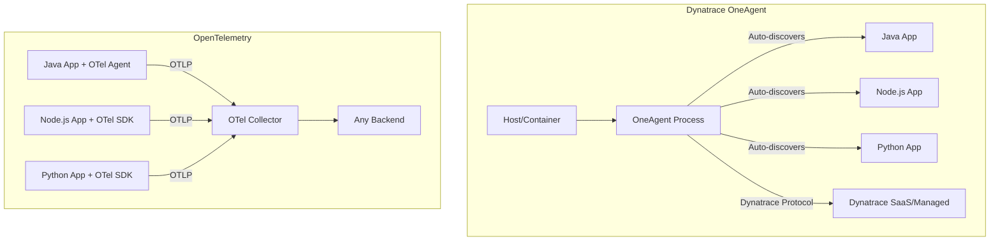

# How to Migrate from Dynatrace OneAgent to OpenTelemetry Instrumentation

Author: [nawazdhandala](https://www.github.com/nawazdhandala)

Tags: OpenTelemetry, Dynatrace, Migration, Observability, OneAgent, Instrumentation

Description: A comprehensive guide to migrating from Dynatrace OneAgent to OpenTelemetry for vendor-independent application observability.

---

Dynatrace OneAgent is one of the most hands-off monitoring agents you can deploy. It installs at the host or container level, automatically discovers processes, instruments them without code changes, and sends everything to the Dynatrace platform. It is genuinely impressive technology. But that magic comes at a price, both literally and in terms of vendor lock-in. When Dynatrace controls your entire instrumentation layer, you have zero portability.

Migrating to OpenTelemetry means trading some of that zero-config convenience for full control over your telemetry pipeline. You will need to be more intentional about what you instrument and how, but you gain the ability to send data to any backend and to customize every part of the pipeline.

## What Makes This Migration Different

Dynatrace OneAgent is fundamentally different from other APM agents. Most APM tools require you to install a language-specific library or attach a javaagent. OneAgent installs at the operating system level and hooks into process execution automatically. There is no SDK import, no startup flag, no configuration file per application.

This means the migration is not a simple library swap. You need to:

1. Add explicit OpenTelemetry instrumentation to each application
2. Deploy an OpenTelemetry Collector to replace OneAgent's data forwarding
3. Remove OneAgent from your hosts or containers



## Step 1: Inventory What OneAgent is Monitoring

OneAgent discovers and monitors everything it can find on a host. Before you remove it, you need to know what "everything" includes. Use the Dynatrace API to pull the list of monitored entities.

This script queries the Dynatrace API to list all process groups and their technologies. It gives you a clear picture of what needs OpenTelemetry instrumentation.

```bash
# Query Dynatrace API for all monitored process groups
# This returns the technology type (Java, Node.js, .NET, etc.) for each process
# You need this list to know which OpenTelemetry SDKs to deploy
curl -s -X GET \
  "https://your-environment.live.dynatrace.com/api/v2/entities?entitySelector=type(PROCESS_GROUP)&fields=properties.softwareTechnologies" \
  -H "Authorization: Api-Token ${DT_API_TOKEN}" \
  -H "Accept: application/json" | python3 -m json.tool
```

Make a spreadsheet with each service, its language/runtime, and whether it needs auto-instrumentation only or also has custom Dynatrace API calls. This becomes your migration tracking sheet.

## Step 2: Deploy the OpenTelemetry Collector

Before changing any application, get the Collector running. This gives you a place to send data as you instrument services one by one.

The following Collector configuration provides a good starting point. It accepts OTLP from applications, collects host metrics (replacing OneAgent's infrastructure monitoring), and exports to your chosen backend.

```yaml
# OpenTelemetry Collector configuration
# This replaces both OneAgent's data forwarding and infrastructure monitoring
receivers:
  # Accept traces, metrics, and logs from instrumented applications
  otlp:
    protocols:
      grpc:
        endpoint: 0.0.0.0:4317
      http:
        endpoint: 0.0.0.0:4318
  # Host metrics replace OneAgent's infrastructure monitoring
  # OneAgent collects CPU, memory, disk, and network by default
  hostmetrics:
    collection_interval: 15s
    scrapers:
      cpu:
        metrics:
          system.cpu.utilization:
            enabled: true
      memory:
        metrics:
          system.memory.utilization:
            enabled: true
      disk: {}
      filesystem: {}
      network: {}
      load: {}
      process:
        include:
          match_type: regexp
          names: [".*"]
        metrics:
          process.cpu.utilization:
            enabled: true

processors:
  # Batch telemetry to reduce network overhead
  batch:
    send_batch_size: 1024
    timeout: 5s
  # Prevent out-of-memory situations
  memory_limiter:
    check_interval: 5s
    limit_mib: 512
    spike_limit_mib: 128
  # Detect resource attributes automatically
  resourcedetection:
    detectors: [env, system, docker]
    timeout: 5s

exporters:
  otlphttp:
    endpoint: "https://otlp.oneuptime.com"
    headers:
      x-oneuptime-token: "${ONEUPTIME_TOKEN}"

service:
  pipelines:
    traces:
      receivers: [otlp]
      processors: [memory_limiter, resourcedetection, batch]
      exporters: [otlphttp]
    metrics:
      receivers: [otlp, hostmetrics]
      processors: [memory_limiter, resourcedetection, batch]
      exporters: [otlphttp]
    logs:
      receivers: [otlp]
      processors: [memory_limiter, batch]
      exporters: [otlphttp]
```

Deploy this as a DaemonSet on Kubernetes or as a systemd service on VMs, matching the deployment pattern of OneAgent.

## Step 3: Instrument Java Applications

Java is typically the biggest component in Dynatrace environments. OneAgent instruments Java automatically through bytecode injection. The OpenTelemetry Java agent does essentially the same thing but requires an explicit javaagent flag.

Here is how to add OpenTelemetry to a Java application that was previously monitored by OneAgent with zero configuration.

```bash
# Download the OpenTelemetry Java agent
# This provides auto-instrumentation for 100+ libraries
curl -L -o opentelemetry-javaagent.jar \
  https://github.com/open-telemetry/opentelemetry-java-instrumentation/releases/latest/download/opentelemetry-javaagent.jar
```

Update your application's startup command or Kubernetes deployment.

```yaml
# Kubernetes deployment with OpenTelemetry Java agent
# Before: OneAgent was injected automatically via init container or host-level install
# After: We explicitly attach the OTel agent and configure it via environment variables
apiVersion: apps/v1
kind: Deployment
metadata:
  name: order-service
spec:
  template:
    spec:
      containers:
        - name: order-service
          image: myregistry/order-service:latest
          env:
            # Java agent configuration via environment variables
            - name: JAVA_TOOL_OPTIONS
              # This tells the JVM to load the OpenTelemetry agent
              value: "-javaagent:/opt/otel/opentelemetry-javaagent.jar"
            - name: OTEL_SERVICE_NAME
              value: "order-service"
            - name: OTEL_EXPORTER_OTLP_ENDPOINT
              # Point to the Collector running as a DaemonSet
              value: "http://otel-collector:4317"
            - name: OTEL_RESOURCE_ATTRIBUTES
              value: "deployment.environment=production,service.version=3.2.1"
          volumeMounts:
            - name: otel-agent
              mountPath: /opt/otel
      # Use an init container to download the agent
      initContainers:
        - name: otel-agent-init
          image: busybox
          command: ['wget', '-O', '/opt/otel/opentelemetry-javaagent.jar',
            'https://github.com/open-telemetry/opentelemetry-java-instrumentation/releases/latest/download/opentelemetry-javaagent.jar']
          volumeMounts:
            - name: otel-agent
              mountPath: /opt/otel
      volumes:
        - name: otel-agent
          emptyDir: {}
```

Alternatively, if you are using the OpenTelemetry Operator for Kubernetes, you can use auto-instrumentation injection which is closer to the OneAgent experience:

```yaml
# OpenTelemetry Operator auto-instrumentation
# This is the closest equivalent to OneAgent's automatic discovery
# The operator injects the OTel agent into annotated pods
apiVersion: opentelemetry.io/v1alpha1
kind: Instrumentation
metadata:
  name: java-instrumentation
spec:
  exporter:
    endpoint: http://otel-collector:4317
  propagators:
    - tracecontext
    - baggage
  java:
    image: ghcr.io/open-telemetry/opentelemetry-operator/autoinstrumentation-java:latest
---
# Annotate your deployment to opt in to auto-instrumentation
# The operator handles agent injection automatically
apiVersion: apps/v1
kind: Deployment
metadata:
  name: order-service
spec:
  template:
    metadata:
      annotations:
        # This annotation tells the OTel Operator to inject the Java agent
        instrumentation.opentelemetry.io/inject-java: "java-instrumentation"
```

## Step 4: Instrument Node.js and Python Applications

For Node.js and Python services, OneAgent injects instrumentation at the process level. With OpenTelemetry, you need to add the SDK to each application.

Node.js setup requires creating a tracing initialization file.

```javascript
// tracing.js - OpenTelemetry initialization for Node.js
// This replaces OneAgent's automatic Node.js instrumentation
// Load this before your application code with: node --require ./tracing.js app.js
const { NodeSDK } = require('@opentelemetry/sdk-node');
const { getNodeAutoInstrumentations } = require('@opentelemetry/auto-instrumentations-node');
const { OTLPTraceExporter } = require('@opentelemetry/exporter-trace-otlp-grpc');
const { OTLPMetricExporter } = require('@opentelemetry/exporter-metrics-otlp-grpc');
const { PeriodicExportingMetricReader } = require('@opentelemetry/sdk-metrics');

const sdk = new NodeSDK({
  serviceName: process.env.OTEL_SERVICE_NAME || 'my-node-service',
  traceExporter: new OTLPTraceExporter({
    url: process.env.OTEL_EXPORTER_OTLP_ENDPOINT || 'http://localhost:4317',
  }),
  metricReader: new PeriodicExportingMetricReader({
    exporter: new OTLPMetricExporter({
      url: process.env.OTEL_EXPORTER_OTLP_ENDPOINT || 'http://localhost:4317',
    }),
  }),
  // Auto-instruments Express, HTTP, gRPC, database clients, and more
  instrumentations: [getNodeAutoInstrumentations()],
});

sdk.start();

// Flush pending telemetry on shutdown
process.on('SIGTERM', () => {
  sdk.shutdown().then(() => process.exit(0));
});
```

For Python, the zero-code approach is quickest:

```bash
# Install OpenTelemetry auto-instrumentation for Python
# This detects and instruments Flask, Django, requests, SQLAlchemy, etc.
pip install opentelemetry-distro opentelemetry-exporter-otlp
opentelemetry-bootstrap -a install

# Run with auto-instrumentation enabled
# This is the closest equivalent to OneAgent's automatic Python instrumentation
OTEL_SERVICE_NAME=user-service \
OTEL_EXPORTER_OTLP_ENDPOINT=http://otel-collector:4317 \
OTEL_RESOURCE_ATTRIBUTES=deployment.environment=production \
opentelemetry-instrument python app.py
```

## Step 5: Migrate Custom Dynatrace API Calls

If your code uses the Dynatrace OneAgent SDK for custom tracing, you need to convert those calls to the OpenTelemetry API.

```java
// Before: Dynatrace OneAgent SDK custom tracing
// import com.dynatrace.oneagent.sdk.api.OneAgentSDK;
// import com.dynatrace.oneagent.sdk.api.InProcessLink;
//
// OneAgentSDK oneAgentSdk = OneAgentSDKFactory.createInstance();
// DatabaseInfo dbInfo = oneAgentSdk.createDatabaseInfo("mydb",
//     DatabaseVendor.POSTGRESQL, ChannelType.TCP_IP, "db-host:5432");
// DatabaseRequestTracer tracer = oneAgentSdk.traceSQLDatabaseRequest(
//     dbInfo, "SELECT * FROM orders WHERE id = ?");
// tracer.start();
// try {
//     // execute query
//     tracer.setRowsReturned(resultCount);
// } catch (Exception e) {
//     tracer.error(e);
// } finally {
//     tracer.end();
// }

// After: OpenTelemetry API custom tracing
// The concepts map directly: tracers create spans, attributes carry metadata
import io.opentelemetry.api.GlobalOpenTelemetry;
import io.opentelemetry.api.trace.Span;
import io.opentelemetry.api.trace.Tracer;
import io.opentelemetry.api.trace.SpanKind;
import io.opentelemetry.api.trace.StatusCode;
import io.opentelemetry.semconv.SemanticAttributes;

Tracer tracer = GlobalOpenTelemetry.getTracer("order-repository", "1.0.0");

// Create a span with database semantic conventions
// SpanKind.CLIENT indicates this is an outbound call to a database
Span span = tracer.spanBuilder("SELECT orders")
    .setSpanKind(SpanKind.CLIENT)
    .setAttribute(SemanticAttributes.DB_SYSTEM, "postgresql")
    .setAttribute(SemanticAttributes.DB_NAME, "mydb")
    .setAttribute(SemanticAttributes.DB_STATEMENT, "SELECT * FROM orders WHERE id = ?")
    .setAttribute(SemanticAttributes.SERVER_ADDRESS, "db-host")
    .setAttribute(SemanticAttributes.SERVER_PORT, 5432L)
    .startSpan();
try {
    // execute query
    span.setAttribute("db.rows_returned", resultCount);
} catch (Exception e) {
    span.recordException(e);
    span.setStatus(StatusCode.ERROR, e.getMessage());
} finally {
    span.end();
}
```

## Step 6: Remove OneAgent

Once all services are instrumented with OpenTelemetry and you have validated data in your new backend, remove OneAgent.

```bash
# Remove OneAgent from a Linux host
# OneAgent installs to /opt/dynatrace/oneagent by default
sudo /opt/dynatrace/oneagent/agent/uninstall.sh

# For Kubernetes, remove the OneAgent DaemonSet or operator
kubectl delete -n dynatrace daemonset oneagent
# Or if using the Dynatrace operator
kubectl delete dynakube --all -n dynatrace
kubectl delete namespace dynatrace
```

## Feature Mapping Reference

| Dynatrace Feature | OpenTelemetry Equivalent |
|---|---|
| Smartscape topology | Service maps built from trace data |
| PurePaths | Distributed traces |
| Real User Monitoring | OpenTelemetry Browser SDK |
| Session Replay | Not available in OTel (use dedicated tools) |
| Custom services | Manual span instrumentation |
| Request attributes | Span attributes |
| Process monitoring | hostmetrics receiver + process scraper |
| Log monitoring | filelog receiver or OTel log SDK |
| Synthetic monitoring | Not part of OTel (use dedicated tools) |

## Conclusion

Migrating from Dynatrace OneAgent to OpenTelemetry requires more effort than migrating from other APM agents because OneAgent's zero-config approach means you have never had to think about instrumentation before. But the payoff is significant: you gain full visibility into and control over your telemetry pipeline, you eliminate vendor lock-in, and you adopt an industry standard that will serve you for years. Start with the Collector and host metrics, then instrument services one by one, validate in your new backend, and remove OneAgent when you are confident everything is covered.
