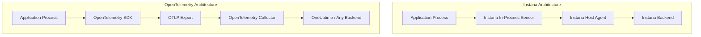

# How to Migrate from Instana to OpenTelemetry

Author: [nawazdhandala](https://www.github.com/nawazdhandala)

Tags: OpenTelemetry, Instana, Migration, Observability, APM, Tracing, Metrics, Java, Node.js, Python

Description: A comprehensive guide to migrating from IBM Instana to OpenTelemetry, with step-by-step instructions for removing Instana agents and replacing them with OpenTelemetry SDKs.

---

> Instana made a name for itself with automatic discovery and zero-configuration monitoring. But after its acquisition by IBM, many teams have found that pricing, roadmap uncertainty, and vendor lock-in make it worth exploring alternatives. OpenTelemetry offers a vendor-neutral path forward that gives you the same depth of instrumentation with far more flexibility.

This guide walks through a complete migration from Instana to OpenTelemetry. We will cover agent removal, SDK installation, concept mapping, and the practical details that make the difference between a smooth migration and a painful one.

---

## Instana vs OpenTelemetry: Key Differences

Instana's approach is heavily agent-based. You install a host agent that auto-discovers processes, injects instrumentation, and manages configuration centrally. OpenTelemetry takes a different approach where instrumentation lives in your application (via SDKs or auto-instrumentation) and a separate Collector handles routing and processing.

| Instana Concept | OpenTelemetry Equivalent |
|---|---|
| Host Agent | OpenTelemetry Collector |
| Sensor (auto-discovery) | Instrumentation library |
| Call / Span | Span |
| Trace | Trace |
| Service | Service (resource attribute) |
| Website Monitoring | Browser instrumentation |
| Custom Event | Span event |
| Custom Metric | Meter instrument |
| Smart Alert | Backend alerting rules |

---

## Migration Architecture

Here is how the architecture changes from Instana to OpenTelemetry:



The main structural difference is that Instana uses a host-level agent that discovers and instruments processes automatically, while OpenTelemetry uses per-application SDKs that you configure explicitly.

---

## Step 1: Remove the Instana Host Agent

The Instana host agent runs as a system service and needs to be stopped and removed from each host:

```bash
# Stop the Instana agent service
sudo systemctl stop instana-agent
sudo systemctl disable instana-agent

# Remove the Instana agent package
# On Debian/Ubuntu systems
sudo apt-get remove instana-agent

# On RHEL/CentOS systems
sudo yum remove instana-agent

# On systems using the static agent install
sudo rm -rf /opt/instana/agent
```

If you are running in Kubernetes, remove the Instana agent DaemonSet:

```bash
# Remove the Instana agent DaemonSet from Kubernetes
kubectl delete daemonset instana-agent -n instana-agent

# Remove the namespace if it was dedicated to Instana
kubectl delete namespace instana-agent

# Remove the Instana Helm release if installed via Helm
helm uninstall instana-agent -n instana-agent
```

---

## Step 2: Install OpenTelemetry for Java Applications

Instana's Java sensor uses bytecode instrumentation that loads automatically when the host agent detects a JVM. With OpenTelemetry, you attach the Java agent explicitly:

```bash
# Download the OpenTelemetry Java agent JAR
# This provides automatic instrumentation for 100+ Java libraries
curl -L -o opentelemetry-javaagent.jar \
  https://github.com/open-telemetry/opentelemetry-java-instrumentation/releases/latest/download/opentelemetry-javaagent.jar
```

Update your Java application startup to use the OpenTelemetry agent instead of relying on Instana's auto-discovery:

```bash
# Run the application with OpenTelemetry Java agent
# Unlike Instana, you configure the agent via system properties or env vars
java -javaagent:opentelemetry-javaagent.jar \
     -Dotel.service.name=order-service \
     -Dotel.exporter.otlp.endpoint=http://otel-collector:4317 \
     -Dotel.resource.attributes="deployment.environment=production,service.namespace=ecommerce" \
     -jar order-service.jar
```

For Spring Boot applications, you can also configure via environment variables in your Dockerfile. This is cleaner for containerized deployments:

```dockerfile
# Dockerfile for a Spring Boot app with OpenTelemetry
FROM eclipse-temurin:21-jre

# Copy the OpenTelemetry agent into the image
COPY opentelemetry-javaagent.jar /opt/otel/javaagent.jar

# Copy your application JAR
COPY target/order-service.jar /app/order-service.jar

# Configure OpenTelemetry via environment variables
# These replace the Instana agent configuration that was in
# /opt/instana/agent/etc/instana/configuration.yaml
ENV JAVA_TOOL_OPTIONS="-javaagent:/opt/otel/javaagent.jar"
ENV OTEL_SERVICE_NAME="order-service"
ENV OTEL_EXPORTER_OTLP_ENDPOINT="http://otel-collector:4317"
ENV OTEL_RESOURCE_ATTRIBUTES="deployment.environment=production"

ENTRYPOINT ["java", "-jar", "/app/order-service.jar"]
```

---

## Step 3: Install OpenTelemetry for Node.js Applications

Instana auto-discovers Node.js processes and injects its sensor. With OpenTelemetry, you add the SDK as a dependency and initialize it before your application code:

```bash
# Install OpenTelemetry packages for Node.js
npm install @opentelemetry/api \
            @opentelemetry/sdk-node \
            @opentelemetry/auto-instrumentations-node \
            @opentelemetry/exporter-trace-otlp-grpc \
            @opentelemetry/exporter-metrics-otlp-grpc
```

Create a tracing initialization file that runs before your application. This replaces Instana's automatic sensor injection:

```javascript
// tracing.js
// This file must be loaded before any other application code
// It replaces the Instana sensor that was auto-injected by the host agent

const { NodeSDK } = require('@opentelemetry/sdk-node');
const { getNodeAutoInstrumentations } = require('@opentelemetry/auto-instrumentations-node');
const { OTLPTraceExporter } = require('@opentelemetry/exporter-trace-otlp-grpc');
const { OTLPMetricExporter } = require('@opentelemetry/exporter-metrics-otlp-grpc');
const { PeriodicExportingMetricReader } = require('@opentelemetry/sdk-metrics');
const { Resource } = require('@opentelemetry/resources');
const { ATTR_SERVICE_NAME, ATTR_SERVICE_VERSION } = require('@opentelemetry/semantic-conventions');

// Configure the SDK with resource attributes
// service.name replaces the Instana service name that was auto-detected
const sdk = new NodeSDK({
  resource: new Resource({
    [ATTR_SERVICE_NAME]: 'payment-service',
    [ATTR_SERVICE_VERSION]: '2.1.0',
    'deployment.environment': process.env.NODE_ENV || 'development',
  }),

  // OTLP trace exporter sends spans to the collector
  traceExporter: new OTLPTraceExporter({
    url: process.env.OTEL_EXPORTER_OTLP_ENDPOINT || 'http://otel-collector:4317',
  }),

  // Metric reader collects and exports metrics periodically
  metricReader: new PeriodicExportingMetricReader({
    exporter: new OTLPMetricExporter({
      url: process.env.OTEL_EXPORTER_OTLP_ENDPOINT || 'http://otel-collector:4317',
    }),
    exportIntervalMillis: 30000,  // export every 30 seconds
  }),

  // Auto-instrumentation covers Express, HTTP, pg, mysql, redis, etc.
  // This replaces Instana's built-in sensors for Node.js libraries
  instrumentations: [
    getNodeAutoInstrumentations({
      // Disable fs instrumentation to reduce noise
      '@opentelemetry/instrumentation-fs': { enabled: false },
    }),
  ],
});

// Start the SDK before the application loads
sdk.start();

// Graceful shutdown to flush remaining telemetry
process.on('SIGTERM', () => {
  sdk.shutdown()
    .then(() => process.exit(0))
    .catch((err) => {
      console.error('Error shutting down OpenTelemetry SDK', err);
      process.exit(1);
    });
});
```

Update your application startup to load the tracing file first:

```bash
# BEFORE: Instana auto-detected Node.js and injected its sensor
# node app.js

# AFTER: Require the tracing setup before your application code
node --require ./tracing.js app.js
```

---

## Step 4: Install OpenTelemetry for Python Applications

Instana provides a Python package that patches libraries at import time. OpenTelemetry takes a similar approach with its auto-instrumentation:

```bash
# Remove the Instana Python package
pip uninstall instana

# Install OpenTelemetry packages
pip install opentelemetry-api \
            opentelemetry-sdk \
            opentelemetry-exporter-otlp \
            opentelemetry-distro \
            opentelemetry-instrumentation

# Auto-detect and install instrumentations for installed libraries
# This replaces Instana's automatic sensor detection
opentelemetry-bootstrap -a install
```

Remove the Instana import from your application code and run with OpenTelemetry auto-instrumentation:

```python
# REMOVE this line from your application
# import instana

# No code changes needed. Just run with the OpenTelemetry wrapper:
```

```bash
# Configure and run with OpenTelemetry
export OTEL_SERVICE_NAME="user-service"
export OTEL_EXPORTER_OTLP_ENDPOINT="http://otel-collector:4317"
export OTEL_RESOURCE_ATTRIBUTES="deployment.environment=production"

# The opentelemetry-instrument command replaces Instana's auto-patching
opentelemetry-instrument python app.py
```

---

## Step 5: Deploy the OpenTelemetry Collector

The OpenTelemetry Collector replaces both the Instana host agent (for infrastructure metrics) and serves as the central telemetry pipeline:

```yaml
# otel-collector-config.yaml
# This configuration replaces the Instana host agent

receivers:
  # Accept OTLP from application SDKs
  otlp:
    protocols:
      grpc:
        endpoint: 0.0.0.0:4317
      http:
        endpoint: 0.0.0.0:4318

  # Host metrics replace Instana infrastructure monitoring
  hostmetrics:
    collection_interval: 30s
    scrapers:
      cpu: {}
      memory: {}
      disk: {}
      network: {}
      filesystem: {}
      load: {}

processors:
  # Batch telemetry for efficient export
  batch:
    timeout: 10s
    send_batch_size: 1024

  # Memory limiter prevents the collector from using too much RAM
  memory_limiter:
    check_interval: 5s
    limit_mib: 512
    spike_limit_mib: 128

exporters:
  # Send all telemetry to your backend via OTLP
  otlp:
    endpoint: https://oneuptime.com/otlp
    headers:
      x-oneuptime-token: your-token-here

service:
  pipelines:
    traces:
      receivers: [otlp]
      processors: [memory_limiter, batch]
      exporters: [otlp]
    metrics:
      receivers: [otlp, hostmetrics]
      processors: [memory_limiter, batch]
      exporters: [otlp]
    logs:
      receivers: [otlp]
      processors: [memory_limiter, batch]
      exporters: [otlp]
```

Deploy the Collector as a DaemonSet in Kubernetes to replace the Instana agent DaemonSet:

```yaml
# otel-collector-daemonset.yaml
apiVersion: apps/v1
kind: DaemonSet
metadata:
  name: otel-collector
  namespace: observability
spec:
  selector:
    matchLabels:
      app: otel-collector
  template:
    metadata:
      labels:
        app: otel-collector
    spec:
      containers:
        - name: collector
          image: otel/opentelemetry-collector-contrib:latest
          args: ["--config=/etc/otel/config.yaml"]
          ports:
            - containerPort: 4317   # gRPC OTLP receiver
            - containerPort: 4318   # HTTP OTLP receiver
          volumeMounts:
            - name: config
              mountPath: /etc/otel
      volumes:
        - name: config
          configMap:
            name: otel-collector-config
```

---

## Step 6: Migrate Custom Instrumentation

If you used Instana's SDK for custom spans or metrics, convert them to OpenTelemetry API calls. Here is a Python example:

```python
# BEFORE: Instana custom span
# import instana
# from instana.span.span import InstanaSpan
# with tracer.start_active_span('process-payment') as scope:
#     scope.span.set_tag('payment.amount', amount)
#     process(amount)

# AFTER: OpenTelemetry custom span
from opentelemetry import trace

# Get a tracer instance for your component
tracer = trace.get_tracer("myapp.payments")

def process_payment(order_id, amount):
    # Create a span for the payment processing operation
    with tracer.start_as_current_span("process-payment") as span:
        # Set attributes (replaces Instana's set_tag)
        span.set_attribute("payment.amount", amount)
        span.set_attribute("order.id", order_id)

        try:
            result = charge_card(amount)
            span.set_attribute("payment.success", True)
            return result
        except Exception as e:
            # Record exception details on the span
            span.record_exception(e)
            span.set_status(trace.Status(trace.StatusCode.ERROR, str(e)))
            raise
```

---

## Handling Instana-Specific Features

**Automatic Service Map**: Instana automatically builds a service dependency map. With OpenTelemetry, your backend builds this from trace data. As long as context propagation works correctly (which it does out of the box with auto-instrumentation), the service map will populate automatically.

**Unbounded Analytics**: Instana stores all traces by default. With OpenTelemetry, you control sampling. For production, consider using tail-based sampling in the Collector to capture all error traces while sampling a percentage of successful ones.

**Website Monitoring**: If you used Instana's browser monitoring, look at the OpenTelemetry Browser SDK (@opentelemetry/sdk-trace-web) as a replacement. It provides similar real user monitoring capabilities.

---

## Verification Steps

After completing the migration for each service:

1. Verify that traces appear in your backend with correct service names
2. Check that distributed traces connect across service boundaries
3. Confirm that database queries, HTTP calls, and messaging operations are captured
4. Validate that custom metrics are flowing
5. Test error scenarios to ensure exceptions are recorded properly
6. Compare trace latency data with historical Instana data as a sanity check

---

## Conclusion

Migrating from Instana to OpenTelemetry trades some of Instana's zero-config convenience for vendor independence and community-backed standards. The initial setup requires more explicit configuration, but once in place, you have complete control over your observability pipeline. You can switch backends without touching application code, add custom processing in the Collector, and benefit from the rapidly growing OpenTelemetry ecosystem.

Take it one service at a time, validate as you go, and you will have a fully migrated stack in a matter of weeks rather than months.

---

*Need an OpenTelemetry-native backend? [OneUptime](https://oneuptime.com) accepts OTLP data natively and provides traces, metrics, logs, dashboards, and alerting out of the box. Start your free trial today.*
