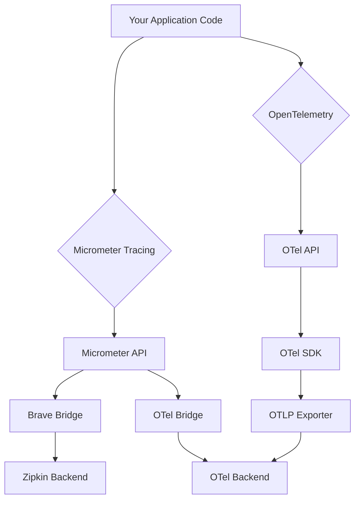

# How to Migrate from Micrometer Tracing to OpenTelemetry in Spring Boot

Author: [nawazdhandala](https://www.github.com/nawazdhandala)

Tags: OpenTelemetry, Micrometer, Spring Boot, Migration, Tracing

Description: A step-by-step guide to migrating Spring Boot applications from Micrometer Tracing to native OpenTelemetry instrumentation for better observability and vendor neutrality.

Many Spring Boot applications use Micrometer Tracing (formerly Spring Cloud Sleuth) for distributed tracing. While Micrometer provides a solid abstraction layer, migrating to native OpenTelemetry offers several advantages: direct access to OpenTelemetry's rich ecosystem, better performance, more features like metrics and logs correlation, and alignment with the industry-standard observability framework.

## Understanding the Differences

Before migrating, understand how Micrometer Tracing differs from OpenTelemetry:



**Micrometer Tracing** provides an abstraction over tracing libraries. It supports multiple backends through bridges but adds an extra layer of indirection.

**OpenTelemetry** is a complete observability framework with native support for traces, metrics, and logs. It's vendor-neutral and provides richer semantic conventions.

## Migration Strategy Overview

The migration follows these phases:

1. **Assessment**: Identify current Micrometer usage and dependencies
2. **Preparation**: Add OpenTelemetry dependencies alongside Micrometer
3. **Instrumentation**: Replace Micrometer code with OpenTelemetry equivalents
4. **Testing**: Verify traces appear correctly in your backend
5. **Cleanup**: Remove Micrometer dependencies

## Phase 1: Assessing Current Implementation

First, identify all Micrometer Tracing dependencies and usage patterns in your application.

```bash
# Find Micrometer dependencies in Maven
mvn dependency:tree | grep micrometer

# Find Micrometer dependencies in Gradle
./gradlew dependencies | grep micrometer
```

Look for these common dependencies:

```xml
<!-- Micrometer Tracing dependencies (to be replaced) -->
<dependency>
    <groupId>io.micrometer</groupId>
    <artifactId>micrometer-tracing-bridge-brave</artifactId>
</dependency>
<dependency>
    <groupId>io.micrometer</groupId>
    <artifactId>micrometer-tracing-bridge-otel</artifactId>
</dependency>
<dependency>
    <groupId>io.zipkin.reporter2</groupId>
    <artifactId>zipkin-reporter-brave</artifactId>
</dependency>
```

Search for Micrometer API usage in your code:

```bash
# Find Micrometer Tracing API usage
grep -r "io.micrometer.tracing" src/
grep -r "import io.micrometer.tracing.Tracer" src/
grep -r "import io.micrometer.tracing.Span" src/
```

## Phase 2: Adding OpenTelemetry Dependencies

Add OpenTelemetry dependencies while keeping Micrometer temporarily (for gradual migration):

```xml
<!-- pom.xml -->
<dependencies>
    <!-- Keep Micrometer temporarily for comparison -->
    <dependency>
        <groupId>io.micrometer</groupId>
        <artifactId>micrometer-tracing-bridge-otel</artifactId>
        <version>1.2.0</version>
    </dependency>

    <!-- Add OpenTelemetry Spring Boot Starter -->
    <dependency>
        <groupId>io.opentelemetry.instrumentation</groupId>
        <artifactId>opentelemetry-spring-boot-starter</artifactId>
        <version>2.1.0-alpha</version>
    </dependency>

    <!-- OTLP Exporter -->
    <dependency>
        <groupId>io.opentelemetry</groupId>
        <artifactId>opentelemetry-exporter-otlp</artifactId>
    </dependency>

    <!-- OpenTelemetry API for manual instrumentation -->
    <dependency>
        <groupId>io.opentelemetry</groupId>
        <artifactId>opentelemetry-api</artifactId>
    </dependency>

    <!-- OpenTelemetry SDK extensions -->
    <dependency>
        <groupId>io.opentelemetry</groupId>
        <artifactId>opentelemetry-sdk-extension-autoconfigure</artifactId>
    </dependency>
</dependencies>
```

For Gradle:

```groovy
dependencies {
    // Keep Micrometer temporarily
    implementation 'io.micrometer:micrometer-tracing-bridge-otel:1.2.0'

    // Add OpenTelemetry
    implementation 'io.opentelemetry.instrumentation:opentelemetry-spring-boot-starter:2.1.0-alpha'
    implementation 'io.opentelemetry:opentelemetry-exporter-otlp'
    implementation 'io.opentelemetry:opentelemetry-api'
    implementation 'io.opentelemetry:opentelemetry-sdk-extension-autoconfigure'
}
```

## Phase 3: Configuration Migration

Migrate configuration from Micrometer to OpenTelemetry format.

**Before (Micrometer Tracing with Zipkin):**

```yaml
# application.yml (Micrometer configuration)
spring:
  application:
    name: payment-service

  zipkin:
    base-url: http://zipkin:9411
    sender:
      type: web

management:
  tracing:
    enabled: true
    sampling:
      probability: 0.1
  zipkin:
    tracing:
      endpoint: http://zipkin:9411/api/v2/spans
```

**After (OpenTelemetry):**

```yaml
# application.yml (OpenTelemetry configuration)
spring:
  application:
    name: payment-service

otel:
  service:
    name: ${spring.application.name}
    version: 1.0.0

  resource:
    attributes:
      deployment.environment: production
      service.namespace: payments

  exporter:
    otlp:
      endpoint: http://otel-collector:4318
      protocol: http/protobuf

  traces:
    exporter: otlp
    sampler:
      probability: 0.1

  metrics:
    exporter: otlp

  logs:
    exporter: otlp
```

## Phase 4: Code Migration

Replace Micrometer Tracing API calls with OpenTelemetry equivalents.

**Before (Micrometer Tracing):**

```java
package com.example.payment;

import io.micrometer.tracing.Tracer;
import io.micrometer.tracing.Span;
import org.springframework.stereotype.Service;
import org.springframework.beans.factory.annotation.Autowired;

/**
 * Payment service using Micrometer Tracing API.
 * This code needs to be migrated to OpenTelemetry.
 */
@Service
public class PaymentService {

    @Autowired
    private Tracer tracer;

    public void processPayment(String paymentId, BigDecimal amount) {
        // Create a span using Micrometer API
        Span span = tracer.nextSpan().name("payment.process");

        try (Tracer.SpanInScope ws = tracer.withSpan(span.start())) {
            // Add tags to span
            span.tag("payment.id", paymentId);
            span.tag("payment.amount", amount.toString());

            // Business logic
            validatePayment(paymentId, amount);
            chargeCustomer(paymentId, amount);
            recordTransaction(paymentId);

            // Add event to span
            span.event("payment.completed");

        } catch (Exception e) {
            // Record error
            span.error(e);
            throw e;
        } finally {
            span.end();
        }
    }

    private void validatePayment(String paymentId, BigDecimal amount) {
        Span span = tracer.nextSpan().name("payment.validate");
        try (Tracer.SpanInScope ws = tracer.withSpan(span.start())) {
            // Validation logic
            if (amount.compareTo(BigDecimal.ZERO) <= 0) {
                throw new IllegalArgumentException("Invalid amount");
            }
        } finally {
            span.end();
        }
    }
}
```

**After (OpenTelemetry):**

```java
package com.example.payment;

import io.opentelemetry.api.trace.Tracer;
import io.opentelemetry.api.trace.Span;
import io.opentelemetry.api.trace.StatusCode;
import io.opentelemetry.context.Scope;
import org.springframework.stereotype.Service;
import org.springframework.beans.factory.annotation.Autowired;

/**
 * Payment service using OpenTelemetry API.
 * Provides the same functionality with native OTel instrumentation.
 */
@Service
public class PaymentService {

    @Autowired
    private Tracer tracer;

    public void processPayment(String paymentId, BigDecimal amount) {
        // Create a span using OpenTelemetry API
        Span span = tracer.spanBuilder("payment.process")
            .startSpan();

        // Make span active in the current context
        try (Scope scope = span.makeCurrent()) {
            // Add attributes to span (equivalent to tags)
            span.setAttribute("payment.id", paymentId);
            span.setAttribute("payment.amount", amount.toString());

            // Business logic
            validatePayment(paymentId, amount);
            chargeCustomer(paymentId, amount);
            recordTransaction(paymentId);

            // Add event to span
            span.addEvent("payment.completed");

            // Mark span as successful
            span.setStatus(StatusCode.OK);

        } catch (Exception e) {
            // Record exception and mark as error
            span.recordException(e);
            span.setStatus(StatusCode.ERROR, e.getMessage());
            throw e;
        } finally {
            span.end();
        }
    }

    private void validatePayment(String paymentId, BigDecimal amount) {
        Span span = tracer.spanBuilder("payment.validate")
            .startSpan();

        try (Scope scope = span.makeCurrent()) {
            // Validation logic
            if (amount.compareTo(BigDecimal.ZERO) <= 0) {
                throw new IllegalArgumentException("Invalid amount");
            }
            span.setStatus(StatusCode.OK);
        } catch (Exception e) {
            span.recordException(e);
            span.setStatus(StatusCode.ERROR, e.getMessage());
            throw e;
        } finally {
            span.end();
        }
    }
}
```

## API Mapping Reference

Here's a comprehensive mapping between Micrometer and OpenTelemetry APIs:

```java
// Micrometer vs OpenTelemetry API comparison

// ============ Creating Spans ============

// Micrometer
Span span = tracer.nextSpan().name("operation");
Tracer.SpanInScope ws = tracer.withSpan(span.start());

// OpenTelemetry
Span span = tracer.spanBuilder("operation").startSpan();
Scope scope = span.makeCurrent();

// ============ Adding Attributes/Tags ============

// Micrometer
span.tag("key", "value");
span.tag("count", "123");

// OpenTelemetry
span.setAttribute("key", "value");
span.setAttribute("count", 123L);  // Type-safe

// ============ Adding Events ============

// Micrometer
span.event("event.name");

// OpenTelemetry
span.addEvent("event.name");
// Or with attributes
span.addEvent("event.name",
    Attributes.of(
        AttributeKey.stringKey("detail"), "value"
    ));

// ============ Recording Errors ============

// Micrometer
span.error(exception);

// OpenTelemetry
span.recordException(exception);
span.setStatus(StatusCode.ERROR, exception.getMessage());

// ============ Ending Spans ============

// Micrometer
try {
    // work
} finally {
    span.end();
    ws.close();
}

// OpenTelemetry
try (Scope scope = span.makeCurrent()) {
    // work
} finally {
    span.end();
}

// ============ Getting Current Span ============

// Micrometer
Span currentSpan = tracer.currentSpan();

// OpenTelemetry
Span currentSpan = Span.current();

// ============ Creating Child Spans ============

// Micrometer (automatic when span is in scope)
Span childSpan = tracer.nextSpan().name("child");

// OpenTelemetry (automatic when span is current)
Span childSpan = tracer.spanBuilder("child").startSpan();
```

## Migrating Baggage

Micrometer's baggage concept maps to OpenTelemetry's baggage API:

**Before (Micrometer):**

```java
import io.micrometer.tracing.BaggageManager;

// Set baggage
BaggageManager baggageManager = tracer.getBaggageManager();
baggageManager.createBaggage("user.id").set("12345");

// Get baggage
String userId = baggageManager.getBaggage("user.id").get();
```

**After (OpenTelemetry):**

```java
import io.opentelemetry.api.baggage.Baggage;
import io.opentelemetry.context.Context;

// Set baggage
Baggage baggage = Baggage.current()
    .toBuilder()
    .put("user.id", "12345")
    .build();

// Make baggage current
try (Scope scope = baggage.makeCurrent()) {
    // Baggage propagates automatically
}

// Get baggage
String userId = Baggage.current()
    .getEntryValue("user.id");
```

## Migrating Span Context Injection

Update context propagation for outbound requests:

**Before (Micrometer):**

```java
import io.micrometer.tracing.propagation.Propagator;

@Autowired
private Propagator propagator;

public void makeHttpRequest() {
    HttpHeaders headers = new HttpHeaders();
    propagator.inject(tracer.currentSpan().context(), headers,
        (carrier, key, value) -> carrier.add(key, value));

    // Make request with headers
}
```

**After (OpenTelemetry):**

```java
import io.opentelemetry.context.propagation.TextMapSetter;
import io.opentelemetry.context.Context;

@Autowired
private OpenTelemetry openTelemetry;

public void makeHttpRequest() {
    HttpHeaders headers = new HttpHeaders();

    openTelemetry.getPropagators()
        .getTextMapPropagator()
        .inject(Context.current(), headers,
            (carrier, key, value) -> carrier.add(key, value));

    // Make request with headers
}
```

## Testing the Migration

Create tests to verify both implementations produce equivalent traces:

```java
package com.example.payment;

import io.opentelemetry.api.trace.Span;
import io.opentelemetry.api.trace.Tracer;
import io.opentelemetry.sdk.testing.junit5.OpenTelemetryExtension;
import io.opentelemetry.sdk.trace.data.SpanData;
import org.junit.jupiter.api.Test;
import org.junit.jupiter.api.extension.RegisterExtension;
import org.springframework.beans.factory.annotation.Autowired;
import org.springframework.boot.test.context.SpringBootTest;

import java.util.List;

import static org.assertj.core.api.Assertions.assertThat;

/**
 * Test OpenTelemetry instrumentation after migration.
 * Verifies that spans are created correctly.
 */
@SpringBootTest
class PaymentServiceTest {

    @RegisterExtension
    static final OpenTelemetryExtension otelTesting = OpenTelemetryExtension.create();

    @Autowired
    private PaymentService paymentService;

    @Autowired
    private Tracer tracer;

    @Test
    void testPaymentProcessingCreatesSpans() {
        // Execute operation
        paymentService.processPayment("pay_123", new BigDecimal("99.99"));

        // Get collected spans
        List<SpanData> spans = otelTesting.getSpans();

        // Verify main span
        assertThat(spans)
            .hasSize(3)  // payment.process, payment.validate, payment.charge
            .anySatisfy(span -> {
                assertThat(span.getName()).isEqualTo("payment.process");
                assertThat(span.getAttributes().get(
                    AttributeKey.stringKey("payment.id")))
                    .isEqualTo("pay_123");
            });

        // Verify child span
        assertThat(spans)
            .anySatisfy(span -> {
                assertThat(span.getName()).isEqualTo("payment.validate");
            });
    }
}
```

## Side-by-Side Comparison

During migration, run both implementations in parallel to verify parity:

```java
package com.example.payment.config;

import org.springframework.context.annotation.Configuration;
import org.springframework.context.annotation.Profile;

/**
 * Temporarily enable both Micrometer and OpenTelemetry
 * to compare trace output during migration.
 */
@Configuration
@Profile("migration")
public class DualTracingConfig {

    // Both tracers will be available
    // Micrometer via its auto-configuration
    // OpenTelemetry via its starter

    // Compare traces in your backend to verify
    // the OpenTelemetry implementation matches
}
```

## Handling Custom Micrometer Extensions

If you have custom Micrometer instrumentation, migrate it to OpenTelemetry:

**Before (Custom Micrometer Instrumentation):**

```java
import io.micrometer.tracing.Tracer;
import io.micrometer.tracing.annotation.NewSpan;
import org.aspectj.lang.ProceedingJoinPoint;
import org.aspectj.lang.annotation.Around;
import org.aspectj.lang.annotation.Aspect;

/**
 * Custom aspect for Micrometer tracing.
 */
@Aspect
public class CustomTracingAspect {

    private final Tracer tracer;

    @Around("@annotation(newSpan)")
    public Object traceMethod(ProceedingJoinPoint pjp, NewSpan newSpan) {
        Span span = tracer.nextSpan().name(newSpan.value());
        try (Tracer.SpanInScope ws = tracer.withSpan(span.start())) {
            return pjp.proceed();
        } finally {
            span.end();
        }
    }
}
```

**After (Custom OpenTelemetry Instrumentation):**

```java
import io.opentelemetry.api.trace.Tracer;
import io.opentelemetry.api.trace.Span;
import io.opentelemetry.api.trace.StatusCode;
import io.opentelemetry.context.Scope;
import io.opentelemetry.instrumentation.annotations.WithSpan;
import org.aspectj.lang.ProceedingJoinPoint;
import org.aspectj.lang.annotation.Around;
import org.aspectj.lang.annotation.Aspect;

/**
 * Custom aspect for OpenTelemetry tracing.
 * Alternatively, use @WithSpan annotation directly.
 */
@Aspect
public class CustomTracingAspect {

    private final Tracer tracer;

    @Around("@annotation(withSpan)")
    public Object traceMethod(ProceedingJoinPoint pjp, WithSpan withSpan) {
        Span span = tracer.spanBuilder(withSpan.value()).startSpan();
        try (Scope scope = span.makeCurrent()) {
            Object result = pjp.proceed();
            span.setStatus(StatusCode.OK);
            return result;
        } catch (Throwable t) {
            span.recordException(t);
            span.setStatus(StatusCode.ERROR, t.getMessage());
            throw t;
        } finally {
            span.end();
        }
    }
}
```

## Phase 5: Cleanup

Once OpenTelemetry is working correctly, remove Micrometer dependencies:

```xml
<!-- Remove these dependencies -->
<dependency>
    <groupId>io.micrometer</groupId>
    <artifactId>micrometer-tracing-bridge-otel</artifactId>
    <!-- DELETE -->
</dependency>
<dependency>
    <groupId>io.micrometer</groupId>
    <artifactId>micrometer-tracing-bridge-brave</artifactId>
    <!-- DELETE -->
</dependency>
<dependency>
    <groupId>io.zipkin.reporter2</groupId>
    <artifactId>zipkin-reporter-brave</artifactId>
    <!-- DELETE -->
</dependency>
```

Remove Micrometer-specific configuration:

```yaml
# Delete Micrometer configuration
management:
  tracing:
    enabled: true  # DELETE
  zipkin:
    tracing:
      endpoint: http://zipkin:9411/api/v2/spans  # DELETE
```

## Common Migration Pitfalls

**Issue 1: Spans not appearing after migration**

Solution: Verify the exporter configuration and ensure OTLP endpoint is reachable:

```yaml
otel:
  exporter:
    otlp:
      endpoint: http://collector:4318  # Verify this is correct
```

**Issue 2: Missing attributes on spans**

Solution: Check attribute types. OpenTelemetry is type-safe:

```java
// Wrong
span.setAttribute("count", "123");  // String

// Correct
span.setAttribute("count", 123L);  // Long
```

**Issue 3: Context not propagating**

Solution: Ensure you're using try-with-resources for Scope:

```java
// Correct pattern
try (Scope scope = span.makeCurrent()) {
    // Context propagates here
}
```

## Performance Comparison

OpenTelemetry typically offers better performance than Micrometer with bridges:

- **Lower overhead**: Direct instrumentation without abstraction layer
- **Better batching**: More efficient span export
- **Reduced allocations**: Optimized for high-throughput scenarios

Monitor these metrics before and after migration to verify improvements.

Migrating from Micrometer Tracing to OpenTelemetry positions your application for the future of observability. While the migration requires careful planning and testing, the benefits of vendor neutrality, richer features, and better performance make it worthwhile for production systems.
