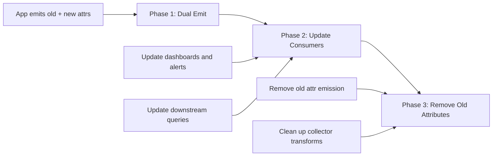

# How to Migrate from Old Semantic Conventions to Stable Versions

Author: [nawazdhandala](https://www.github.com/nawazdhandala)

Tags: OpenTelemetry, Semantic Conventions, Migration, Telemetry, Observability, Best Practices

Description: A practical guide to migrating your OpenTelemetry instrumentation from deprecated semantic conventions to the latest stable versions without breaking dashboards or alerts.

---

OpenTelemetry semantic conventions have gone through significant changes as the project matured. Attribute names that were standard a year ago are now deprecated, replaced by new stable conventions. If you have been running OpenTelemetry in production for any length of time, you probably have instrumentation, dashboards, and alert rules built on the old names. Migrating without breaking everything requires a careful, phased approach.

This guide covers the major convention changes, provides a step-by-step migration plan, and shows how to run old and new conventions in parallel during the transition.

## What Changed and Why

The OpenTelemetry project reorganized its semantic conventions to improve consistency and clarity. The most visible changes involve HTTP, database, and messaging attributes. Here are some of the key renames.

```text
# HTTP attribute renames (old -> new)
http.method          ->  http.request.method
http.url             ->  url.full
http.target          ->  url.path + url.query
http.host            ->  server.address + server.port
http.scheme          ->  url.scheme
http.status_code     ->  http.response.status_code
http.request_content_length  ->  http.request.body.size
http.response_content_length ->  http.response.body.size

# Network attribute renames
net.peer.name        ->  server.address (client) / client.address (server)
net.peer.port        ->  server.port (client) / client.port (server)
net.host.name        ->  server.address
net.host.port        ->  server.port
net.transport        ->  network.transport
net.protocol.name    ->  network.protocol.name
net.protocol.version ->  network.protocol.version

# Database attribute renames
db.statement         ->  db.query.text
db.system            ->  db.system.name
```

The motivation behind these changes is straightforward. The old conventions mixed concerns and used inconsistent naming patterns. The new conventions separate request attributes from response attributes, distinguish client-side from server-side perspectives, and follow a consistent dot-separated hierarchy.

## Assessing Your Current State

Before changing any code, you need to understand the scope of the migration. Audit your instrumentation, dashboards, and alert rules to find every reference to deprecated attributes.

```python
# audit_conventions.py
# Scans Python source files for deprecated semantic convention attribute names.
# Run this against your instrumentation code to find migration targets.

import os
import re

# Map of deprecated attribute names to their replacements
DEPRECATED_ATTRS = {
    "http.method": "http.request.method",
    "http.url": "url.full",
    "http.target": "url.path",
    "http.host": "server.address",
    "http.scheme": "url.scheme",
    "http.status_code": "http.response.status_code",
    "net.peer.name": "server.address / client.address",
    "net.peer.port": "server.port / client.port",
    "net.host.name": "server.address",
    "net.host.port": "server.port",
    "db.statement": "db.query.text",
    "db.system": "db.system.name",
}

def scan_file(filepath: str) -> list:
    """Scan a single file for deprecated attribute usage."""
    findings = []
    with open(filepath, "r") as f:
        for line_num, line in enumerate(f, 1):
            for old_attr, new_attr in DEPRECATED_ATTRS.items():
                if old_attr in line:
                    findings.append({
                        "file": filepath,
                        "line": line_num,
                        "old": old_attr,
                        "new": new_attr,
                        "context": line.strip()
                    })
    return findings

def scan_directory(root: str) -> list:
    """Walk a directory tree and scan all Python files."""
    all_findings = []
    for dirpath, _, filenames in os.walk(root):
        for fname in filenames:
            if fname.endswith(".py"):
                fpath = os.path.join(dirpath, fname)
                all_findings.extend(scan_file(fpath))
    return all_findings

# Run the audit
if __name__ == "__main__":
    results = scan_directory("./src")
    for r in results:
        print(f"{r['file']}:{r['line']} - {r['old']} -> {r['new']}")
    print(f"\nTotal deprecated usages found: {len(results)}")
```

This script gives you a concrete list of files and lines that need updating. Run a similar audit against your Grafana dashboard JSON exports and alerting rule definitions to catch references outside the application code.

## The Dual-Emit Migration Strategy

The safest way to migrate is to emit both old and new attribute names during a transition period. This keeps existing dashboards working while you update them to use the new names.



Here is how to implement dual emission in your instrumentation code.

```python
# dual_emit.py
# A wrapper that emits both old and new attribute names during migration.
# This keeps dashboards working while you transition to stable conventions.

from opentelemetry import trace

class MigrationSpanWrapper:
    """Wraps span attribute setting to emit both old and new convention names."""

    # Mapping from new stable names to their deprecated predecessors
    MIGRATION_MAP = {
        "http.request.method": "http.method",
        "url.full": "http.url",
        "url.path": "http.target",
        "url.scheme": "http.scheme",
        "http.response.status_code": "http.status_code",
        "server.address": "net.peer.name",
        "server.port": "net.peer.port",
        "db.query.text": "db.statement",
        "db.system.name": "db.system",
    }

    def __init__(self, span: trace.Span, dual_emit: bool = True):
        self._span = span
        self._dual_emit = dual_emit

    def set_attribute(self, key: str, value):
        """Set an attribute using the new name, optionally emitting the old name too."""
        # Always set the new stable attribute
        self._span.set_attribute(key, value)

        # During migration, also set the old attribute name
        if self._dual_emit and key in self.MIGRATION_MAP:
            old_key = self.MIGRATION_MAP[key]
            self._span.set_attribute(old_key, value)

    def __getattr__(self, name):
        """Proxy all other calls to the underlying span."""
        return getattr(self._span, name)
```

Use this wrapper in your instrumentation code. When the migration is complete, set `dual_emit=False` or remove the wrapper entirely.

## Collector-Level Attribute Translation

For services you cannot easily modify, or during the transition period, the OpenTelemetry Collector can translate attributes on the fly.

```yaml
# collector-migration.yaml
# Uses the transform processor to copy old attribute names to new ones.
# Deploy this while services are being migrated.

processors:
  transform:
    trace_statements:
      - context: span
        statements:
          # HTTP method migration
          - set(attributes["http.request.method"], attributes["http.method"])
            where attributes["http.method"] != nil and
                  attributes["http.request.method"] == nil

          # URL migration
          - set(attributes["url.full"], attributes["http.url"])
            where attributes["http.url"] != nil and
                  attributes["url.full"] == nil

          # Status code migration
          - set(attributes["http.response.status_code"], attributes["http.status_code"])
            where attributes["http.status_code"] != nil and
                  attributes["http.response.status_code"] == nil

          # Network attribute migration
          - set(attributes["server.address"], attributes["net.peer.name"])
            where attributes["net.peer.name"] != nil and
                  attributes["server.address"] == nil

          - set(attributes["server.port"], attributes["net.peer.port"])
            where attributes["net.peer.port"] != nil and
                  attributes["server.port"] == nil

          # Database migration
          - set(attributes["db.query.text"], attributes["db.statement"])
            where attributes["db.statement"] != nil and
                  attributes["db.query.text"] == nil

service:
  pipelines:
    traces:
      receivers: [otlp]
      processors: [transform, batch]
      exporters: [otlp]
```

The `where` conditions ensure that if a service already emits the new attribute name, the collector does not overwrite it with the old value. This makes the transform safe to apply across all traffic, regardless of each service's migration status.

## Updating SDK Instrumentation Libraries

If you are using auto-instrumentation libraries from the OpenTelemetry ecosystem, check whether newer versions already emit the stable conventions. Most maintained libraries have been updated.

```python
# requirements.txt
# Pin to versions that support stable semantic conventions.
# Check changelogs for the version that introduced stable convention support.

opentelemetry-api>=1.22.0
opentelemetry-sdk>=1.22.0
opentelemetry-instrumentation-flask>=0.43b0
opentelemetry-instrumentation-requests>=0.43b0
opentelemetry-instrumentation-sqlalchemy>=0.43b0
opentelemetry-semantic-conventions>=0.43b0
```

After upgrading, some libraries offer configuration flags to control which conventions they emit.

```python
# configure_instrumentation.py
# Some instrumentation libraries let you choose the convention version.

from opentelemetry.instrumentation.flask import FlaskInstrumentor

# The OTEL_SEMCONV_STABILITY_OPT_IN environment variable controls this.
# Set it before initializing instrumentation.
#
# Values:
#   "http"          - emit only stable HTTP conventions
#   "http/dup"      - emit both old and stable (dual emit)
#   "database"      - emit only stable database conventions
#   "database/dup"  - emit both old and stable database conventions

import os
# Enable dual emit for HTTP conventions during migration
os.environ["OTEL_SEMCONV_STABILITY_OPT_IN"] = "http/dup,database/dup"

# Now initialize instrumentation
FlaskInstrumentor().instrument()
```

The `OTEL_SEMCONV_STABILITY_OPT_IN` environment variable is the standard mechanism across OpenTelemetry SDKs for controlling convention behavior. The `/dup` suffix enables dual emission, which is what you want during migration.

## Updating Dashboards and Alerts

With dual emission in place, you can update dashboards and alerts incrementally. Start with the highest-value dashboards and work your way through.

```text
# Example: Updating a Grafana query from old to new conventions

# Before (old convention)
rate(http_server_duration_milliseconds_bucket{http_method="GET"}[5m])

# After (new convention)
rate(http_server_duration_milliseconds_bucket{http_request_method="GET"}[5m])

# During migration, you can use regex matching to handle both
rate(http_server_duration_milliseconds_bucket{http_method=~"GET|",http_request_method=~"GET|"}[5m])
```

For each dashboard and alert rule, update the attribute references to use the new names. Test that the updated queries return the expected results. Once confirmed, note the dashboard as migrated in your tracking spreadsheet or issue tracker.

## Span Name Convention Changes

Beyond attributes, span naming conventions have also been updated. HTTP spans, for example, now follow a different pattern.

```text
# Old span naming convention
HTTP GET /api/users

# New span naming convention
GET /api/users

# The HTTP prefix was removed because the span kind and
# attributes already indicate it is an HTTP operation.
```

If your dashboards or queries filter on span names, you will need to update those patterns as well.

## Tracking Migration Progress

Create a simple tracking system to monitor which services have completed the migration.

```python
# migration_tracker.py
# Queries your telemetry backend to check which attributes
# services are emitting, helping track migration progress.

from collections import defaultdict

def check_service_conventions(query_results: list) -> dict:
    """Analyze query results to determine convention usage per service."""
    service_status = defaultdict(lambda: {"old": set(), "new": set()})

    for result in query_results:
        service = result.get("service.name", "unknown")
        attrs = result.get("attributes", {})

        # Check for old convention usage
        if "http.method" in attrs:
            service_status[service]["old"].add("http.method")
        if "http.status_code" in attrs:
            service_status[service]["old"].add("http.status_code")

        # Check for new convention usage
        if "http.request.method" in attrs:
            service_status[service]["new"].add("http.request.method")
        if "http.response.status_code" in attrs:
            service_status[service]["new"].add("http.response.status_code")

    return dict(service_status)
```

This kind of automated checking helps you know when it is safe to move to Phase 3 and remove the old attribute emission.

## Timeline and Rollback Plan

Plan your migration timeline with clear milestones.

Phase 1 takes one to two weeks. Enable dual emission across all services, either through code changes or collector transforms. Verify that dashboards continue to work.

Phase 2 takes two to four weeks. Update all dashboards, alerts, and downstream queries to reference the new attribute names. Validate each update against production data.

Phase 3 takes one week. Disable dual emission by removing the old attribute names from instrumentation code and removing collector transform rules. Monitor for any broken queries or dashboards.

Keep the collector transform configuration in version control so you can re-enable it quickly if something breaks during Phase 3. A clean rollback path reduces the risk of the migration significantly.

Migrating semantic conventions is not glamorous work, but it is necessary maintenance. The new stable conventions are better designed, more consistent, and will be the foundation of OpenTelemetry tooling going forward. Investing in the migration now saves you from accumulating ever more technical debt around deprecated attribute names.
