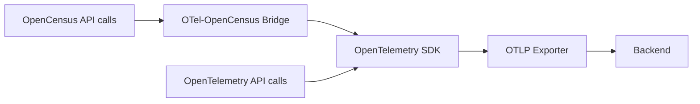

# How to Migrate from OpenCensus to OpenTelemetry (Official Bridge Guide)

Author: [nawazdhandala](https://www.github.com/nawazdhandala)

Tags: OpenTelemetry, OpenCensus, Migration, Bridge, Tracing, Metrics, Observability

Description: A step-by-step guide to migrating from OpenCensus to OpenTelemetry using the official bridge libraries, with code examples in Go and Python.

---

OpenCensus was one of the two projects (along with OpenTracing) that merged to form OpenTelemetry. While OpenCensus served the community well, it has been in maintenance mode since 2019 and will not receive new features or security patches going forward. If you still have OpenCensus instrumentation in your codebase, now is the time to migrate.

The good news is that the OpenTelemetry project provides official bridge libraries that let you run OpenCensus and OpenTelemetry side by side during the transition. This means you do not have to rewrite all your instrumentation at once. You can migrate incrementally while keeping your existing OpenCensus code working.

## Understanding the Bridge Approach

The OpenCensus bridge works by redirecting OpenCensus API calls to the OpenTelemetry SDK. When your code calls `opencensus.StartSpan()`, the bridge intercepts that call and creates an OpenTelemetry span instead. From the application code's perspective, nothing changes. But under the hood, all telemetry flows through the OpenTelemetry SDK and its exporters.



This architecture means you can start using OpenTelemetry for new code immediately while your existing OpenCensus instrumentation continues to work without modification.

## Step 1: Install the Bridge Libraries

The bridge libraries are available for Go, Python, Java, and JavaScript. Let's start with Go, since OpenCensus was most widely adopted in Go projects.

```bash
# Install the OpenTelemetry SDK and the OpenCensus bridge for Go
go get go.opentelemetry.io/otel
go get go.opentelemetry.io/otel/sdk
go get go.opentelemetry.io/otel/sdk/metric
go get go.opentelemetry.io/otel/exporters/otlp/otlptrace/otlptracegrpc
go get go.opentelemetry.io/otel/exporters/otlp/otlpmetric/otlpmetricgrpc

# The bridge package that redirects OpenCensus calls to OpenTelemetry
go get go.opentelemetry.io/otel/bridge/opencensus
```

For Python:

```bash
# Install the OpenTelemetry SDK and bridge for Python
pip install opentelemetry-api opentelemetry-sdk
pip install opentelemetry-exporter-otlp
pip install opentelemetry-opencensus-shim
```

## Step 2: Initialize the OpenTelemetry SDK

Before activating the bridge, you need a working OpenTelemetry SDK setup. Here is a complete initialization in Go:

```go
package main

import (
    "context"
    "log"
    "time"

    "go.opentelemetry.io/otel"
    "go.opentelemetry.io/otel/exporters/otlp/otlptrace/otlptracegrpc"
    "go.opentelemetry.io/otel/exporters/otlp/otlpmetric/otlpmetricgrpc"
    "go.opentelemetry.io/otel/sdk/resource"
    sdktrace "go.opentelemetry.io/otel/sdk/trace"
    sdkmetric "go.opentelemetry.io/otel/sdk/metric"
    semconv "go.opentelemetry.io/otel/semconv/v1.21.0"
)

func initOTel(ctx context.Context) (func(), error) {
    // Define the resource that describes this service
    res, err := resource.New(ctx,
        resource.WithAttributes(
            semconv.ServiceName("my-service"),
            semconv.ServiceVersion("2.0.0"),
        ),
    )
    if err != nil {
        return nil, err
    }

    // Set up the trace exporter
    traceExporter, err := otlptracegrpc.New(ctx,
        otlptracegrpc.WithEndpoint("localhost:4317"),
        otlptracegrpc.WithInsecure(),
    )
    if err != nil {
        return nil, err
    }

    // Create the TracerProvider with a batch span processor
    tp := sdktrace.NewTracerProvider(
        sdktrace.WithResource(res),
        sdktrace.WithBatcher(traceExporter),
    )
    otel.SetTracerProvider(tp)

    // Set up the metric exporter
    metricExporter, err := otlpmetricgrpc.New(ctx,
        otlpmetricgrpc.WithEndpoint("localhost:4317"),
        otlpmetricgrpc.WithInsecure(),
    )
    if err != nil {
        return nil, err
    }

    // Create the MeterProvider with a periodic reader
    mp := sdkmetric.NewMeterProvider(
        sdkmetric.WithResource(res),
        sdkmetric.WithReader(
            sdkmetric.NewPeriodicReader(metricExporter,
                sdkmetric.WithInterval(30*time.Second),
            ),
        ),
    )
    otel.SetMeterProvider(mp)

    // Return a cleanup function for graceful shutdown
    cleanup := func() {
        tp.Shutdown(ctx)
        mp.Shutdown(ctx)
    }

    return cleanup, nil
}
```

This sets up both tracing and metrics with OTLP export. The key requirement is that you have a registered `TracerProvider` and `MeterProvider` before activating the bridge.

## Step 3: Activate the Trace Bridge

Now install the bridge that redirects OpenCensus trace calls to OpenTelemetry:

```go
package main

import (
    octrace "go.opencensus.io/trace"
    "go.opentelemetry.io/otel/bridge/opencensus"
)

func main() {
    ctx := context.Background()

    // Initialize the OpenTelemetry SDK first
    cleanup, err := initOTel(ctx)
    if err != nil {
        log.Fatal(err)
    }
    defer cleanup()

    // Install the OpenCensus trace bridge
    // This replaces the default OpenCensus tracer with one that
    // forwards all spans to the OpenTelemetry SDK
    tracer := opencensus.NewTracer(otel.GetTracerProvider().Tracer("opencensus-bridge"))
    octrace.DefaultTracer = tracer

    // From this point on, all OpenCensus trace calls produce
    // OpenTelemetry spans. Existing code like this still works:
    ctx, span := octrace.StartSpan(ctx, "legacy-operation")
    defer span.End()

    // New code can use OpenTelemetry directly
    otelTracer := otel.Tracer("my-service")
    ctx, otelSpan := otelTracer.Start(ctx, "new-operation")
    defer otelSpan.End()

    // Both spans appear in the same trace
    doWork(ctx)
}
```

The critical line is `octrace.DefaultTracer = tracer`. After this, every `opencensus.StartSpan` call in your entire application (including third-party libraries that use OpenCensus) will produce OpenTelemetry spans. The context propagation works correctly, so OpenCensus spans and OpenTelemetry spans can be parents and children of each other within the same trace.

## Step 4: Activate the Metrics Bridge

The metrics bridge works similarly. It redirects OpenCensus metric views to the OpenTelemetry SDK:

```go
import (
    "go.opentelemetry.io/otel/bridge/opencensus"
)

func setupMetricsBridge() {
    // Install the metric bridge
    // This makes OpenCensus stats.Record calls flow through
    // the OpenTelemetry MeterProvider
    opencensus.InstallNewPipeline(
        // Pass in any options for metric conversion
    )
}
```

After activating the metric bridge, OpenCensus `stats.Record()` calls are converted to OpenTelemetry metric recordings. The bridge maps OpenCensus measures to OpenTelemetry instruments:

- `stats.Int64Measure` with `view.Count()` aggregation becomes an OTel Counter
- `stats.Float64Measure` with `view.Distribution()` becomes an OTel Histogram
- `stats.Int64Measure` with `view.LastValue()` becomes an OTel Gauge

## Step 5: Migrate the Python Bridge

For Python projects, the shim approach is similar. Here is how to set up the bridge:

```python
# main.py
from opentelemetry import trace, metrics
from opentelemetry.sdk.trace import TracerProvider
from opentelemetry.sdk.trace.export import BatchSpanProcessor
from opentelemetry.sdk.metrics import MeterProvider
from opentelemetry.sdk.metrics.export import PeriodicExportingMetricReader
from opentelemetry.exporter.otlp.proto.grpc.trace_exporter import OTLPSpanExporter
from opentelemetry.exporter.otlp.proto.grpc.metric_exporter import OTLPMetricExporter

# Step 1: Initialize the OpenTelemetry SDK
# Configure the tracer provider with OTLP export
tp = TracerProvider()
tp.add_span_processor(BatchSpanProcessor(OTLPSpanExporter()))
trace.set_tracer_provider(tp)

# Configure the meter provider with OTLP export
reader = PeriodicExportingMetricReader(OTLPMetricExporter())
mp = MeterProvider(metric_readers=[reader])
metrics.set_meter_provider(mp)

# Step 2: Install the OpenCensus shim
# This must happen AFTER the OTel SDK is configured
from opentelemetry.shim.opencensus import install_shim
install_shim()

# Now all OpenCensus calls are redirected to OpenTelemetry
# Existing code like this still works:
from opencensus.trace import tracer as oc_tracer
tracer = oc_tracer.Tracer()
with tracer.span(name="legacy-operation") as span:
    # This span appears in OpenTelemetry traces
    do_legacy_work()
```

The `install_shim()` call patches the OpenCensus library to route everything through OpenTelemetry. It is a single line of code that makes your entire OpenCensus instrumentation work with the new SDK.

## Step 6: Remove OpenCensus Exporters

An important step that is easy to overlook: once the bridge is active, you should remove all OpenCensus exporters. The data now flows through OpenTelemetry exporters, so having OpenCensus exporters still active will cause duplicate data.

```go
// BEFORE: OpenCensus exporter setup (REMOVE THIS)
// import "contrib.go.opencensus.io/exporter/jaeger"
// je, _ := jaeger.NewExporter(jaeger.Options{...})
// octrace.RegisterExporter(je)

// AFTER: Only OpenTelemetry exporters remain
// The OTLP exporter configured in initOTel() handles all export
```

Remove the OpenCensus exporter imports and registration calls. The OpenTelemetry SDK's exporters are the only export path now.

## Step 7: Incrementally Replace OpenCensus API Calls

With the bridge in place, you can now migrate OpenCensus API calls to OpenTelemetry at your own pace. Here is a before-and-after comparison for tracing:

```go
// BEFORE: OpenCensus tracing
import "go.opencensus.io/trace"

func processOrder(ctx context.Context, orderID string) error {
    ctx, span := trace.StartSpan(ctx, "processOrder")
    defer span.End()

    // OpenCensus uses StringAttribute
    span.AddAttributes(trace.StringAttribute("order.id", orderID))

    // OpenCensus status codes
    if err := validateOrder(ctx, orderID); err != nil {
        span.SetStatus(trace.Status{Code: trace.StatusCodeInternal, Message: err.Error()})
        return err
    }
    return nil
}
```

```go
// AFTER: OpenTelemetry tracing
import (
    "go.opentelemetry.io/otel"
    "go.opentelemetry.io/otel/attribute"
    "go.opentelemetry.io/otel/codes"
)

var tracer = otel.Tracer("order-service")

func processOrder(ctx context.Context, orderID string) error {
    ctx, span := tracer.Start(ctx, "processOrder")
    defer span.End()

    // OpenTelemetry uses attribute.String
    span.SetAttributes(attribute.String("order.id", orderID))

    // OpenTelemetry status codes
    if err := validateOrder(ctx, orderID); err != nil {
        span.SetStatus(codes.Error, err.Error())
        span.RecordError(err)
        return err
    }
    return nil
}
```

The changes are mechanical: different import paths, slightly different method names, and a richer error recording API. You can migrate one file or one package at a time.

## Migration Checklist

Here is a checklist to track your migration progress:

1. **Install OpenTelemetry SDK and bridge packages** in each service
2. **Initialize the OpenTelemetry SDK** with your desired exporters (OTLP recommended)
3. **Activate the trace bridge** by replacing the default OpenCensus tracer
4. **Activate the metrics bridge** by installing the metric pipeline
5. **Remove all OpenCensus exporters** to prevent duplicate data
6. **Verify traces and metrics** appear correctly in your backend
7. **Incrementally replace OpenCensus API calls** with OpenTelemetry equivalents
8. **Remove OpenCensus dependencies** once all API calls are migrated
9. **Remove the bridge packages** since they are no longer needed

## Common Issues and Solutions

**Context propagation mismatch**: OpenCensus uses its own context format for trace propagation. The bridge handles in-process context correctly, but for cross-service propagation, make sure you switch to W3C TraceContext format (the OpenTelemetry default) on both sides.

**Missing span attributes**: Some OpenCensus attribute types do not have exact equivalents in OpenTelemetry. The bridge handles the common types (string, int, bool, float), but custom annotation types may need manual conversion.

**Metric view differences**: OpenCensus views define aggregation at registration time. OpenTelemetry handles aggregation in the SDK through Views. If you have complex OpenCensus view configurations, verify they map correctly through the bridge.

**Performance overhead**: The bridge adds a thin translation layer. In benchmarks, the overhead is negligible (single-digit nanoseconds per span or metric recording), but you should verify this in your specific workload.

## Conclusion

Migrating from OpenCensus to OpenTelemetry does not have to be a big-bang rewrite. The official bridge libraries let you redirect all OpenCensus telemetry through the OpenTelemetry SDK with just a few lines of setup code. Once the bridge is active, you can migrate API calls one at a time, at whatever pace works for your team. The end result is a modern, actively maintained instrumentation stack with access to the full OpenTelemetry ecosystem of exporters, processors, and semantic conventions.
