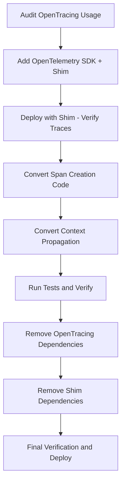

# How to Migrate from OpenTracing to OpenTelemetry (Step by Step)

Author: [nawazdhandala](https://www.github.com/nawazdhandala)

Tags: OpenTelemetry, OpenTracing, Migration, Distributed Tracing, Observability

Description: A practical step-by-step guide for migrating your distributed tracing instrumentation from the deprecated OpenTracing API to OpenTelemetry.

---

OpenTracing served the distributed tracing community well for years, but the project has been officially archived. OpenTelemetry is its successor, merging the best ideas from both OpenTracing and OpenCensus into a single, unified observability framework. If you still have OpenTracing instrumentation in your codebase, now is the time to migrate. This guide walks you through the entire process, from initial assessment to final cleanup, with concrete code examples at every step.

## Why Migrate Now?

OpenTracing stopped receiving updates after it merged into OpenTelemetry. The OpenTracing libraries still work, but they no longer receive security patches, bug fixes, or compatibility updates. As language runtimes and frameworks evolve, relying on unmaintained dependencies becomes a growing risk.

OpenTelemetry offers several advantages beyond just being actively maintained. It provides a unified API for traces, metrics, and logs. The SDK is more configurable, with pluggable exporters, samplers, and propagators. The ecosystem of auto-instrumentation libraries is much larger, and the community behind it is one of the most active in the CNCF.

## Step 1: Audit Your Current OpenTracing Usage

Before changing any code, you need to understand the scope of the migration. Start by identifying every place in your codebase that imports OpenTracing packages.

For a Java project, search for these common imports:

```java
// OpenTracing imports to look for in your codebase
import io.opentracing.Tracer;
import io.opentracing.Span;
import io.opentracing.SpanContext;
import io.opentracing.propagation.Format;
import io.opentracing.tag.Tags;
import io.opentracing.util.GlobalTracer;
```

For Python projects, look for:

```python
# Common OpenTracing imports in Python codebases
import opentracing
from opentracing import Tracer
from opentracing.ext import tags
from opentracing.propagation import Format
```

Create an inventory that categorizes your usage into three buckets: tracer initialization code, manual span creation and management, and context propagation. This inventory will serve as your migration checklist.

## Step 2: Use the OpenTracing Shim (Bridge) for a Gradual Migration

OpenTelemetry provides an official compatibility shim that lets you run both OpenTracing and OpenTelemetry instrumentation side by side. This is the key to a safe, incremental migration. You do not need to rewrite everything at once.

The shim wraps an OpenTelemetry tracer behind the OpenTracing API interface. Your existing OpenTracing code keeps working, but the spans it creates flow through the OpenTelemetry pipeline.

Here is how to set it up in Java:

```java
// Step 2a: Add OpenTelemetry SDK and the OpenTracing shim to your dependencies
// Maven pom.xml additions:
// io.opentelemetry:opentelemetry-api:1.35.0
// io.opentelemetry:opentelemetry-sdk:1.35.0
// io.opentelemetry.opentracing-shim:opentelemetry-opentracing-shim:1.35.0

import io.opentelemetry.api.OpenTelemetry;
import io.opentelemetry.sdk.OpenTelemetrySdk;
import io.opentelemetry.sdk.trace.SdkTracerProvider;
import io.opentelemetry.sdk.trace.export.BatchSpanProcessor;
import io.opentelemetry.exporter.otlp.trace.OtlpGrpcSpanExporter;
import io.opentelemetry.opentracingshim.OpenTracingShim;

// Step 2b: Configure the OpenTelemetry SDK
SdkTracerProvider tracerProvider = SdkTracerProvider.builder()
    .addSpanProcessor(
        // BatchSpanProcessor batches spans before exporting for better performance
        BatchSpanProcessor.builder(
            OtlpGrpcSpanExporter.builder()
                .setEndpoint("http://localhost:4317")
                .build()
        ).build()
    ).build();

OpenTelemetrySdk openTelemetry = OpenTelemetrySdk.builder()
    .setTracerProvider(tracerProvider)
    .build();

// Step 2c: Create the shim tracer and register it as the global OpenTracing tracer
io.opentracing.Tracer shimTracer = OpenTracingShim.createTracerShim(openTelemetry);
io.opentracing.util.GlobalTracer.registerIfAbsent(shimTracer);
```

For Python, the setup looks like this:

```python
# Install dependencies:
# pip install opentelemetry-api opentelemetry-sdk opentelemetry-opentracing-shim

from opentelemetry import trace
from opentelemetry.sdk.trace import TracerProvider
from opentelemetry.sdk.trace.export import BatchSpanProcessor
from opentelemetry.exporter.otlp.proto.grpc.trace_exporter import OTLPSpanExporter
from opentelemetry.shim.opentracing_shim import create_tracer

# Configure the OpenTelemetry SDK with OTLP exporter
provider = TracerProvider()
processor = BatchSpanProcessor(
    OTLPSpanExporter(endpoint="http://localhost:4317")
)
provider.add_span_processor(processor)
trace.set_tracer_provider(provider)

# Create the shim tracer for backward compatibility
# This tracer implements the OpenTracing API but uses OpenTelemetry internally
shim_tracer = create_tracer(provider)
```

At this point, deploy your application with the shim in place. Verify that traces still appear in your backend. This is your safety net for the rest of the migration.

## Step 3: Migrate Span Creation Code

Now begin converting your manual instrumentation from OpenTracing to OpenTelemetry, one file at a time. Here is a before-and-after comparison.

OpenTracing style:

```java
// Old OpenTracing span creation pattern
Tracer tracer = GlobalTracer.get();
Span span = tracer.buildSpan("process-order")
    .withTag(Tags.COMPONENT, "order-service")
    .withTag("order.id", orderId)
    .start();

try (Scope scope = tracer.activateSpan(span)) {
    // Business logic here
    span.setTag("order.total", total);
    span.log("Order processed successfully");
} catch (Exception e) {
    // Mark the span as errored using OpenTracing conventions
    Tags.ERROR.set(span, true);
    span.log(Map.of("event", "error", "message", e.getMessage()));
    throw e;
} finally {
    span.finish();
}
```

OpenTelemetry equivalent:

```java
// New OpenTelemetry span creation pattern
import io.opentelemetry.api.trace.Span;
import io.opentelemetry.api.trace.StatusCode;
import io.opentelemetry.context.Scope;

Tracer tracer = openTelemetry.getTracer("order-service", "1.0.0");

Span span = tracer.spanBuilder("process-order")
    .setAttribute("component", "order-service")
    .setAttribute("order.id", orderId)
    .startSpan();

try (Scope scope = span.makeCurrent()) {
    // Business logic here
    span.setAttribute("order.total", total);
    // Events replace logs in OpenTelemetry
    span.addEvent("Order processed successfully");
} catch (Exception e) {
    // OpenTelemetry uses setStatus and recordException
    span.setStatus(StatusCode.ERROR, e.getMessage());
    span.recordException(e);
    throw e;
} finally {
    span.end();
}
```

Notice the key differences: `finish()` becomes `end()`, `setTag()` becomes `setAttribute()`, `log()` becomes `addEvent()`, and error handling uses `setStatus()` and `recordException()` instead of boolean tags and log maps.

## Step 4: Migrate Context Propagation

Context propagation is how trace context flows across service boundaries. The API is different between the two libraries.

OpenTracing context injection:

```java
// Old OpenTracing context injection into HTTP headers
tracer.inject(
    span.context(),
    Format.Builtin.HTTP_HEADERS,
    new TextMapAdapter(httpHeaders)
);
```

OpenTelemetry context propagation:

```java
// New OpenTelemetry context propagation using W3C Trace Context
import io.opentelemetry.api.GlobalOpenTelemetry;
import io.opentelemetry.context.Context;
import io.opentelemetry.context.propagation.TextMapSetter;

// Define how to set headers on your HTTP carrier
TextMapSetter<HttpHeaders> setter = (carrier, key, value) ->
    carrier.set(key, value);

// Inject current context into outgoing request headers
// This automatically uses W3C Trace Context format (traceparent header)
GlobalOpenTelemetry.getPropagators()
    .getTextMapPropagator()
    .inject(Context.current(), httpHeaders, setter);
```

OpenTelemetry defaults to W3C Trace Context propagation (the `traceparent` header), while OpenTracing implementations typically used vendor-specific formats like Jaeger or Zipkin B3 headers. During migration, you can configure OpenTelemetry to support multiple propagation formats simultaneously:

```java
// Support both W3C and B3 propagation during migration
// This ensures compatibility with services that have not yet been migrated
import io.opentelemetry.extension.trace.propagation.B3Propagator;
import io.opentelemetry.api.trace.propagation.W3CTraceContextPropagator;
import io.opentelemetry.context.propagation.TextMapPropagator;

TextMapPropagator compositePropagator = TextMapPropagator.composite(
    W3CTraceContextPropagator.getInstance(),
    B3Propagator.injectingMultiHeaders()
);
```

## Step 5: Update Your Dependencies and Clean Up

Once all your instrumentation code has been converted and you have verified traces are flowing correctly, remove the OpenTracing dependencies entirely.

```xml
<!-- Remove these from your Maven pom.xml -->
<!-- <dependency>
    <groupId>io.opentracing</groupId>
    <artifactId>opentracing-api</artifactId>
</dependency>
<dependency>
    <groupId>io.opentracing</groupId>
    <artifactId>opentracing-util</artifactId>
</dependency> -->

<!-- Also remove the shim since it is no longer needed -->
<!-- <dependency>
    <groupId>io.opentelemetry</groupId>
    <artifactId>opentelemetry-opentracing-shim</artifactId>
</dependency> -->
```

Run your test suite and integration tests to verify nothing broke during the cleanup.

## Migration Flow Overview



## Common Pitfalls to Avoid

**Baggage items are not tags.** In OpenTracing, baggage items propagate across service boundaries. In OpenTelemetry, this is handled by the Baggage API, which is separate from span attributes. Make sure you migrate baggage usage to `io.opentelemetry.api.baggage.Baggage`.

**Span kind mapping.** OpenTracing's `span.kind` tag maps to OpenTelemetry's SpanKind enum. Make sure CLIENT, SERVER, PRODUCER, and CONSUMER span kinds are set correctly using `spanBuilder.setSpanKind()` rather than as string attributes.

**Sampling configuration.** If you had custom sampling in your OpenTracing setup, review OpenTelemetry's sampling options. The SDK offers ParentBasedSampler, TraceIdRatioBasedSampler, and the ability to create custom samplers that are more flexible than what OpenTracing provided.

## Wrapping Up

Migrating from OpenTracing to OpenTelemetry does not need to happen all at once. The shim bridge lets you run both systems in parallel, converting one piece of instrumentation at a time. Start with your tracer initialization, move on to span creation, handle context propagation, and finish by cleaning up old dependencies.

The investment pays off quickly. You get access to the full OpenTelemetry ecosystem, including auto-instrumentation libraries, a richer SDK with better sampling and export options, and a project that is actively maintained by one of the largest open-source communities in observability.
