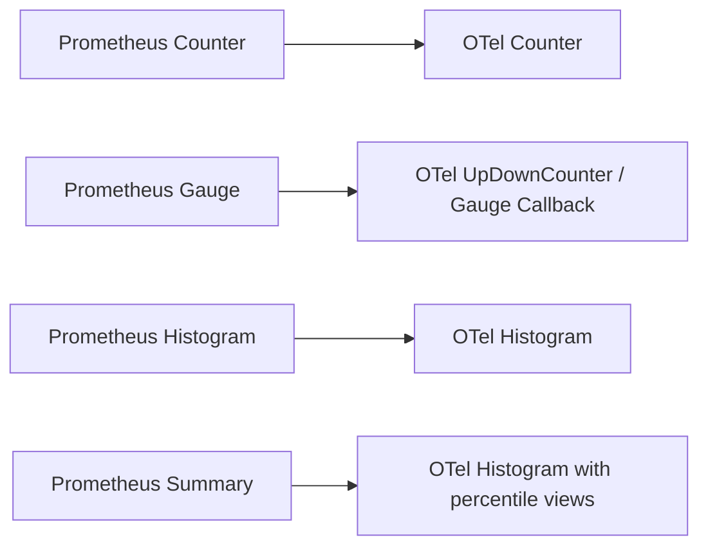

# How to Migrate from Prometheus Client Libraries to OpenTelemetry Metrics SDK

Author: [nawazdhandala](https://www.github.com/nawazdhandala)

Tags: OpenTelemetry, Prometheus, Metrics, Migration, SDK, Observability

Description: A practical guide to migrating your application instrumentation from Prometheus client libraries to the OpenTelemetry Metrics SDK with code examples and mapping strategies.

---

If your services currently use Prometheus client libraries for metrics instrumentation, you are not alone. Prometheus has been the de facto standard for cloud-native monitoring for years. But OpenTelemetry is quickly becoming the unified standard for all telemetry signals, and migrating your metrics instrumentation to the OpenTelemetry Metrics SDK opens the door to a vendor-neutral, multi-signal observability stack.

This guide walks through the process of replacing Prometheus client library calls with their OpenTelemetry equivalents. We will cover metric type mappings, SDK initialization, and practical code changes you can apply incrementally across your services.

## Why Migrate?

Prometheus client libraries are tightly coupled to the Prometheus exposition format and the pull-based scraping model. OpenTelemetry, on the other hand, supports both push and pull delivery, speaks OTLP natively, and lets you correlate metrics with traces and logs under a single instrumentation framework.

By migrating to the OpenTelemetry Metrics SDK, you gain the ability to export metrics to any OTLP-compatible backend (including Prometheus itself) while also benefiting from exemplar support, resource attributes, and a consistent API across languages.

## Understanding the Metric Type Mapping

Before changing any code, it helps to understand how Prometheus metric types map to OpenTelemetry instrument types.



The mapping is mostly straightforward:

- A Prometheus **Counter** maps to an OpenTelemetry **Counter**. Both are monotonically increasing values.
- A Prometheus **Gauge** maps to an OpenTelemetry **UpDownCounter** (for values you increment and decrement) or an **Observable Gauge** (for values you observe via a callback).
- A Prometheus **Histogram** maps to an OpenTelemetry **Histogram**. The default bucket boundaries differ, so you may want to configure explicit boundaries to match your existing dashboards.
- A Prometheus **Summary** has no direct equivalent. The recommended approach is to use an OpenTelemetry **Histogram** and configure percentile aggregation in your backend or through SDK views.

## Setting Up the OpenTelemetry Metrics SDK

Let's start with a Go example since Go has one of the most mature Prometheus client ecosystems.

First, add the required OpenTelemetry dependencies:

```bash
# Install the OpenTelemetry Go metrics SDK and OTLP exporter
go get go.opentelemetry.io/otel
go get go.opentelemetry.io/otel/sdk/metric
go get go.opentelemetry.io/otel/exporters/otlp/otlpmetric/otlpmetricgrpc
```

Now initialize the SDK in your application's main function:

```go
package main

import (
    "context"
    "log"
    "time"

    "go.opentelemetry.io/otel"
    "go.opentelemetry.io/otel/exporters/otlp/otlpmetric/otlpmetricgrpc"
    sdkmetric "go.opentelemetry.io/otel/sdk/metric"
    "go.opentelemetry.io/otel/sdk/resource"
    semconv "go.opentelemetry.io/otel/semconv/v1.21.0"
)

func initMetrics() (*sdkmetric.MeterProvider, error) {
    ctx := context.Background()

    // Create an OTLP gRPC exporter that sends metrics to the collector
    exporter, err := otlpmetricgrpc.New(ctx,
        otlpmetricgrpc.WithEndpoint("localhost:4317"),
        otlpmetricgrpc.WithInsecure(),
    )
    if err != nil {
        return nil, err
    }

    // Define the resource that describes this service
    res, err := resource.New(ctx,
        resource.WithAttributes(
            semconv.ServiceName("my-service"),
            semconv.ServiceVersion("1.0.0"),
        ),
    )
    if err != nil {
        return nil, err
    }

    // Build the MeterProvider with a periodic reader
    // The reader collects and exports metrics every 30 seconds
    mp := sdkmetric.NewMeterProvider(
        sdkmetric.WithResource(res),
        sdkmetric.WithReader(
            sdkmetric.NewPeriodicReader(exporter,
                sdkmetric.WithInterval(30*time.Second),
            ),
        ),
    )

    // Register this MeterProvider as the global default
    otel.SetMeterProvider(mp)
    return mp, nil
}
```

This replaces the Prometheus HTTP handler you would normally register on `/metrics`. Instead of waiting to be scraped, the SDK pushes metrics on a configurable interval.

## Migrating a Counter

Here is a typical Prometheus counter in Go:

```go
// Prometheus version: create and register a counter
var httpRequestsTotal = prometheus.NewCounterVec(
    prometheus.CounterOpts{
        Name: "http_requests_total",
        Help: "Total number of HTTP requests",
    },
    []string{"method", "status"},
)

func init() {
    prometheus.MustRegister(httpRequestsTotal)
}

// Usage in a handler
httpRequestsTotal.WithLabelValues("GET", "200").Inc()
```

The OpenTelemetry equivalent looks like this:

```go
// OpenTelemetry version: create a counter from the global meter
var meter = otel.Meter("my-service")

// Create the counter instrument
var httpRequestsTotal, _ = meter.Int64Counter(
    "http.requests.total",
    metric.WithDescription("Total number of HTTP requests"),
)

// Usage in a handler
// Attributes replace Prometheus labels
httpRequestsTotal.Add(ctx, 1,
    metric.WithAttributes(
        attribute.String("http.method", "GET"),
        attribute.String("http.status_code", "200"),
    ),
)
```

Notice a few differences. OpenTelemetry uses dot-separated metric names by convention rather than underscores. Labels become attributes. And you pass a context, which allows the SDK to attach exemplars linking metrics to traces.

## Migrating a Gauge

Prometheus gauges that you set directly map to observable gauges in OpenTelemetry:

```go
// Prometheus version: a gauge tracking active connections
var activeConnections = prometheus.NewGauge(
    prometheus.GaugeOpts{
        Name: "active_connections",
        Help: "Number of active connections",
    },
)

// Set it directly
activeConnections.Set(42)
```

In OpenTelemetry, if the value comes from an external source you observe periodically, use an asynchronous gauge:

```go
// OpenTelemetry version: register a callback that reports the value
_, err := meter.Int64ObservableGauge(
    "active.connections",
    metric.WithDescription("Number of active connections"),
    metric.WithInt64Callback(func(_ context.Context, o metric.Int64Observer) error {
        // Read the current value from your connection pool
        o.Observe(getActiveConnectionCount())
        return nil
    }),
)
```

If you are incrementing and decrementing a gauge in your code (for example, tracking in-flight requests), use an UpDownCounter instead:

```go
// OpenTelemetry UpDownCounter for values that go up and down
var inFlightRequests, _ = meter.Int64UpDownCounter(
    "http.requests.in_flight",
    metric.WithDescription("Number of in-flight HTTP requests"),
)

// Increment when a request starts
inFlightRequests.Add(ctx, 1)

// Decrement when a request finishes
inFlightRequests.Add(ctx, -1)
```

## Migrating a Histogram

Prometheus histograms and OpenTelemetry histograms are conceptually similar, but the default bucket boundaries differ.

```go
// Prometheus version
var requestDuration = prometheus.NewHistogramVec(
    prometheus.HistogramOpts{
        Name:    "http_request_duration_seconds",
        Help:    "HTTP request duration in seconds",
        Buckets: prometheus.DefBuckets,
    },
    []string{"method"},
)

// Record a duration
requestDuration.WithLabelValues("GET").Observe(0.42)
```

```go
// OpenTelemetry version
var requestDuration, _ = meter.Float64Histogram(
    "http.request.duration",
    metric.WithDescription("HTTP request duration in seconds"),
    metric.WithUnit("s"),
)

// Record a duration
requestDuration.Record(ctx, 0.42,
    metric.WithAttributes(
        attribute.String("http.method", "GET"),
    ),
)
```

If you need to match the exact Prometheus default buckets, configure an explicit bucket histogram view in your MeterProvider setup:

```go
// Define a view that sets custom bucket boundaries
// This preserves compatibility with existing Prometheus dashboards
bucketView := sdkmetric.NewView(
    sdkmetric.Instrument{Name: "http.request.duration"},
    sdkmetric.Stream{
        Aggregation: sdkmetric.AggregationExplicitBucketHistogram{
            Boundaries: []float64{.005, .01, .025, .05, .1, .25, .5, 1, 2.5, 5, 10},
        },
    },
)

mp := sdkmetric.NewMeterProvider(
    sdkmetric.WithView(bucketView),
    // ... other options
)
```

## Migration Strategy

You do not have to migrate everything at once. Here is an incremental approach that has worked well in production:

1. **Add the OpenTelemetry SDK** alongside your existing Prometheus instrumentation. Both can coexist in the same process.
2. **Migrate one metric at a time**, starting with the least critical ones. Verify the data appears correctly in your backend.
3. **Use the Prometheus exporter** in the OpenTelemetry SDK if your backend still scrapes Prometheus format. This way, you can migrate instrumentation code without changing your collection pipeline.
4. **Update dashboards and alerts** as you rename metrics to follow OpenTelemetry semantic conventions.
5. **Remove the Prometheus client library** once all metrics have been migrated and dashboards are updated.

## Keeping Prometheus Compatibility During Migration

If you want to migrate the SDK but keep your Prometheus scraping infrastructure, the OpenTelemetry SDK includes a Prometheus exporter that serves metrics in Prometheus exposition format:

```go
import "go.opentelemetry.io/otel/exporters/prometheus"

// Create a Prometheus exporter that serves metrics on /metrics
promExporter, err := prometheus.New()
if err != nil {
    log.Fatal(err)
}

mp := sdkmetric.NewMeterProvider(
    sdkmetric.WithReader(promExporter),
)
```

This lets you rewrite your instrumentation code to use OpenTelemetry APIs while your collection pipeline still uses Prometheus scraping. When you are ready to move to OTLP, you simply swap the exporter.

## Conclusion

Migrating from Prometheus client libraries to the OpenTelemetry Metrics SDK is a practical, incremental process. The metric type mappings are intuitive, the SDK initialization is straightforward, and the ability to run both systems side by side means you can migrate at your own pace. Start with a single service, validate the output, and expand from there. Once you are on OpenTelemetry, you gain a unified instrumentation layer that connects your metrics with traces and logs, giving you deeper visibility into your systems.
